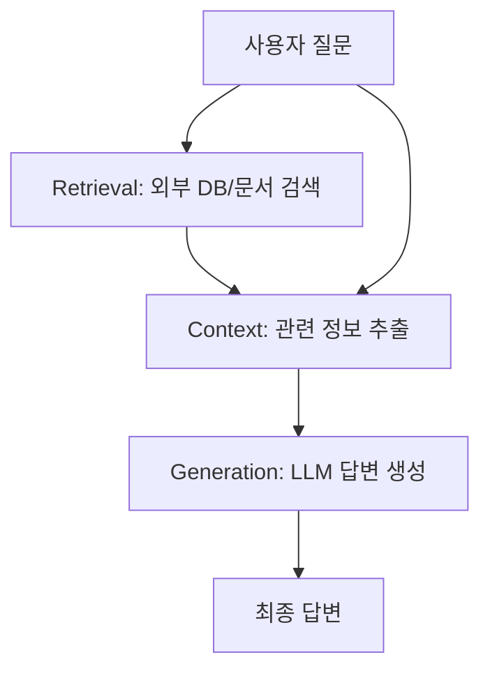

# RAG (Retrieval-Augmented Generation)

RAG는 대형 언어 모델(LLM)의 한계를 보완하기 위해 **외부 지식(문서 등)을 검색(Retrieval)하여, 생성(Generation) 결과에 반영**하는 AI 아키텍처입니다.

---

## 핵심 개념

- **Retrieval(검색):**
  - 외부 DB/문서/지식베이스 등에서 쿼리와 관련된 정보를 찾아옴
- **Augmentation(증강):**
  - 검색된 정보를 LLM 입력에 포함시켜, 답변의 정확성과 최신성 보장
- **Generation(생성):**
  - LLM이 검색된 컨텍스트를 바탕으로 자연어 답변 생성

---

## 동작 구조

1. **질문 입력** →
2. **검색(문서/DB)** →
3. **검색 결과 + 질문**을 LLM에 입력 →
4. **최종 답변 생성**

---

## 장점

- 최신 정보/사내 데이터 등 LLM이 학습하지 않은 지식까지 활용 가능
- 신뢰도 높은 답변, 근거 출처 제공 가능
- 프롬프트 길이 한계 극복

---

## 한계 및 고려사항

- 검색 품질에 따라 답변 품질이 좌우됨
- 실시간성/속도, 비용, 보안 등 추가 고려 필요

---

## 주요 활용 예시

- **기업 내 문서 QA**
- **실시간 뉴스/논문/웹 데이터 기반 질의응답**
- **고객센터 챗봇, FAQ 자동화**

---

## 대표 구조 (아키텍처)

---

**태그:** #RAG #RetrievalAugmentedGeneration #검색증강생성 #LLM #AI

**관련 개념:** LangChain, LangGraph, Vector DB, Chunking, Hybrid Search, QA 시스템

**참고/출처**
- OpenAI, Meta 논문, 위키독스, 다양한 AI 블로그 등
