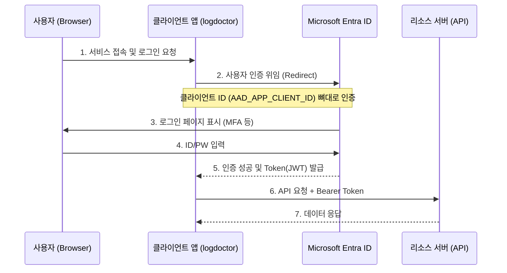

---
tags:
  - azure
  - entra_id
  - authentication
  - sso
date: 2026-02-20
---
# Azure Entra ID (구 Azure AD)

> [!note] 한 줄 요약
> **Microsoft Entra ID**는 과저 **Azure Active Directory (AAD)**로 불리던 마이크로소프트의 클라우드 기반 신원 및 접근 관리(IAM) 솔루션이다. 2023년에 이름만 바뀌었을 뿐, 역할과 기능은 동일하다.

## 1. Entra ID의 근본 (First Principles)

### 왜 "신원 관리(Identity Management)"가 필요한가?
전통적인 온프레미스(사내 서버) 환경에서는 직원들이 회사 건물을 출입하고, 사내망에 접속하기 위해 윈도우 서버 기반의 **Active Directory (AD)**를 사용했다. 
하지만 클라우드 시대가 도래하면서 직원들은 외부 네트워크에서도 수많은 SaaS 애플리케이션(Office 365, 슬랙, 노션 등)에 접속해야 했다. 이에 따라 클라우드 상에서 "이 사람이 우리 직원이 맞는지", "어떤 앱에 접근할 권한이 있는지"를 중앙에서 통제할 **거대한 온라인 출입 관리소**가 필요해졌고, 그것이 바로 **Azure AD(현 Entra ID)**의 탄생 배경이다.

> [!tip] 💡 메타포(Metaphor): 거대한 통합 여권 발급국
> 각 나라(앱)마다 따로 입국 심사(아이디/비밀번호 생성)를 받는 것은 비효율적이다. Entra ID라는 강력한 여권 발급국(Identity Provider)에서 하나의 여권(계정)을 만들어주면, 이 여권을 신뢰하는 수만 개의 나라(애플리케이션)에 프리패스(Single Sign-On, SSO)로 들어갈 수 있다.

---

## 2. AAD에서 Entra ID로의 개명 역사

### 무엇이 바뀌었는가?
마이크로소프트는 2023년에 보안, 인증, 신원 보호 관련 서비스 포트폴리오를 **"Microsoft Entra"**라는 새로운 브랜드로 통합했다. 
그 과정에서 가장 핵심이었던 **Azure Active Directory (AAD)**의 이름이 **Microsoft Entra ID**로 변경되었다.

| 과거 명칭 | 현재 명칭 |
| :--- | :--- |
| Azure Active Directory (AAD) | **Microsoft Entra ID** |
| Azure AD Premium P1 / P2 | Microsoft Entra ID P1 / P2 |
| Azure AD B2C | Microsoft Entra External ID |

### 왜 아직도 코드나 문서에는 `AAD`가 많을까?
이름만 바뀌었을 뿐 내부 아키텍처나 API 엔드포인트는 변경되지 않았다.
- **API 엔드포인트**: 로그인 요청을 보내는 주소는 여전히 `login.microsoftonline.com` 이다.
- **변수 명명 관례**: 수많은 오픈소스 라이브러리와 SDK, 환경 변수(`.env`)에서 이미 `AAD_APP_CLIENT_ID`, `AAD_TENANT_ID` 방식을 수년간 사용해 왔다. 이전 코드와의 하위 호환성을 깨지 않기 위해 개발 레벨에서는 여전히 `AAD`라는 토큰과 식별자가 혼용되어 사용된다.

---

## 3. 핵심 아키텍처 및 동작 방식

Entra ID가 외부 애플리케이션(예: 우리가 만든 Teams 앱)과 어떻게 인증을 처리하는지 시각화한 흐름도이다. (OAuth 2.0 / OIDC 기반)

### 필수 개념 정리
- **Tenant (테넌트)**: 엔트라 ID 안에서 격리된 "우리 회사만의 고유한 영역". (예: `sesac.onmicrosoft.com` 또는 고유 식별자 UUID)
- **App Registration (앱 등록)**: 우리가 만든 커스텀 앱이 Entra ID를 이용해 사용자를 로그인시키려면 사전에 앱을 등록해야 한다. 생성 시 **Client ID**를 발급받으며, 이것이 앱의 고유 신분증이 된다. 

---

## 4. 📝 Further Questions
- [[OAuth 2.0]]과 [[OpenID Connect (OIDC)]]는 Entra ID에서 어떻게 다르게 쓰이는가?
- Entra ID의 `App Registration(앱 등록)`과 `Enterprise Applications(엔터프라이즈 애플리케이션)` 메뉴의 차이점은 무엇인가? (Service Principal의 개념)
- B2B 협업 기능(Entra External ID)을 통해 타사 테넌트 사용자를 우리 테넌트에 초대하는 원리는?
