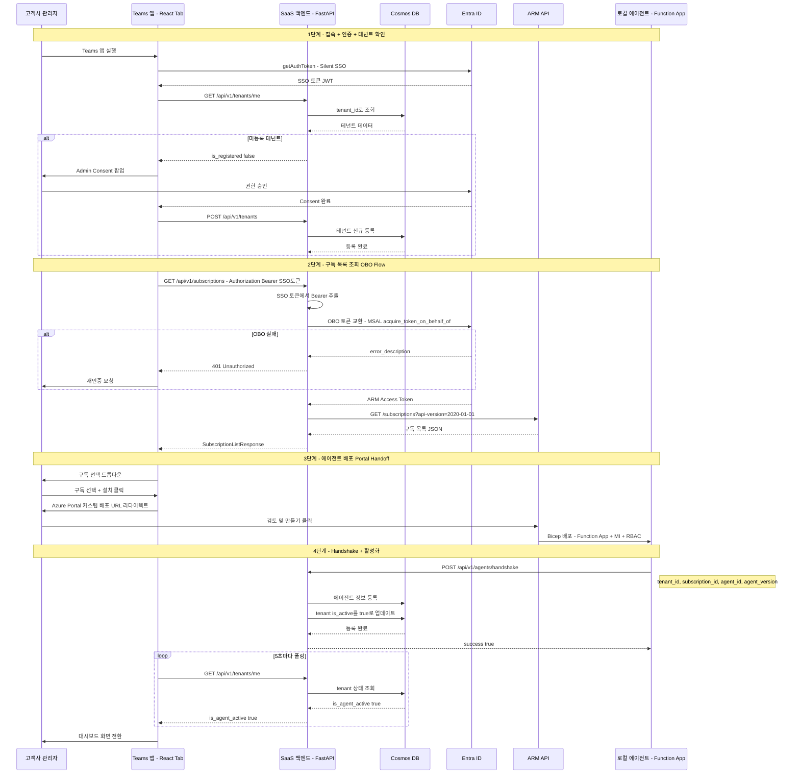
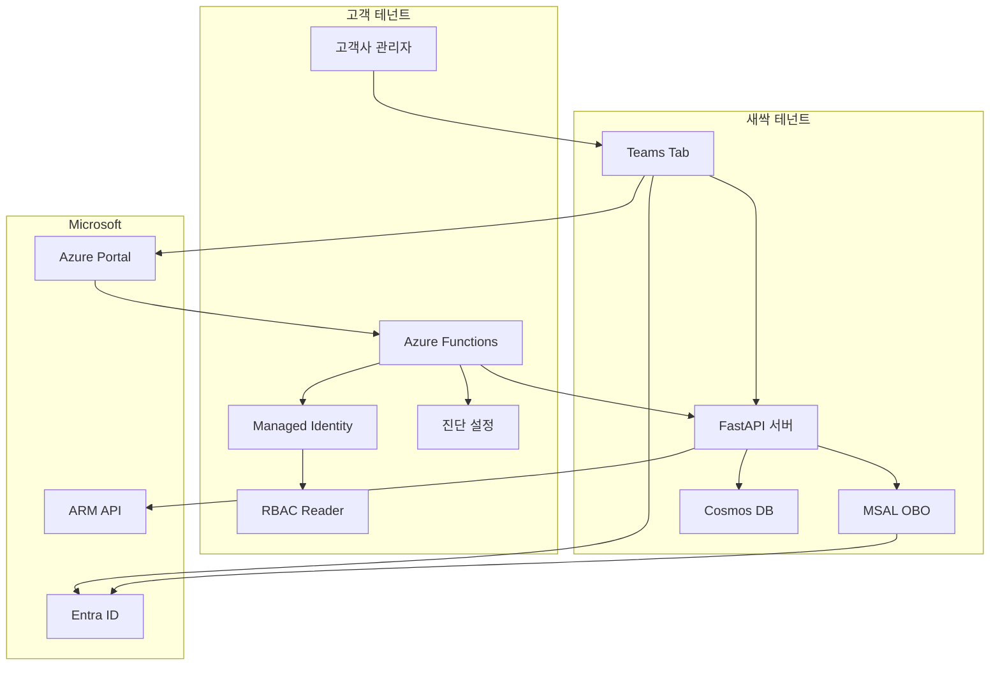

# Azure 학습 & 프로젝트 정리

---

## 📂 폴더 구조

```
azure/
├── 📚 학습 자료 (개념 정리)
│   ├── bicep/                  # Bicep 문법, 함수, 모듈, CLI
│   ├── entra-id/               # Entra ID, SSO, OBO Flow, Admin Consent
│   ├── arm-api/                # ARM REST API, Portal Handoff
│   ├── teams-app/              # Teams SDK, 매니페스트, React 구조
│   ├── managed-identity/       # System/User Assigned, 인증 흐름
│   ├── rbac/                   # 역할 종류, Bicep 패턴
│   ├── key-vault/              # 비밀 관리, 코드 연동
│   ├── diagnostic-settings/    # 진단 로그, DCR, KQL
│   ├── azure-functions/        # 트리거, Durable, 호스팅 플랜
│   ├── acr/                    # Container Registry
│   ├── container-app/          # Container Apps
│   ├── log-analytics/          # Log Analytics Workspace
│   └── cosmos-db/              # Cosmos DB (NoSQL)
│
└── 🔧 프로젝트
    └── projects/log-doctor-provider-back/  # → ~/log-doctor-provider-back (심볼릭 링크)
        ├── app/
        │   ├── core/        # 설정, OBO 인증 (MSAL)
        │   ├── api/         # API 라우터 (v1)
        │   ├── infra/       # Cosmos DB, Azure REST Client
        │   └── domains/     # tenant, subscription, agent, license, report
        ├── tests/
        └── docs/
```

---

# Log-Doctor 전체 아키텍처 정리

시퀀스 다이어그램에 등장하는 **모든 기술과 흐름**을 한눈에 정리합니다.

---

## 참여자 (Participants)

| 참여자 | 설명 | 계정/위치 |
|--------|------|-----------|
| 👨‍💼 고객사 관리자 | SaaS를 구매/설치하는 고객 | 고객 테넌트 (개인계정) |
| 💻 Teams 앱 | React SPA (Personal Tab) | 새싹 테넌트에서 호스팅 |
| ☁️ Log-Doctor API | SaaS 백엔드 서버 | 새싹 테넌트에서 운영 |
| 🔐 Entra ID | 인증/인가 서비스 | Microsoft 관리 |
| 🏢 ARM API | Azure 리소스 관리 API | Microsoft 관리 |
| 🤖 로컬 에이전트 | 고객 구독에 배포되는 Function App | 고객 구독 내 |

---

## 전체 시퀀스 다이어그램



### 수정 및 보완 사항

실제 프로젝트 코드(`~/log-doctor-provider-back`)를 분석하여 기존 다이어그램에서 **누락되거나 부족했던 로직 6가지**를 보완했습니다.

#### 1. 테넌트 상태 확인 단계 추가

- **기존**: 바로 Consent 여부만 확인
- **보완**: `GET /api/v1/tenants/me` 호출로 DB에서 테넌트 등록 상태 확인
- **근거**: `GetTenantStatusUseCase`가 `TenantResponse(is_registered, is_agent_active)`를 반환하는 구조가 이미 구현되어 있음
- **코드**: `app/domains/tenant/usecases/get_tenant_status_use_case.py`

#### 2. 테넌트 등록 시점 명확화

- **기존**: Admin Consent 후 어떻게 테넌트가 DB에 등록되는지 불명확
- **보완**: Consent 완료 후 `POST /api/v1/tenants`로 테넌트를 DB에 신규 등록하는 단계 추가
- **근거**: `CosmosTenantRepository.create()`가 `is_active: False` 상태로 테넌트를 생성하는 코드가 있음
- **코드**: `app/domains/tenant/repository.py` 37-44줄

#### 3. OBO 실패 에러 처리 추가

- **기존**: OBO 토큰 교환이 항상 성공한다고 가정
- **보완**: `alt OBO 실패` 분기 추가 — 401 반환 후 재인증 유도
- **근거**: `EntraIDTokenProvider.get_obo_token()`에서 `access_token`이 없으면 `ValueError`를 raise하는 코드가 있음
- **코드**: `app/core/auth_provider.py` 42-48줄

#### 4. Handshake 후 tenant 활성화 업데이트 추가

- **기존**: 에이전트 등록만 하고 끝
- **보완**: 핸드셰이크 성공 후 `tenant.is_active = true`로 업데이트하는 단계 추가
- **근거**: `GetTenantStatusUseCase`가 `is_agent_active` 필드를 반환하는데, 이 값을 `true`로 바꿔주는 로직이 필요 (현재 코드에 **TODO**로 남아있음)
- **코드**: `handshake_agent_use_case.py` 10줄 `# TODO: Add validation logic`

#### 5. 실제 API 경로 반영

- **기존**: `/auth/token`, `/subscriptions` 등 가상 경로 사용
- **보완**: 실제 프로젝트의 API 경로로 수정
  - `GET /api/v1/tenants/me`
  - `GET /api/v1/subscriptions` (Authorization 헤더에 SSO 토큰)
  - `POST /api/v1/agents/handshake`
- **근거**: `app/main.py`에서 `prefix="/api/v1"` 설정, 각 도메인 라우터에서 경로 확인
- **코드**: `app/api/v1/router.py`, 각 도메인의 `router.py`

#### 6. DB 참여자 추가 및 상태 폴링 정확화

- **기존**: DB가 다이어그램에 없어서 데이터 흐름이 불명확
- **보완**: Cosmos DB를 별도 참여자로 추가하여 읽기/쓰기 흐름 표현
- **근거**: 테넌트 조회, 에이전트 등록, 상태 폴링 모두 DB를 경유
- **코드**: `app/infra/db/cosmos.py` (CosmosDB 싱글톤 클라이언트)

## 아키텍처 다이어그램



## 전체 흐름 요약

```
[1단계] 접속 + 인증         → SSO + Admin Consent
[2단계] 구독 목록 조회       → OBO Flow + ARM API
[3단계] 에이전트 배포        → Portal Handoff + Bicep
[4단계] Handshake           → Webhook + 상태 폴링
```

---

## 1단계: 접속 및 권한/테넌트 확인

```
👨‍💼 관리자 → Teams 앱 실행 (Tab 접속)
         → Teams SDK getAuthToken() (Silent SSO)
         → Entra ID가 JWT 토큰 발급
         → 백엔드에 토큰 전달, Consent 상태 확인
         → [미가입이면] Admin Consent 팝업 진행
```

### 사용 기술

| 기술 | 역할 | 상세 정리 |
|------|------|----------|
| **Teams SDK** | Silent SSO 토큰 요청 | [teams-app/README.md](./teams-app/README.md) |
| **Entra ID** | JWT 토큰 발급 | [entra-id/README.md](./entra-id/README.md) |
| **Admin Consent** | 멀티 테넌트 앱 권한 허용 | [entra-id/README.md](./entra-id/README.md) |

### 핵심 코드

```typescript
// Teams SDK - Silent SSO
const ssoToken = await microsoftTeams.authentication.getAuthToken();
// → audience = 우리 앱의 Client ID (ARM 접근 불가!)

// 백엔드에 토큰 전달
const { needsConsent } = await api.post("/auth/token", { token: ssoToken });

// Consent 필요 시 팝업
if (needsConsent) {
  await microsoftTeams.authentication.authenticate({
    url: `https://login.microsoftonline.com/common/adminconsent?client_id=${CLIENT_ID}`
  });
}
```

---

## 2단계: 구독(Subscription) 목록 조회

```
💻 Teams 앱 → SaaS 백엔드에 구독 조회 요청
☁️ SaaS 백엔드 → Entra ID에 OBO 토큰 교환 요청
                  (SSO 토큰 → ARM 접근용 토큰)
               → ARM API GET /subscriptions 호출
               → 구독 목록 JSON 반환
```

### 🚨 핵심: OBO (On-Behalf-Of) Flow

```
SSO 토큰                        ARM 토큰
audience: api://our-app    →    audience: management.azure.com
scope: User.Read           →    scope: user_impersonation

같은 사용자, 다른 대상(audience)의 토큰으로 교환!
```

### 사용 기술

| 기술 | 역할 | 상세 정리 |
|------|------|----------|
| **OBO Flow** | 토큰 교환 (SSO → ARM) | [entra-id/README.md](./entra-id/README.md) |
| **ARM API** | 구독 목록 조회 | [arm-api/README.md](./arm-api/README.md) |
| **MSAL** | OBO 구현 라이브러리 | [entra-id/README.md](./entra-id/README.md) |

### 핵심 코드

```python
# 백엔드 — OBO 토큰 교환
arm_token = msal_app.acquire_token_on_behalf_of(
    user_assertion=sso_token,
    scopes=["https://management.azure.com/.default"]
)

# ARM API — 구독 목록 조회
response = requests.get(
    "https://management.azure.com/subscriptions?api-version=2022-01-01",
    headers={"Authorization": f"Bearer {arm_token}"}
)
subscriptions = response.json()["value"]
```

---

## 3단계: 구독 선택 및 에이전트 배포

```
💻 Teams 앱 → 구독 선택 드롭다운 렌더링
👨‍💼 관리자 → 구독 선택 + "1-Click 설치" 버튼 클릭
💻 Teams 앱 → Azure Portal 커스텀 배포 URL 생성 (구독ID 주입)
            → 새 창으로 Azure Portal 리다이렉트
👨‍💼 관리자 → Portal에서 [검토 및 만들기] 클릭
🏢 ARM    → Bicep 템플릿으로 Function App + Managed Identity 배포
```

### 사용 기술

| 기술 | 역할 | 상세 정리 |
|------|------|----------|
| **Portal Handoff** | Azure Portal 커스텀 배포 리다이렉트 | [arm-api/README.md](./arm-api/README.md) |
| **Bicep** | 에이전트 인프라 정의 | [bicep/README.md](./bicep/README.md) |
| **Managed Identity** | 에이전트가 고객 리소스 접근 | [managed-identity/README.md](./managed-identity/README.md) |
| **RBAC** | 에이전트에 Reader 권한 부여 | [rbac/README.md](./rbac/README.md) |
| **Azure Functions** | 에이전트 실행 환경 | [azure-functions/README.md](./azure-functions/README.md) |

### 핵심 코드

```typescript
// Portal Handoff URL 생성
const deployUrl = `https://portal.azure.com/#create/Microsoft.Template`
  + `/uri/${encodeURIComponent(TEMPLATE_URL)}`
  + `/deploymentParameters/${encodeURIComponent(JSON.stringify({
      parameters: {
        subscriptionId: { value: selectedSubscriptionId },
        saasEndpoint: { value: "https://api.log-doctor.com" }
      }
    }))}`;

window.open(deployUrl, "_blank");
```

### 배포되는 리소스

```
고객 구독 내 리소스 그룹
├── Function App (에이전트 코드 실행)
├── Storage Account (Functions 필수)
├── App Service Plan (Consumption)
├── Managed Identity (Azure 리소스 접근용)
└── RBAC Role Assignment (Reader 권한)
```

---

## 4단계: 배포 완료 및 Handshake

```
🤖 에이전트 (Function App) 최초 기동
    → POST /agents Webhook으로 SaaS에 알림
☁️ SaaS 백엔드
    → DB 상태 "Active" 업데이트
💻 Teams 앱
    → 상태 폴링 (5초마다)
    → Active 감지 → 대시보드 화면 전환
👨‍💼 관리자
    → 절감 통계 대시보드 확인 🎉
```

### 사용 기술

| 기술 | 역할 | 상세 정리 |
|------|------|----------|
| **Webhook** | 에이전트 → SaaS 설치 완료 알림 | [teams-app/README.md](./teams-app/README.md) |
| **Polling** | Teams 앱 → SaaS 상태 확인 | [teams-app/README.md](./teams-app/README.md) |

### 핵심 코드

```python
# 에이전트 — SaaS에 설치 완료 알림
requests.post(f"{SAAS_ENDPOINT}/agents", json={
    "subscriptionId": SUBSCRIPTION_ID,
    "agentVersion": "1.0.0"
})
```

```typescript
// Teams 앱 — 상태 폴링
const interval = setInterval(async () => {
  const { active } = await api.get(`/agents/${subId}/status`);
  if (active) {
    clearInterval(interval);
    setView("dashboard");
  }
}, 5000);
```

---

## 계정 구분 (새싹 vs 고객)

| 항목 | 새싹 테넌트 (SaaS 제공자) | 고객 테넌트 |
|------|-------------------------|------------|
| Entra ID 앱 등록 | ✅ 여기에 등록 | ❌ |
| Teams 앱 호스팅 | ✅ | ❌ |
| SaaS 백엔드 | ✅ | ❌ |
| Client Secret | ✅ 새싹이 보유 | ❌ |
| 에이전트 (Function App) | ❌ | ✅ 고객 구독에 배포 |
| 구독/리소스 | ❌ | ✅ 고객 소유 |
| Admin Consent | ❌ | ✅ 고객 관리자가 동의 |

---

## 기술 스택 맵

```
┌─────────────────────────────────────────────────────┐
│                   프론트엔드                          │
│  Teams Tab (React) + Teams SDK SSO                   │
└─────────────────────┬───────────────────────────────┘
                      │ REST API
┌─────────────────────┴───────────────────────────────┐
│                   백엔드 (SaaS)                      │
│  Node.js/Python + MSAL + ARM REST API               │
│  ├── OBO 토큰 교환                                   │
│  ├── ARM 구독 조회                                   │
│  └── Webhook 수신                                    │
└─────────────────────┬───────────────────────────────┘
                      │
┌─────────────────────┴───────────────────────────────┐
│                   인증 (Entra ID)                    │
│  JWT 토큰, SSO, OBO Flow, Admin Consent             │
└─────────────────────────────────────────────────────┘
                      │
┌─────────────────────┴───────────────────────────────┐
│                   고객 인프라                         │
│  Azure Functions (에이전트)                          │
│  ├── Managed Identity + RBAC                        │
│  ├── 진단 설정 데이터 수집                            │
│  └── Webhook → SaaS                                 │
└─────────────────────────────────────────────────────┘
```

---

## 상세 정리 목록

| # | 주제 | 파일 | 핵심 내용 |
|---|------|------|----------|
| 1 | Entra ID | [entra-id/](./entra-id/README.md) | 테넌트, JWT, SSO, OBO, Admin Consent, MSAL |
| 2 | ARM API | [arm-api/](./arm-api/README.md) | REST 구조, 구독 조회, Portal Handoff, 에러 처리 |
| 3 | Teams App | [teams-app/](./teams-app/README.md) | Teams SDK, 매니페스트, React 구조, Webhook |
| 4 | Bicep | [bicep/](./bicep/README.md) | 문법, 함수, 모듈, CLI, 패턴 |
| 5 | Managed Identity | [managed-identity/](./managed-identity/README.md) | System/User, 인증 흐름, 코드 예시 |
| 6 | RBAC | [rbac/](./rbac/README.md) | 역할 종류, Bicep 패턴, guid/scope |
| 7 | Key Vault | [key-vault/](./key-vault/README.md) | 비밀 관리, 코드 연동, 비밀 회전 |
| 8 | 진단 설정 | [diagnostic-settings/](./diagnostic-settings/README.md) | 로그 카테고리, DCR, KQL |
| 9 | Azure Functions | [azure-functions/](./azure-functions/README.md) | 트리거, Durable, 호스팅 플랜 |
| 10 | ACR | [acr/](./acr/README.md) | SKU, 인증, ACR Tasks, 이미지 관리, Bicep |
| 11 | Container Apps | [container-app/](./container-app/README.md) | Revision, Ingress, 스케일링, 비밀, KQL |
| 12 | Log Analytics | [log-analytics/](./log-analytics/README.md) | KQL, 테이블 구조, DCR, 알림 규칙, 비용 |
| 13 | Cosmos DB | [cosmos-db/](./cosmos-db/README.md) | 파티션 키, RU, Python SDK, 일관성 수준 |

---

## 🔗 학습 ↔ 프로젝트 코드 매핑

학습 자료의 개념이 **실제 프로젝트에서 어떻게 구현**되었는지 보여줍니다.

| 학습 자료 | 실제 프로젝트 파일 | 구현 내용 |
|-----------|------------------|----------|
| Entra ID → OBO Flow | `app/core/auth_provider.py` | MSAL `acquire_token_on_behalf_of()` |
| Entra ID → 토큰 교환 | `app/core/security.py` | `get_obo_access_token()` 래퍼 |
| ARM API → REST 클라이언트 | `app/infra/external/azure_client.py` | httpx 기반 `AzureRestClient` |
| ARM API → 구독 조회 | `app/domains/subscription/` | OBO → ARM 구독 목록 Use Case |
| Webhook Handshake | `app/domains/agent/router.py` | `POST /agents/handshake` 엔드포인트 |
| Managed Identity | `app/infra/db/cosmos.py` | `DefaultAzureCredential()` 사용 |
| 환경 설정 | `app/core/config.py` | Pydantic Settings + `.env` |

