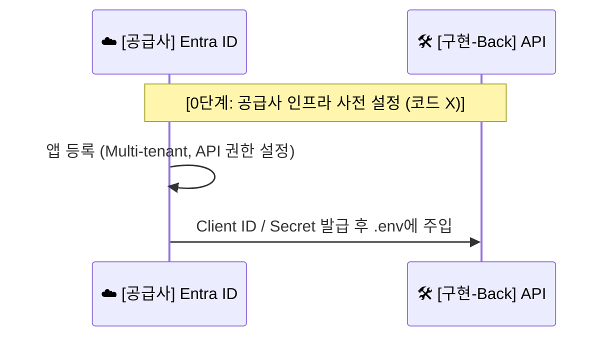

---
tags:
  - architecture
  - sequence_diagram
  - infrastructure_setup
date: 2026-02-20
completed: true
---

# 🚀 단계 0: 공급사 인프라 사전 설정 (코드 X)

> [!info] 문서 개요
> 이 문서는 [[Log-Doctor]] SaaS 솔루션의 초기 공급사 인프라 (새싹 테넌트) 설정 과정을 설명합니다. 개발 또는 운영 환경에 배포하기 전에 수동 혹은 스크립트로 진행되는 단계입니다.

## ✅ 구현 체크리스트

- [x] Entra ID Multi-tenant 앱 등록 (App Registration)
- [x] API 권한 (User.Read 등) 설정
- [x] Client ID / Secret 발급 및 `.env` 파일에 주입 완료

## 🔄 시퀀스 다이어그램 (부분)

> [!abstract] 이 단계에서는 멀티 테넌트용 앱을 등록하고, API 권한을 설정한 뒤 Client ID를 발급받아 환경 변수로 주입합니다.

## 📝 상세 설명

1. **앱 등록 (App Registration)**:
   - ☁️ **[[Entra ID]]**에 새로운 멀티 테넌트 애플리케이션으로 등록합니다.
   - 이 앱은 추후 고객의 테넌트(Customer Tenant)에서 Admin Consent를 받기 위해 사용됩니다.
   - 필요한 API 권한(예: `User.Read` 등)을 사전에 정의합니다.

2. **환경 변수 주입**:
   - 발급받은 `Client ID`, `Tenant ID` 및 `Client Secret`을 🛠️ **백엔드 서버**의 `.env` 파일 등에 안전하게 주입합니다.
   - 이 정보는 서비스 구동 시 OBO Token 교환 및 기타 Azure API 호출에 사용됩니다.
