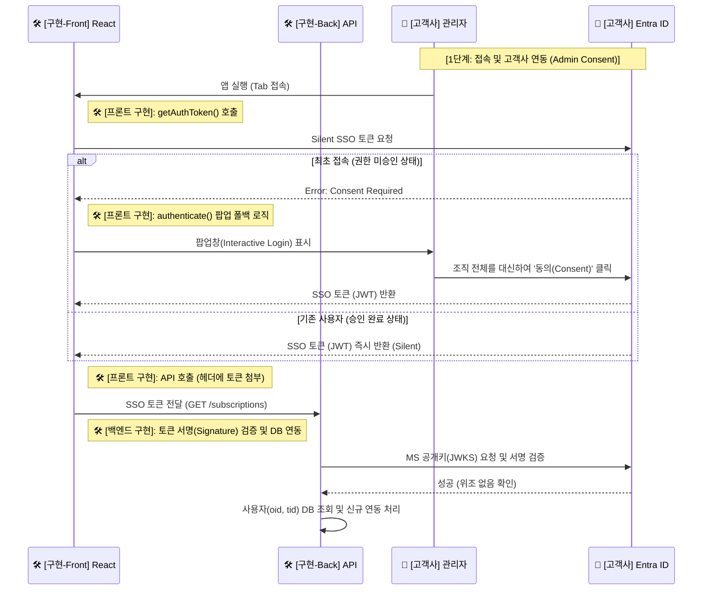

---
tags:
  - architecture
  - sequence_diagram
  - admin_consent
date: 2026-02-20
completed: true
---

# 🚀 단계 1: 접속 및 고객사 연동 (Admin Consent)

> [!info] 문서 개요
> 고객사 관리자가 최초로 Teams Tab 앱에 접속할 때 발생하는 인증(Silent SSO) 및 권한 승인(Interactive Login)의 흐름을 다룹니다.

## ✅ 구현 체크리스트

- [x] **[프론트엔드]** `getAuthToken()`을 통한 Silent SSO 토큰 요청 로직 구현
- [x] **[프론트엔드]** 최초 접속 시 `Consent Required` 에러 처리 및 `authenticate()` 팝업 로직 구현
- [x] **[프론트엔드]** 발급받은 SSO 토큰을 백엔드 API 요청 헤더(`Authorization: Bearer ...`)에 첨부
- [x] **[백엔드]** 프론트엔드가 보낸 SSO 토큰의 서명(Signature) 및 만료(Exp) 검증 미들웨어 구현
- [x] **[백엔드]** 검증된 페이로드에서 `oid`, `tid`를 추출하여 DB 회원 조회 및 신규 고객사 연동(가입) 처리

## 🔄 시퀀스 다이어그램 (부분)

> [!abstract] 프론트엔드가 토큰을 획득하고 관리할 권한을 얻는 과정을 설명합니다.

## 📝 상세 설명

1. **앱 접속 및 Silent SSO**:
   - 🏢 **고객사 관리자**가 Teams 환경 내부에서 탭(Personal Tab) 앱을 엽니다.
   - 🛠️ **프론트엔드 (React)** 는 Teams SDK의 `getAuthToken()`을 호출하여 백그라운드 환경에서 사용자의 개입 없이 SSO 토큰 발급을 시도합니다.

2. **Admin Consent 분기 처리**:
   - **(최초 접속 시)**: 권한이 부족하여 에러(`Consent Required`)가 나면, 프론트엔드 측에서 폴백 로직으로 `authenticate()` 팝업을 띄워 관리자가 전체 조직 구성원들을 대신해 동의 버튼을 클릭할 수 있도록 유도합니다.
   - **(기존 승인 시)**: 에러 없이 깔끔히 JWT를 받아옵니다.

3. **백엔드 통신**:
   - 확보된 JWT 토큰은 `Bearer` 헤더에 담겨 🛠️ **백엔드 API** 호출 시 사용됩니다.

---

## 🔐 발급된 SSO 토큰 (JWT) 해부분석

프론트엔드가 성공적으로 받아온 토큰은 단순한 난수가 아니라 **회원의 신분증(JWT Payload)** 입니다. 프론트엔드에서 `jwt-decode` 라이브러리를 통해 이 토큰을 까보면 다음과 같은 핵심 클레임(Claims)들이 포함되어 있습니다.

> [!important] 보안 핵심 요약
> 토큰의 암호화된 문자열 값 자체는 1시간마다 만료되어 계속 변하지만, 그 안에 들어있는 **근본 신분 정보(`oid`, `tid`)는 절대 변하지 않는 고유 식별자**입니다. 백엔드는 이 값을 꺼내어 사용자를 식별합니다.

| 클레임 키 | 예시 값 | 설명 및 중요도 |
| :--- | :--- | :--- |
| **`oid`** | `39e6ba32-xxx-5b332c` | ⭐ **(가장 중요) 사용자 고유 Object ID**. 사용자가 이름을 바꾸거나 이메일을 변경해도 절대 변하지 않는 고유 Primary Key입니다. DB 회원 조회용으로 쓰입니다. |
| **`tid`** | `ccdcb...-dc1fc6` | ⭐ **(매우 중요) 고객사(Tenant) 고유 ID**. 사용자가 소속된 회사를 식별합니다. B2B SaaS 환경에서 이 사람이 당사 직원인지 검증하는 핵심 키입니다. |
| **`preferred_username`** | `admin@logdoctor...` | 사용자의 로그인 이메일 주소입니다. (화면 표출용) |
| **`name`** | `최 성현` | 사용자의 표시 이름입니다. (화면 표출용 / DB 신규가입 시 닉네임으로 활용) |
| **`aud`** | `api://log-doctor...` | **Audience**. 이 토큰이 우리 서비스(Log Doctor App ID)를 쓰라고 발급된 정품이 맞는지 증명하는 정보입니다. |
| **`exp`** | `1708419600` | 토큰 만료 시간(Expiration Time, Unix 타임스탬프 기반). 이 시간이 지나면 토큰은 휴지조각이 되며 SSO 갱신이 필요합니다. |
