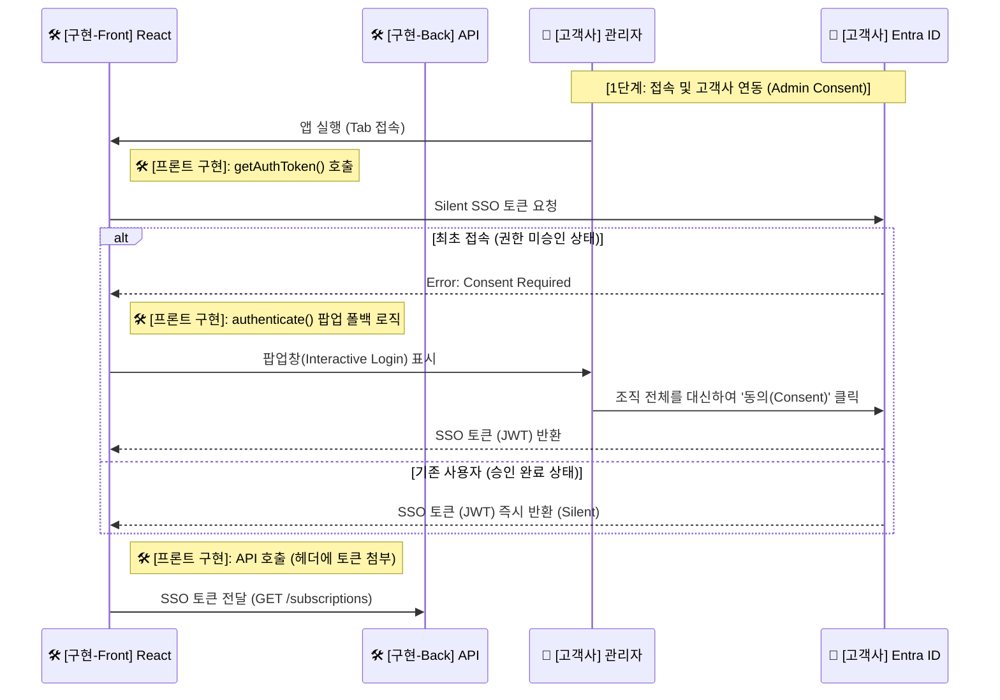

---
tags:
  - architecture
  - sequence_diagram
  - admin_consent
date: 2026-02-20
---

# 🚀 단계 1: 접속 및 고객사 연동 (Admin Consent)

> [!info] 문서 개요
> 고객사 관리자가 최초로 Teams Tab 앱에 접속할 때 발생하는 인증(Silent SSO) 및 권한 승인(Interactive Login)의 흐름을 다룹니다.

## 🔄 시퀀스 다이어그램 (부분)

> [!abstract] 프론트엔드가 토큰을 획득하고 관리할 권한을 얻는 과정을 설명합니다.

## 📝 상세 설명

1. **앱 접속 및 Silent SSO**: 
   - 🏢 **고객사 관리자**가 Teams 환경 내부에서 탭(Personal Tab) 앱을 엽니다.
   - 🛠️ **프론트엔드 (React)** 는 Teams SDK의 `getAuthToken()`을 호출하여 백그라운드 환경에서 사용자의 개입 없이 SSO 토큰 발급을 시도합니다.

2. **Admin Consent 분기 처리**:
   - **(최초 접속 시)**: 권한이 부족하여 에러(`Consent Required`)가 나면, 프론트엔드 측에서 폴백 로직으로 `authenticate()` 팝업을 띄워 관리자가 전체 조직 구성원들을 대신해 동의 버튼을 클릭할 수 있도록 유도합니다.
   - **(기존 승인 시)**: 에러 없이 깔끔히 JWT를 받아옵니다.

3. **백엔드 통신**:
   - 확보된 JWT 토큰은 `Bearer` 헤더에 담겨 🛠️ **백엔드 API** 호출 시 사용됩니다.
