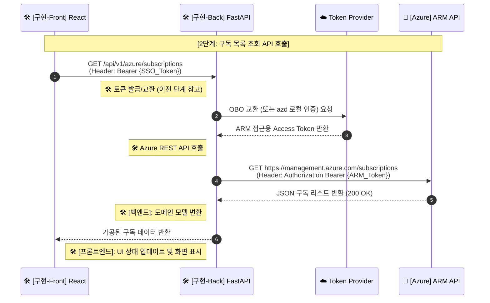
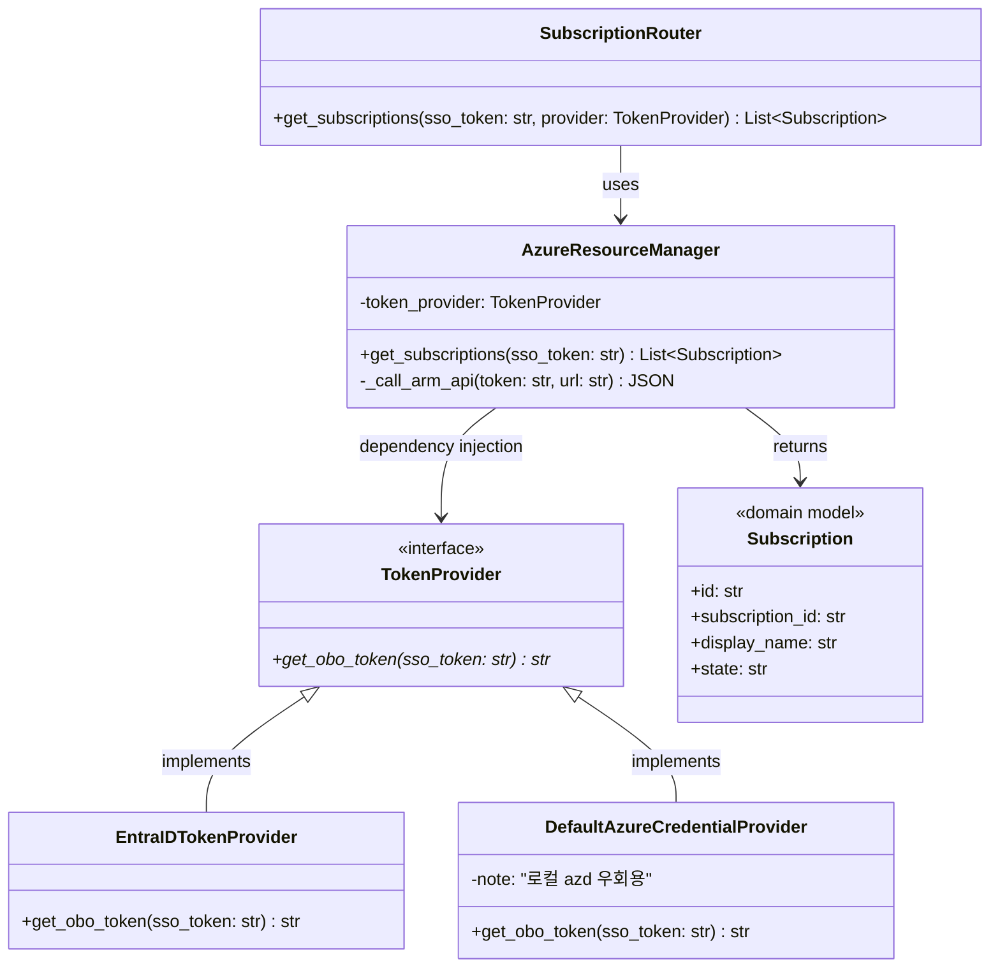
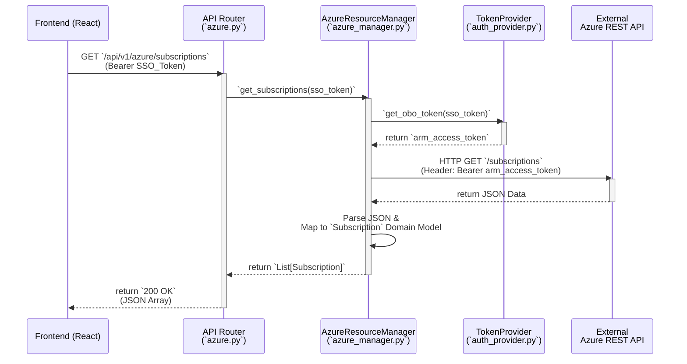

---
tags:
  - architecture
  - sequence_diagram
  - obo_flow
date: 2026-02-20
completed: true
---

# 🚀 단계 2: 구독 목록 조회 (ARM API 호출)

> [!info] 문서 개요
> 이 과정은 프론트엔드가 획득한 SSO 토큰을 백엔드에서 **OBO(On-Behalf-Of) Flow (또는 로컬 우회 인증)**를 통해 실제 Azure 리소스 제어용 토큰(ARM Access Token)으로 교환한 뒤, 이를 사용하여 **Azure 구독 목록을 조회**하는 절차를 설명합니다.

## ✅ 구현 체크리스트

- [x] 백엔드: MSAL 연동 / Azure SDK (`DefaultAzureCredential`)를 통한 ARM Access Token 획득 로직 구현
- [x] 백엔드: API 라우터 (`GET /api/v1/azure/subscriptions`) 생성
- [x] 백엔드: 발급받은 Access Token으로 Azure REST API (`GET https://management.azure.com/subscriptions?api-version=2020-01-01`) 호출
- [x] 백엔드: 응답받은 구독 리스트를 도메인 모델로 변환하여 프론트엔드로 반환
- [x] 프론트엔드: 백엔드 API 호출 및 화면에 리스트 UI 렌더링

## 🔄 시퀀스 다이어그램 (부분)

> [!abstract] 이 단계의 핵심은 🛠️ **백엔드 구현**에서 이전 단계(1, 1.5, 1.6)를 거쳐 획득한 **ARM Token**을 사용하여 [[Azure ARM API]]를 성공적으로 호출하고, 그 결과를 프론트에 전달하는 것입니다.

## 📝 상세 설명

1. **ARM Access Token 획득**:
   - 프론트에서 넘어온 SSO 토큰을 기반으로 `.env`의 설정(`AUTH_METHOD`)에 따라 ☁️ **Token Provider** (Entra ID OBO 또는 로컬 `azd`)로부터 Azure 환경 제어를 위한 ARM Access Token을 얻습니다. (1.5 및 1.6 문서 참조)

2. **ARM API 호출 및 데이터 반환**:
   - 성공적으로 확보한 ARM Access Token을 `Authorization: Bearer <token>` 헤더에 담아 🏢 **[[Azure ARM API]]** 측에 `GET /subscriptions?api-version=2020-01-01` 요청을 쏘아 사용자가 접근 가능한 Azure 구독 리스트를 얻습니다.
   - 응답받은 JSON 페이로드를 프론트엔드가 렌더링하기 편하도록 변환(`Subscription` 도메인 모델 등)하여 🛠️ **Teams 프론트엔드**로 돌려줍니다.

## 🧩 백엔드 컴포넌트 구조 (Class / Object-Oriented)

> [!abstract] 이 다이어그램은 FastAPI 백엔드 내부에서 구독 목록 조회를 처리하기 위해 어떤 클래스와 의존성 주입(DI)이 사용되는지 보여주는 객체지향 구조도입니다.

## ⚙️ 함수 호출 흐름 (Function Flow)

> [!abstract] 이 다이어그램은 프론트엔드에서 API 요청이 들어왔을 때, FastAPI 내부의 라우터부터 서비스 객체를 거쳐 외부 Azure API까지 함수가 어떤 순서로 호출되는지를 보여줍니다.

