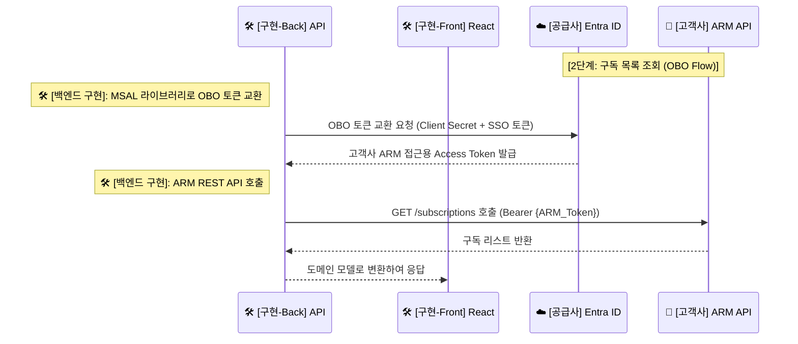

---
tags:
  - architecture
  - sequence_diagram
  - obo_flow
date: 2026-02-20
---

# 🚀 단계 2: 구독 목록 조회 (OBO Flow)

> [!info] 문서 개요
> 이 과정은 프론트엔드가 획득한 SSO 토큰을 백엔드에서 **OBO(On-Behalf-Of) Flow**를 통해 실제 Azure 리소스 제어용 토큰으로 교환하는 절차를 설명합니다.

## 🔄 시퀀스 다이어그램 (부분)

> [!abstract] 이 단계의 핵심은 🛠️ **백엔드 구현**에서 [[MSAL]] 라이브러리를 사용하여 Token Exchange를 수행하고 OBO 토큰을 발급받아 [[Azure ARM API]]를 호출하는 것입니다.

## 📝 상세 설명

1. **OBO (On-Behalf-Of) 토큰 교환**:
   - 프론트에서 넘어온 SSO 토큰(`User.Read` 등 한정된 스코프)을 🛠️ **백엔드 (SaaS)** 가 Azure 환경 제어를 위해 사용하려면 권한을 확장해야 합니다.
   - 백엔드는 `.env`에 정의된 **공급사 Client Secret**과 로그인된 사용자의 SSO 토큰을 ☁️ **[[Entra ID]]**로 보내어 "이 사용자를 대신(On-Behalf-Of)할 권한"을 요청합니다.
   
2. **ARM API 호출 및 데이터 반환**:
   - 성공적으로 교환받은 ARM Access Token을 통해 `GET /subscriptions`를 🏢 **[[Azure ARM API]]** 측에 쏘아 고객사의 Azure 구독 리스트를 얻습니다.
   - 응답받은 JSON 페이로드를 프론트엔드가 렌더링하기 편하도록 변환하여 🛠️ **Teams 프론트엔드**로 돌려줍니다.
