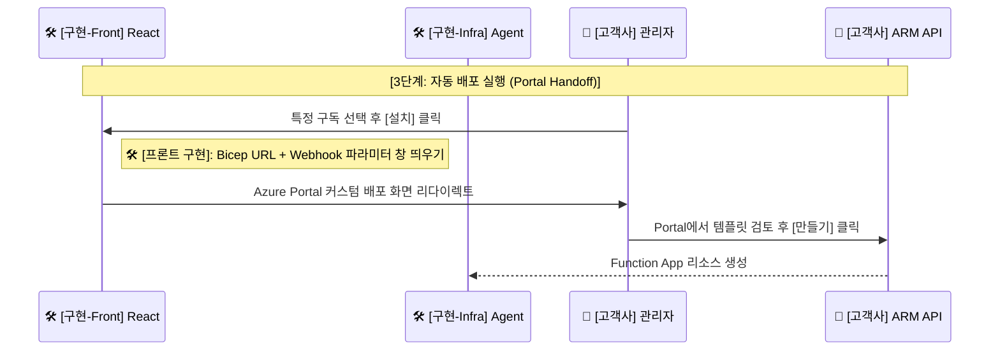

---
tags:
  - architecture
  - sequence_diagram
  - portal_handoff
  - bicep
date: 2026-02-20
---

# 🚀 단계 3: 자동 배포 실행 (Portal Handoff)

> [!info] 문서 개요
> 고객사 관리자가 구독 목록 중에서 특정 구독을 픽(Pick)한 후, 로컬 에이전트 인프라스트럭처([[Azure Functions]])를 자동 배포하는 프로세스입니다.

## 🔄 시퀀스 다이어그램 (부분)

> [!abstract] 이 다이어그램은 **Portal Handoff** 모델을 이용하여 Azure Portal로 리다이렉트시키고 템플릿 검토 후 실제 Bicep을 가동하는 로직을 다룹니다.

## 📝 상세 설명

1. **옵션 선택 및 커스텀 배포 뷰 생성**:
   - 🏢 **고객사 관리자**가 🛠️ **Teams 탭**에서 `설치` 버튼을 누르면, 프론트엔드가 Bicep 템플릿과 고객사 구독 정보, 그리고 추후 콜백 받을 Webhook 파라미터를 인코딩합니다.
   - 이 데이터들을 Query Parameter 등에 담아 공식 Azure Portal의 "커스텀 배포 팝업창(템플릿 배포 페이지)"으로 사용자를 리다이렉트 시킵니다.

2. **Bicep 템플릿 자동화 (IaC)**:
   - 🏢 **ARM API**는 Bicep 기반 인프라스트럭처 템플릿에 따라 실제 🛠️ **로컬 플랫폼 에이전트 인프라([[Azure Functions]], [[Managed Identity]])**를 자동 구축하게 됩니다.
   - এই 과정 중, 보안 강화를 위한 RBAC Role 역시 시스템 자동 할당 및 부여됩니다.
