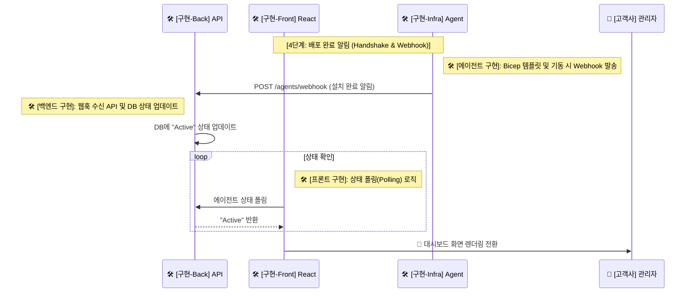

---
tags:
  - architecture
  - sequence_diagram
  - webhook_handshake
date: 2026-02-20
completed: false
---

# 🚀 단계 4: 배포 완료 알림 (Handshake & Webhook)

> [!info] 문서 개요
> 3단계 화면을 거쳐 Azure Functions 기반 **에이전트 인프라** 배포가 종료되면, 새롭게 생성된 에이전트가 공급사 백엔드로 Webhook을 날려 설치 완료를 알리는 아키텍처입니다.

## ✅ 구현 체크리스트

- [ ] 에이전트 (Infra): 배포 완료 및 기동 시 백엔드로 웹훅 발송(`POST /agents/webhook`) 로직 구현
- [ ] 백엔드: 웹훅 수신 API 처리 및 DB 내 해당 테넌트/에이전트 상태를 "Active"로 업데이트
- [ ] 프론트엔드: 에이전트 활성화 상태 폴링(Polling) 로직 구현 및 상태 변경 시 대시보드 화면 전환 처리

## 🔄 시퀀스 다이어그램 (부분)

> [!abstract] 이 구간은 DB 상태 값의 동기화 문제와 프론트엔드의 **폴링(Polling)** 처리 방식이 포함되어 있습니다.

## 📝 상세 설명

1. **설치 완료 웹훅(Webhook) 핸드셰이킹**:
   - 🛠️ **로컬 인프라 에이전트** 가 초기 구동(Startup)되거나 배포 스크립트의 마지막 단계가 완료될 때, 3단계 배포 파라미터로 넘겨받았던 SaaS 엔드포인트를 향해 `POST /agents/webhook`을 쏩니다.
   - 이 패킷에는 에이전트가 어떤 테넌트/구독에서 런칭했는지 매칭할 정보가 들어 있습니다.

2. **상태 동기화 (DB Update & Polling)**:
   - 🛠️ **백엔드 (SaaS)** 는 Database 내 해당 고객의 상태를 "설치 중"에서 `"Active"`로 업데이트합니다.
   - 이때 🛠️ **Teams 프론트엔드** 에서는 수 초 단위로 SaaS 백엔드를 폴링(Polling)하고 있었으므로, 상태가 "Active" 됨을 관측하는 즉시 성공 처리(🎉)와 함께 대시보드 메인 화면으로 전환시킵니다.
