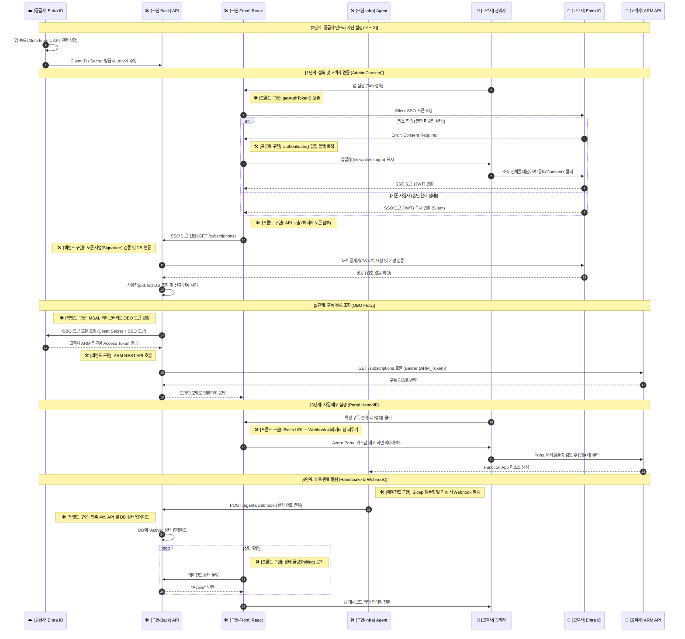
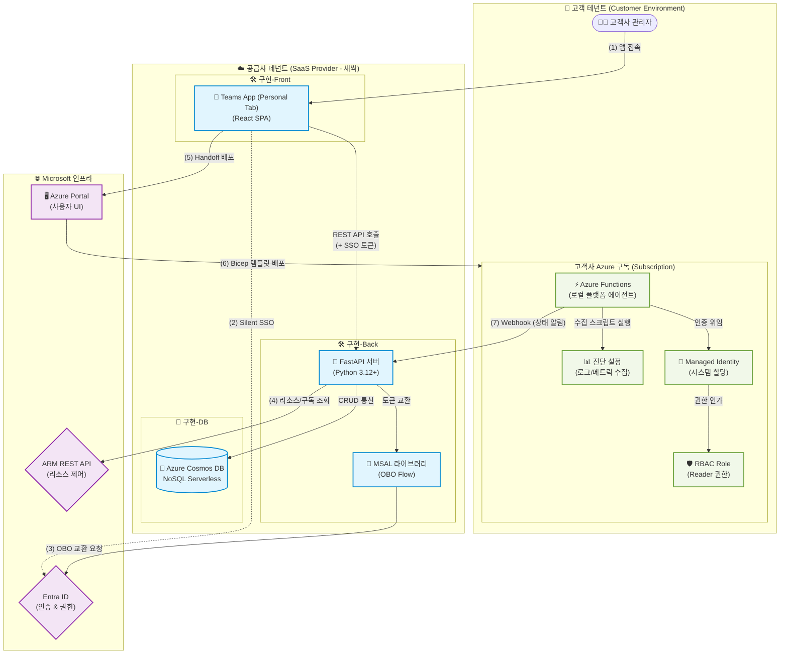

---
tags:
  - architecture
  - sequence_diagram
  - system_design
date: 2026-02-20
---

# 🚀 Azure Projects (Log-Doctor)

> [!info] 문서 개요
> 이 문서는 [[Log-Doctor]] SaaS 솔루션이 [[Entra ID]], [[Azure ARM API|ARM API]], 그리고 고객의 [[Azure Functions|로컬 에이전트]]와 어떻게 상호작용하는지 정리한 **아키텍처 스펙 문서**입니다.

## 🔄 1. 시스템 동작 시퀀스 (Architecture Sequence)

> [!abstract] SaaS 백엔드, 프론트엔드(Teams), 그리고 고객사 인프라(Agent) 간의 상호작용 및 인증 흐름을 구체적인 기술 스택과 함께 정의합니다.

## 🏛️ 2. 전체 시스템 아키텍처 (System Architecture & Components)

> [!note]
> SaaS 제공자(새싹 테넌트)와 고객사(Customer 테넌트), 그리고 Microsoft 클라우드 인프라 간의 물리적/논리적 컴포넌트 구성도입니다.

