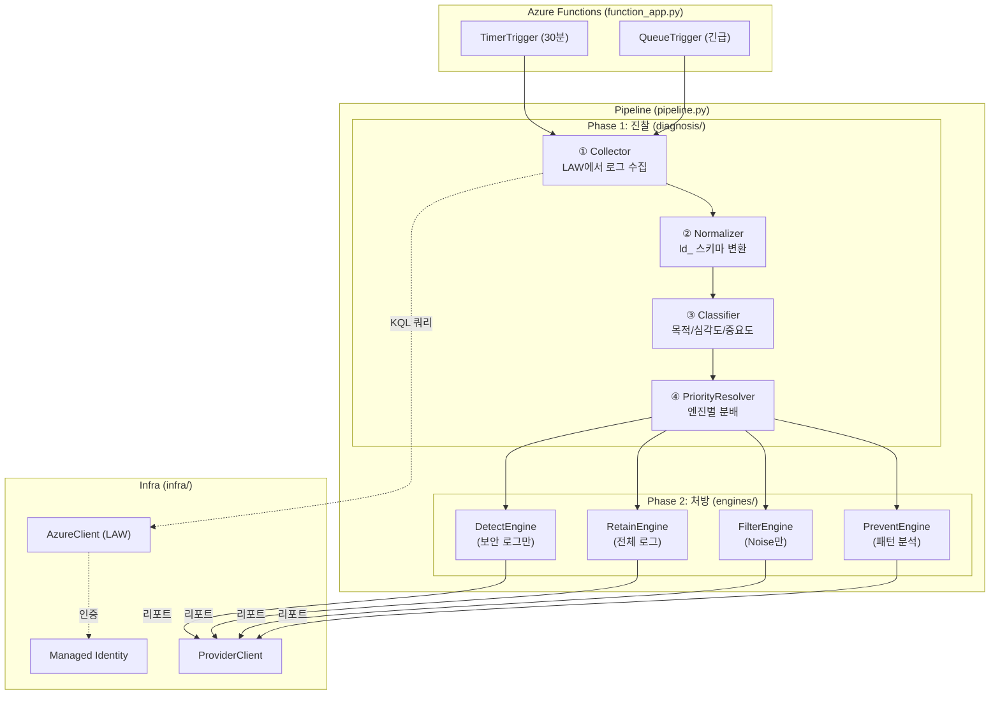

# Log Doctor: 진찰 → 구현 가이드

> Log Doctor는 **로그를 진찰(Diagnosis)하는 서비스**입니다.
> 의사가 환자를 진찰할 때 "어디가 아픈지 → 검사 → 판단 → 처방" 순서가 있듯이,
> Log Doctor도 "로그 수집 → 정규화 → 분류 → 엔진 실행" 순서로 동작합니다.
>
> 이 문서는 [log-standardization.md](log-standardization.md)의 표준화 개념을  
> `log-doctor-client-back` 코드에 **어디에 어떻게 구현하는가**를 설명합니다.

---

## 1. 진찰 비유: 의사 vs Log Doctor

```
의사의 진찰 과정                        Log Doctor의 진단 과정
────────────                           ────────────
① 환자가 온다                          ① TimerTrigger가 깨어남
   └ "어디가 아프세요?"                    └ should_i_run? → Provider에 폴링

② 기초 검사 (혈압, 체온)                ② 로그 수집 (Log Collector)
   └ 표준 장비로 수치화                    └ LAW에서 KQL로 수집 → ld_ 스키마로 정규화

③ 분류 (내과? 외과? 정형?)              ③ 분류 (Classifier)
   └ 증상에 따라 전문 분과로 분류          └ 목적/심각도/중요도로 분류 → 엔진 라우팅

④ 전문의 진단                          ④ 엔진 실행 (Engines)
   ├ 내과: "혈당 높으니 관리"             ├ Retain: "이 로그 보존 기간 재설정"
   ├ 외과: "수술 필요"                   ├ Detect: "이 패턴 공격 징후"
   └ 피부과: "연고 처방"                 ├ Prevent: "Debug 레벨 너무 많음"
                                       └ Filter: "이 노이즈 삭제 추천"

⑤ 처방전 발급                          ⑤ 리포트 전송
   └ 약국에 보냄                          └ Provider에 결과 보고 → Teams 대시보드
```

---

## 2. 현재 코드 구조 vs 필요한 구조

### 현재 `log-doctor-client-back` 구조

```
log-doctor-client-back/
├── function_app.py          ← Azure Functions 진입점 (Timer/Queue)
└── agent/
    ├── handshake.py         ← Provider 등록/인증
    ├── pipeline.py          ← 엔진 순차 실행 (오케스트레이터)
    ├── core/
    │   └── config.py        ← 설정값
    ├── engines/
    │   ├── base.py          ← BaseEngine (추상 클래스)
    │   ├── detect.py        ← 스켈레톤 (빈 엔진)
    │   ├── filter.py        ← 스켈레톤
    │   ├── prevent.py       ← 스켈레톤
    │   └── retain.py        ← 스켈레톤
    └── infra/
        ├── auth.py          ← Managed Identity 인증
        ├── azure.py         ← Azure 리소스 클라이언트
        └── provider.py      ← Provider Backend 통신
```

### 추가해야 할 구조 ("진찰" 레이어)

```
agent/
├── ...기존 구조 유지...
│
├── diagnosis/                       ← 🆕 진찰 레이어 (엔진 실행 전에 동작)
│   ├── __init__.py
│   ├── collector.py                 ← 로그 수집기 (LAW → 원본 데이터)
│   ├── normalizer.py                ← 정규화기 (원본 → ld_ 스키마 변환)
│   ├── classifier.py                ← 분류기 (ld_ 데이터 → 목적/심각도/중요도 배정)
│   └── mapping/
│       ├── table_registry.py        ← LAW 테이블 → 레이어/심각도 매핑 정의
│       └── priority_resolver.py     ← 엔진 간 충돌 해결 로직
│
└── engines/
    ├── base.py                      ← ⬆ 수정: run(classified_logs) 시그니처 변경
    ├── detect.py                    ← 분류된 로그 중 Security만 받아서 분석
    ├── filter.py                    ← 분류된 로그 중 Noise/Low만 받아서 처리
    ├── prevent.py                   ← 분류된 로그 중 패턴 분석
    └── retain.py                    ← 분류 결과의 retain_class에 따라 처리
```

---

## 3. 실행 흐름: Pipeline에 진찰 단계 추가

### 현재 흐름 (표준화 없음)

```
TimerTrigger → should_i_run? → Pipeline.execute_all()
                                  ├── DetectEngine.run()   ← 각 엔진이 독자적으로 LAW 쿼리
                                  ├── PreventEngine.run()  ← 각자 다른 기준으로 판단
                                  ├── FilterEngine.run()   ← 충돌 가능!
                                  └── RetainEngine.run()
```

### 개선된 흐름 (표준화 적용)

```
TimerTrigger → should_i_run? → Pipeline.execute_all()
                                  │
                               ① Collector.collect()
                                  │  LAW에서 로그 수집 (1회만 수행)
                                  ▼
                               ② Normalizer.normalize()
                                  │  ld_ 스키마로 변환
                                  ▼
                               ③ Classifier.classify()
                                  │  목적/심각도/중요도 배정
                                  ▼
                               ④ PriorityResolver.resolve()
                                  │  엔진 간 충돌 해결 + 엔진별 로그 분배
                                  ▼
                               ⑤ 엔진 실행 (분류된 로그만 받음)
                                  ├── DetectEngine.run(security_logs)
                                  ├── RetainEngine.run(all_classified_logs)
                                  ├── FilterEngine.run(filterable_logs)  ← Noise만
                                  └── PreventEngine.run(pattern_logs)
```

> [!IMPORTANT] 핵심 차이
> **현재**: 4개 엔진이 각각 LAW에 쿼리함 → 4번 쿼리, 4가지 기준
> **개선**: 1번 수집 → 1번 정규화 → 1번 분류 → 분류 결과를 엔진에 분배

---

## 4. 각 모듈의 역할과 구현 방향

### 4-1. Collector (수집기)

```python
# agent/diagnosis/collector.py — 역할: LAW에서 로그를 한 번만 수집

class LogCollector:
    """LAW에서 원본 로그를 수집하는 책임만 가진다."""

    def __init__(self, azure_client: AzureClient):
        self.azure_client = azure_client

    async def collect(self, tables: list[str], time_range_hours: int = 1) -> list[dict]:
        """
        지정된 테이블에서 최근 N시간 로그를 수집.
        각 엔진이 따로 쿼리하지 않고, 여기서 한 번만 수집한다.
        """
        raw_logs = []
        for table in tables:
            kql = f"{table} | where TimeGenerated > ago({time_range_hours}h)"
            results = await self.azure_client.query_logs(kql)
            for row in results:
                raw_logs.append({"_source_table": table, **row})
        return raw_logs
```

### 4-2. Normalizer (정규화기)

```python
# agent/diagnosis/normalizer.py — 역할: 테이블마다 다른 필드를 ld_ 통일 포맷으로 변환

class LogNormalizer:
    """LAW 원본 로그를 ld_ 공통 스키마로 변환한다."""

    def normalize(self, raw_log: dict) -> dict:
        table = raw_log["_source_table"]
        mapping = TABLE_REGISTRY[table]  # 매핑 테이블 참조

        return {
            "ld_timestamp": raw_log.get("TimeGenerated"),
            "ld_source_table": table,
            "ld_layer": mapping.layer,              # "security", "application", etc.
            "ld_severity": mapping.extract_severity(raw_log),
            "ld_message": mapping.extract_message(raw_log),
            "ld_context": mapping.extract_context(raw_log),
            "raw": raw_log,
        }
```

### 4-3. Classifier (분류기)

```python
# agent/diagnosis/classifier.py — 역할: 목적/중요도를 판단하고 엔진별 행동을 결정

class LogClassifier:
    """정규화된 로그에 목적(purpose)과 중요도(criticality)를 배정한다."""

    def classify(self, normalized_log: dict) -> dict:
        layer = normalized_log["ld_layer"]
        severity = normalized_log["ld_severity"]

        # 목적 결정
        purpose = "security" if layer == "security" else "operational"

        # 중요도 점수 계산 (log-standardization.md Section 3-2)
        criticality = self._calculate_criticality(layer, severity, purpose)

        # 엔진별 행동 결정
        classification = {
            "retain_class": self._to_retain_class(criticality),
            "filterable": criticality in ("low", "noise"),
            "detect_relevant": purpose == "security",
            "prevent_relevant": severity in ("DEBUG", "TRACE"),
        }

        return {**normalized_log, "ld_purpose": purpose,
                "ld_criticality": criticality, "ld_classification": classification}
```

### 4-4. PriorityResolver (우선순위 해결기)

```python
# agent/diagnosis/mapping/priority_resolver.py — 역할: 엔진 간 충돌 해결

class PriorityResolver:
    """Detect > Retain > Filter > Prevent 우선순위로 충돌을 해결한다."""

    def resolve(self, classified_logs: list[dict]) -> dict:
        """분류된 로그를 엔진별로 분배한다."""
        engine_inputs = {
            "detect": [],   # security 레이어만
            "retain": [],   # 전부 (보존 등급 결정됨)
            "filter": [],   # filterable=True인 것만
            "prevent": [],  # prevent_relevant=True인 것만
        }

        for log in classified_logs:
            cls = log["ld_classification"]

            # Detect: 보안 관련이면 무조건 포함
            if cls["detect_relevant"]:
                engine_inputs["detect"].append(log)

            # Retain: 모든 로그의 보존 등급 관리
            engine_inputs["retain"].append(log)

            # Filter: 중요도가 Low/Noise인 경우만 (보안은 절대 불가)
            if cls["filterable"] and not cls["detect_relevant"]:
                engine_inputs["filter"].append(log)

            # Prevent: 로그 패턴 분석 대상
            if cls["prevent_relevant"]:
                engine_inputs["prevent"].append(log)

        return engine_inputs
```

---

## 5. Pipeline 수정 방향

```python
# agent/pipeline.py — 개선 후

class AnalysisPipeline:
    def __init__(self, azure_client: AzureClient):
        # 진찰 레이어
        self.collector = LogCollector(azure_client)
        self.normalizer = LogNormalizer()
        self.classifier = LogClassifier()
        self.resolver = PriorityResolver()

        # 엔진 레이어
        self.engines = {
            "detect": DetectEngine(azure_client),
            "retain": RetainEngine(azure_client),
            "filter": FilterEngine(azure_client),
            "prevent": PreventEngine(azure_client),
        }

    async def execute_all(self, policies: dict) -> list[dict]:
        # ① 수집 (1회)
        raw_logs = await self.collector.collect(
            tables=policies.get("target_tables", []),
            time_range_hours=policies.get("time_range", 1)
        )

        # ② 정규화
        normalized = [self.normalizer.normalize(log) for log in raw_logs]

        # ③ 분류
        classified = [self.classifier.classify(log) for log in normalized]

        # ④ 엔진별 분배
        engine_inputs = self.resolver.resolve(classified)

        # ⑤ 엔진 실행 (분류된 로그만 받는다)
        results = []
        for engine_name, logs in engine_inputs.items():
            engine = self.engines[engine_name]
            result = await engine.run(logs)
            results.append(result)

        return results
```

---

## 6. 전체 흐름 다이어그램



---

## 7. 구현 순서 (추천)

| 순서 | 모듈 | 난이도 | 이유 |
| :---: | --- | :---: | --- |
| 1 | `mapping/table_registry.py` | 낮음 | 순수 데이터 정의 — LAW 테이블 목록과 매핑 규칙 |
| 2 | `normalizer.py` | 낮음 | table_registry 기반 변환 로직, 테스트 쉬움  |
| 3 | `classifier.py` | 중간 | 점수 계산 로직, 경계값 조정 필요 |
| 4 | `collector.py` | 중간 | LAW KQL 연동 필요, 페이징/타임아웃 처리 |
| 5 | `priority_resolver.py` | 중간 | 엔진 간 충돌 규칙 구현 |
| 6 | `pipeline.py` 수정 | 낮음 | 위 모듈 조합 |
| 7 | 각 엔진 구현 | 높음 | 분류된 로그를 받아 실제 분석/처방 |

> [!TIP] 1~3번은 LAW 연동 없이 순수 Python으로 구현 + 테스트 가능합니다.
> `raw_log` 샘플 JSON을 만들어서 `normalize → classify` 파이프라인을 먼저 검증하세요.
