# Log Doctor Project: Log Optimization & Management Plan

이 문서는 Azure Functions 기반의 로그 최적화 및 관리 전략을 정리한 내용입니다. (화이트보드 회의 내용 정리)

## 1. Retain (보존 및 관리)

로그의 보존 기간과 중요도에 따른 관리 전략입니다. 보존 정책은 **비용**과 **컴플라이언스** 사이의 균형을 맞추는 것이 핵심입니다.

---

### 1-1. 전체 아키텍처 (C4 Container Diagram)

시스템 전체에서 Retain 기능이 어떤 위치에 있는지 보여줍니다.

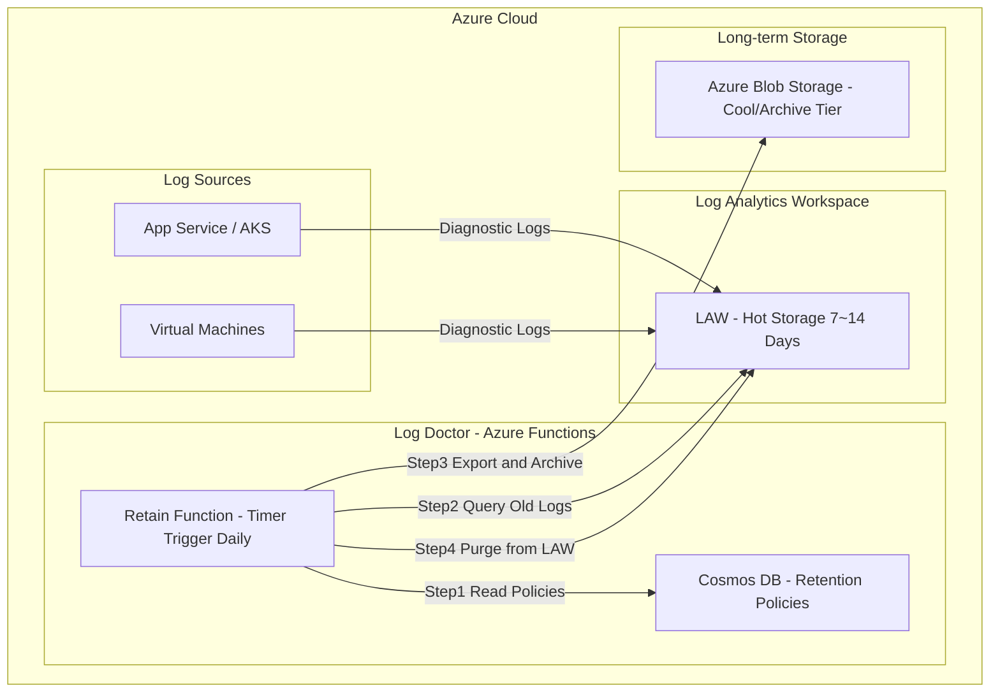
```mermaid
graph TB
    subgraph Azure Cloud
        subgraph Log Sources
            AppService["App Service / AKS"]
            VM["Virtual Machines"]
        end

        subgraph Log Analytics Workspace
            LAW["LAW - Hot Storage 7~14 Days"]
        end

        subgraph Log Doctor - Azure Functions
            RetainFn["Retain Function - Timer Trigger Daily"]
            PolicyDB["Cosmos DB - Retention Policies"]
        end

        subgraph Long-term Storage
            Blob["Azure Blob Storage - Cool/Archive Tier"]
        end
    end

    AppService -->|Diagnostic Logs| LAW
    VM -->|Diagnostic Logs| LAW
    RetainFn -->|Step1 Read Policies| PolicyDB
    RetainFn -->|Step2 Query Old Logs| LAW
    RetainFn -->|Step3 Export and Archive| Blob
    RetainFn -->|Step4 Purge from LAW| LAW
```

> [!NOTE] 왜 이렇게 짰는가?
> - **Log Analytics Workspace(LAW)** 는 쿼리 성능이 뛰어나지만, 장기 보존 시 비용이 매우 높습니다 (GB당 약 $2.76/월).
> - **Blob Storage Archive Tier** 는 GB당 약 $0.002/월로, **약 1,000배 이상 저렴**합니다.
> - 따라서 "최근 N일은 LAW에서 빠르게 검색 가능하게 유지하고, 오래된 로그는 저렴한 스토리지로 옮기는" 2-tier 전략이 필수입니다.

---

### 1-2. 보존 정책 분류 흐름도 (Decision Flow)

각 로그가 어떤 보존 등급에 배정되는지 결정하는 상세 흐름입니다.

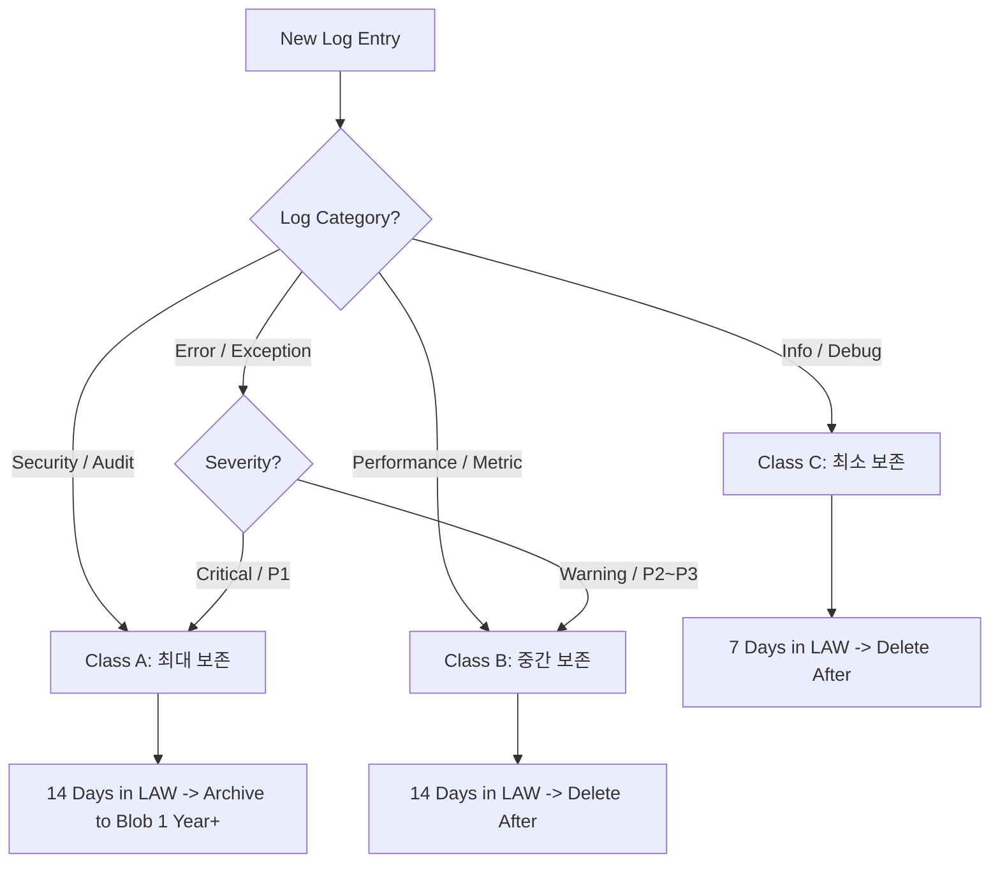
```mermaid
graph TD
    A["New Log Entry"] --> B{"Log Category?"}

    B -- "Security / Audit" --> C["Class A: 최대 보존"]
    B -- "Error / Exception" --> D{"Severity?"}
    B -- "Info / Debug" --> E["Class C: 최소 보존"]
    B -- "Performance / Metric" --> F["Class B: 중간 보존"]

    D -- "Critical / P1" --> C
    D -- "Warning / P2~P3" --> F

    C --> G["14 Days in LAW -> Archive to Blob 1 Year+"]
    F --> H["14 Days in LAW -> Delete After"]
    E --> I["7 Days in LAW -> Delete After"]
```

> [!NOTE] 왜 이렇게 짰는가?
> - **Class A (Security/Audit, Critical Error)**: 컴플라이언스와 사후 분석을 위해 장기 보존이 반드시 필요합니다. 규제 요건(ISMS, SOC2 등)에서 보안 로그 1년 이상 보존을 요구하는 경우가 많습니다.
> - **Class B (Performance, Warning)**: 트렌드 분석용으로 2주 정도면 충분하고, 장기 보존 가치가 낮습니다.
> - **Class C (Info/Debug)**: 개발/디버깅 용도로만 가치가 있으므로 7일이면 충분합니다. 이 로그들이 전체 볼륨의 70~80%를 차지하므로, 빠르게 삭제하는 것이 비용 절감의 핵심입니다.

---

### 1-3. Timer Trigger 실행 흐름 (Sequence Diagram)

Azure Functions가 실제로 어떤 순서로 보존 작업을 수행하는지 보여줍니다.

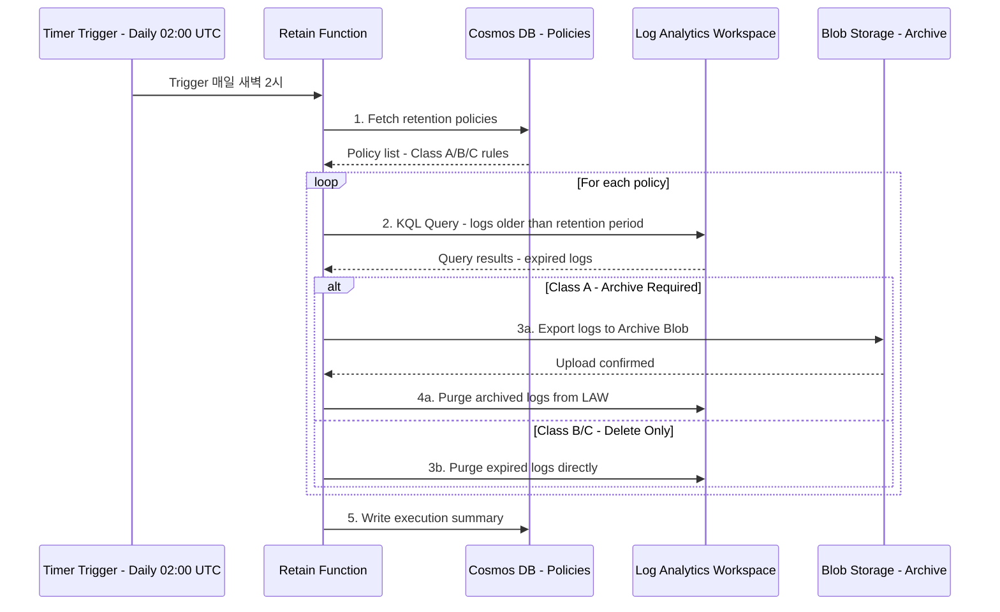
```mermaid
sequenceDiagram
    participant Timer as Timer Trigger - Daily 02:00 UTC
    participant Fn as Retain Function
    participant DB as Cosmos DB - Policies
    participant LAW as Log Analytics Workspace
    participant Blob as Blob Storage - Archive

    Timer->>Fn: Trigger 매일 새벽 2시
    Fn->>DB: 1. Fetch retention policies
    DB-->>Fn: Policy list - Class A/B/C rules

    loop For each policy
        Fn->>LAW: 2. KQL Query - logs older than retention period
        LAW-->>Fn: Query results - expired logs

        alt Class A - Archive Required
            Fn->>Blob: 3a. Export logs to Archive Blob
            Blob-->>Fn: Upload confirmed
            Fn->>LAW: 4a. Purge archived logs from LAW
        else Class B/C - Delete Only
            Fn->>LAW: 3b. Purge expired logs directly
        end
    end

    Fn->>DB: 5. Write execution summary
```

> [!NOTE] 왜 이렇게 짰는가?
> - **새벽 2시 UTC 실행**: 사용자 트래픽이 가장 적은 시간대에 실행하여 LAW 쿼리 부하를 최소화합니다.
> - **정책 DB 분리 (Cosmos DB)**: 보존 정책을 코드에 하드코딩하지 않고 DB에 저장함으로써, **운영자가 UI에서 보존 기간을 동적으로 변경**(7→14, 14→7)할 수 있게 합니다.
> - **Archive 후 Purge**: 데이터 유실 방지를 위해 반드시 Blob 업로드가 확인된 후에만 LAW에서 삭제합니다.
> - **실행 요약 기록**: 어제 몇 건이 보존/삭제되었는지 추적할 수 있어 운영 가시성을 확보합니다.

---

### 1-4. 보존 정책 데이터 모델 (Class Diagram)

Cosmos DB에 저장되는 보존 정책의 데이터 구조입니다.

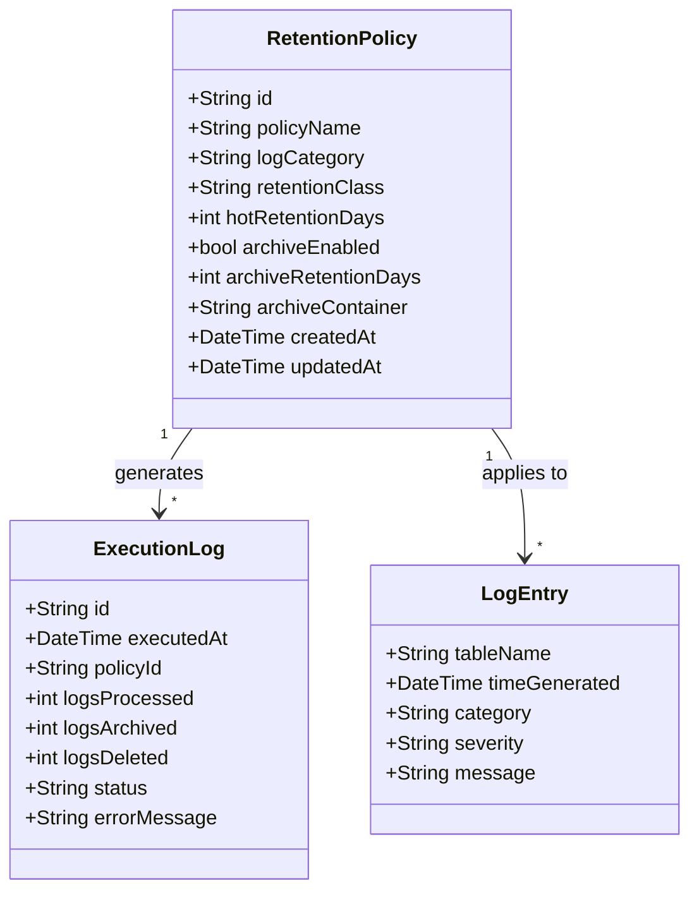
```mermaid
classDiagram
    class RetentionPolicy {
        +String id
        +String policyName
        +String logCategory
        +String retentionClass
        +int hotRetentionDays
        +bool archiveEnabled
        +int archiveRetentionDays
        +String archiveContainer
        +DateTime createdAt
        +DateTime updatedAt
    }

    class ExecutionLog {
        +String id
        +DateTime executedAt
        +String policyId
        +int logsProcessed
        +int logsArchived
        +int logsDeleted
        +String status
        +String errorMessage
    }

    class LogEntry {
        +String tableName
        +DateTime timeGenerated
        +String category
        +String severity
        +String message
    }

    RetentionPolicy "1" --> "*" ExecutionLog : generates
    RetentionPolicy "1" --> "*" LogEntry : applies to
```

> [!NOTE] 왜 이렇게 짰는가?
> - **RetentionPolicy**: 정책 자체를 문서(document)로 관리하여, 카테고리별로 다른 보존 기간과 아카이브 여부를 유연하게 설정할 수 있습니다.
> - **ExecutionLog**: 매 실행마다 기록을 남겨서, "어제 정상적으로 돌았나?", "얼마나 삭제했나?"를 확인할 수 있게 합니다.
> - **archiveEnabled / archiveRetentionDays**: 아카이브 여부와 기간을 정책 단위로 분리하여, 특정 로그만 선택적으로 장기 보존할 수 있습니다.

---

### 1-5. 로그 생명주기 (State Diagram)

하나의 로그 항목이 생성부터 최종 삭제까지 거치는 상태 전이를 보여줍니다.

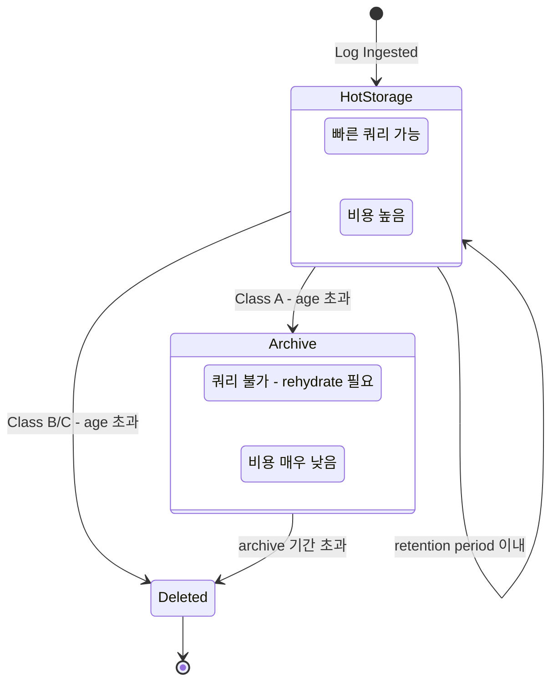
```mermaid
stateDiagram-v2
    [*] --> HotStorage: Log Ingested

    state HotStorage {
        direction LR
        query: 빠른 쿼리 가능
        cost1: 비용 높음
    }

    state Archive {
        direction LR
        rehydrate: 쿼리 불가 - rehydrate 필요
        cost2: 비용 매우 낮음
    }

    HotStorage --> HotStorage: retention period 이내
    HotStorage --> Archive: Class A - age 초과
    HotStorage --> Deleted: Class B/C - age 초과
    Archive --> Deleted: archive 기간 초과
    Deleted --> [*]
```

> [!NOTE] 왜 이렇게 짰는가?
> - 로그의 **가치는 시간이 지날수록 감소**합니다. 최근 로그는 즉각적인 디버깅/모니터링에 사용되고, 오래된 로그는 규제 준수나 포렌식 용도로만 필요합니다.
> - State Diagram으로 표현하면 **각 로그의 현재 상태와 전이 조건**이 명확해져, 운영팀이 정책을 쉽게 이해할 수 있습니다.
> - Archive에서 다시 쿼리하려면 **rehydrate(복원)**가 필요하므로, 이 비용과 시간을 고려해 정책을 설계해야 합니다.

---

### 1-6. 비용 비교 요약

| 저장소 | 비용 (GB/월) | 쿼리 속도 | 용도 |
| --- | --- | --- | --- |
| Log Analytics (LAW) | ~$2.76 | 즉시 (KQL) | 실시간 모니터링, 디버깅 |
| Blob Cool Tier | ~$0.01 | 복원 필요 (수분) | 중기 보존 (3~6개월) |
| Blob Archive Tier | ~$0.002 | 복원 필요 (수시간) | 장기 보존 (1년+, 컴플라이언스) |

> [!TIP] 핵심 포인트
> 일 10GB 로그 발생 시, 전부 LAW에 30일 보존하면 월 **~$828**, 7일만 LAW + 나머지 Archive로 하면 월 **~$195 + $0.5 = ~$196**. **약 75% 비용 절감**이 가능합니다.

---

## 2. Prevent (앱 레벨 예방)

어플리케이션 단에서 불필요한 로그 생성을 방지합니다. **로그 볼륨의 70~80%는 Info/Debug 레벨**이므로, 이를 제어하는 것만으로도 비용과 노이즈를 대폭 줄일 수 있습니다.

---

### 2-1. 전체 아키텍처 (Prevent Function 위치)

Prevent Function이 전체 시스템에서 어떤 역할을 하는지 보여줍니다.

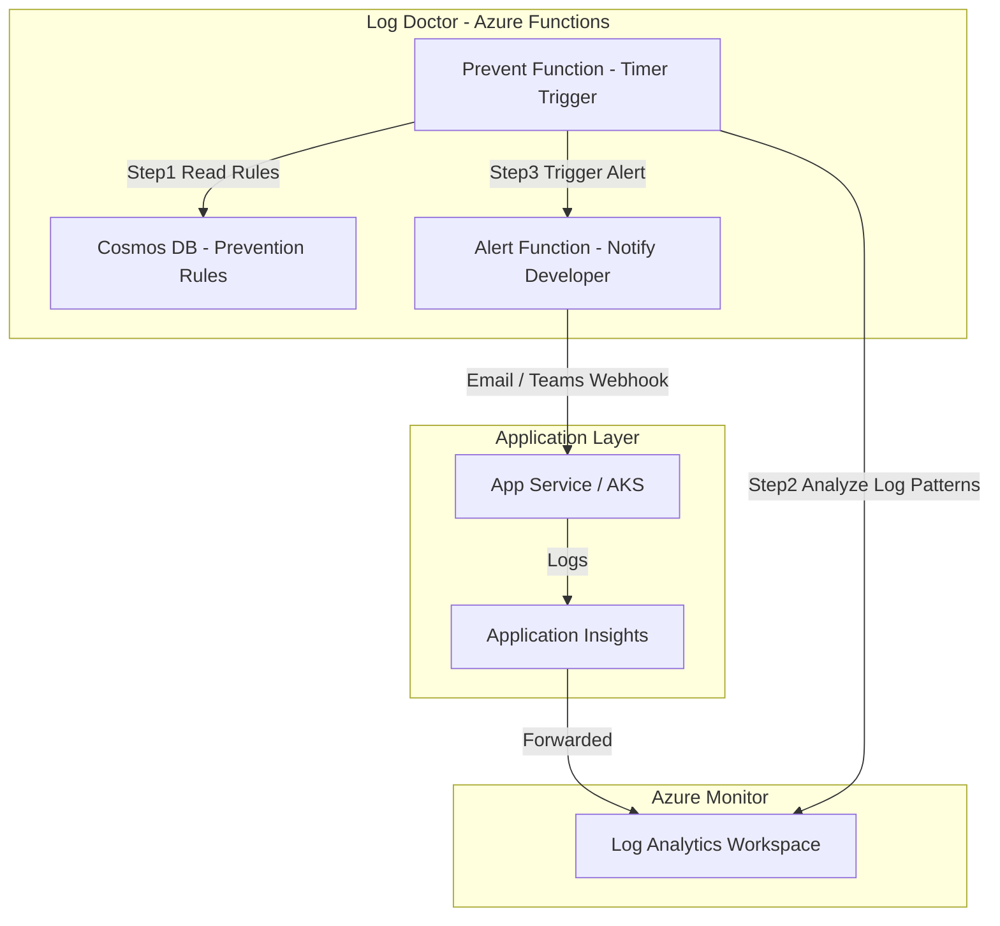
```mermaid
graph TB
    subgraph Application Layer
        App["App Service / AKS"]
        AppConfig["Application Insights"]
    end

    subgraph Log Doctor - Azure Functions
        PreventFn["Prevent Function - Timer Trigger"]
        RuleDB["Cosmos DB - Prevention Rules"]
        AlertFn["Alert Function - Notify Developer"]
    end

    subgraph Azure Monitor
        LAW["Log Analytics Workspace"]
    end

    App -->|Logs| AppConfig
    AppConfig -->|Forwarded| LAW
    PreventFn -->|Step1 Read Rules| RuleDB
    PreventFn -->|Step2 Analyze Log Patterns| LAW
    PreventFn -->|Step3 Trigger Alert| AlertFn
    AlertFn -->|Email / Teams Webhook| App
```

> [!NOTE] 왜 이렇게 짰는가?
> - Prevent는 **로그 자체를 삭제하는 것이 아니라**, 개발팀에게 "이 로그 레벨을 올려라", "이 로그가 너무 자주 나와"라고 **알려주는 역할**입니다.
> - 직접 로그를 차단하면 중요한 정보가 유실될 위험이 있으므로, **권고 → 개발팀 조치** 형태의 간접 개입 방식을 선택했습니다.
> - Application Insights를 통해 로그 패턴을 분석하면, 앱별/서비스별 세밀한 분석이 가능합니다.

---

### 2-2. 규칙 엔진 상세 흐름 (Decision Flow)

Prevent Function이 각 로그 패턴을 어떻게 판단하는지의 상세 흐름입니다.

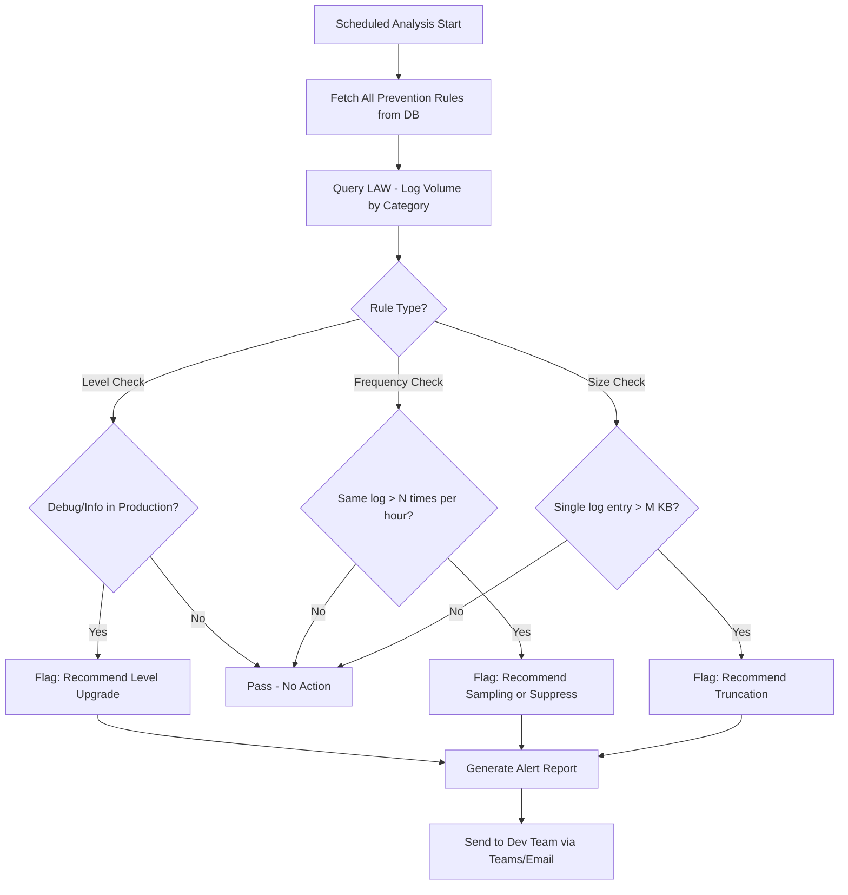
```mermaid
graph TD
    A["Scheduled Analysis Start"] --> B["Fetch All Prevention Rules from DB"]
    B --> C["Query LAW - Log Volume by Category"]

    C --> D{"Rule Type?"}

    D -- "Level Check" --> E{"Debug/Info in Production?"}
    D -- "Frequency Check" --> F{"Same log > N times per hour?"}
    D -- "Size Check" --> G{"Single log entry > M KB?"}

    E -- "Yes" --> H["Flag: Recommend Level Upgrade"]
    E -- "No" --> I["Pass - No Action"]

    F -- "Yes" --> J["Flag: Recommend Sampling or Suppress"]
    F -- "No" --> I

    G -- "Yes" --> K["Flag: Recommend Truncation"]
    G -- "No" --> I

    H --> L["Generate Alert Report"]
    J --> L
    K --> L
    L --> M["Send to Dev Team via Teams/Email"]
```

> [!NOTE] 왜 이렇게 짰는가?
> - **세 가지 규칙 타입**으로 분류한 이유:
>   - **Level Check**: 프로덕션에서 Debug 로그가 켜져 있으면 볼륨이 폭증합니다. 가장 흔한 실수이므로 1순위 체크입니다.
>   - **Frequency Check**: 같은 로그가 시간당 수천 건 반복되면 loop bug나 retry storm의 징후입니다. 빈도 제한을 통해 10건만 허용하고 나머지는 sampling하도록 권고합니다.
>   - **Size Check**: 하나의 로그 엔트리에 전체 HTTP body를 덤프하는 경우가 있습니다. 이런 대형 로그는 비용과 쿼리 성능에 치명적입니다.

---

### 2-3. 분석 및 알림 시퀀스 (Sequence Diagram)

Prevent Function의 실행부터 개발팀 알림까지의 전체 흐름입니다.

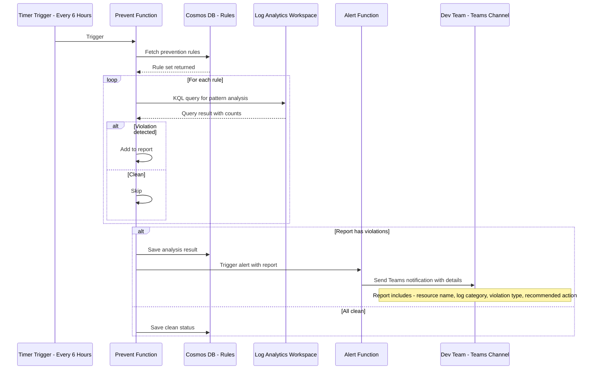
```mermaid
sequenceDiagram
    participant Timer as Timer Trigger - Every 6 Hours
    participant Fn as Prevent Function
    participant DB as Cosmos DB - Rules
    participant LAW as Log Analytics Workspace
    participant Alert as Alert Function
    participant Dev as Dev Team - Teams Channel

    Timer->>Fn: Trigger
    Fn->>DB: Fetch prevention rules
    DB-->>Fn: Rule set returned

    loop For each rule
        Fn->>LAW: KQL query for pattern analysis
        LAW-->>Fn: Query result with counts

        alt Violation detected
            Fn->>Fn: Add to report
        else Clean
            Fn->>Fn: Skip
        end
    end

    alt Report has violations
        Fn->>DB: Save analysis result
        Fn->>Alert: Trigger alert with report
        Alert->>Dev: Send Teams notification with details
        Note over Dev: Report includes - resource name, log category, violation type, recommended action
    else All clean
        Fn->>DB: Save clean status
    end
```

> [!NOTE] 왜 이렇게 짰는가?
> - **6시간마다 실행**: Retain과 달리, Prevent는 더 자주 실행해야 합니다. 프로덕션에서 실수로 Debug 로그가 켜지면 몇 시간 만에 수십 GB가 쌓일 수 있으므로, 빠른 감지가 중요합니다.
> - **위반 건만 알림**: 매번 "정상입니다" 알림을 보내면 알림 피로(alert fatigue)가 생깁니다. 위반이 있을 때만 Teams로 알려줍니다.
> - **분석 결과 저장**: 위반 여부와 관계없이 매번 DB에 기록하여, "최근 일주일간 위반이 몇 건 있었나?" 같은 트렌드 분석이 가능하게 합니다.

---

### 2-4. 규칙 데이터 모델 (Class Diagram)

Prevention Rule과 분석 결과의 데이터 구조입니다.

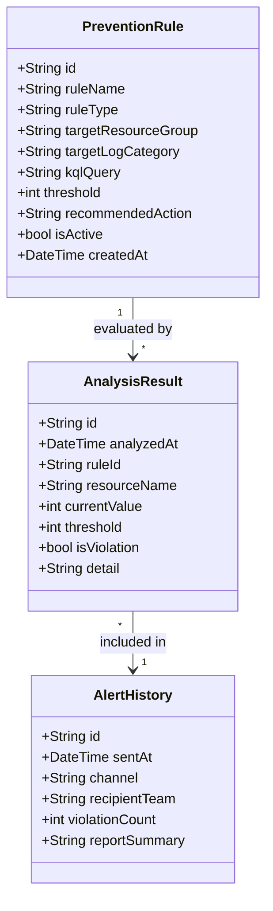
```mermaid
classDiagram
    class PreventionRule {
        +String id
        +String ruleName
        +String ruleType
        +String targetResourceGroup
        +String targetLogCategory
        +String kqlQuery
        +int threshold
        +String recommendedAction
        +bool isActive
        +DateTime createdAt
    }

    class AnalysisResult {
        +String id
        +DateTime analyzedAt
        +String ruleId
        +String resourceName
        +int currentValue
        +int threshold
        +bool isViolation
        +String detail
    }

    class AlertHistory {
        +String id
        +DateTime sentAt
        +String channel
        +String recipientTeam
        +int violationCount
        +String reportSummary
    }

    PreventionRule "1" --> "*" AnalysisResult : evaluated by
    AnalysisResult "*" --> "1" AlertHistory : included in
```

> [!NOTE] 왜 이렇게 짰는가?
> - **PreventionRule에 KQL 쿼리 포함**: 규칙마다 분석에 사용할 KQL을 직접 저장합니다. 이렇게 하면 새로운 분석 규칙을 **코드 배포 없이 DB에 추가**만 하면 됩니다.
> - **threshold 필드**: "시간당 10건 이상", "1건당 100KB 이상" 같은 기준값을 규칙별로 다르게 설정할 수 있습니다.
> - **AlertHistory 분리**: 알림 이력을 별도로 관리하여, "이 팀에 최근 며칠간 몇 번 알림을 보냈는지" 추적하여 알림 피로를 방지합니다.

---

### 2-5. 로그 상태 변화 (State Diagram)

하나의 로그 패턴이 Prevent 시스템에 의해 어떻게 관리되는지 보여줍니다.

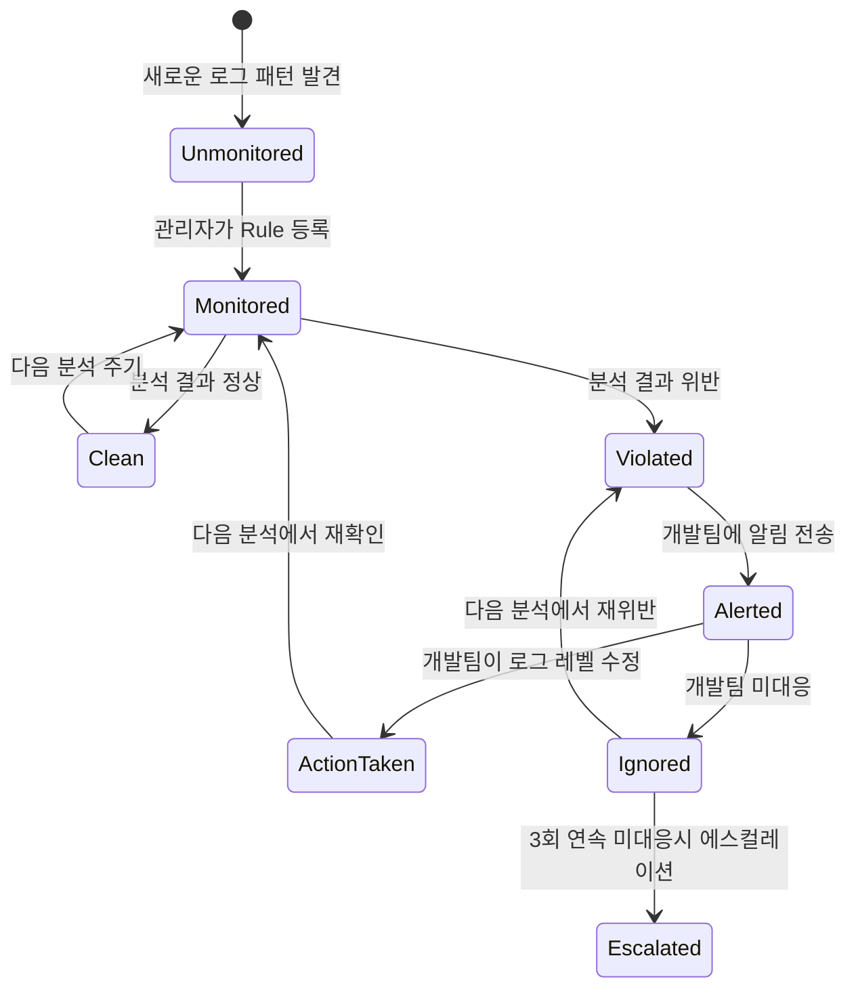
```mermaid
stateDiagram-v2
    [*] --> Unmonitored: 새로운 로그 패턴 발견

    Unmonitored --> Monitored: 관리자가 Rule 등록

    Monitored --> Clean: 분석 결과 정상
    Monitored --> Violated: 분석 결과 위반

    Clean --> Monitored: 다음 분석 주기
    Violated --> Alerted: 개발팀에 알림 전송
    Alerted --> ActionTaken: 개발팀이 로그 레벨 수정
    Alerted --> Ignored: 개발팀 미대응

    ActionTaken --> Monitored: 다음 분석에서 재확인
    Ignored --> Violated: 다음 분석에서 재위반
    Ignored --> Escalated: 3회 연속 미대응시 에스컬레이션
```

> [!NOTE] 왜 이렇게 짰는가?
> - **Escalation 로직**: 알림을 보냈는데 개발팀이 대응하지 않으면, 3회 연속 위반 시 상위 관리자에게 에스컬레이션합니다. 이는 알림이 무시되는 것을 방지합니다.
> - **ActionTaken → Monitored**: 개발팀이 조치를 취한 후에도 계속 모니터링하여, 실제로 효과가 있었는지(볼륨이 줄었는지) 확인합니다.
> - **Unmonitored 상태**: 모든 로그가 자동으로 모니터링되는 것이 아니라, 관리자가 의미 있는 패턴에 대해 Rule을 등록하는 방식입니다. 이렇게 해야 false positive를 줄일 수 있습니다.

---

### 2-6. 규칙 예시 (참고용)

| Rule Name | Type | Target | Threshold | Action |
| --- | --- | --- | --- | --- |
| debug-in-prod | Level Check | All Resources | Debug level count > 0 | 로그 레벨을 Info 이상으로 상향 권고 |
| high-frequency-log | Frequency | API Gateway | 같은 메시지 > 100/hour | Sampling rate 적용 권고 |
| oversized-entry | Size Check | Backend API | 단일 로그 > 50KB | Payload 로깅 비활성화 권고 |
| unused-trace | Level Check | Batch Jobs | Trace level count > 0 | Trace 로그 제거 권고 |

---

## 3. Detect (인프라 레벨 탐지)

앱 단까지 들어온 불량 트래픽을 로그에서 감지하고, 인프라 팀에 차단을 요청하는 **보안 연계 기능**입니다. Prevent가 "로그 품질"에 집중한다면, Detect는 "로그 속 보안 위협"에 집중합니다.

---

### 3-1. 전체 아키텍처 (Detect Function 위치)

Detect Function이 인프라 보안 체계와 어떻게 연결되는지 보여줍니다.

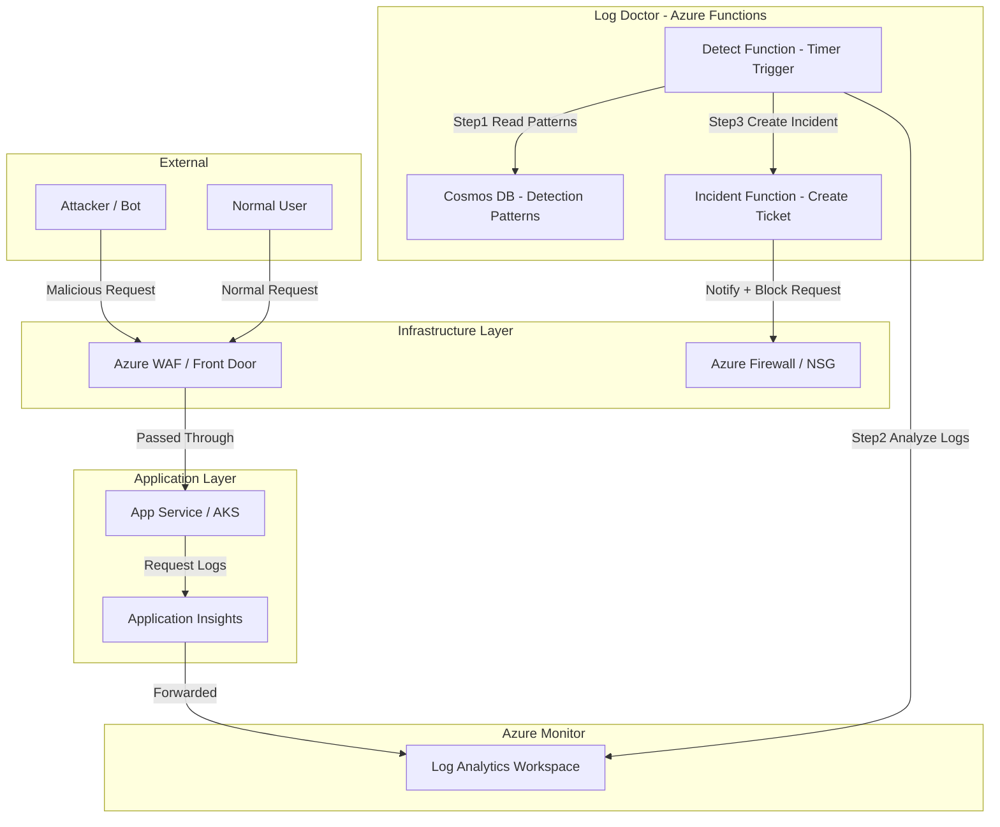
```mermaid
graph TB
    subgraph External
        Attacker["Attacker / Bot"]
        User["Normal User"]
    end

    subgraph Infrastructure Layer
        WAF["Azure WAF / Front Door"]
        FW["Azure Firewall / NSG"]
    end

    subgraph Application Layer
        App["App Service / AKS"]
        AppInsights["Application Insights"]
    end

    subgraph Log Doctor - Azure Functions
        DetectFn["Detect Function - Timer Trigger"]
        PatternDB["Cosmos DB - Detection Patterns"]
        IncidentFn["Incident Function - Create Ticket"]
    end

    subgraph Azure Monitor
        LAW["Log Analytics Workspace"]
    end

    Attacker -->|Malicious Request| WAF
    User -->|Normal Request| WAF
    WAF -->|Passed Through| App
    App -->|Request Logs| AppInsights
    AppInsights -->|Forwarded| LAW
    DetectFn -->|Step1 Read Patterns| PatternDB
    DetectFn -->|Step2 Analyze Logs| LAW
    DetectFn -->|Step3 Create Incident| IncidentFn
    IncidentFn -->|Notify + Block Request| FW
```

> [!NOTE] 왜 이렇게 짰는가?
> - **WAF를 이미 통과한 트래픽**이 핵심입니다. WAF가 모든 공격을 막을 수 없으므로, 앱 단 로그에서 "WAF를 우회한 비정상 패턴"을 2차로 탐지합니다.
> - Detect Function은 **직접 트래픽을 차단하지 않고**, 인시던트를 생성하여 인프라 팀이 WAF/Firewall 규칙을 업데이트하도록 요청합니다. 이는 잘못된 차단(false positive)을 방지하기 위함입니다.
> - Application Insights → LAW 경로를 활용하면, HTTP 요청의 URL/IP/User-Agent/Response Code 등 풍부한 메타데이터를 분석할 수 있습니다.

---

### 3-2. 탐지 규칙 판단 흐름 (Decision Flow)

각 로그 패턴을 어떻게 분석하고 위협 여부를 판단하는지의 상세 흐름입니다.

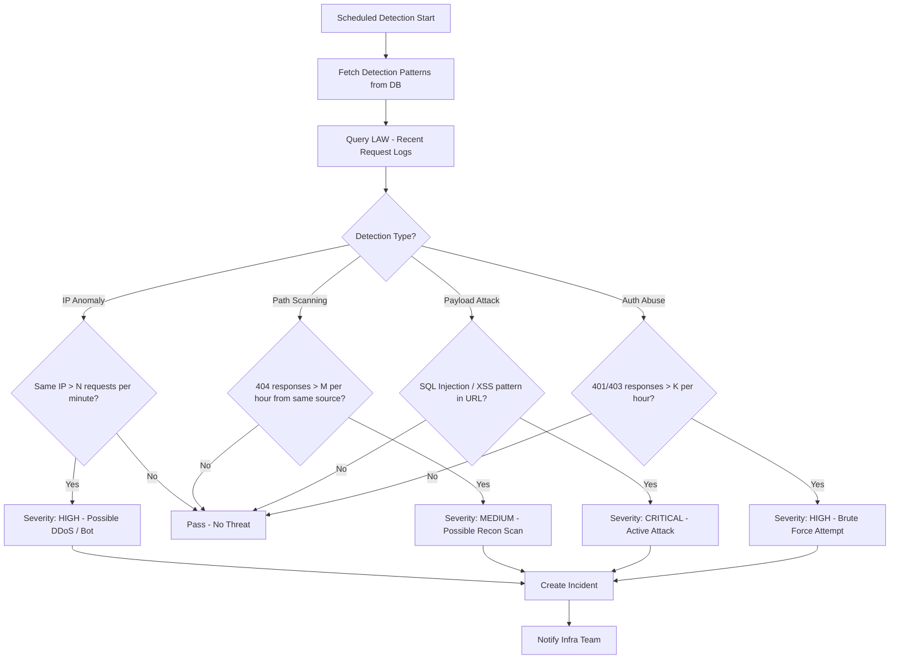
```mermaid
graph TD
    A["Scheduled Detection Start"] --> B["Fetch Detection Patterns from DB"]
    B --> C["Query LAW - Recent Request Logs"]

    C --> D{"Detection Type?"}

    D -- "IP Anomaly" --> E{"Same IP > N requests per minute?"}
    D -- "Path Scanning" --> F{"404 responses > M per hour from same source?"}
    D -- "Payload Attack" --> G{"SQL Injection / XSS pattern in URL?"}
    D -- "Auth Abuse" --> H{"401/403 responses > K per hour?"}

    E -- "Yes" --> I["Severity: HIGH - Possible DDoS / Bot"]
    E -- "No" --> J["Pass - No Threat"]

    F -- "Yes" --> K["Severity: MEDIUM - Possible Recon Scan"]
    F -- "No" --> J

    G -- "Yes" --> L["Severity: CRITICAL - Active Attack"]
    G -- "No" --> J

    H -- "Yes" --> M["Severity: HIGH - Brute Force Attempt"]
    H -- "No" --> J

    I --> N["Create Incident"]
    K --> N
    L --> N
    M --> N
    N --> O["Notify Infra Team"]
```

> [!NOTE] 왜 이렇게 짰는가?
> - **4가지 탐지 타입**으로 분류한 이유:
>   - **IP Anomaly**: 특정 IP에서 분당 수백~수천 건의 요청이 오면 DDoS 또는 봇 공격의 징후입니다.
>   - **Path Scanning**: 존재하지 않는 경로(/admin, /wp-login 등)에 대한 404 응답이 반복되면, 공격자가 취약점을 탐색하는 정찰(Recon) 행위입니다.
>   - **Payload Attack**: URL이나 쿼리스트링에 SQL Injection(`' OR 1=1`)이나 XSS(`<script>`) 패턴이 포함된 요청을 감지합니다.
>   - **Auth Abuse**: 인증 실패(401/403)가 특정 소스에서 반복되면 무차별 대입 공격(Brute Force)의 징후입니다.
> - **Severity 분류**: 각 위협의 심각도를 구분하여, 인프라 팀이 우선순위에 따라 대응할 수 있게 합니다.

---

### 3-3. 탐지 및 인시던트 생성 시퀀스 (Sequence Diagram)

Detect Function의 실행부터 인프라 팀 대응까지의 전체 흐름입니다.

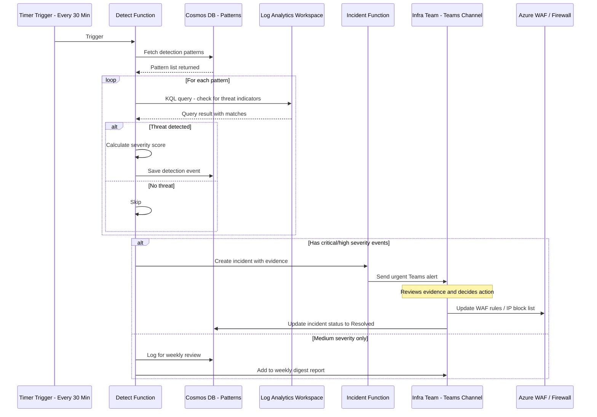
```mermaid
sequenceDiagram
    participant Timer as Timer Trigger - Every 30 Min
    participant Fn as Detect Function
    participant DB as Cosmos DB - Patterns
    participant LAW as Log Analytics Workspace
    participant Incident as Incident Function
    participant Infra as Infra Team - Teams Channel
    participant WAF as Azure WAF / Firewall

    Timer->>Fn: Trigger
    Fn->>DB: Fetch detection patterns
    DB-->>Fn: Pattern list returned

    loop For each pattern
        Fn->>LAW: KQL query - check for threat indicators
        LAW-->>Fn: Query result with matches

        alt Threat detected
            Fn->>Fn: Calculate severity score
            Fn->>DB: Save detection event
        else No threat
            Fn->>Fn: Skip
        end
    end

    alt Has critical/high severity events
        Fn->>Incident: Create incident with evidence
        Incident->>Infra: Send urgent Teams alert
        Note over Infra: Reviews evidence and decides action
        Infra->>WAF: Update WAF rules / IP block list
        Infra->>DB: Update incident status to Resolved
    else Medium severity only
        Fn->>DB: Log for weekly review
        Fn->>Infra: Add to weekly digest report
    end
```

> [!NOTE] 왜 이렇게 짰는가?
> - **30분마다 실행**: 보안 위협은 빠른 감지가 중요합니다. Retain(24시간)이나 Prevent(6시간)보다 훨씬 짧은 주기로 실행합니다.
> - **Severity 기반 대응 분기**: CRITICAL/HIGH는 즉시 Teams 알림으로 긴급 대응을 유도하고, MEDIUM은 주간 다이제스트에 포함하여 누적 분석합니다. 이렇게 분리하면 알림 피로를 줄이면서도 중요한 위협은 놓치지 않습니다.
> - **Evidence 포함**: 인시던트 생성 시 해당 IP, 요청 URL, 발생 시각 등의 증거를 함께 첨부하여, 인프라 팀이 별도 조사 없이 바로 차단 여부를 결정할 수 있게 합니다.
> - **인프라 팀이 직접 차단**: Detect Function이 자동으로 IP를 차단하지 않습니다. 잘못된 차단(정상 사용자 IP)의 위험을 방지하기 위해, 사람이 확인 후 차단하는 방식을 택했습니다.

---

### 3-4. 탐지 데이터 모델 (Class Diagram)

Detection Pattern, Event, Incident의 데이터 구조입니다.

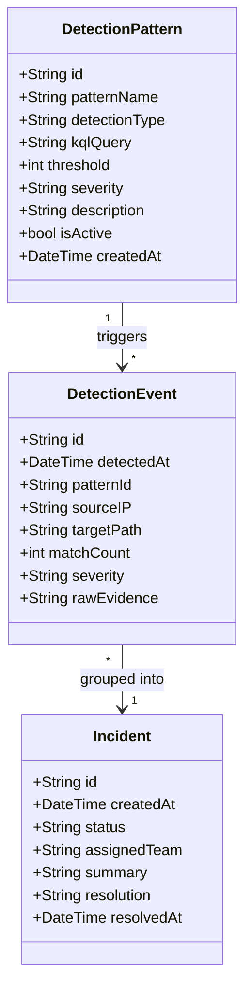
```mermaid
classDiagram
    class DetectionPattern {
        +String id
        +String patternName
        +String detectionType
        +String kqlQuery
        +int threshold
        +String severity
        +String description
        +bool isActive
        +DateTime createdAt
    }

    class DetectionEvent {
        +String id
        +DateTime detectedAt
        +String patternId
        +String sourceIP
        +String targetPath
        +int matchCount
        +String severity
        +String rawEvidence
    }

    class Incident {
        +String id
        +DateTime createdAt
        +String status
        +String assignedTeam
        +String summary
        +String resolution
        +DateTime resolvedAt
    }

    DetectionPattern "1" --> "*" DetectionEvent : triggers
    DetectionEvent "*" --> "1" Incident : grouped into
```

> [!NOTE] 왜 이렇게 짰는가?
> - **DetectionPattern**: 탐지 규칙을 DB에 저장하여, 새로운 공격 패턴이 발견되면 **코드 배포 없이 KQL 쿼리만 추가**하면 됩니다. 보안 팀이 직접 패턴을 관리할 수 있습니다.
> - **DetectionEvent**: 개별 탐지 이벤트를 기록합니다. `sourceIP`, `targetPath`, `rawEvidence` 등을 저장하여 사후 포렌식에 활용합니다.
> - **Incident**: 여러 DetectionEvent를 하나의 인시던트로 묶습니다. 같은 IP에서 여러 종류의 공격이 감지되면 하나의 인시던트로 관리하여 중복 알림을 방지합니다.
> - **status 필드**: Open → InProgress → Resolved 같은 워크플로우를 지원하여, 인시던트의 생명주기를 추적합니다.

---

### 3-5. 인시던트 생명주기 (State Diagram)

하나의 탐지 인시던트가 생성부터 해결까지 거치는 상태 전이를 보여줍니다.

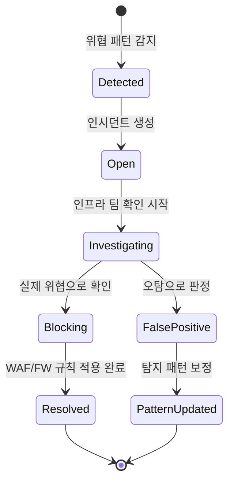
```mermaid
stateDiagram-v2
    [*] --> Detected: 위협 패턴 감지

    Detected --> Open: 인시던트 생성
    Open --> Investigating: 인프라 팀 확인 시작
    
    Investigating --> Blocking: 실제 위협으로 확인
    Investigating --> FalsePositive: 오탐으로 판정

    Blocking --> Resolved: WAF/FW 규칙 적용 완료
    FalsePositive --> PatternUpdated: 탐지 패턴 보정

    Resolved --> [*]
    PatternUpdated --> [*]
```

> [!NOTE] 왜 이렇게 짰는가?
> - **FalsePositive 경로**: 오탐이 발생하면 탐지 패턴을 보정합니다. 이 피드백 루프가 없으면 같은 오탐이 반복되어 신뢰도가 떨어집니다.
> - **Investigating 단계 분리**: Open에서 바로 Blocking으로 가지 않고, 조사 단계를 거칩니다. 자동 차단의 위험성을 고려한 설계입니다.
> - **PatternUpdated**: 오탐 시 패턴을 수정하면, 다음 분석 주기부터 개선된 규칙이 적용됩니다. 이를 통해 시스템이 점점 정교해집니다.

---

### 3-6. 탐지 규칙 예시 (참고용)

| Pattern Name | Type | KQL 핵심 로직 | Threshold | Severity |
| --- | --- | --- | --- | --- |
| ddos-suspect | IP Anomaly | 동일 IP에서 분당 요청 수 집계 | 500 req/min | HIGH |
| path-scanner | Path Scanning | 동일 소스에서 404 응답 시간당 집계 | 50 per hour | MEDIUM |
| sql-injection | Payload Attack | URL에 UNION SELECT, OR 1=1 등 패턴 매칭 | 1회 이상 | CRITICAL |
| brute-force | Auth Abuse | 동일 소스에서 401 응답 시간당 집계 | 30 per hour | HIGH |
| suspicious-ua | IP Anomaly | User-Agent가 알려진 공격 도구 이름 포함 | 1회 이상 | MEDIUM |

---

## 4. Filter (필터링)

원본 로그를 삭제하지 않고, **수집 파이프라인 단계에서 노이즈를 걸러내는 기능**입니다. 다른 3개 기능(Retain/Prevent/Detect)이 이미 수집된 로그를 후처리하는 반면, Filter는 **수집 시점에 개입**하여 불필요한 로그가 LAW에 들어오는 것 자체를 차단합니다.

---

### 4-1. 전체 아키텍처 (Filter Function 위치)

Filter가 로그 수집 파이프라인에서 어떤 위치에 있는지 보여줍니다.

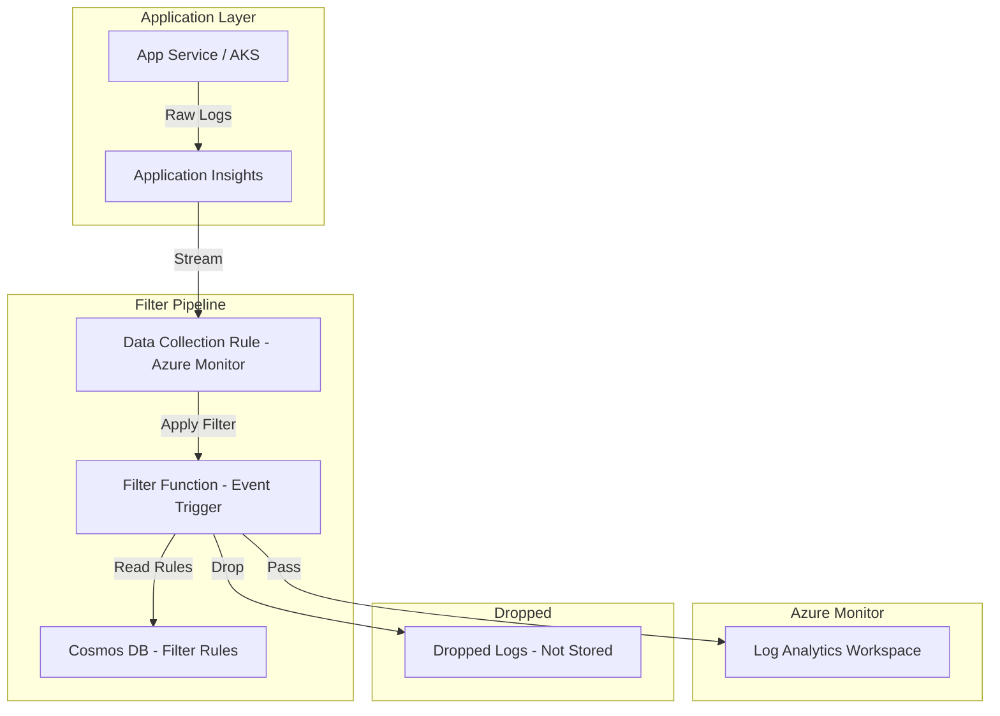
```mermaid
graph TB
    subgraph Application Layer
        App["App Service / AKS"]
        AppInsights["Application Insights"]
    end

    subgraph Filter Pipeline
        DCR["Data Collection Rule - Azure Monitor"]
        FilterFn["Filter Function - Event Trigger"]
        FilterDB["Cosmos DB - Filter Rules"]
    end

    subgraph Azure Monitor
        LAW["Log Analytics Workspace"]
    end

    subgraph Dropped
        Trash["Dropped Logs - Not Stored"]
    end

    App -->|Raw Logs| AppInsights
    AppInsights -->|Stream| DCR
    FilterFn -->|Read Rules| FilterDB
    DCR -->|Apply Filter| FilterFn
    FilterFn -->|Pass| LAW
    FilterFn -->|Drop| Trash
```

> [!NOTE] 왜 이렇게 짰는가?
> - **Data Collection Rule(DCR)** 은 Azure Monitor의 기본 기능으로, 로그가 LAW에 도달하기 전에 변환/필터링을 적용할 수 있습니다.
> - Filter Function은 DCR과 연동하여 더 복잡한 필터 로직(정규식, IP 범위, 복합 조건 등)을 적용합니다.
> - **원본 삭제가 아니라 수집 차단**: 이미 LAW에 들어온 로그를 삭제하는 것(Retain)과 달리, 처음부터 LAW에 넣지 않으므로 **수집 비용 자체가 발생하지 않습니다**.
> - **우선순위가 최하인 이유**: Retain/Prevent/Detect가 안정화된 후에 적용해야 합니다. 섣부른 필터링은 중요한 로그를 유실시킬 위험이 있기 때문입니다.

---

### 4-2. 필터 파이프라인 상세 흐름 (Decision Flow)

각 로그 항목이 어떤 필터 단계를 거치는지의 상세 흐름입니다.

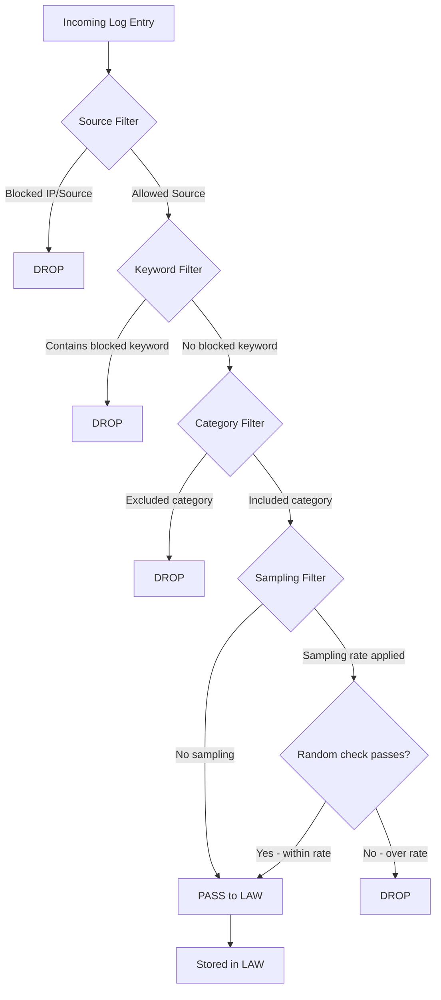
```mermaid
graph TD
    A["Incoming Log Entry"] --> B{"Source Filter"}

    B -- "Blocked IP/Source" --> DROP1["DROP"]
    B -- "Allowed Source" --> C{"Keyword Filter"}

    C -- "Contains blocked keyword" --> DROP2["DROP"]
    C -- "No blocked keyword" --> D{"Category Filter"}

    D -- "Excluded category" --> DROP3["DROP"]
    D -- "Included category" --> E{"Sampling Filter"}

    E -- "Sampling rate applied" --> F{"Random check passes?"}
    E -- "No sampling" --> G["PASS to LAW"]

    F -- "Yes - within rate" --> G
    F -- "No - over rate" --> DROP4["DROP"]

    G --> H["Stored in LAW"]
```

> [!NOTE] 왜 이렇게 짰는가?
> - **4단계 필터 파이프라인**: 각 필터는 독립적으로 동작하며, 순서대로 적용됩니다.
>   - **Source Filter**: 알려진 봇/크롤러 IP, 내부 health check 소스 등을 소스 레벨에서 차단합니다. 가장 비용이 낮은 필터이므로 첫 번째에 배치합니다.
>   - **Keyword Filter**: 특정 키워드(예: "health check", "readiness probe")가 포함된 로그를 필터링합니다.
>   - **Category Filter**: 특정 로그 카테고리(예: kube-system 내부 로그) 전체를 제외합니다.
>   - **Sampling Filter**: 위 필터를 통과한 로그 중에서도, 볼륨이 너무 많은 경우 일정 비율만 수집합니다 (예: 10%만 저장).
> - **순서가 중요한 이유**: 비용이 낮은 필터(IP 비교)를 먼저 적용하고, 비용이 높은 필터(정규식 매칭)를 나중에 적용하여 전체 처리 효율을 높입니다.

---

### 4-3. 필터 적용 시퀀스 (Sequence Diagram)

Filter Function의 설정 관리부터 실시간 필터 적용까지의 흐름입니다.

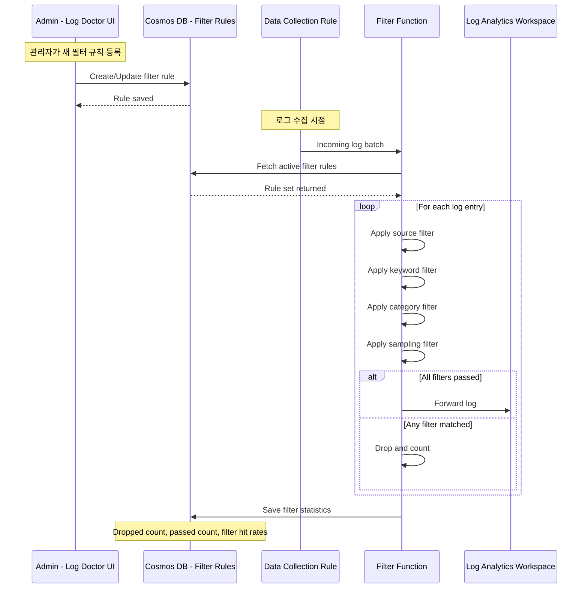
```mermaid
sequenceDiagram
    participant Admin as Admin - Log Doctor UI
    participant DB as Cosmos DB - Filter Rules
    participant DCR as Data Collection Rule
    participant FilterFn as Filter Function
    participant LAW as Log Analytics Workspace

    Note over Admin: 관리자가 새 필터 규칙 등록
    Admin->>DB: Create/Update filter rule
    DB-->>Admin: Rule saved

    Note over DCR: 로그 수집 시점
    DCR->>FilterFn: Incoming log batch
    FilterFn->>DB: Fetch active filter rules
    DB-->>FilterFn: Rule set returned

    loop For each log entry
        FilterFn->>FilterFn: Apply source filter
        FilterFn->>FilterFn: Apply keyword filter
        FilterFn->>FilterFn: Apply category filter
        FilterFn->>FilterFn: Apply sampling filter

        alt All filters passed
            FilterFn->>LAW: Forward log
        else Any filter matched
            FilterFn->>FilterFn: Drop and count
        end
    end

    FilterFn->>DB: Save filter statistics
    Note over DB: Dropped count, passed count, filter hit rates
```

> [!NOTE] 왜 이렇게 짰는가?
> - **실시간 처리**: Retain/Prevent/Detect는 Timer Trigger(주기적)이지만, Filter는 **Event Trigger(이벤트 기반)** 입니다. 로그가 들어올 때마다 즉시 필터링해야 수집 비용을 원천 차단할 수 있습니다.
> - **필터 통계 저장**: 각 필터가 얼마나 많은 로그를 차단했는지 기록합니다. 이를 통해 "이 필터 규칙이 실제로 효과가 있는지", "너무 많이 차단하고 있진 않은지" 검증할 수 있습니다.
> - **배치 단위 처리**: 로그를 건건이 처리하면 Function 호출 비용이 증가하므로, DCR에서 배치 단위로 전달받아 한 번에 처리합니다.

---

### 4-4. 필터 규칙 데이터 모델 (Class Diagram)

Filter Rule과 통계 데이터의 구조입니다.

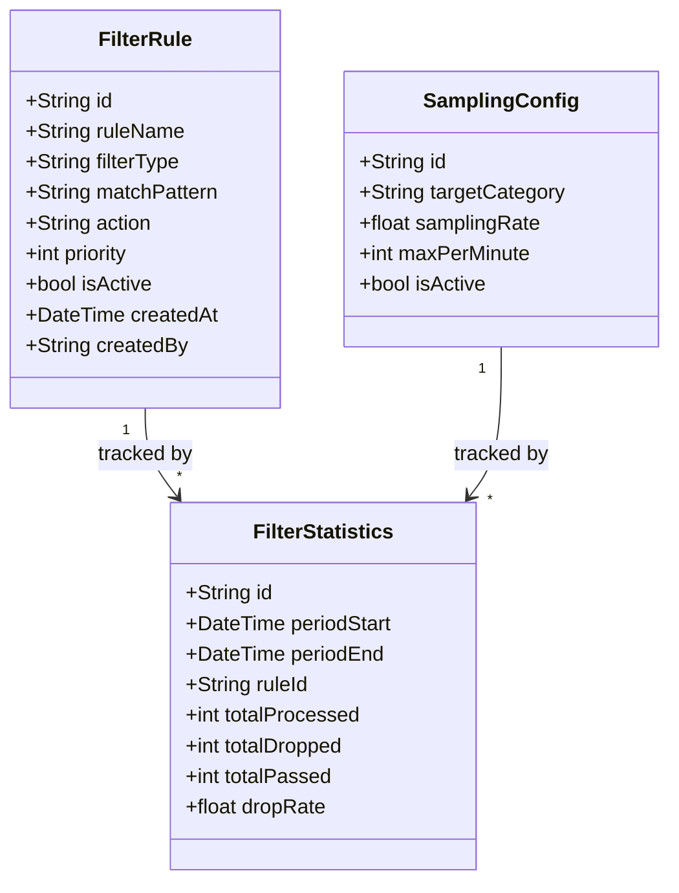
```mermaid
classDiagram
    class FilterRule {
        +String id
        +String ruleName
        +String filterType
        +String matchPattern
        +String action
        +int priority
        +bool isActive
        +DateTime createdAt
        +String createdBy
    }

    class FilterStatistics {
        +String id
        +DateTime periodStart
        +DateTime periodEnd
        +String ruleId
        +int totalProcessed
        +int totalDropped
        +int totalPassed
        +float dropRate
    }

    class SamplingConfig {
        +String id
        +String targetCategory
        +float samplingRate
        +int maxPerMinute
        +bool isActive
    }

    FilterRule "1" --> "*" FilterStatistics : tracked by
    SamplingConfig "1" --> "*" FilterStatistics : tracked by
```

> [!NOTE] 왜 이렇게 짰는가?
> - **filterType**: source / keyword / category / sampling 4가지 타입을 구분하여, 각 타입에 맞는 매칭 로직을 적용합니다.
> - **priority 필드**: 같은 타입 내에서 규칙 적용 순서를 지정합니다. 우선순위가 높은 규칙이 먼저 평가되어 성능을 최적화합니다.
> - **SamplingConfig 분리**: 샘플링은 다른 필터와 성격이 달라서(확률적 차단 vs 조건적 차단) 별도 모델로 관리합니다. `samplingRate`는 0.0~1.0 범위로, 0.1이면 10%만 통과시킵니다.
> - **FilterStatistics**: 시간대별로 필터 효과를 추적합니다. drop rate가 95% 이상이면 해당 카테고리 자체를 비활성화하는 것이 더 효율적일 수 있다는 인사이트를 얻을 수 있습니다.

---

### 4-5. 필터 규칙 생명주기 (State Diagram)

하나의 필터 규칙이 생성부터 폐기까지 거치는 상태 전이를 보여줍니다.

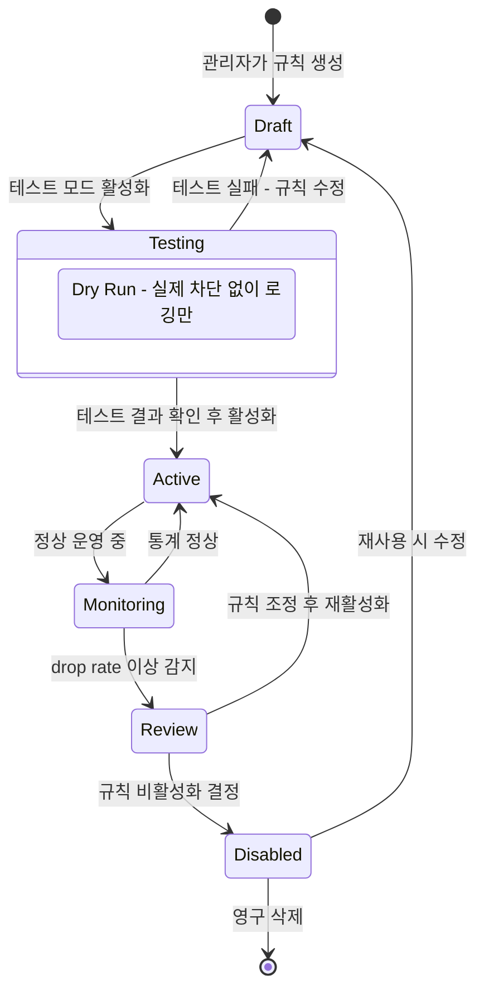
```mermaid
stateDiagram-v2
    [*] --> Draft: 관리자가 규칙 생성

    Draft --> Testing: 테스트 모드 활성화
    
    state Testing {
        direction LR
        DryRun: Dry Run - 실제 차단 없이 로깅만
    }

    Testing --> Active: 테스트 결과 확인 후 활성화
    Testing --> Draft: 테스트 실패 - 규칙 수정

    Active --> Monitoring: 정상 운영 중
    Monitoring --> Active: 통계 정상

    Monitoring --> Review: drop rate 이상 감지
    Review --> Active: 규칙 조정 후 재활성화
    Review --> Disabled: 규칙 비활성화 결정

    Disabled --> Draft: 재사용 시 수정
    Disabled --> [*]: 영구 삭제
```

> [!NOTE] 왜 이렇게 짰는가?
> - **Dry Run(테스트 모드)**: 필터 규칙을 바로 적용하면 중요한 로그가 유실될 수 있습니다. 먼저 "이 규칙을 적용했다면 몇 건이 차단되었을까?"를 시뮬레이션하여 안전성을 확인합니다.
> - **Monitoring → Review**: 필터가 활성화된 후에도 지속적으로 모니터링합니다. drop rate가 갑자기 급증하면(예: 새 서비스 배포 후 정상 로그가 차단됨) 자동으로 Review 상태로 전환하여 관리자가 확인하게 합니다.
> - **Draft → Testing → Active 워크플로우**: 프로덕션 환경에서의 안전한 변경 관리를 위해, 반드시 테스트를 거쳐야만 활성화할 수 있는 구조입니다.

---

### 4-6. 필터 규칙 예시 (참고용)

| Rule Name | Type | Match Pattern | Action | 예상 효과 |
| --- | --- | --- | --- | --- |
| block-healthcheck | Keyword | "health check", "readiness" | DROP | health check 로그 100% 제거 |
| block-k8s-internal | Category | kube-system namespace 로그 | DROP | K8s 내부 로그 제거 |
| block-crawler-ips | Source | 알려진 봇/크롤러 IP 리스트 | DROP | 봇 트래픽 로그 제거 |
| sample-verbose-api | Sampling | /api/v1/status 경로 로그 | 10% SAMPLE | 반복적인 status API 로그 90% 감소 |
| block-static-assets | Keyword | ".css", ".js", ".png" | DROP | 정적 파일 요청 로그 제거 |

---

## 전체 기능 비교 요약

4개 기능의 핵심 차이를 한눈에 비교합니다.

```mermaid
graph LR
    subgraph Execution Frequency
        R["Retain - Daily"]
        P["Prevent - Every 6h"]
        D["Detect - Every 30min"]
        F["Filter - Real-time"]
    end

    R -.->|Slowest| P
    P -.-> D
    D -.->|Fastest| F
```

| 항목 | Retain | Prevent | Detect | Filter |
| --- | --- | --- | --- | --- |
| 목적 | 비용 최적화 | 로그 품질 개선 | 보안 위협 탐지 | 노이즈 제거 |
| 대상 | 수집된 로그 | 로그 패턴 | 트래픽 로그 | 수집 전 로그 |
| 실행 주기 | 24시간 | 6시간 | 30분 | 실시간 |
| Trigger | Timer | Timer | Timer | Event |
| 자동 조치 | Archive/Delete | 알림만 | 인시던트 생성 | 수집 차단 |
| 우선순위 | 1순위 | 2순위 | 3순위 | 4순위 |
| 주요 Azure 서비스 | LAW + Blob | LAW + Teams | LAW + WAF | DCR + LAW |
