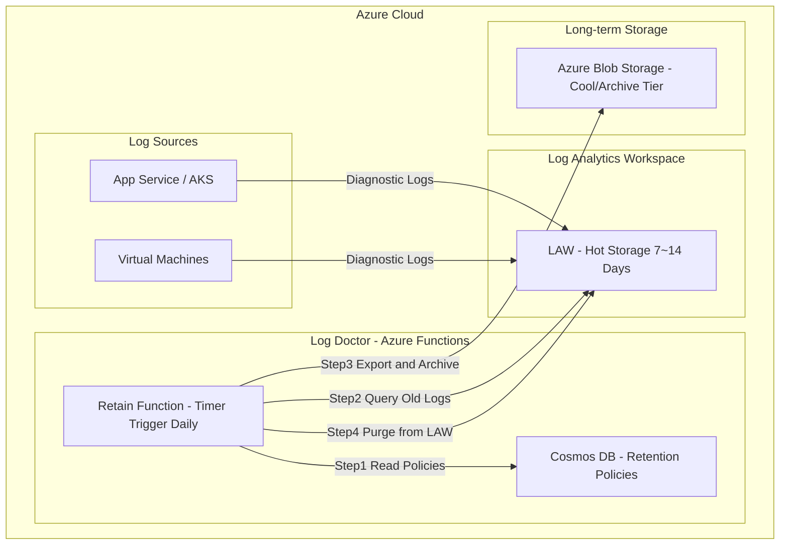
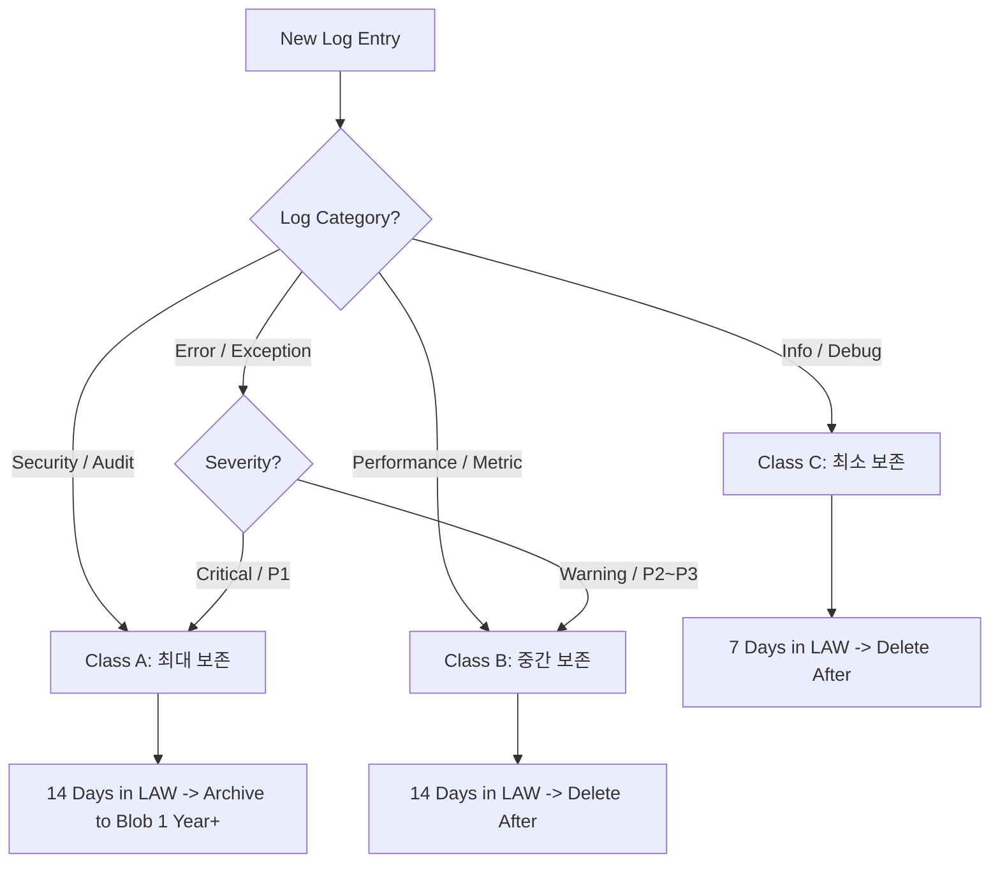
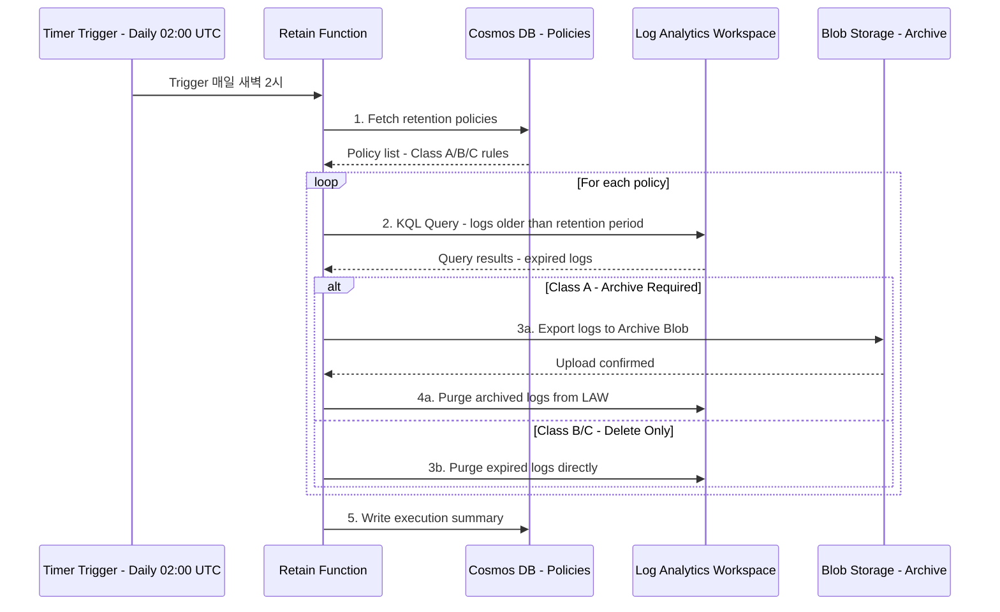
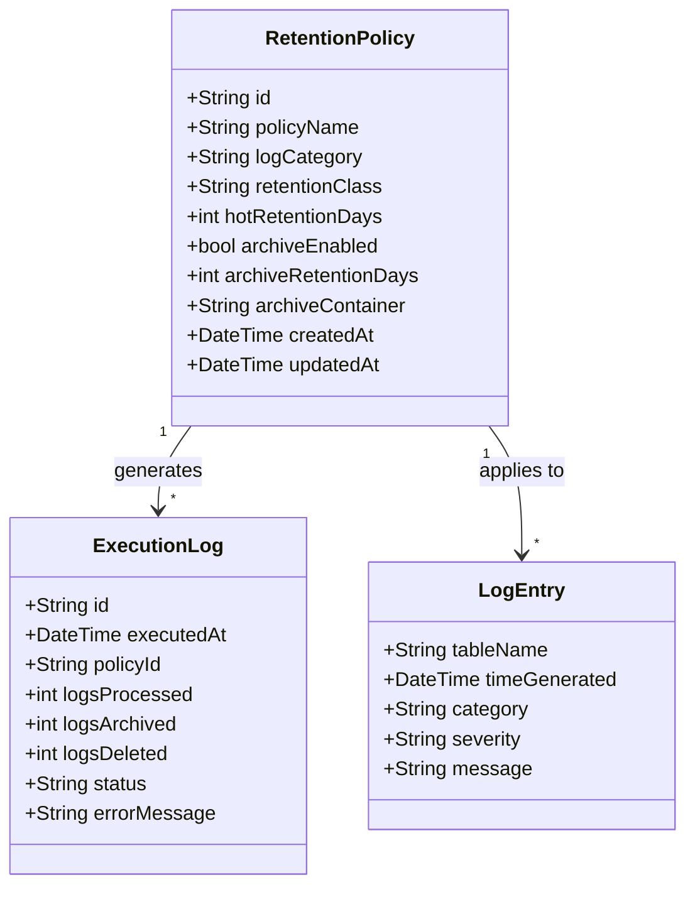
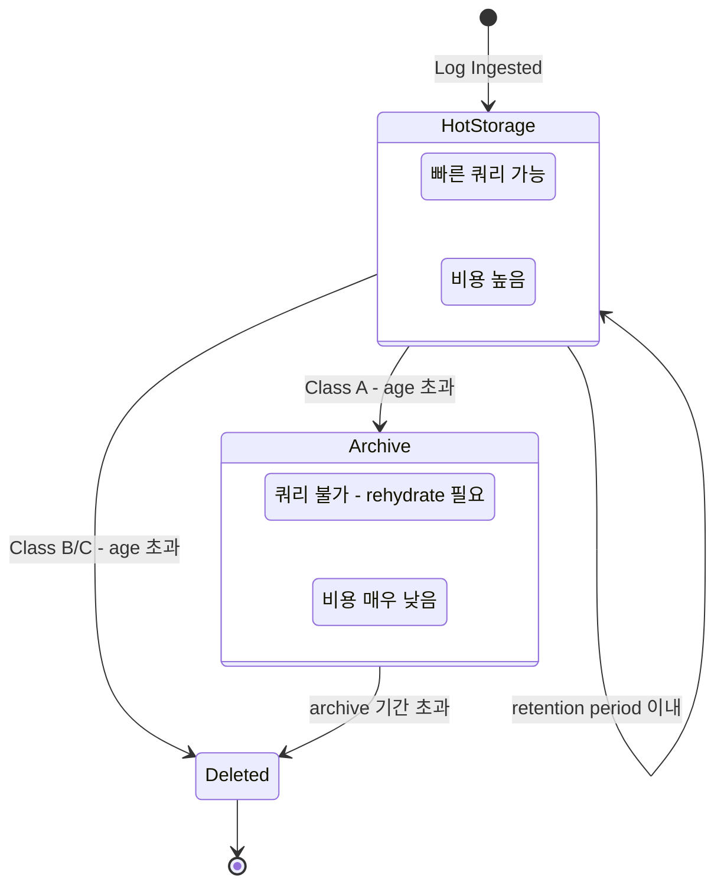
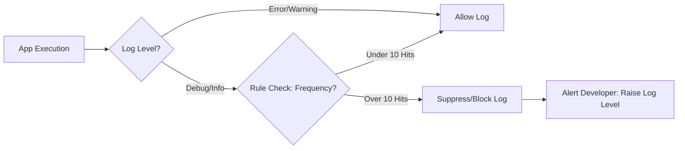
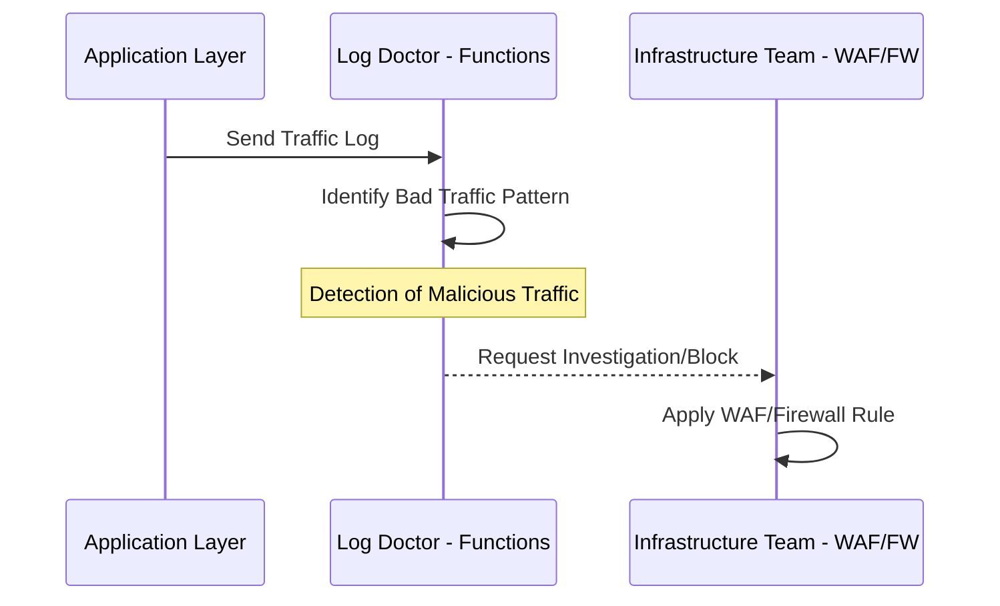
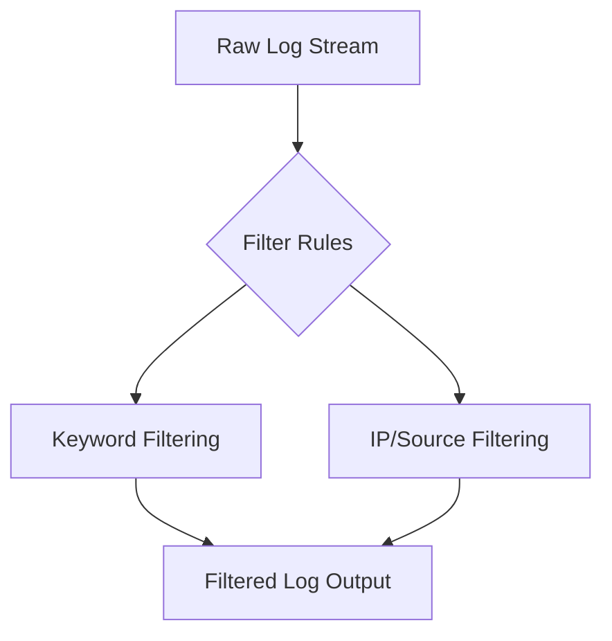

# Log Doctor Project: Log Optimization & Management Plan

이 문서는 Azure Functions 기반의 로그 최적화 및 관리 전략을 정리한 내용입니다. (화이트보드 회의 내용 정리)

## 1. Retain (보존 및 관리)

로그의 보존 기간과 중요도에 따른 관리 전략입니다. 보존 정책은 **비용**과 **컴플라이언스** 사이의 균형을 맞추는 것이 핵심입니다.

---

### 1-1. 전체 아키텍처 (C4 Container Diagram)

시스템 전체에서 Retain 기능이 어떤 위치에 있는지 보여줍니다.

> [!NOTE] 왜 이렇게 짰는가?
> - **Log Analytics Workspace(LAW)** 는 쿼리 성능이 뛰어나지만, 장기 보존 시 비용이 매우 높습니다 (GB당 약 $2.76/월).
> - **Blob Storage Archive Tier** 는 GB당 약 $0.002/월로, **약 1,000배 이상 저렴**합니다.
> - 따라서 "최근 N일은 LAW에서 빠르게 검색 가능하게 유지하고, 오래된 로그는 저렴한 스토리지로 옮기는" 2-tier 전략이 필수입니다.

---

### 1-2. 보존 정책 분류 흐름도 (Decision Flow)

각 로그가 어떤 보존 등급에 배정되는지 결정하는 상세 흐름입니다.

> [!NOTE] 왜 이렇게 짰는가?
> - **Class A (Security/Audit, Critical Error)**: 컴플라이언스와 사후 분석을 위해 장기 보존이 반드시 필요합니다. 규제 요건(ISMS, SOC2 등)에서 보안 로그 1년 이상 보존을 요구하는 경우가 많습니다.
> - **Class B (Performance, Warning)**: 트렌드 분석용으로 2주 정도면 충분하고, 장기 보존 가치가 낮습니다.
> - **Class C (Info/Debug)**: 개발/디버깅 용도로만 가치가 있으므로 7일이면 충분합니다. 이 로그들이 전체 볼륨의 70~80%를 차지하므로, 빠르게 삭제하는 것이 비용 절감의 핵심입니다.

---

### 1-3. Timer Trigger 실행 흐름 (Sequence Diagram)

Azure Functions가 실제로 어떤 순서로 보존 작업을 수행하는지 보여줍니다.

> [!NOTE] 왜 이렇게 짰는가?
> - **새벽 2시 UTC 실행**: 사용자 트래픽이 가장 적은 시간대에 실행하여 LAW 쿼리 부하를 최소화합니다.
> - **정책 DB 분리 (Cosmos DB)**: 보존 정책을 코드에 하드코딩하지 않고 DB에 저장함으로써, **운영자가 UI에서 보존 기간을 동적으로 변경**(7→14, 14→7)할 수 있게 합니다.
> - **Archive 후 Purge**: 데이터 유실 방지를 위해 반드시 Blob 업로드가 확인된 후에만 LAW에서 삭제합니다.
> - **실행 요약 기록**: 어제 몇 건이 보존/삭제되었는지 추적할 수 있어 운영 가시성을 확보합니다.

---

### 1-4. 보존 정책 데이터 모델 (Class Diagram)

Cosmos DB에 저장되는 보존 정책의 데이터 구조입니다.

> [!NOTE] 왜 이렇게 짰는가?
> - **RetentionPolicy**: 정책 자체를 문서(document)로 관리하여, 카테고리별로 다른 보존 기간과 아카이브 여부를 유연하게 설정할 수 있습니다.
> - **ExecutionLog**: 매 실행마다 기록을 남겨서, "어제 정상적으로 돌았나?", "얼마나 삭제했나?"를 확인할 수 있게 합니다.
> - **archiveEnabled / archiveRetentionDays**: 아카이브 여부와 기간을 정책 단위로 분리하여, 특정 로그만 선택적으로 장기 보존할 수 있습니다.

---

### 1-5. 로그 생명주기 (State Diagram)

하나의 로그 항목이 생성부터 최종 삭제까지 거치는 상태 전이를 보여줍니다.

> [!NOTE] 왜 이렇게 짰는가?
> - 로그의 **가치는 시간이 지날수록 감소**합니다. 최근 로그는 즉각적인 디버깅/모니터링에 사용되고, 오래된 로그는 규제 준수나 포렌식 용도로만 필요합니다.
> - State Diagram으로 표현하면 **각 로그의 현재 상태와 전이 조건**이 명확해져, 운영팀이 정책을 쉽게 이해할 수 있습니다.
> - Archive에서 다시 쿼리하려면 **rehydrate(복원)**가 필요하므로, 이 비용과 시간을 고려해 정책을 설계해야 합니다.

---

### 1-6. 비용 비교 요약

| 저장소 | 비용 (GB/월) | 쿼리 속도 | 용도 |
| --- | --- | --- | --- |
| Log Analytics (LAW) | ~$2.76 | 즉시 (KQL) | 실시간 모니터링, 디버깅 |
| Blob Cool Tier | ~$0.01 | 복원 필요 (수분) | 중기 보존 (3~6개월) |
| Blob Archive Tier | ~$0.002 | 복원 필요 (수시간) | 장기 보존 (1년+, 컴플라이언스) |

> [!TIP] 핵심 포인트
> 일 10GB 로그 발생 시, 전부 LAW에 30일 보존하면 월 **~$828**, 7일만 LAW + 나머지 Archive로 하면 월 **~$195 + $0.5 = ~$196**. **약 75% 비용 절감**이 가능합니다.

---

## 2. Prevent (앱 레벨 예방)

어플리케이션 단에서 불필요한 로그 생성을 방지합니다.

- **로그 레벨 상향**: 불필요한 상세 로그를 줄이기 위해 로그 레벨 조정 권고 ("로그 레벨 올리세요!").
- **디버그 로그 체크**: 디버그 레벨 지정 없이 출력되는 로그들을 식별하고 수정.
- **빈도 제한 (Rule)**: 특정 로그의 출력 횟수를 제한 (예: 10건 정도만 허용).

---

## 3. Detect (인프라 레벨 탐지)

앱 단까지 들어온 유해 트래픽을 감지하여 인프라 팀에 대응을 요청합니다.

- **불량 트래픽 인지**: 앱 단까지 들어온 비정상적인 트래픽을 식별.
- **인프라 단 검토 요청**: 탐지된 트래픽에 대해 인프라 레벨(WAF, Firewall 등)에서의 차단 방안 검토 요청.

---

## 4. Filter (필터링)

로그 필터링 규칙을 적용하여 노이즈를 제어합니다.

- **우선순위**: 최하
- 로그 필터링 규칙 적용.
