# Log Doctor Project: Log Optimization & Management Plan

이 문서는 Azure Functions 기반의 로그 최적화 및 관리 전략을 정리한 내용입니다. (화이트보드 회의 내용 정리)

> [!IMPORTANT] 아키텍처 전제
> 본 문서의 모든 기능은 [system_architecture_and_security.md](system_architecture_and_security.md)의 **하이브리드 배포 아키텍처**를 따릅니다.
> - **Provider Backend** (FastAPI): 정책/규칙 관리, 에이전트 제어, 리포트 수신
> - **Client Agent** (Azure Functions): 고객사 환경에서 실제 로그 분석/처리 수행
> - **Teams Frontend** (React): 운영 대시보드, 설정 UI

---

## 1. Retain (보존 및 관리)

로그의 보존 기간과 중요도에 따른 관리 전략입니다. 보존 정책은 **비용**과 **컴플라이언스** 사이의 균형을 맞추는 것이 핵심입니다.

---

### 1-1. 전체 아키텍처 (Provider + Agent 분리)

Provider Backend가 정책을 관리하고, Client Agent가 고객사 LAW에서 실제 보존 작업을 수행합니다.

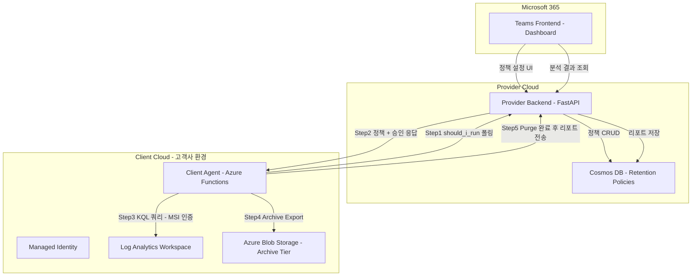
```mermaid
graph TB
    subgraph Microsoft 365
        Teams["Teams Frontend - Dashboard"]
    end

    subgraph Provider Cloud
        PB["Provider Backend - FastAPI"]
        CosmosDB["Cosmos DB - Retention Policies"]
    end

    subgraph Client Cloud - 고객사 환경
        Agent["Client Agent - Azure Functions"]
        MSI["Managed Identity"]
        LAW["Log Analytics Workspace"]
        Blob["Azure Blob Storage - Archive Tier"]
    end

    Teams -->|정책 설정 UI| PB
    PB -->|정책 CRUD| CosmosDB

    Agent -->|Step1 should_i_run 폴링| PB
    PB -->|Step2 정책 + 승인 응답| Agent
    Agent -->|Step3 KQL 쿼리 - MSI 인증| LAW
    Agent -->|Step4 Archive Export| Blob
    Agent -->|Step5 Purge 완료 후 리포트 전송| PB
    PB -->|리포트 저장| CosmosDB
    Teams -->|분석 결과 조회| PB
```

> [!NOTE] 왜 이렇게 짰는가?
> - **Provider가 직접 고객 LAW에 접근하지 않습니다.** 고객사 데이터 주권을 지키기 위해, Agent가 고객사 Managed Identity로 LAW/Blob에 접근합니다.
> - **should_i_run 폴링**: Agent가 독자적으로 실행 시점을 결정하는 것이 아니라, Provider에 "지금 실행해도 되는지" 확인하여 **중앙 통제**를 유지합니다.
> - **리포트 경로**: Agent → Provider API → Cosmos DB. Agent가 직접 DB에 쓰지 않고, Provider를 경유하여 **보안 게이트웨이**를 거칩니다.

---

### 1-2. 보존 정책 분류 흐름도 (Decision Flow)

각 로그가 어떤 보존 등급에 배정되는지 결정하는 상세 흐름입니다.

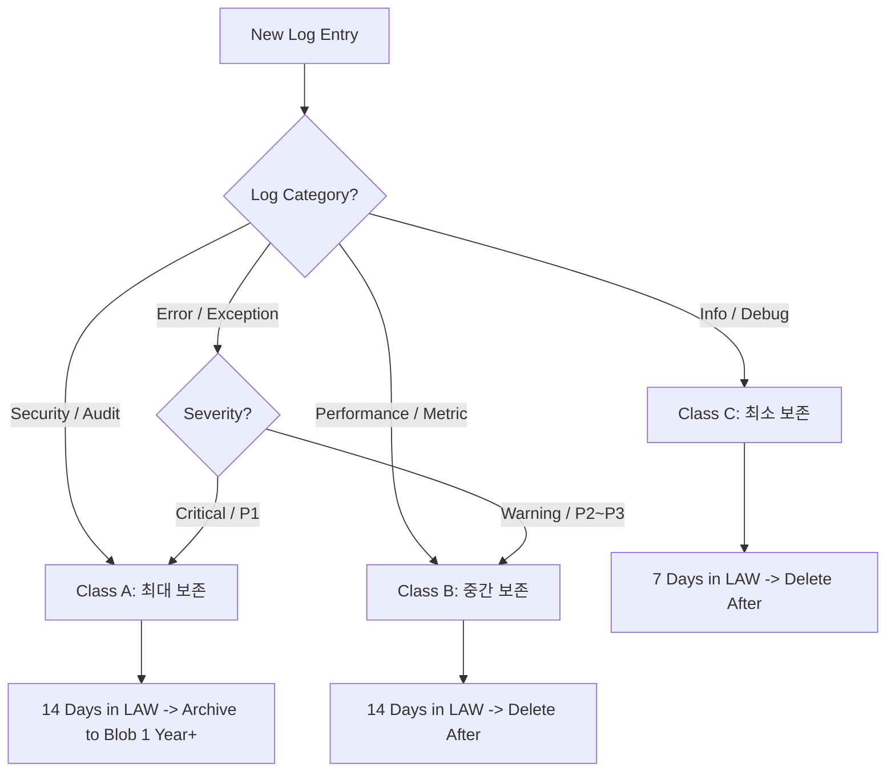
```mermaid
graph TD
    A["New Log Entry"] --> B{"Log Category?"}

    B -- "Security / Audit" --> C["Class A: 최대 보존"]
    B -- "Error / Exception" --> D{"Severity?"}
    B -- "Info / Debug" --> E["Class C: 최소 보존"]
    B -- "Performance / Metric" --> F["Class B: 중간 보존"]

    D -- "Critical / P1" --> C
    D -- "Warning / P2~P3" --> F

    C --> G["14 Days in LAW -> Archive to Blob 1 Year+"]
    F --> H["14 Days in LAW -> Delete After"]
    E --> I["7 Days in LAW -> Delete After"]
```

> [!NOTE] 왜 이렇게 짰는가?
> - **Class A (Security/Audit, Critical Error)**: 컴플라이언스와 사후 분석을 위해 장기 보존이 반드시 필요합니다. 규제 요건(ISMS, SOC2 등)에서 보안 로그 1년 이상 보존을 요구하는 경우가 많습니다.
> - **Class B (Performance, Warning)**: 트렌드 분석용으로 2주 정도면 충분하고, 장기 보존 가치가 낮습니다.
> - **Class C (Info/Debug)**: 개발/디버깅 용도로만 가치가 있으므로 7일이면 충분합니다. 이 로그들이 전체 볼륨의 70~80%를 차지하므로, 빠르게 삭제하는 것이 비용 절감의 핵심입니다.

---

### 1-3. Agent 실행 흐름 (Sequence Diagram)

Client Agent가 Provider에 폴링하고, 승인받아 보존 작업을 수행하는 전체 흐름입니다.

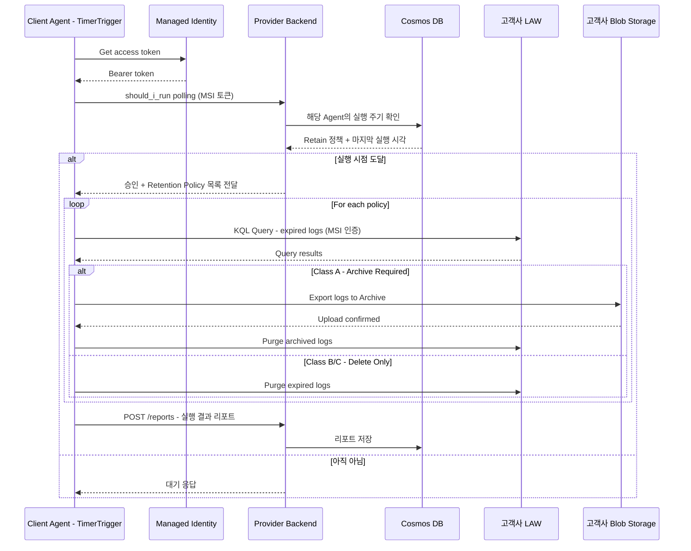
```mermaid
sequenceDiagram
    participant Agent as Client Agent - TimerTrigger
    participant MSI as Managed Identity
    participant PB as Provider Backend
    participant DB as Cosmos DB
    participant LAW as 고객사 LAW
    participant Blob as 고객사 Blob Storage

    Agent->>MSI: Get access token
    MSI-->>Agent: Bearer token

    Agent->>PB: should_i_run polling (MSI 토큰)
    PB->>DB: 해당 Agent의 실행 주기 확인
    DB-->>PB: Retain 정책 + 마지막 실행 시각

    alt 실행 시점 도달
        PB-->>Agent: 승인 + Retention Policy 목록 전달
        
        loop For each policy
            Agent->>LAW: KQL Query - expired logs (MSI 인증)
            LAW-->>Agent: Query results

            alt Class A - Archive Required
                Agent->>Blob: Export logs to Archive
                Blob-->>Agent: Upload confirmed
                Agent->>LAW: Purge archived logs
            else Class B/C - Delete Only
                Agent->>LAW: Purge expired logs
            end
        end

        Agent->>PB: POST /reports - 실행 결과 리포트
        PB->>DB: 리포트 저장
    else 아직 아님
        PB-->>Agent: 대기 응답
    end
```

> [!NOTE] 왜 이렇게 짰는가?
> - **MSI 토큰 인증**: Agent는 Managed Identity로 Provider Backend와 고객사 LAW 모두에 인증합니다. 시크릿 키나 연결 문자열을 사용하지 않는 **Zero Trust** 원칙입니다.
> - **Provider가 정책 전달**: Agent가 직접 DB에서 정책을 읽지 않고, Provider API를 통해 전달받습니다. 이렇게 해야 Provider에서 **테넌트별 정책 격리**가 가능합니다.
> - **리포트 전송**: 실행 결과를 Provider에 보고하면, Teams Frontend 대시보드에서 "어제 Retain이 정상 수행되었는지" 확인할 수 있습니다.

---

### 1-4. 보존 정책 데이터 모델 (Class Diagram)

Cosmos DB에 저장되는 보존 정책의 데이터 구조입니다.

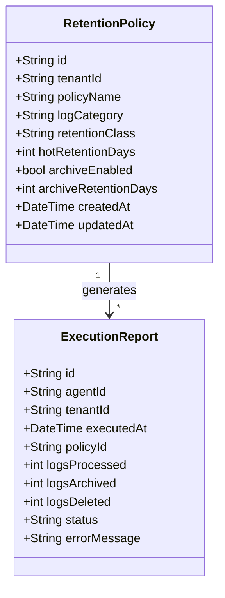
```mermaid
classDiagram
    class RetentionPolicy {
        +String id
        +String tenantId
        +String policyName
        +String logCategory
        +String retentionClass
        +int hotRetentionDays
        +bool archiveEnabled
        +int archiveRetentionDays
        +DateTime createdAt
        +DateTime updatedAt
    }

    class ExecutionReport {
        +String id
        +String agentId
        +String tenantId
        +DateTime executedAt
        +String policyId
        +int logsProcessed
        +int logsArchived
        +int logsDeleted
        +String status
        +String errorMessage
    }

    RetentionPolicy "1" --> "*" ExecutionReport : generates
```

> [!NOTE] 왜 이렇게 짰는가?
> - **tenantId 필드 추가**: 멀티테넌트 구조이므로, 모든 정책과 리포트에 `tenantId`가 포함되어 고객사별 데이터 격리를 보장합니다.
> - **agentId 필드**: 어떤 Agent가 실행했는지 추적하여, 특정 Agent의 동작 상태를 모니터링합니다.

---

### 1-5. 로그 생명주기 (State Diagram)

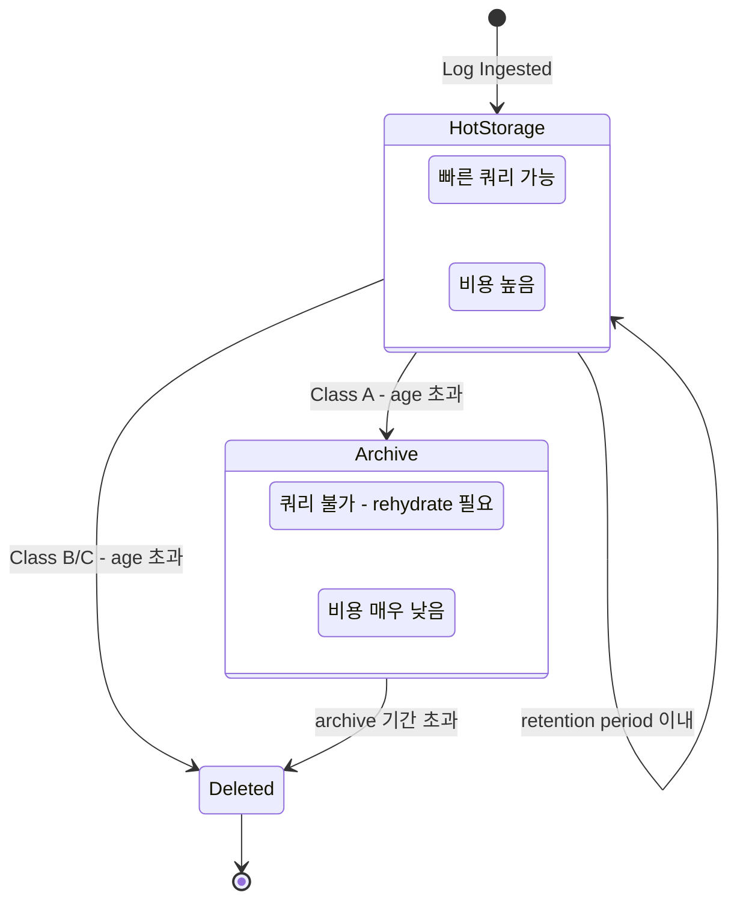
```mermaid
stateDiagram-v2
    [*] --> HotStorage: Log Ingested

    state HotStorage {
        direction LR
        query: 빠른 쿼리 가능
        cost1: 비용 높음
    }

    state Archive {
        direction LR
        rehydrate: 쿼리 불가 - rehydrate 필요
        cost2: 비용 매우 낮음
    }

    HotStorage --> HotStorage: retention period 이내
    HotStorage --> Archive: Class A - age 초과
    HotStorage --> Deleted: Class B/C - age 초과
    Archive --> Deleted: archive 기간 초과
    Deleted --> [*]
```

---

### 1-6. 비용 비교 요약

| 저장소 | 비용 (GB/월) | 쿼리 속도 | 용도 |
| --- | --- | --- | --- |
| Log Analytics (LAW) | ~$2.76 | 즉시 (KQL) | 실시간 모니터링, 디버깅 |
| Blob Cool Tier | ~$0.01 | 복원 필요 (수분) | 중기 보존 (3~6개월) |
| Blob Archive Tier | ~$0.002 | 복원 필요 (수시간) | 장기 보존 (1년+, 컴플라이언스) |

> [!TIP] 핵심 포인트
> 일 10GB 로그 발생 시, 전부 LAW에 30일 보존하면 월 **~$828**, 7일만 LAW + 나머지 Archive로 하면 월 **~$195 + $0.5 = ~$196**. **약 75% 비용 절감**이 가능합니다.

---

## 2. Prevent (앱 레벨 예방)

어플리케이션 단에서 불필요한 로그 생성을 방지합니다. **로그 볼륨의 70~80%는 Info/Debug 레벨**이므로, 이를 제어하는 것만으로도 비용과 노이즈를 대폭 줄일 수 있습니다.

---

### 2-1. 전체 아키텍처 (Provider + Agent 분리)

Provider가 규칙을 관리하고, Agent가 고객사 LAW를 분석하여 위반 사항을 리포트합니다.

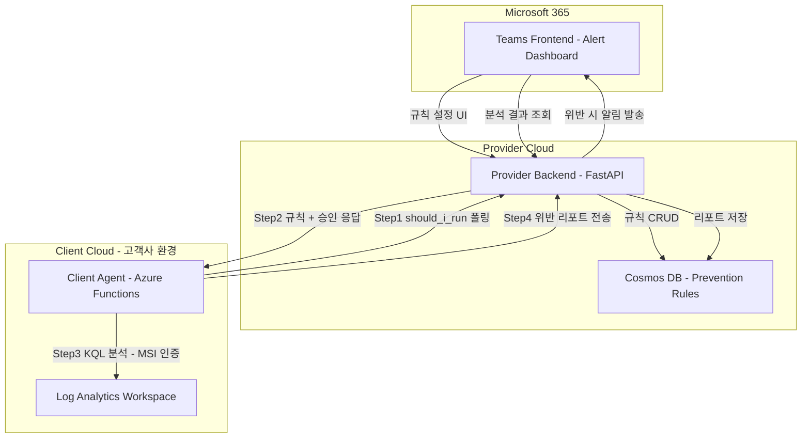
```mermaid
graph TB
    subgraph Microsoft 365
        Teams["Teams Frontend - Alert Dashboard"]
    end

    subgraph Provider Cloud
        PB["Provider Backend - FastAPI"]
        CosmosDB["Cosmos DB - Prevention Rules"]
    end

    subgraph Client Cloud - 고객사 환경
        Agent["Client Agent - Azure Functions"]
        LAW["Log Analytics Workspace"]
    end

    Teams -->|규칙 설정 UI| PB
    PB -->|규칙 CRUD| CosmosDB

    Agent -->|Step1 should_i_run 폴링| PB
    PB -->|Step2 규칙 + 승인 응답| Agent
    Agent -->|Step3 KQL 분석 - MSI 인증| LAW
    Agent -->|Step4 위반 리포트 전송| PB
    PB -->|리포트 저장| CosmosDB

    PB -->|위반 시 알림 발송| Teams
    Teams -->|분석 결과 조회| PB
```

> [!NOTE] 왜 이렇게 짰는가?
> - Prevent는 **로그를 삭제하는 것이 아니라 분석하여 권고**하는 기능입니다. Agent가 분석하고, Provider가 알림을 보냅니다.
> - Agent가 직접 Teams로 알림을 보내지 않습니다. **Provider를 경유**하여 알림을 보냄으로써, 알림 이력을 중앙에서 관리하고 알림 피로를 제어합니다.

---

### 2-2. 규칙 엔진 상세 흐름 (Decision Flow)

Agent가 각 로그 패턴을 어떻게 판단하는지의 상세 흐름입니다.

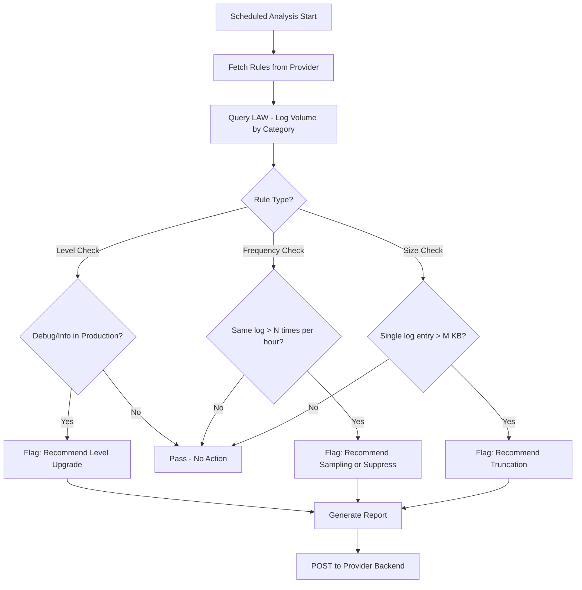
```mermaid
graph TD
    A["Scheduled Analysis Start"] --> B["Fetch Rules from Provider"]
    B --> C["Query LAW - Log Volume by Category"]

    C --> D{"Rule Type?"}

    D -- "Level Check" --> E{"Debug/Info in Production?"}
    D -- "Frequency Check" --> F{"Same log > N times per hour?"}
    D -- "Size Check" --> G{"Single log entry > M KB?"}

    E -- "Yes" --> H["Flag: Recommend Level Upgrade"]
    E -- "No" --> I["Pass - No Action"]

    F -- "Yes" --> J["Flag: Recommend Sampling or Suppress"]
    F -- "No" --> I

    G -- "Yes" --> K["Flag: Recommend Truncation"]
    G -- "No" --> I

    H --> L["Generate Report"]
    J --> L
    K --> L
    L --> M["POST to Provider Backend"]
```

> [!NOTE] 왜 이렇게 짰는가?
> - **세 가지 규칙 타입**: Level Check(1순위), Frequency Check, Size Check
> - 최종 결과는 Provider Backend로 리포트됩니다. Provider가 알림 발송 여부를 판단합니다.

---

### 2-3. 분석 및 알림 시퀀스 (Sequence Diagram)

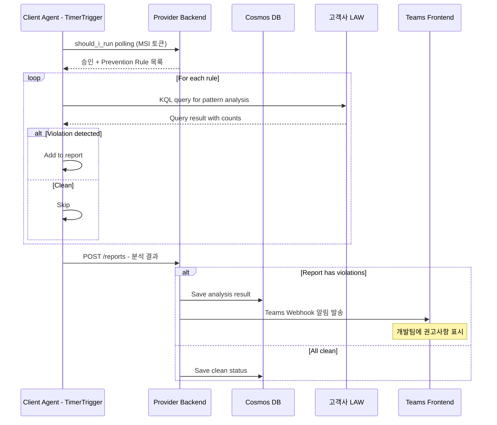
```mermaid
sequenceDiagram
    participant Agent as Client Agent - TimerTrigger
    participant PB as Provider Backend
    participant DB as Cosmos DB
    participant LAW as 고객사 LAW
    participant Teams as Teams Frontend

    Agent->>PB: should_i_run polling (MSI 토큰)
    PB-->>Agent: 승인 + Prevention Rule 목록

    loop For each rule
        Agent->>LAW: KQL query for pattern analysis
        LAW-->>Agent: Query result with counts

        alt Violation detected
            Agent->>Agent: Add to report
        else Clean
            Agent->>Agent: Skip
        end
    end

    Agent->>PB: POST /reports - 분석 결과

    alt Report has violations
        PB->>DB: Save analysis result
        PB->>Teams: Teams Webhook 알림 발송
        Note over Teams: 개발팀에 권고사항 표시
    else All clean
        PB->>DB: Save clean status
    end
```

> [!NOTE] 왜 이렇게 짰는가?
> - **Agent는 분석만, Provider는 판단과 알림**: Agent는 로그를 분석하여 결과를 보내고, 알림 발송은 Provider가 담당합니다. 이렇게 분리해야 알림 피로 제어, 중복 알림 방지 등 중앙 관리가 가능합니다.

---

### 2-4. 규칙 데이터 모델 (Class Diagram)

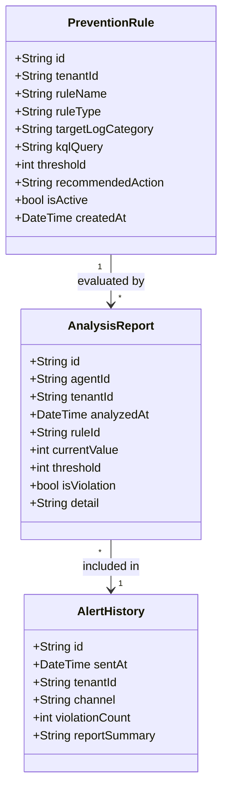
```mermaid
classDiagram
    class PreventionRule {
        +String id
        +String tenantId
        +String ruleName
        +String ruleType
        +String targetLogCategory
        +String kqlQuery
        +int threshold
        +String recommendedAction
        +bool isActive
        +DateTime createdAt
    }

    class AnalysisReport {
        +String id
        +String agentId
        +String tenantId
        +DateTime analyzedAt
        +String ruleId
        +int currentValue
        +int threshold
        +bool isViolation
        +String detail
    }

    class AlertHistory {
        +String id
        +DateTime sentAt
        +String tenantId
        +String channel
        +int violationCount
        +String reportSummary
    }

    PreventionRule "1" --> "*" AnalysisReport : evaluated by
    AnalysisReport "*" --> "1" AlertHistory : included in
```

---

### 2-5. 로그 상태 변화 (State Diagram)

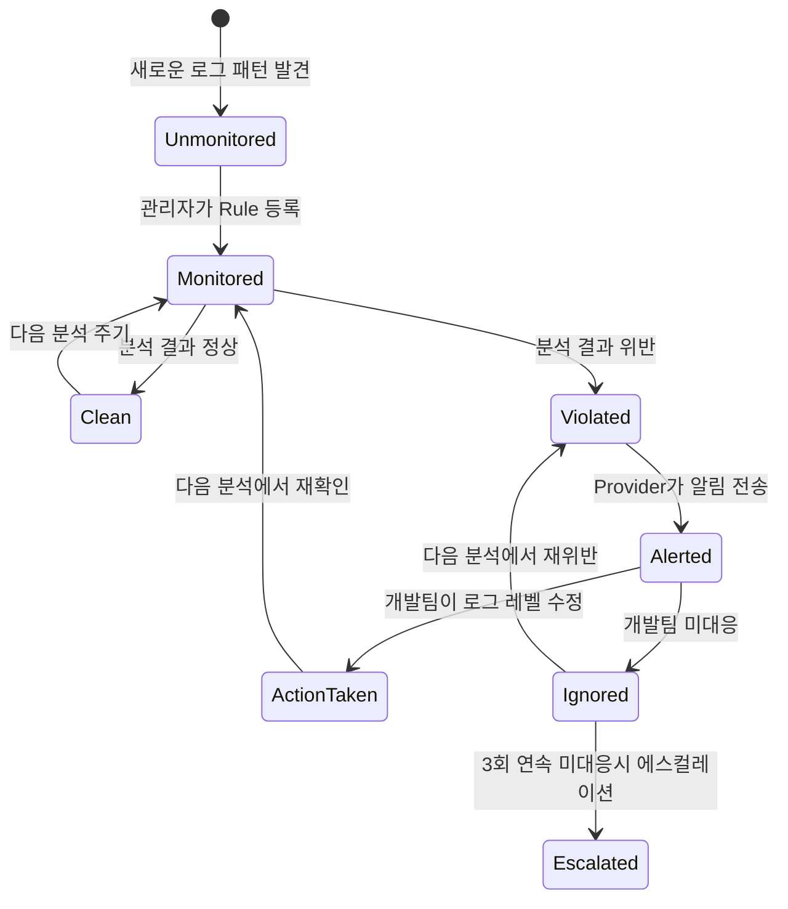
```mermaid
stateDiagram-v2
    [*] --> Unmonitored: 새로운 로그 패턴 발견

    Unmonitored --> Monitored: 관리자가 Rule 등록

    Monitored --> Clean: 분석 결과 정상
    Monitored --> Violated: 분석 결과 위반

    Clean --> Monitored: 다음 분석 주기
    Violated --> Alerted: Provider가 알림 전송
    Alerted --> ActionTaken: 개발팀이 로그 레벨 수정
    Alerted --> Ignored: 개발팀 미대응

    ActionTaken --> Monitored: 다음 분석에서 재확인
    Ignored --> Violated: 다음 분석에서 재위반
    Ignored --> Escalated: 3회 연속 미대응시 에스컬레이션
```

---

### 2-6. 규칙 예시 (참고용)

| Rule Name | Type | Target | Threshold | Action |
| --- | --- | --- | --- | --- |
| debug-in-prod | Level Check | All Resources | Debug level count > 0 | 로그 레벨을 Info 이상으로 상향 권고 |
| high-frequency-log | Frequency | API Gateway | 같은 메시지 > 100/hour | Sampling rate 적용 권고 |
| oversized-entry | Size Check | Backend API | 단일 로그 > 50KB | Payload 로깅 비활성화 권고 |
| unused-trace | Level Check | Batch Jobs | Trace level count > 0 | Trace 로그 제거 권고 |

---

## 3. Detect (인프라 레벨 탐지)

앱 단까지 들어온 불량 트래픽을 로그에서 감지하고, 인프라 팀에 차단을 요청하는 **보안 연계 기능**입니다. Prevent가 "로그 품질"에 집중한다면, Detect는 "로그 속 보안 위협"에 집중합니다.

---

### 3-1. 전체 아키텍처 (Provider + Agent 분리)

Agent가 고객사 LAW에서 위협을 탐지하고, Provider가 인시던트를 관리합니다.

```mermaid
graph TB
    subgraph Microsoft 365
        Teams["Teams Frontend - Incident Dashboard"]
    end

    subgraph Provider Cloud
        PB["Provider Backend - FastAPI"]
        CosmosDB["Cosmos DB - Detection Patterns"]
    end

    subgraph Client Cloud - 고객사 환경
        Agent["Client Agent - Azure Functions"]
        LAW["Log Analytics Workspace"]
        WAF["Azure WAF / Front Door"]
    end

    subgraph External
        Attacker["Attacker / Bot"]
    end

    Attacker -->|Malicious Request| WAF
    WAF -->|Passed Through| LAW

    Agent -->|Step1 should_i_run 폴링| PB
    PB -->|Step2 Detection Patterns 전달| Agent
    Agent -->|Step3 KQL 위협 분석 - MSI 인증| LAW
    Agent -->|Step4 탐지 결과 리포트| PB

    PB -->|인시던트 저장| CosmosDB
    PB -->|긴급 알림| Teams
    Teams -->|인시던트 조회 및 대응 지시| PB
```

> [!NOTE] 왜 이렇게 짰는가?
> - **Agent는 탐지만, Provider는 인시던트 관리**: Agent가 직접 WAF 룰을 변경하지 않습니다. 탐지 결과를 Provider에 보고하면, 인프라 팀이 Teams 대시보드에서 확인 후 WAF를 수동 업데이트합니다. 이는 **오탐에 의한 잘못된 차단을 방지**하기 위함입니다.
> - **30분 주기 폴링**: 보안 위협은 빠른 감지가 중요하므로, Retain(24h)이나 Prevent(6h)보다 짧은 주기로 실행합니다.

---

### 3-2. 탐지 규칙 판단 흐름 (Decision Flow)

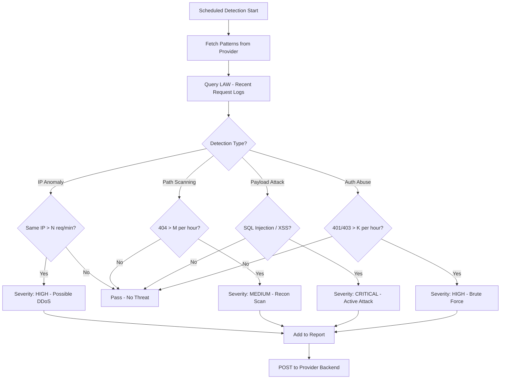
```mermaid
graph TD
    A["Scheduled Detection Start"] --> B["Fetch Patterns from Provider"]
    B --> C["Query LAW - Recent Request Logs"]

    C --> D{"Detection Type?"}

    D -- "IP Anomaly" --> E{"Same IP > N req/min?"}
    D -- "Path Scanning" --> F{"404 > M per hour?"}
    D -- "Payload Attack" --> G{"SQL Injection / XSS?"}
    D -- "Auth Abuse" --> H{"401/403 > K per hour?"}

    E -- "Yes" --> I["Severity: HIGH - Possible DDoS"]
    E -- "No" --> J["Pass - No Threat"]

    F -- "Yes" --> K["Severity: MEDIUM - Recon Scan"]
    F -- "No" --> J

    G -- "Yes" --> L["Severity: CRITICAL - Active Attack"]
    G -- "No" --> J

    H -- "Yes" --> M["Severity: HIGH - Brute Force"]
    H -- "No" --> J

    I --> N["Add to Report"]
    K --> N
    L --> N
    M --> N
    N --> O["POST to Provider Backend"]
```

---

### 3-3. 탐지 및 인시던트 시퀀스 (Sequence Diagram)

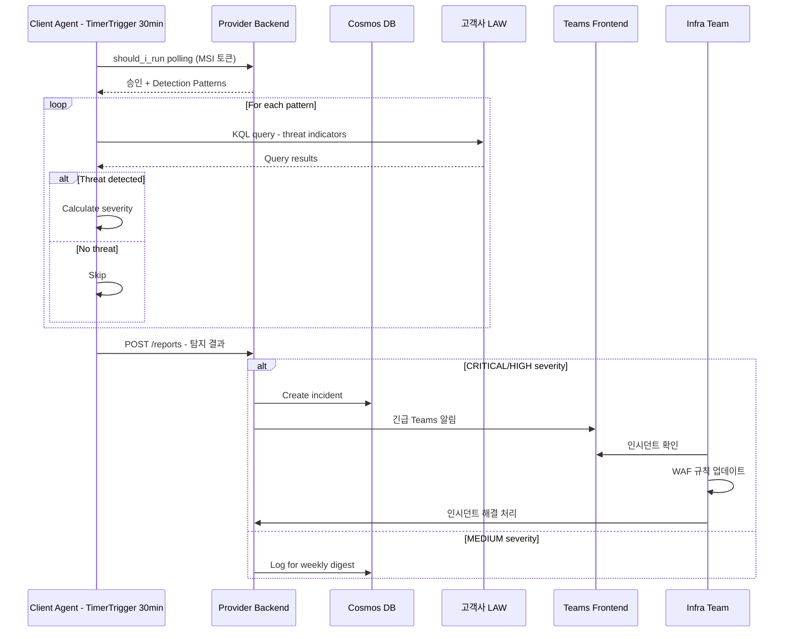
```mermaid
sequenceDiagram
    participant Agent as Client Agent - TimerTrigger 30min
    participant PB as Provider Backend
    participant DB as Cosmos DB
    participant LAW as 고객사 LAW
    participant Teams as Teams Frontend
    participant Infra as Infra Team

    Agent->>PB: should_i_run polling (MSI 토큰)
    PB-->>Agent: 승인 + Detection Patterns

    loop For each pattern
        Agent->>LAW: KQL query - threat indicators
        LAW-->>Agent: Query results

        alt Threat detected
            Agent->>Agent: Calculate severity
        else No threat
            Agent->>Agent: Skip
        end
    end

    Agent->>PB: POST /reports - 탐지 결과

    alt CRITICAL/HIGH severity
        PB->>DB: Create incident
        PB->>Teams: 긴급 Teams 알림
        Infra->>Teams: 인시던트 확인
        Infra->>Infra: WAF 규칙 업데이트
        Infra->>PB: 인시던트 해결 처리
    else MEDIUM severity
        PB->>DB: Log for weekly digest
    end
```

---

### 3-4. 탐지 데이터 모델 (Class Diagram)

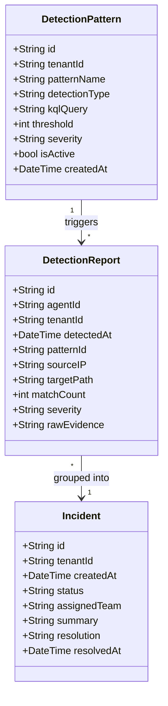
```mermaid
classDiagram
    class DetectionPattern {
        +String id
        +String tenantId
        +String patternName
        +String detectionType
        +String kqlQuery
        +int threshold
        +String severity
        +bool isActive
        +DateTime createdAt
    }

    class DetectionReport {
        +String id
        +String agentId
        +String tenantId
        +DateTime detectedAt
        +String patternId
        +String sourceIP
        +String targetPath
        +int matchCount
        +String severity
        +String rawEvidence
    }

    class Incident {
        +String id
        +String tenantId
        +DateTime createdAt
        +String status
        +String assignedTeam
        +String summary
        +String resolution
        +DateTime resolvedAt
    }

    DetectionPattern "1" --> "*" DetectionReport : triggers
    DetectionReport "*" --> "1" Incident : grouped into
```

---

### 3-5. 인시던트 생명주기 (State Diagram)

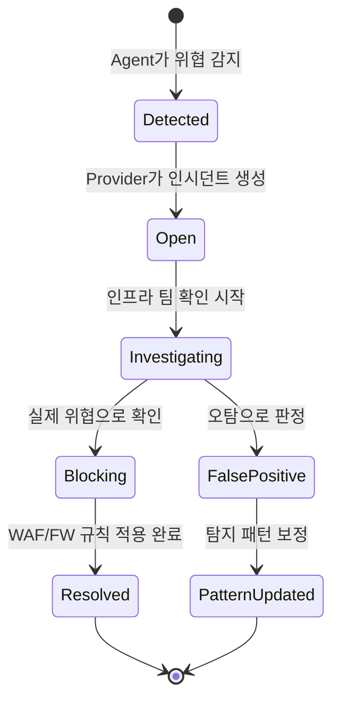
```mermaid
stateDiagram-v2
    [*] --> Detected: Agent가 위협 감지

    Detected --> Open: Provider가 인시던트 생성
    Open --> Investigating: 인프라 팀 확인 시작

    Investigating --> Blocking: 실제 위협으로 확인
    Investigating --> FalsePositive: 오탐으로 판정

    Blocking --> Resolved: WAF/FW 규칙 적용 완료
    FalsePositive --> PatternUpdated: 탐지 패턴 보정

    Resolved --> [*]
    PatternUpdated --> [*]
```

---

### 3-6. 탐지 규칙 예시 (참고용)

| Pattern Name | Type | KQL 핵심 로직 | Threshold | Severity |
| --- | --- | --- | --- | --- |
| ddos-suspect | IP Anomaly | 동일 IP에서 분당 요청 수 집계 | 500 req/min | HIGH |
| path-scanner | Path Scanning | 동일 소스에서 404 응답 시간당 집계 | 50 per hour | MEDIUM |
| sql-injection | Payload Attack | URL에 UNION SELECT 등 패턴 매칭 | 1회 이상 | CRITICAL |
| brute-force | Auth Abuse | 동일 소스에서 401 응답 시간당 집계 | 30 per hour | HIGH |
| suspicious-ua | IP Anomaly | User-Agent가 공격 도구 이름 포함 | 1회 이상 | MEDIUM |

---

## 4. Filter (필터링)

원본 로그를 삭제하지 않고, **수집 파이프라인 단계에서 노이즈를 걸러내는 기능**입니다. 다른 3개 기능이 이미 수집된 로그를 후처리하는 반면, Filter는 **수집 시점에 개입**하여 불필요한 로그가 LAW에 들어오는 것 자체를 차단합니다.

---

### 4-1. 전체 아키텍처 (Provider + Agent 분리)

Provider가 필터 규칙을 관리하고, Agent가 고객사 DCR에 규칙을 적용합니다.

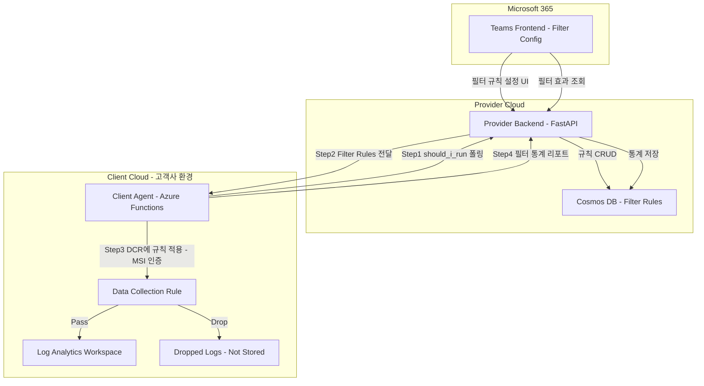
```mermaid
graph TB
    subgraph Microsoft 365
        Teams["Teams Frontend - Filter Config"]
    end

    subgraph Provider Cloud
        PB["Provider Backend - FastAPI"]
        CosmosDB["Cosmos DB - Filter Rules"]
    end

    subgraph Client Cloud - 고객사 환경
        Agent["Client Agent - Azure Functions"]
        DCR["Data Collection Rule"]
        LAW["Log Analytics Workspace"]
        Trash["Dropped Logs - Not Stored"]
    end

    Teams -->|필터 규칙 설정 UI| PB
    PB -->|규칙 CRUD| CosmosDB

    Agent -->|Step1 should_i_run 폴링| PB
    PB -->|Step2 Filter Rules 전달| Agent
    Agent -->|Step3 DCR에 규칙 적용 - MSI 인증| DCR
    DCR -->|Pass| LAW
    DCR -->|Drop| Trash
    Agent -->|Step4 필터 통계 리포트| PB
    PB -->|통계 저장| CosmosDB
    Teams -->|필터 효과 조회| PB
```

> [!NOTE] 왜 이렇게 짰는가?
> - **Agent가 DCR을 제어**: 고객사 환경의 DCR은 고객사 Managed Identity로만 접근 가능합니다. Provider가 직접 건드릴 수 없으므로 Agent가 대행합니다.
> - **우선순위가 최하인 이유**: Retain/Prevent/Detect가 안정화된 후에 적용해야 합니다. 섣부른 필터링은 중요한 로그를 유실시킬 위험이 있기 때문입니다.
> - **필터 통계 리포트**: Agent가 얼마나 많은 로그를 차단했는지 Provider에 보고하여, Teams 대시보드에서 효과를 모니터링합니다.

---

### 4-2. 필터 파이프라인 상세 흐름 (Decision Flow)

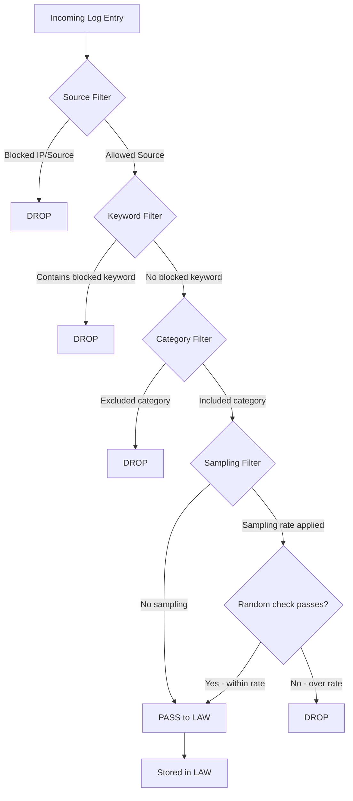
```mermaid
graph TD
    A["Incoming Log Entry"] --> B{"Source Filter"}

    B -- "Blocked IP/Source" --> DROP1["DROP"]
    B -- "Allowed Source" --> C{"Keyword Filter"}

    C -- "Contains blocked keyword" --> DROP2["DROP"]
    C -- "No blocked keyword" --> D{"Category Filter"}

    D -- "Excluded category" --> DROP3["DROP"]
    D -- "Included category" --> E{"Sampling Filter"}

    E -- "Sampling rate applied" --> F{"Random check passes?"}
    E -- "No sampling" --> G["PASS to LAW"]

    F -- "Yes - within rate" --> G
    F -- "No - over rate" --> DROP4["DROP"]

    G --> H["Stored in LAW"]
```

---

### 4-3. 필터 적용 시퀀스 (Sequence Diagram)

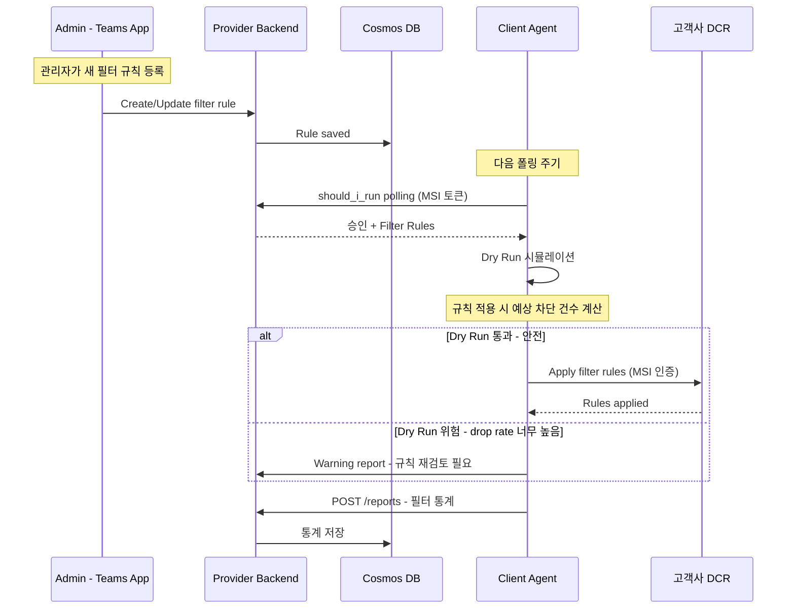
```mermaid
sequenceDiagram
    participant Admin as Admin - Teams App
    participant PB as Provider Backend
    participant DB as Cosmos DB
    participant Agent as Client Agent
    participant DCR as 고객사 DCR

    Note over Admin: 관리자가 새 필터 규칙 등록
    Admin->>PB: Create/Update filter rule
    PB->>DB: Rule saved

    Note over Agent: 다음 폴링 주기
    Agent->>PB: should_i_run polling (MSI 토큰)
    PB-->>Agent: 승인 + Filter Rules

    Agent->>Agent: Dry Run 시뮬레이션
    Note over Agent: 규칙 적용 시 예상 차단 건수 계산

    alt Dry Run 통과 - 안전
        Agent->>DCR: Apply filter rules (MSI 인증)
        DCR-->>Agent: Rules applied
    else Dry Run 위험 - drop rate 너무 높음
        Agent->>PB: Warning report - 규칙 재검토 필요
    end

    Agent->>PB: POST /reports - 필터 통계
    PB->>DB: 통계 저장
```

> [!NOTE] 왜 이렇게 짰는가?
> - **Dry Run 자동 실행**: Agent가 규칙을 적용하기 전에 시뮬레이션을 돌려 예상 차단 건수를 계산합니다. 너무 많은 로그가 차단될 것으로 예상되면 Provider에 경고를 보냅니다.
> - **DCR 직접 제어**: Agent가 고객사 DCR에 MSI 인증으로 접근하여 필터 규칙을 적용합니다.

---

### 4-4. 필터 규칙 데이터 모델 (Class Diagram)

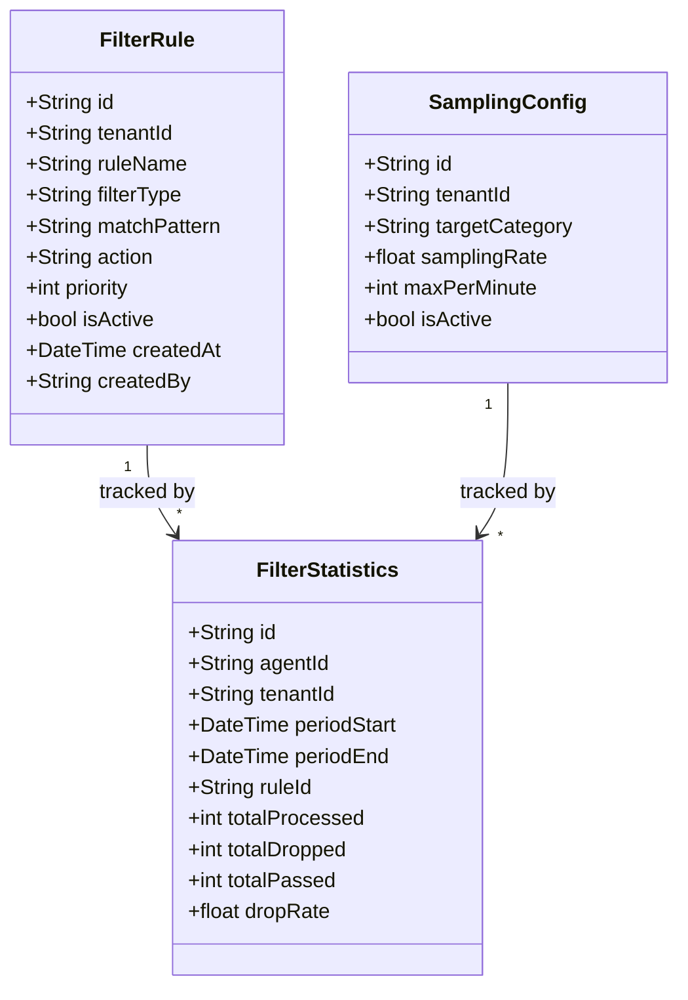
```mermaid
classDiagram
    class FilterRule {
        +String id
        +String tenantId
        +String ruleName
        +String filterType
        +String matchPattern
        +String action
        +int priority
        +bool isActive
        +DateTime createdAt
        +String createdBy
    }

    class FilterStatistics {
        +String id
        +String agentId
        +String tenantId
        +DateTime periodStart
        +DateTime periodEnd
        +String ruleId
        +int totalProcessed
        +int totalDropped
        +int totalPassed
        +float dropRate
    }

    class SamplingConfig {
        +String id
        +String tenantId
        +String targetCategory
        +float samplingRate
        +int maxPerMinute
        +bool isActive
    }

    FilterRule "1" --> "*" FilterStatistics : tracked by
    SamplingConfig "1" --> "*" FilterStatistics : tracked by
```

---

### 4-5. 필터 규칙 생명주기 (State Diagram)

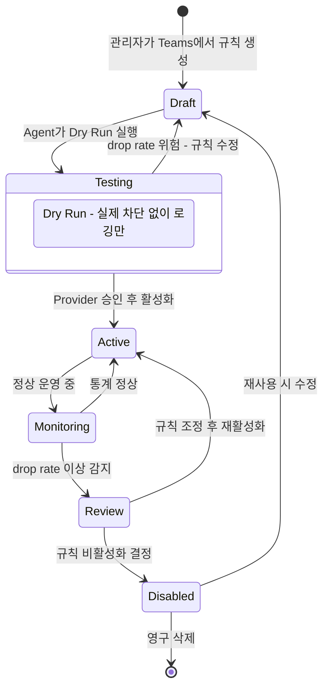
```mermaid
stateDiagram-v2
    [*] --> Draft: 관리자가 Teams에서 규칙 생성

    Draft --> Testing: Agent가 Dry Run 실행

    state Testing {
        direction LR
        DryRun: Dry Run - 실제 차단 없이 로깅만
    }

    Testing --> Active: Provider 승인 후 활성화
    Testing --> Draft: drop rate 위험 - 규칙 수정

    Active --> Monitoring: 정상 운영 중
    Monitoring --> Active: 통계 정상

    Monitoring --> Review: drop rate 이상 감지
    Review --> Active: 규칙 조정 후 재활성화
    Review --> Disabled: 규칙 비활성화 결정

    Disabled --> Draft: 재사용 시 수정
    Disabled --> [*]: 영구 삭제
```

---

### 4-6. 필터 규칙 예시 (참고용)

| Rule Name | Type | Match Pattern | Action | 예상 효과 |
| --- | --- | --- | --- | --- |
| block-healthcheck | Keyword | "health check", "readiness" | DROP | health check 로그 100% 제거 |
| block-k8s-internal | Category | kube-system namespace 로그 | DROP | K8s 내부 로그 제거 |
| block-crawler-ips | Source | 알려진 봇/크롤러 IP 리스트 | DROP | 봇 트래픽 로그 제거 |
| sample-verbose-api | Sampling | /api/v1/status 경로 로그 | 10% SAMPLE | 반복적인 status API 로그 90% 감소 |
| block-static-assets | Keyword | ".css", ".js", ".png" | DROP | 정적 파일 요청 로그 제거 |

---

## 전체 기능 비교 요약

4개 기능의 핵심 차이를 한눈에 비교합니다.

```mermaid
graph LR
    subgraph Execution Frequency
        R["Retain - Daily"]
        P["Prevent - Every 6h"]
        D["Detect - Every 30min"]
        F["Filter - On Demand"]
    end

    R -.->|Slowest| P
    P -.-> D
    D -.->|Fastest| F
```

| 항목 | Retain | Prevent | Detect | Filter |
| --- | --- | --- | --- | --- |
| 목적 | 비용 최적화 | 로그 품질 개선 | 보안 위협 탐지 | 노이즈 제거 |
| 대상 | 수집된 로그 | 로그 패턴 | 트래픽 로그 | 수집 전 로그 |
| 실행 주기 | 24시간 | 6시간 | 30분 | On Demand |
| Agent 역할 | LAW 쿼리 + Archive + Purge | LAW 분석 | LAW 위협 분석 | DCR 규칙 적용 |
| Provider 역할 | 정책 관리 + 리포트 수신 | 규칙 관리 + 알림 발송 | 패턴 관리 + 인시던트 관리 | 규칙 관리 + 통계 수집 |
| Teams 역할 | 리포트 조회 | 위반 알림 수신 | 인시던트 대응 | 필터 설정 + 효과 확인 |
| 우선순위 | 1순위 | 2순위 | 3순위 | 4순위 |
| 인증 방식 | Agent MSI | Agent MSI | Agent MSI | Agent MSI |
