# Log Doctor Project: Log Optimization & Management Plan

이 문서는 Azure Functions 기반의 로그 최적화 및 관리 전략을 정리한 내용입니다. (화이트보드 회의 내용 정리)

> [!IMPORTANT] 아키텍처 전제
> 본 문서의 모든 기능은 [system_architecture_and_security.md](system_architecture_and_security.md)의 **하이브리드 배포 아키텍처**를 따릅니다.
> - **Provider Backend** (FastAPI): 정책/규칙 관리, 에이전트 제어, 리포트 수신
> - **Client Agent** (Azure Functions): 고객사 환경에서 실제 로그 분석/처리 수행
> - **Teams Frontend** (React): 운영 대시보드, 설정 UI

---

## 1. Retain (보존 및 관리)

로그의 보존 기간과 중요도에 따른 관리 전략입니다. 보존 정책은 **비용**과 **컴플라이언스** 사이의 균형을 맞추는 것이 핵심입니다.

---

### 1-1. 전체 아키텍처 (Provider + Agent 분리)

Provider Backend가 정책을 관리하고, Client Agent가 고객사 LAW에서 실제 보존 작업을 수행합니다.

```mermaid
graph TB
    subgraph Microsoft 365
        Teams["Teams Frontend - Dashboard"]
    end

    subgraph Provider Cloud
        PB["Provider Backend - FastAPI"]
        CosmosDB["Cosmos DB - Retention Policies"]
    end

    subgraph Client Cloud - 고객사 환경
        Agent["Client Agent - Azure Functions"]
        Managed Identity["Managed Identity"]
        LAW["Log Analytics Workspace"]
        Blob["Azure Blob Storage - Archive Tier"]
    end

    Teams -->|정책 설정 UI| PB
    PB -->|정책 CRUD| CosmosDB

    Agent -->|Step1 should_i_run 폴링| PB
    PB -->|Step2 정책 + 승인 응답| Agent
    Agent -->|Step3 KQL 쿼리 - Managed Identity 인증| LAW
    Agent -->|Step4 Archive Export| Blob
    Agent -->|Step5 Purge 완료 후 리포트 전송| PB
    PB -->|리포트 저장| CosmosDB
    Teams -->|분석 결과 조회| PB
```

> [!NOTE] 왜 이렇게 짰는가?
> - **Provider가 직접 고객 LAW에 접근하지 않습니다.** 고객사 데이터 주권을 지키기 위해, Agent가 고객사 Managed Identity로 LAW/Blob에 접근합니다.
> - **should_i_run 폴링**: Agent가 독자적으로 실행 시점을 결정하는 것이 아니라, Provider에 "지금 실행해도 되는지" 확인하여 **중앙 통제**를 유지합니다.
> - **리포트 경로**: Agent → Provider API → Cosmos DB. Agent가 직접 DB에 쓰지 않고, Provider를 경유하여 **보안 게이트웨이**를 거칩니다.

---

### 1-2. 보존 정책 분류 흐름도 (Decision Flow)

각 로그가 어떤 보존 등급에 배정되는지 결정하는 상세 흐름입니다.

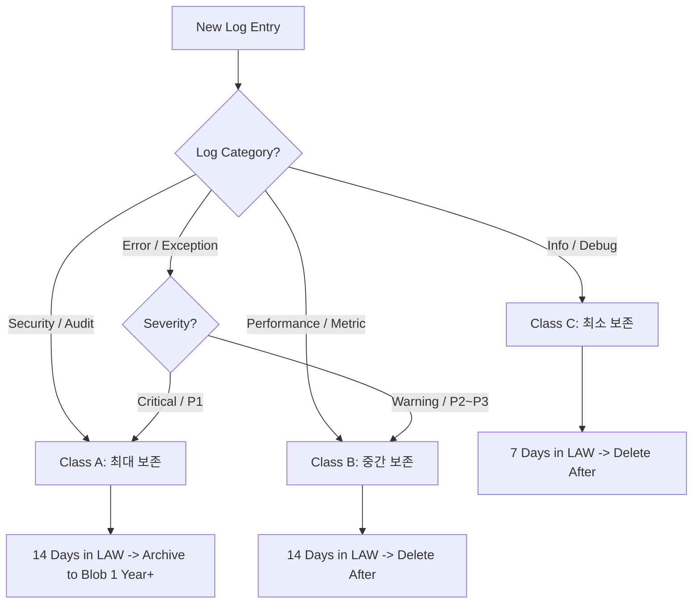
```mermaid
graph TD
    A["New Log Entry"] --> B{"Log Category?"}

    B -- "Security / Audit" --> C["Class A: 최대 보존"]
    B -- "Error / Exception" --> D{"Severity?"}
    B -- "Info / Debug" --> E["Class C: 최소 보존"]
    B -- "Performance / Metric" --> F["Class B: 중간 보존"]

    D -- "Critical / P1" --> C
    D -- "Warning / P2~P3" --> F

    C --> G["14 Days in LAW -> Archive to Blob 1 Year+"]
    F --> H["14 Days in LAW -> Delete After"]
    E --> I["7 Days in LAW -> Delete After"]
```

> [!NOTE] 왜 이렇게 짰는가?
> - **Class A (Security/Audit, Critical Error)**: 컴플라이언스와 사후 분석을 위해 장기 보존이 반드시 필요합니다. 규제 요건(ISMS, SOC2 등)에서 보안 로그 1년 이상 보존을 요구하는 경우가 많습니다.
> - **Class B (Performance, Warning)**: 트렌드 분석용으로 2주 정도면 충분하고, 장기 보존 가치가 낮습니다.
> - **Class C (Info/Debug)**: 개발/디버깅 용도로만 가치가 있으므로 7일이면 충분합니다. 이 로그들이 전체 볼륨의 70~80%를 차지하므로, 빠르게 삭제하는 것이 비용 절감의 핵심입니다.

---

### 1-3. Agent 실행 흐름 (Sequence Diagram)

Client Agent가 Provider에 폴링하고, 승인받아 보존 작업을 수행하는 전체 흐름입니다.

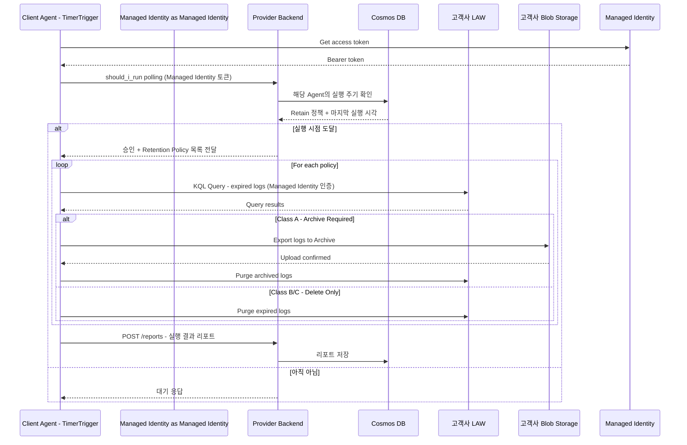
```mermaid
sequenceDiagram
    participant Agent as Client Agent - TimerTrigger
    participant Managed Identity as Managed Identity
    participant PB as Provider Backend
    participant DB as Cosmos DB
    participant LAW as 고객사 LAW
    participant Blob as 고객사 Blob Storage

    Agent->>Managed Identity: Get access token
    Managed Identity-->>Agent: Bearer token

    Agent->>PB: should_i_run polling (Managed Identity 토큰)
    PB->>DB: 해당 Agent의 실행 주기 확인
    DB-->>PB: Retain 정책 + 마지막 실행 시각

    alt 실행 시점 도달
        PB-->>Agent: 승인 + Retention Policy 목록 전달
        
        loop For each policy
            Agent->>LAW: KQL Query - expired logs (Managed Identity 인증)
            LAW-->>Agent: Query results

            alt Class A - Archive Required
                Agent->>Blob: Export logs to Archive
                Blob-->>Agent: Upload confirmed
                Agent->>LAW: Purge archived logs
            else Class B/C - Delete Only
                Agent->>LAW: Purge expired logs
            end
        end

        Agent->>PB: POST /reports - 실행 결과 리포트
        PB->>DB: 리포트 저장
    else 아직 아님
        PB-->>Agent: 대기 응답
    end
```

> [!NOTE] 왜 이렇게 짰는가?
> - **Managed Identity 토큰 인증**: Agent는 Managed Identity로 Provider Backend와 고객사 LAW 모두에 인증합니다. 시크릿 키나 연결 문자열을 사용하지 않는 **Zero Trust** 원칙입니다.
> - **Provider가 정책 전달**: Agent가 직접 DB에서 정책을 읽지 않고, Provider API를 통해 전달받습니다. 이렇게 해야 Provider에서 **테넌트별 정책 격리**가 가능합니다.
> - **리포트 전송**: 실행 결과를 Provider에 보고하면, Teams Frontend 대시보드에서 "어제 Retain이 정상 수행되었는지" 확인할 수 있습니다.

---

### 1-4. 보존 정책 데이터 모델 (Class Diagram)

Cosmos DB에 저장되는 보존 정책의 데이터 구조입니다.

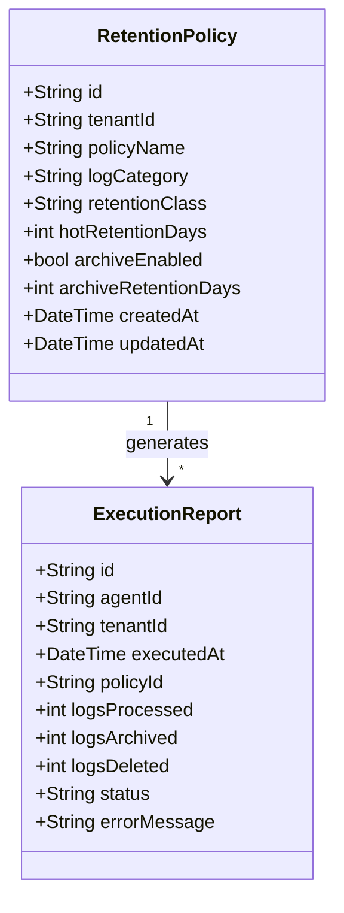
```mermaid
classDiagram
    class RetentionPolicy {
        +String id
        +String tenantId
        +String policyName
        +String logCategory
        +String retentionClass
        +int hotRetentionDays
        +bool archiveEnabled
        +int archiveRetentionDays
        +DateTime createdAt
        +DateTime updatedAt
    }

    class ExecutionReport {
        +String id
        +String agentId
        +String tenantId
        +DateTime executedAt
        +String policyId
        +int logsProcessed
        +int logsArchived
        +int logsDeleted
        +String status
        +String errorMessage
    }

    RetentionPolicy "1" --> "*" ExecutionReport : generates
```

> [!NOTE] 왜 이렇게 짰는가?
> - **tenantId 필드 추가**: 멀티테넌트 구조이므로, 모든 정책과 리포트에 `tenantId`가 포함되어 고객사별 데이터 격리를 보장합니다.
> - **agentId 필드**: 어떤 Agent가 실행했는지 추적하여, 특정 Agent의 동작 상태를 모니터링합니다.

---

### 1-5. 로그 생명주기 (State Diagram)

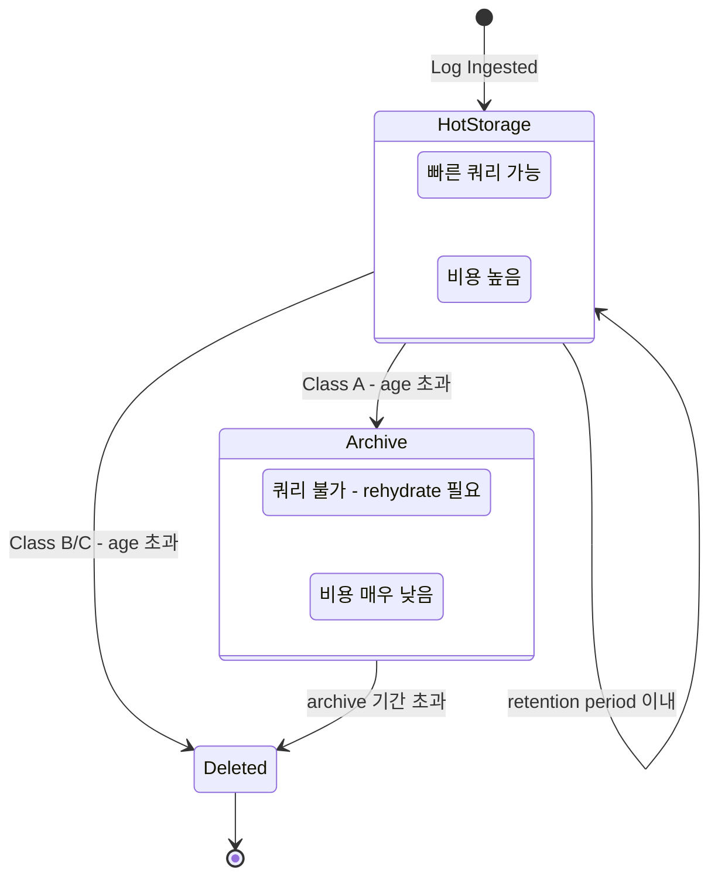
```mermaid
stateDiagram-v2
    [*] --> HotStorage: Log Ingested

    state HotStorage {
        direction LR
        query: 빠른 쿼리 가능
        cost1: 비용 높음
    }

    state Archive {
        direction LR
        rehydrate: 쿼리 불가 - rehydrate 필요
        cost2: 비용 매우 낮음
    }

    HotStorage --> HotStorage: retention period 이내
    HotStorage --> Archive: Class A - age 초과
    HotStorage --> Deleted: Class B/C - age 초과
    Archive --> Deleted: archive 기간 초과
    Deleted --> [*]
```

---

### 1-6. 비용 비교 요약

| 저장소 | 비용 (GB/월) | 쿼리 속도 | 용도 |
| --- | --- | --- | --- |
| Log Analytics (LAW) | ~$2.76 | 즉시 (KQL) | 실시간 모니터링, 디버깅 |
| Blob Cool Tier | ~$0.01 | 복원 필요 (수분) | 중기 보존 (3~6개월) |
| Blob Archive Tier | ~$0.002 | 복원 필요 (수시간) | 장기 보존 (1년+, 컴플라이언스) |

> [!TIP] 핵심 포인트
> 일 10GB 로그 발생 시, 전부 LAW에 30일 보존하면 월 **~$828**, 7일만 LAW + 나머지 Archive로 하면 월 **~$195 + $0.5 = ~$196**. **약 75% 비용 절감**이 가능합니다.

> [!CAUTION] #todo - Section 1: Retain 미결 사항
> **정책 설계**
> - [ ] Class A/B/C 분류 기준을 고객사가 직접 커스터마이징할 수 있어야 하는가? (예: "우리 회사 Performance 로그는 1년 보존 필요")
> - [ ] 하나의 로그가 여러 카테고리에 해당할 때(예: Security + Error) 어떤 Class가 우선인가? 우선순위 규칙 필요
> - [ ] Blob Archive 단계 이전에 Blob Cool 단계를 거치는가, 아니면 바로 Archive로 가는가? 1-6 비용표에는 Cool Tier가 있지만 플로우에는 없음
>
> **실행 로직**
> - [ ] KQL로 대용량 로그를 배치 처리할 때 타임아웃/페이징 처리 전략은? (LAW KQL 최대 쿼리 결과 수 제한 있음)
> - [ ] Blob으로 Export 시 파일 포맷은 무엇인가? (JSON, Parquet 등) — 나중에 다시 분석이 필요할 때 쿼리 가능 포맷인가?
> - [ ] Archive export 후 LAW Purge는 즉시 실행되는가, 아니면 Blob 업로드 확인 후 일정 대기 시간(예: 24시간)이 필요한가?
> - [ ] Agent가 Purge 도중 실패하면? (일부만 삭제된 경우) 멱등성(idempotency) 보장 전략 필요
>
> **운영/모니터링**
> - [ ] Retain이 실패했을 때 Teams 알림이 가는가? 현재 ExecutionReport에 `errorMessage`가 있지만 알림 트리거 로직이 없음
> - [ ] 동일 테넌트에 여러 Agent가 있을 때, 여러 Agent가 같은 LAW에 동시에 Retain 실행되는 것을 막는 잠금(lock) 메커니즘이 필요한가?
> - [ ] 고객사 Blob Storage는 누가 생성하는가? Bicep 템플릿에 포함되는가, 고객사가 사전에 만들어야 하는가?

---

## 2. Prevent (앱 레벨 예방)

어플리케이션 단에서 불필요한 로그 생성을 방지합니다. **로그 볼륨의 70~80%는 Info/Debug 레벨**이므로, 이를 제어하는 것만으로도 비용과 노이즈를 대폭 줄일 수 있습니다.

---

### 2-1. 전체 아키텍처 (Provider + Agent 분리)

Provider가 규칙을 관리하고, Agent가 고객사 LAW를 분석하여 위반 사항을 리포트합니다.

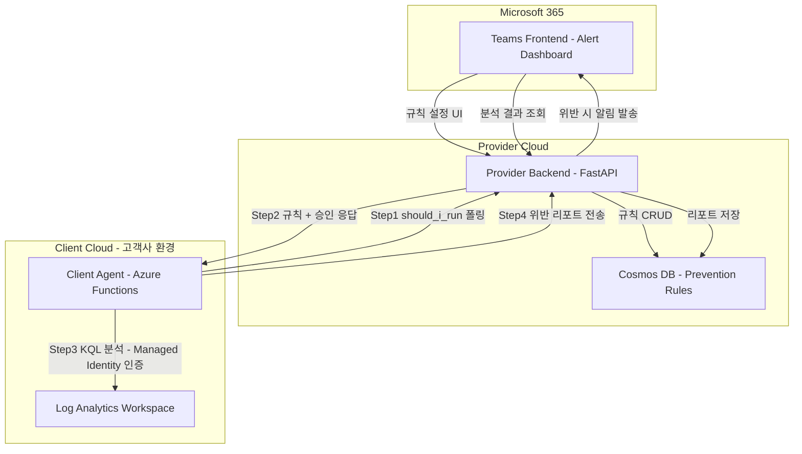
```mermaid
graph TB
    subgraph Microsoft 365
        Teams["Teams Frontend - Alert Dashboard"]
    end

    subgraph Provider Cloud
        PB["Provider Backend - FastAPI"]
        CosmosDB["Cosmos DB - Prevention Rules"]
    end

    subgraph Client Cloud - 고객사 환경
        Agent["Client Agent - Azure Functions"]
        LAW["Log Analytics Workspace"]
    end

    Teams -->|규칙 설정 UI| PB
    PB -->|규칙 CRUD| CosmosDB

    Agent -->|Step1 should_i_run 폴링| PB
    PB -->|Step2 규칙 + 승인 응답| Agent
    Agent -->|Step3 KQL 분석 - Managed Identity 인증| LAW
    Agent -->|Step4 위반 리포트 전송| PB
    PB -->|리포트 저장| CosmosDB

    PB -->|위반 시 알림 발송| Teams
    Teams -->|분석 결과 조회| PB
```

> [!NOTE] 왜 이렇게 짰는가?
> - Prevent는 **로그를 삭제하는 것이 아니라 분석하여 권고**하는 기능입니다. Agent가 분석하고, Provider가 알림을 보냅니다.
> - Agent가 직접 Teams로 알림을 보내지 않습니다. **Provider를 경유**하여 알림을 보냄으로써, 알림 이력을 중앙에서 관리하고 알림 피로를 제어합니다.

---

### 2-2. 규칙 엔진 상세 흐름 (Decision Flow)

Agent가 각 로그 패턴을 어떻게 판단하는지의 상세 흐름입니다.

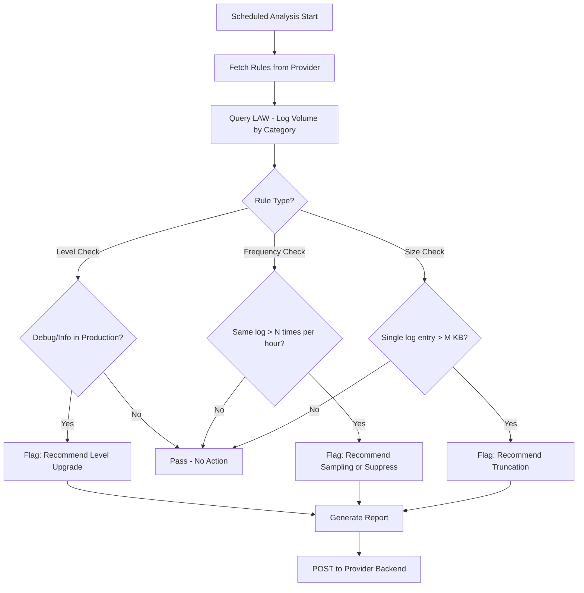
```mermaid
graph TD
    A["Scheduled Analysis Start"] --> B["Fetch Rules from Provider"]
    B --> C["Query LAW - Log Volume by Category"]

    C --> D{"Rule Type?"}

    D -- "Level Check" --> E{"Debug/Info in Production?"}
    D -- "Frequency Check" --> F{"Same log > N times per hour?"}
    D -- "Size Check" --> G{"Single log entry > M KB?"}

    E -- "Yes" --> H["Flag: Recommend Level Upgrade"]
    E -- "No" --> I["Pass - No Action"]

    F -- "Yes" --> J["Flag: Recommend Sampling or Suppress"]
    F -- "No" --> I

    G -- "Yes" --> K["Flag: Recommend Truncation"]
    G -- "No" --> I

    H --> L["Generate Report"]
    J --> L
    K --> L
    L --> M["POST to Provider Backend"]
```

> [!NOTE] 왜 이렇게 짰는가?
> - **세 가지 규칙 타입**: Level Check(1순위), Frequency Check, Size Check
> - 최종 결과는 Provider Backend로 리포트됩니다. Provider가 알림 발송 여부를 판단합니다.

---

### 2-3. 분석 및 알림 시퀀스 (Sequence Diagram)

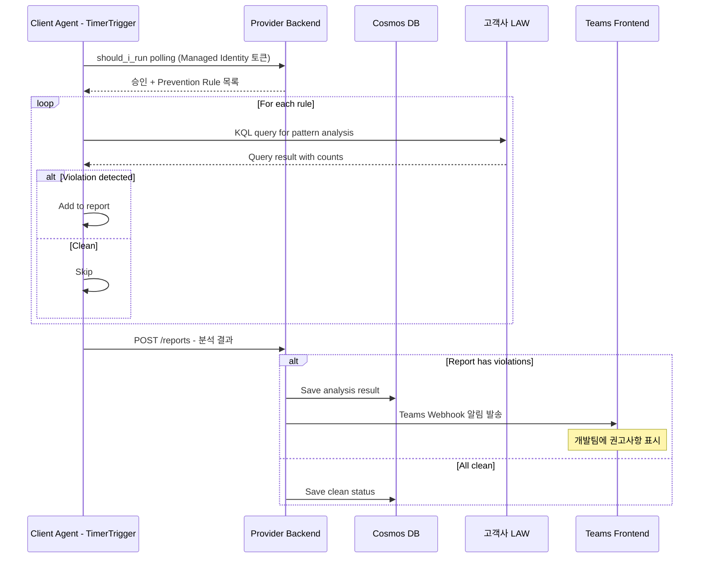
```mermaid
sequenceDiagram
    participant Agent as Client Agent - TimerTrigger
    participant PB as Provider Backend
    participant DB as Cosmos DB
    participant LAW as 고객사 LAW
    participant Teams as Teams Frontend

    Agent->>PB: should_i_run polling (Managed Identity 토큰)
    PB-->>Agent: 승인 + Prevention Rule 목록

    loop For each rule
        Agent->>LAW: KQL query for pattern analysis
        LAW-->>Agent: Query result with counts

        alt Violation detected
            Agent->>Agent: Add to report
        else Clean
            Agent->>Agent: Skip
        end
    end

    Agent->>PB: POST /reports - 분석 결과

    alt Report has violations
        PB->>DB: Save analysis result
        PB->>Teams: Teams Webhook 알림 발송
        Note over Teams: 개발팀에 권고사항 표시
    else All clean
        PB->>DB: Save clean status
    end
```

> [!NOTE] 왜 이렇게 짰는가?
> - **Agent는 분석만, Provider는 판단과 알림**: Agent는 로그를 분석하여 결과를 보내고, 알림 발송은 Provider가 담당합니다. 이렇게 분리해야 알림 피로 제어, 중복 알림 방지 등 중앙 관리가 가능합니다.

---

### 2-4. 규칙 데이터 모델 (Class Diagram)

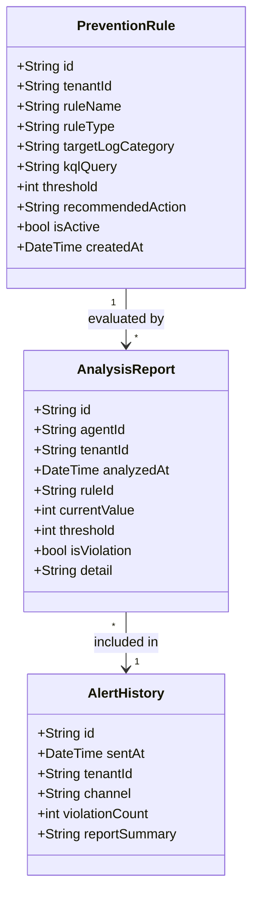
```mermaid
classDiagram
    class PreventionRule {
        +String id
        +String tenantId
        +String ruleName
        +String ruleType
        +String targetLogCategory
        +String kqlQuery
        +int threshold
        +String recommendedAction
        +bool isActive
        +DateTime createdAt
    }

    class AnalysisReport {
        +String id
        +String agentId
        +String tenantId
        +DateTime analyzedAt
        +String ruleId
        +int currentValue
        +int threshold
        +bool isViolation
        +String detail
    }

    class AlertHistory {
        +String id
        +DateTime sentAt
        +String tenantId
        +String channel
        +int violationCount
        +String reportSummary
    }

    PreventionRule "1" --> "*" AnalysisReport : evaluated by
    AnalysisReport "*" --> "1" AlertHistory : included in
```

---

### 2-5. 로그 상태 변화 (State Diagram)

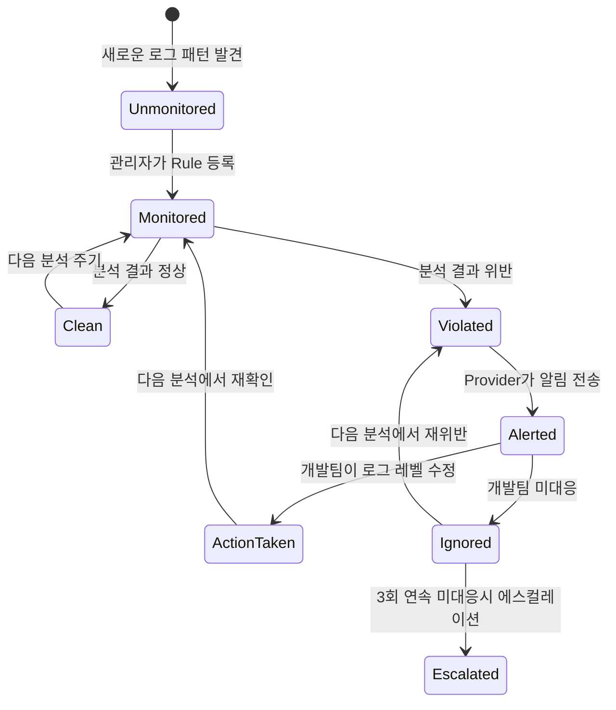
```mermaid
stateDiagram-v2
    [*] --> Unmonitored: 새로운 로그 패턴 발견

    Unmonitored --> Monitored: 관리자가 Rule 등록

    Monitored --> Clean: 분석 결과 정상
    Monitored --> Violated: 분석 결과 위반

    Clean --> Monitored: 다음 분석 주기
    Violated --> Alerted: Provider가 알림 전송
    Alerted --> ActionTaken: 개발팀이 로그 레벨 수정
    Alerted --> Ignored: 개발팀 미대응

    ActionTaken --> Monitored: 다음 분석에서 재확인
    Ignored --> Violated: 다음 분석에서 재위반
    Ignored --> Escalated: 3회 연속 미대응시 에스컬레이션
```

---

### 2-6. 규칙 예시 (참고용)

| Rule Name | Type | Target | Threshold | Action |
| --- | --- | --- | --- | --- |
| debug-in-prod | Level Check | All Resources | Debug level count > 0 | 로그 레벨을 Info 이상으로 상향 권고 |
| high-frequency-log | Frequency | API Gateway | 같은 메시지 > 100/hour | Sampling rate 적용 권고 |
| oversized-entry | Size Check | Backend API | 단일 로그 > 50KB | Payload 로깅 비활성화 권고 |
| unused-trace | Level Check | Batch Jobs | Trace level count > 0 | Trace 로그 제거 권고 |

> [!CAUTION] #todo - Section 2: Prevent 미결 사항
> **규칙 설계**
> - [ ] Prevent 규칙은 누가 어떻게 최초 등록하는가? 초기에 기본 규칙 세트를 Provider가 자동으로 넣어주는가, 아니면 관리자가 처음부터 직접 작성해야 하는가?
> - [ ] threshold 기준값(예: 100/hour)을 어떻게 결정하는가? 고객사마다 트래픽 규모가 달라 동일 기준이 맞지 않을 수 있음
> - [ ] "같은 메시지"의 정의는? 완전 동일 문자열인가, 유사도 기반(예: 80% 이상 동일)인가? 로그 메시지에 타임스탬프/Request ID가 포함되면 매번 달라짐
>
> **알림/대응 흐름**
> - [ ] 에스컬레이션 대상(3회 연속 미대응 시)은 누구인가? 고객사 팀장? Provider 운영팀? 에스컬레이션 채널(Teams/Email)은 어떻게 설정하는가?
> - [ ] 개발팀이 "조치 완료"를 어떻게 표시하는가? Teams에서 버튼 클릭인가, 자동으로 다음 분석 결과가 Clean이면 ActionTaken으로 전환되는가?
> - [ ] Prevent 알림을 받은 개발팀이 코드를 수정하면, 다음 분석 주기(6시간)까지 기다려야 알림이 사라지는가? 즉각 확인 방법이 있어야 할 수 있음
>
> **기술 구현**
> - [ ] KQL로 "같은 로그가 시간당 N건 이상" 집계 시 시간 윈도우 기준은? (Agent 실행 시점 기준 -1시간인가, 절대 시간 기준인가)
> - [ ] Agent가 분석한 로그 볼륨 데이터를 얼마나 상세히 Provider에 보내는가? (카운트만? 대표 샘플 로그도 포함?)

---

## 3. Detect (인프라 레벨 탐지)

앱 단까지 들어온 불량 트래픽을 로그에서 감지하고, 인프라 팀에 차단을 요청하는 **보안 연계 기능**입니다. Prevent가 "로그 품질"에 집중한다면, Detect는 "로그 속 보안 위협"에 집중합니다.

---

### 3-1. 전체 아키텍처 (Provider + Agent 분리)

Agent가 고객사 LAW에서 위협을 탐지하고, Provider가 인시던트를 관리합니다.

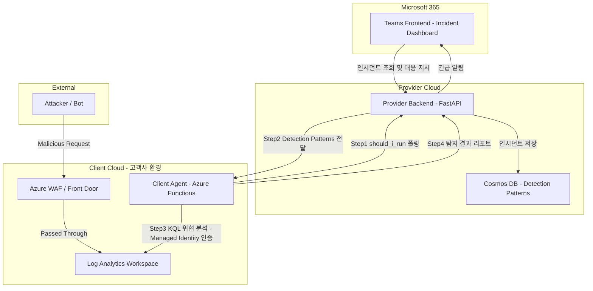
```mermaid
graph TB
    subgraph Microsoft 365
        Teams["Teams Frontend - Incident Dashboard"]
    end

    subgraph Provider Cloud
        PB["Provider Backend - FastAPI"]
        CosmosDB["Cosmos DB - Detection Patterns"]
    end

    subgraph Client Cloud - 고객사 환경
        Agent["Client Agent - Azure Functions"]
        LAW["Log Analytics Workspace"]
        WAF["Azure WAF / Front Door"]
    end

    subgraph External
        Attacker["Attacker / Bot"]
    end

    Attacker -->|Malicious Request| WAF
    WAF -->|Passed Through| LAW

    Agent -->|Step1 should_i_run 폴링| PB
    PB -->|Step2 Detection Patterns 전달| Agent
    Agent -->|Step3 KQL 위협 분석 - Managed Identity 인증| LAW
    Agent -->|Step4 탐지 결과 리포트| PB

    PB -->|인시던트 저장| CosmosDB
    PB -->|긴급 알림| Teams
    Teams -->|인시던트 조회 및 대응 지시| PB
```

> [!NOTE] 왜 이렇게 짰는가?
> - **Agent는 탐지만, Provider는 인시던트 관리**: Agent가 직접 WAF 룰을 변경하지 않습니다. 탐지 결과를 Provider에 보고하면, 인프라 팀이 Teams 대시보드에서 확인 후 WAF를 수동 업데이트합니다. 이는 **오탐에 의한 잘못된 차단을 방지**하기 위함입니다.
> - **30분 주기 폴링**: 보안 위협은 빠른 감지가 중요하므로, Retain(24h)이나 Prevent(6h)보다 짧은 주기로 실행합니다.

---

### 3-2. 탐지 규칙 판단 흐름 (Decision Flow)

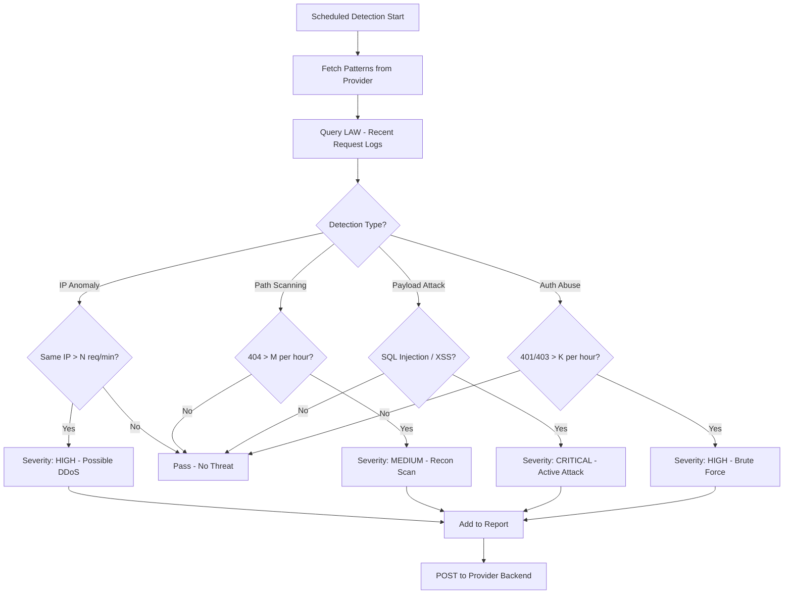
```mermaid
graph TD
    A["Scheduled Detection Start"] --> B["Fetch Patterns from Provider"]
    B --> C["Query LAW - Recent Request Logs"]

    C --> D{"Detection Type?"}

    D -- "IP Anomaly" --> E{"Same IP > N req/min?"}
    D -- "Path Scanning" --> F{"404 > M per hour?"}
    D -- "Payload Attack" --> G{"SQL Injection / XSS?"}
    D -- "Auth Abuse" --> H{"401/403 > K per hour?"}

    E -- "Yes" --> I["Severity: HIGH - Possible DDoS"]
    E -- "No" --> J["Pass - No Threat"]

    F -- "Yes" --> K["Severity: MEDIUM - Recon Scan"]
    F -- "No" --> J

    G -- "Yes" --> L["Severity: CRITICAL - Active Attack"]
    G -- "No" --> J

    H -- "Yes" --> M["Severity: HIGH - Brute Force"]
    H -- "No" --> J

    I --> N["Add to Report"]
    K --> N
    L --> N
    M --> N
    N --> O["POST to Provider Backend"]
```

---

### 3-3. 탐지 및 인시던트 시퀀스 (Sequence Diagram)

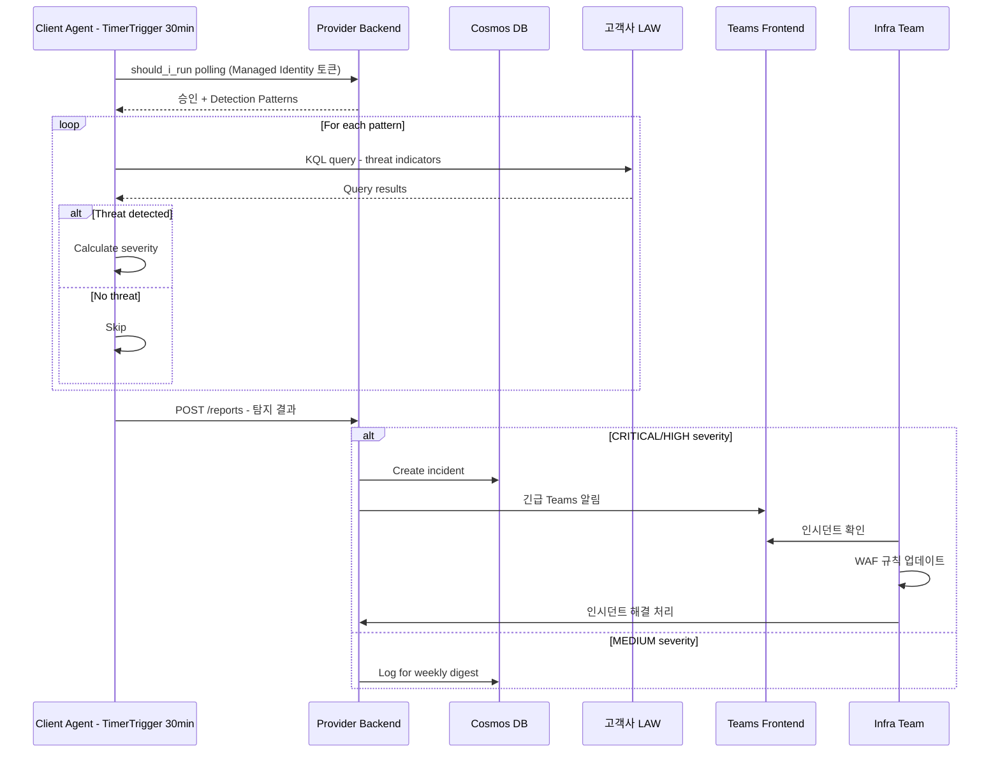
```mermaid
sequenceDiagram
    participant Agent as Client Agent - TimerTrigger 30min
    participant PB as Provider Backend
    participant DB as Cosmos DB
    participant LAW as 고객사 LAW
    participant Teams as Teams Frontend
    participant Infra as Infra Team

    Agent->>PB: should_i_run polling (Managed Identity 토큰)
    PB-->>Agent: 승인 + Detection Patterns

    loop For each pattern
        Agent->>LAW: KQL query - threat indicators
        LAW-->>Agent: Query results

        alt Threat detected
            Agent->>Agent: Calculate severity
        else No threat
            Agent->>Agent: Skip
        end
    end

    Agent->>PB: POST /reports - 탐지 결과

    alt CRITICAL/HIGH severity
        PB->>DB: Create incident
        PB->>Teams: 긴급 Teams 알림
        Infra->>Teams: 인시던트 확인
        Infra->>Infra: WAF 규칙 업데이트
        Infra->>PB: 인시던트 해결 처리
    else MEDIUM severity
        PB->>DB: Log for weekly digest
    end
```

---

### 3-4. 탐지 데이터 모델 (Class Diagram)

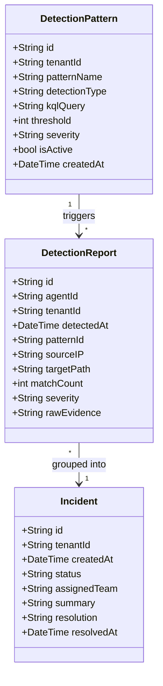
```mermaid
classDiagram
    class DetectionPattern {
        +String id
        +String tenantId
        +String patternName
        +String detectionType
        +String kqlQuery
        +int threshold
        +String severity
        +bool isActive
        +DateTime createdAt
    }

    class DetectionReport {
        +String id
        +String agentId
        +String tenantId
        +DateTime detectedAt
        +String patternId
        +String sourceIP
        +String targetPath
        +int matchCount
        +String severity
        +String rawEvidence
    }

    class Incident {
        +String id
        +String tenantId
        +DateTime createdAt
        +String status
        +String assignedTeam
        +String summary
        +String resolution
        +DateTime resolvedAt
    }

    DetectionPattern "1" --> "*" DetectionReport : triggers
    DetectionReport "*" --> "1" Incident : grouped into
```

---

### 3-5. 인시던트 생명주기 (State Diagram)

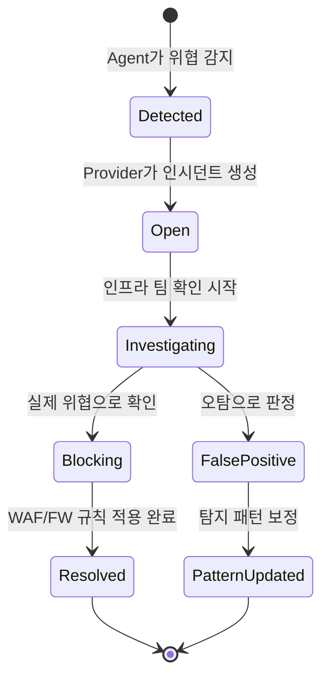
```mermaid
stateDiagram-v2
    [*] --> Detected: Agent가 위협 감지

    Detected --> Open: Provider가 인시던트 생성
    Open --> Investigating: 인프라 팀 확인 시작

    Investigating --> Blocking: 실제 위협으로 확인
    Investigating --> FalsePositive: 오탐으로 판정

    Blocking --> Resolved: WAF/FW 규칙 적용 완료
    FalsePositive --> PatternUpdated: 탐지 패턴 보정

    Resolved --> [*]
    PatternUpdated --> [*]
```

---

### 3-6. 탐지 규칙 예시 (참고용)

| Pattern Name | Type | KQL 핵심 로직 | Threshold | Severity |
| --- | --- | --- | --- | --- |
| ddos-suspect | IP Anomaly | 동일 IP에서 분당 요청 수 집계 | 500 req/min | HIGH |
| path-scanner | Path Scanning | 동일 소스에서 404 응답 시간당 집계 | 50 per hour | MEDIUM |
| sql-injection | Payload Attack | URL에 UNION SELECT 등 패턴 매칭 | 1회 이상 | CRITICAL |
| brute-force | Auth Abuse | 동일 소스에서 401 응답 시간당 집계 | 30 per hour | HIGH |
| suspicious-ua | IP Anomaly | User-Agent가 공격 도구 이름 포함 | 1회 이상 | MEDIUM |

> [!CAUTION] #todo - Section 3: Detect 미결 사항
> **탐지 정확도**
> - [ ] WAF 로그와 App 로그를 동시에 분석하는가, 아니면 App 로그만 보는가? WAF 로그는 별도 LAW 테이블에 저장됨
> - [ ] SQL Injection 패턴 매칭 시 인코딩된 공격(URL 인코딩, Base64)도 탐지하는가? KQL에서 디코딩 처리 필요
> - [ ] 정상 트래픽이 threshold를 초과하는 경우(예: 배포 직후 트래픽 급증, 마케팅 이벤트)를 어떻게 구분하는가? 화이트리스트/예외 기간 설정 필요
>
> **인시던트 관리**
> - [ ] 인시던트를 누가 받아서 처리하는가? 고객사 인프라 팀? Provider 팀? Teams 채널 라우팅 설정이 필요
> - [ ] 같은 IP에서 여러 공격 패턴이 동시에 감지되면 인시던트를 하나로 묶는 로직은? (현재 DetectionReport → Incident 1:N이지만 그룹핑 기준 불명확)
> - [ ] 인시던트 해결(Resolved) 후에도 같은 IP에서 공격이 재발하면 어떻게 처리하는가?
>
> **기술 구현**
> - [ ] 30분 안에 CRITICAL 탐지 시 즉시 알림이 가야 하는데, 현재는 분석 완료 후 Provider에 리포트 → 알림 순서임. 탐지 즉시 QueueTrigger로 긴급 알림하는 방법 고려 필요
> - [ ] 고객사 WAF 규칙 자동 업데이트는 장기적으로 가능한가? (현재는 사람이 수동 업데이트) 관련 Azure API 권한 필요

---

## 4. Filter (필터링)

원본 로그를 삭제하지 않고, **수집 파이프라인 단계에서 노이즈를 걸러내는 기능**입니다. 다른 3개 기능이 이미 수집된 로그를 후처리하는 반면, Filter는 **수집 시점에 개입**하여 불필요한 로그가 LAW에 들어오는 것 자체를 차단합니다.

---

### 4-1. 전체 아키텍처 (Provider + Agent 분리)

Provider가 필터 규칙을 관리하고, Agent가 고객사 DCR에 규칙을 적용합니다.

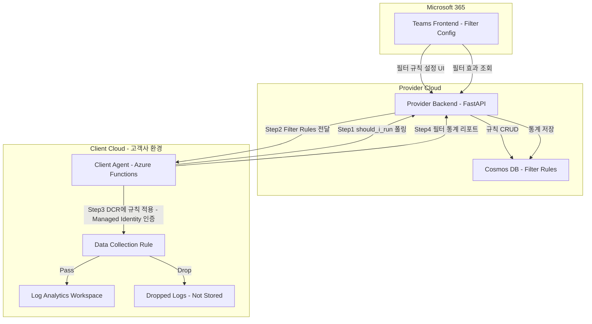
```mermaid
graph TB
    subgraph Microsoft 365
        Teams["Teams Frontend - Filter Config"]
    end

    subgraph Provider Cloud
        PB["Provider Backend - FastAPI"]
        CosmosDB["Cosmos DB - Filter Rules"]
    end

    subgraph Client Cloud - 고객사 환경
        Agent["Client Agent - Azure Functions"]
        DCR["Data Collection Rule"]
        LAW["Log Analytics Workspace"]
        Trash["Dropped Logs - Not Stored"]
    end

    Teams -->|필터 규칙 설정 UI| PB
    PB -->|규칙 CRUD| CosmosDB

    Agent -->|Step1 should_i_run 폴링| PB
    PB -->|Step2 Filter Rules 전달| Agent
    Agent -->|Step3 DCR에 규칙 적용 - Managed Identity 인증| DCR
    DCR -->|Pass| LAW
    DCR -->|Drop| Trash
    Agent -->|Step4 필터 통계 리포트| PB
    PB -->|통계 저장| CosmosDB
    Teams -->|필터 효과 조회| PB
```

> [!NOTE] 왜 이렇게 짰는가?
> - **Agent가 DCR을 제어**: 고객사 환경의 DCR은 고객사 Managed Identity로만 접근 가능합니다. Provider가 직접 건드릴 수 없으므로 Agent가 대행합니다.
> - **우선순위가 최하인 이유**: Retain/Prevent/Detect가 안정화된 후에 적용해야 합니다. 섣부른 필터링은 중요한 로그를 유실시킬 위험이 있기 때문입니다.
> - **필터 통계 리포트**: Agent가 얼마나 많은 로그를 차단했는지 Provider에 보고하여, Teams 대시보드에서 효과를 모니터링합니다.

---

### 4-2. 필터 파이프라인 상세 흐름 (Decision Flow)

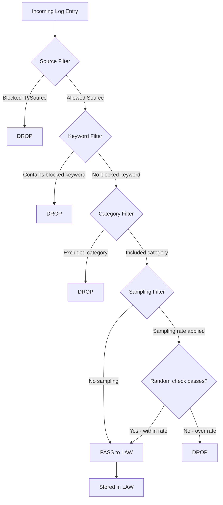
```mermaid
graph TD
    A["Incoming Log Entry"] --> B{"Source Filter"}

    B -- "Blocked IP/Source" --> DROP1["DROP"]
    B -- "Allowed Source" --> C{"Keyword Filter"}

    C -- "Contains blocked keyword" --> DROP2["DROP"]
    C -- "No blocked keyword" --> D{"Category Filter"}

    D -- "Excluded category" --> DROP3["DROP"]
    D -- "Included category" --> E{"Sampling Filter"}

    E -- "Sampling rate applied" --> F{"Random check passes?"}
    E -- "No sampling" --> G["PASS to LAW"]

    F -- "Yes - within rate" --> G
    F -- "No - over rate" --> DROP4["DROP"]

    G --> H["Stored in LAW"]
```

---

### 4-3. 필터 적용 시퀀스 (Sequence Diagram)

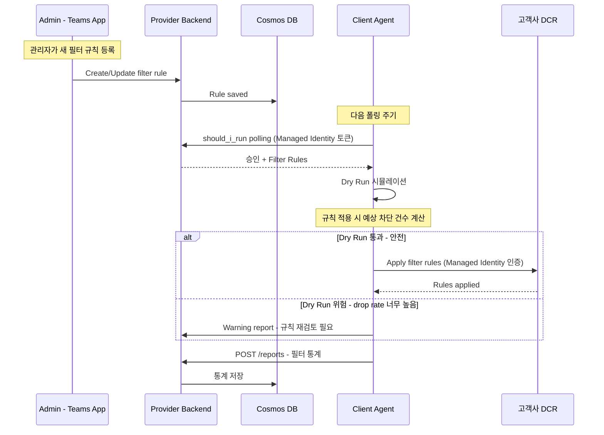
```mermaid
sequenceDiagram
    participant Admin as Admin - Teams App
    participant PB as Provider Backend
    participant DB as Cosmos DB
    participant Agent as Client Agent
    participant DCR as 고객사 DCR

    Note over Admin: 관리자가 새 필터 규칙 등록
    Admin->>PB: Create/Update filter rule
    PB->>DB: Rule saved

    Note over Agent: 다음 폴링 주기
    Agent->>PB: should_i_run polling (Managed Identity 토큰)
    PB-->>Agent: 승인 + Filter Rules

    Agent->>Agent: Dry Run 시뮬레이션
    Note over Agent: 규칙 적용 시 예상 차단 건수 계산

    alt Dry Run 통과 - 안전
        Agent->>DCR: Apply filter rules (Managed Identity 인증)
        DCR-->>Agent: Rules applied
    else Dry Run 위험 - drop rate 너무 높음
        Agent->>PB: Warning report - 규칙 재검토 필요
    end

    Agent->>PB: POST /reports - 필터 통계
    PB->>DB: 통계 저장
```

> [!NOTE] 왜 이렇게 짰는가?
> - **Dry Run 자동 실행**: Agent가 규칙을 적용하기 전에 시뮬레이션을 돌려 예상 차단 건수를 계산합니다. 너무 많은 로그가 차단될 것으로 예상되면 Provider에 경고를 보냅니다.
> - **DCR 직접 제어**: Agent가 고객사 DCR에 Managed Identity 인증으로 접근하여 필터 규칙을 적용합니다.

---

### 4-4. 필터 규칙 데이터 모델 (Class Diagram)

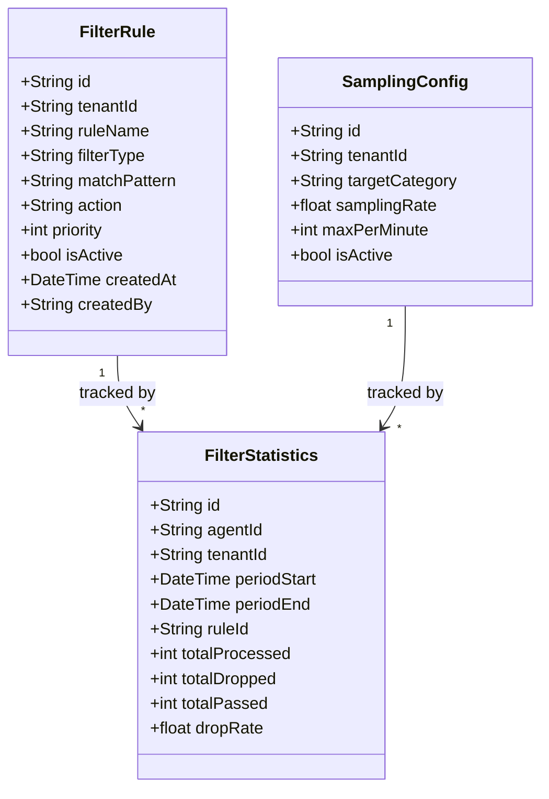
```mermaid
classDiagram
    class FilterRule {
        +String id
        +String tenantId
        +String ruleName
        +String filterType
        +String matchPattern
        +String action
        +int priority
        +bool isActive
        +DateTime createdAt
        +String createdBy
    }

    class FilterStatistics {
        +String id
        +String agentId
        +String tenantId
        +DateTime periodStart
        +DateTime periodEnd
        +String ruleId
        +int totalProcessed
        +int totalDropped
        +int totalPassed
        +float dropRate
    }

    class SamplingConfig {
        +String id
        +String tenantId
        +String targetCategory
        +float samplingRate
        +int maxPerMinute
        +bool isActive
    }

    FilterRule "1" --> "*" FilterStatistics : tracked by
    SamplingConfig "1" --> "*" FilterStatistics : tracked by
```

---

### 4-5. 필터 규칙 생명주기 (State Diagram)

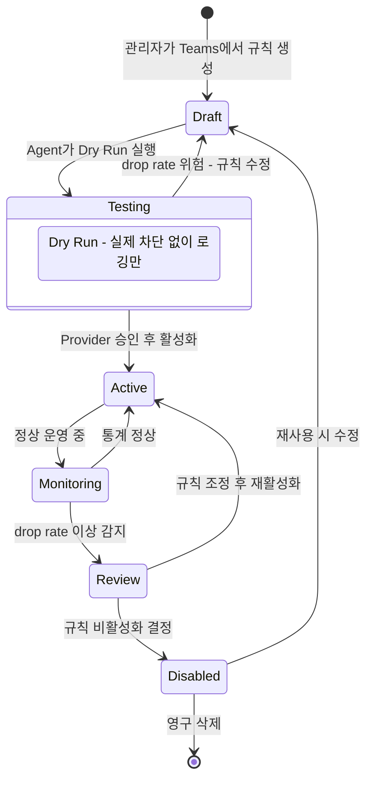
```mermaid
stateDiagram-v2
    [*] --> Draft: 관리자가 Teams에서 규칙 생성

    Draft --> Testing: Agent가 Dry Run 실행

    state Testing {
        direction LR
        DryRun: Dry Run - 실제 차단 없이 로깅만
    }

    Testing --> Active: Provider 승인 후 활성화
    Testing --> Draft: drop rate 위험 - 규칙 수정

    Active --> Monitoring: 정상 운영 중
    Monitoring --> Active: 통계 정상

    Monitoring --> Review: drop rate 이상 감지
    Review --> Active: 규칙 조정 후 재활성화
    Review --> Disabled: 규칙 비활성화 결정

    Disabled --> Draft: 재사용 시 수정
    Disabled --> [*]: 영구 삭제
```

---

### 4-6. 필터 규칙 예시 (참고용)

| Rule Name | Type | Match Pattern | Action | 예상 효과 |
| --- | --- | --- | --- | --- |
| block-healthcheck | Keyword | "health check", "readiness" | DROP | health check 로그 100% 제거 |
| block-k8s-internal | Category | kube-system namespace 로그 | DROP | K8s 내부 로그 제거 |
| block-crawler-ips | Source | 알려진 봇/크롤러 IP 리스트 | DROP | 봇 트래픽 로그 제거 |
| sample-verbose-api | Sampling | /api/v1/status 경로 로그 | 10% SAMPLE | 반복적인 status API 로그 90% 감소 |
| block-static-assets | Keyword | ".css", ".js", ".png" | DROP | 정적 파일 요청 로그 제거 |

> [!CAUTION] #todo - Section 4: Filter 미결 사항
> **DCR 제어 방식**
> - [ ] Azure DCR API를 통해 Agent가 필터 규칙을 동적으로 추가/수정/삭제할 수 있는가? DCR 수정에 필요한 Managed Identity 권한 범위 확인 필요 (Monitoring Contributor 이상 필요)
> - [ ] DCR에서 지원하는 필터 표현식의 한계는? (KQL 서브셋만 지원, 복잡한 정규식 불가 등) 현재 플로우가 DCR 기능 범위 내에서 가능한지 검증 필요
> - [ ] DCR이 없는 고객사(기존에 Diagnostic Settings만 사용)는 어떻게 처리하는가? Agent가 DCR을 새로 생성하는가?
>
> **안전성**
> - [ ] 필터 규칙 적용 후 실제로 LAW에서 로그가 빠지고 있음을 어떻게 검증하는가? (Dry Run과 실제 적용 결과 비교 메커니즘)
> - [ ] drop rate 급증 감지 기준은 무엇인가? (예: 전일 대비 20% 이상 증가 시 Review 상태로 전환) 기준값을 누가 설정하는가?
> - [ ] 필터가 적용된 상태에서 보안 사고 조사를 위해 "필터를 임시로 꺼야" 하는 상황은? 긴급 필터 비활성화 절차 필요
>
> **운영**
> - [ ] Sampling Filter의 "랜덤" 샘플링 방식은? (단순 확률, 시간 기반 토큰 버킷 등) 동일 요청이 항상 샘플링되도록 Request ID 기반 결정적 샘플링이 필요할 수 있음
> - [ ] Filter 통계 리포트 주기는? 실시간으로 보내는가, 아니면 배치로 보내는가?

---

## 5. LLM Intelligence Layer (지능형 분류 엔진)

4개 엔진의 **규칙을 자동 생성/제안**하는 상위 레이어입니다. 기존에는 관리자가 직접 KQL 쿼리와 분류 기준을 작성해야 했지만, LLM을 도입하면 Agent가 로그를 자동 분석하여 **"이 로그는 Class A로 분류하는 게 좋겠다"** 같은 제안(Suggestion)을 생성합니다. 운영자는 Teams에서 승인/거부만 하면 됩니다.

> [!IMPORTANT] 핵심 원칙
> - LLM은 **Agent 안에서** 실행됩니다. 고객사 로그 원본이 Provider(외부)로 나가지 않습니다.
> - LLM은 **자동 실행하지 않고 제안만** 합니다. 반드시 사람이 승인해야 정책에 반영됩니다 (Human-in-the-loop).

---

### 5-1. 전체 아키텍처 (LLM 위치)

LLM이 Agent 안에서 동작하고, 분류 결과만 Provider로 전달되는 구조입니다.

```mermaid
graph TB
    subgraph Microsoft 365
        Teams["Teams Frontend - Suggestion 승인 UI"]
    end

    subgraph Provider Cloud
        PB["Provider Backend - FastAPI"]
        CosmosDB["Cosmos DB - Suggestions"]
    end

    subgraph Client Cloud - 고객사 환경
        Agent["Client Agent - Azure Functions"]
        AOAI["Azure OpenAI - 고객사 리소스"]
        LAW["Log Analytics Workspace"]
    end

    Agent -->|Step1 로그 샘플 수집 - Managed Identity| LAW
    Agent -->|Step2 분류 요청 - Managed Identity| AOAI
    AOAI -->|분류 결과 반환| Agent
    Agent -->|Step3 Suggestion 전송 - 원본 로그 X| PB
    PB -->|Suggestion 저장 - status pending| CosmosDB

    Teams -->|pending 목록 조회| PB
    Teams -->|승인/거부/수정| PB
    PB -->|승인 시 정책 반영| CosmosDB
```

> [!NOTE] 왜 이렇게 짰는가?
> - **Azure OpenAI가 고객사 구독에 배포됩니다.** 로그 원본이 고객사 환경을 벗어나지 않아 데이터 주권을 보장합니다.
> - **Provider에는 메타데이터만 전송**: "AppGW 로그, Security 카테고리, Class A 추천, 신뢰도 0.92" 같은 분류 결과만 보냅니다. 실제 로그 내용은 전송하지 않습니다.
> - **Suggestion(제안) 패턴**: LLM이 직접 정책을 변경하지 않고, "이렇게 하면 어떻겠습니까?" 형태로 제안합니다. 운영자가 Teams에서 검토 후 승인하면 그때 실제 정책에 반영됩니다.

---

### 5-2. LLM 분석 흐름 (Decision Flow)

Agent가 로그 샘플을 LLM에 보내고, 결과를 Suggestion으로 변환하는 흐름입니다.

```mermaid
graph TD
    A["TimerTrigger - LLM 분석 주기"] --> B["LAW에서 최근 로그 샘플 수집"]
    B --> C["대표 로그 100건 추출 - 비용 절감"]

    C --> D["Azure OpenAI API 호출"]
    D --> E["LLM 분류 결과 수신"]

    E --> F{"Suggestion Type?"}

    F -- "새 보존 정책 제안" --> G["Retain Suggestion 생성"]
    F -- "로그 레벨 이상 감지" --> H["Prevent Suggestion 생성"]
    F -- "보안 위협 패턴 감지" --> I["Detect Suggestion 생성"]
    F -- "노이즈 로그 패턴 감지" --> J["Filter Suggestion 생성"]

    G --> K["POST to Provider - status pending"]
    H --> K
    I --> K
    J --> K
```

> [!NOTE] 왜 이렇게 짰는가?
> - **샘플링 전략**: 매번 모든 로그를 LLM에 보내면 비용이 폭발합니다. 최근 1시간 로그 중 **대표 100건만 추출**하여 분석합니다. 카테고리별/severity별로 균등 샘플링합니다.
> - **4개 엔진 모두에 대해 제안 생성**: LLM이 "이 로그는 보존 가치가 높다(Retain)", "이 패턴이 비정상이다(Detect)" 등을 동시에 판단하여 각 엔진에 맞는 Suggestion을 생성합니다.

---

### 5-3. Suggestion 승인 시퀀스 (Sequence Diagram)

LLM 분석부터 운영자 승인, 최종 정책 반영까지의 전체 흐름입니다.

```mermaid
sequenceDiagram
    participant Agent as Client Agent
    participant AOAI as Azure OpenAI - 고객사
    participant PB as Provider Backend
    participant DB as Cosmos DB
    participant Teams as Teams Frontend
    participant Admin as 운영자

    Agent->>Agent: LAW에서 로그 샘플 100건 수집
    Agent->>AOAI: 로그 분류 요청 (Managed Identity 인증)
    AOAI-->>Agent: 분류 결과 반환

    loop For each classification
        Agent->>Agent: Suggestion 객체 생성
    end

    Agent->>PB: POST /suggestions - 메타데이터만 전송
    PB->>DB: Suggestions 저장 (status: pending)

    Admin->>Teams: 대시보드 접속
    Teams->>PB: GET /suggestions?status=pending
    PB-->>Teams: pending Suggestion 목록

    Admin->>Teams: Suggestion 상세 확인

    alt 승인
        Admin->>Teams: 승인 클릭
        Teams->>PB: PATCH /suggestions/id (status: approved)
        PB->>DB: 해당 정책 자동 생성 (RetentionPolicy 등)
        PB-->>Teams: 정책 반영 완료
    else 수정 후 승인
        Admin->>Teams: threshold 값 수정 후 승인
        Teams->>PB: PATCH /suggestions/id (수정된 값 + approved)
        PB->>DB: 수정된 값으로 정책 생성
    else 거부
        Admin->>Teams: 거부 + 사유 입력
        Teams->>PB: PATCH /suggestions/id (status: rejected, reason)
        PB->>DB: 거부 이력 저장
        Note over DB: 거부 사유는 LLM 프롬프트 개선에 활용
    end
```

> [!NOTE] 왜 이렇게 짰는가?
> - **Human-in-the-loop**: LLM이 아무리 정확해도 100%는 아닙니다. 운영자가 반드시 검토하는 단계가 있어야 잘못된 정책이 적용되는 것을 방지합니다.
> - **수정 후 승인**: "LLM이 threshold를 50으로 제안했는데 100이 더 적절하다" 같은 경우, 운영자가 값을 조정하여 승인할 수 있습니다.
> - **거부 사유 활용**: 거부된 Suggestion의 사유를 축적하면, LLM 프롬프트를 점진적으로 개선하여 정확도를 높일 수 있습니다.

---

### 5-4. Suggestion 데이터 모델 (Class Diagram)

```mermaid
classDiagram
    class Suggestion {
        +String id
        +String agentId
        +String tenantId
        +DateTime createdAt
        +String targetEngine
        +String suggestionType
        +String summary
        +float confidence
        +String status
        +String reviewedBy
        +DateTime reviewedAt
        +String rejectReason
    }

    class SuggestionDetail {
        +String id
        +String suggestionId
        +String logCategory
        +String recommendedClass
        +int recommendedThreshold
        +String recommendedAction
        +String evidence
    }

    class LLMConfig {
        +String id
        +String tenantId
        +String modelDeployment
        +String systemPrompt
        +int sampleSize
        +String analysisSchedule
        +bool isActive
    }

    Suggestion "1" --> "*" SuggestionDetail : contains
    LLMConfig "1" --> "*" Suggestion : generates
```

> [!NOTE] 왜 이렇게 짰는가?
> - **confidence (신뢰도)**: LLM이 분류 결과에 대한 확신도를 0.0~1.0으로 반환합니다. 신뢰도가 0.8 미만이면 Teams에서 경고 표시를 하여 운영자가 더 신중하게 검토하도록 합니다.
> - **targetEngine**: 이 Suggestion이 Retain/Prevent/Detect/Filter 중 어느 엔진에 대한 제안인지 구분합니다.
> - **LLMConfig**: 테넌트별로 LLM 설정(모델, 프롬프트, 샘플 크기 등)을 다르게 관리할 수 있습니다.
> - **evidence**: "왜 이렇게 분류했는지" LLM의 근거를 저장합니다. 운영자가 승인/거부 판단에 참고합니다.

---

### 5-5. Suggestion 생명주기 (State Diagram)

```mermaid
stateDiagram-v2
    [*] --> Created: Agent LLM이 제안 생성

    Created --> Pending: Provider에 전송 완료

    Pending --> Approved: 운영자 승인
    Pending --> Modified: 운영자 수정 후 승인
    Pending --> Rejected: 운영자 거부
    Pending --> Expired: 7일 내 미검토시 자동 만료

    Approved --> Applied: 실제 정책에 반영
    Modified --> Applied: 수정된 값으로 정책 반영

    Applied --> [*]
    Rejected --> [*]
    Expired --> [*]
```

> [!NOTE] 왜 이렇게 짰는가?
> - **Expired 상태**: Suggestion이 7일 이상 방치되면 자동 만료됩니다. 오래된 분석 결과는 현재 상황과 맞지 않을 수 있으므로, 새로운 분석이 필요합니다.
> - **Modified 분리**: 단순 승인과 수정 후 승인을 구분하여, LLM의 원래 제안과 운영자가 실제 적용한 값의 차이를 추적합니다. 이 데이터가 LLM 정확도 개선의 핵심 피드백입니다.

---

### 5-6. 비용 절감 전략

| 전략 | 설명 | 예상 효과 |
| --- | --- | --- |
| 로그 샘플링 | 전체 로그 대신 대표 100건만 분석 | API 호출 비용 99% 감소 |
| 분석 주기 조절 | 매 30분이 아닌 6~24시간 주기 | 호출 횟수 감소 |
| 캐시 활용 | 이미 분류된 패턴은 재분석 안 함 | 중복 분석 방지 |
| 모델 선택 | GPT-4o-mini 사용 (가벼운 분류 작업) | GPT-4o 대비 비용 90% 절감 |

---

### 5-7. 단계별 도입 계획

| 단계 | 적용 대상 | LLM 역할 | 난이도 |
| --- | --- | --- | --- |
| 1단계 | Prevent | "이 로그 레벨 너무 낮다" 자동 감지 | 낮음 |
| 2단계 | Detect | "이 트래픽 패턴 의심스럽다" 이상 탐지 | 중간 |
| 3단계 | Retain | "이 로그는 Class A로 장기 보존해야 한다" 분류 | 중간 |
| 4단계 | Filter | "이 로그는 노이즈다, 필터 규칙 추가" 제안 | 높음 |

> [!CAUTION] #todo - Section 5: LLM Intelligence Layer 미결 사항
> **모델/인프라**
> - [ ] 고객사마다 Azure OpenAI 리소스를 별도 배포해야 하는가? Bicep 템플릿에 포함되는가? 비용은 고객사가 부담하는가?
> - [ ] Azure OpenAI API 호출 실패(throttling, 서비스 장애) 시 Agent는 어떻게 처리하는가? LLM 분석 없이 기존 규칙 기반으로 폴백하는가?
> - [ ] 고객사 데이터 레지던시(Data Residency) 요건이 있을 경우, Azure OpenAI 리전을 고객사 LAW와 동일 리전에 배포해야 함 — 자동화 가능한가?
>
> **프롬프트/정확도**
> - [ ] 시스템 프롬프트(LLMConfig.systemPrompt)는 누가 작성하는가? 고객사별로 커스터마이징할 수 있는가?
> - [ ] 거부 이력(reject reason)을 LLM 프롬프트 개선에 어떻게 활용하는가? 자동으로 few-shot 예시에 추가하는 파이프라인이 필요함
> - [ ] 신뢰도(confidence) 0.8 미만 기준은 어떻게 산출하는가? LLM이 직접 반환하는가, 아니면 별도 계산 로직이 있는가?
>
> **운영/비용**
> - [ ] LLM 분석 비용을 어떻게 고객사에 청구하는가? (사용량 기반? 구독 요금에 포함?)
> - [ ] Suggestion은 7일 후 자동 만료인데, 7일이 지나기 전에 미검토 Suggestion이 쌓이면 Teams에서 알림을 주는가?
> - [ ] 4개 엔진에 대해 동시에 Suggestion을 생성하면 운영자가 처리해야 할 건수가 너무 많아질 수 있음 — 우선순위 기반 정렬 또는 자동 필터링 필요

---

## 6. Rollback & Change History (변경 이력 및 원복)

Log Doctor가 고객사 LAW/DCR 설정을 변경한 모든 이력을 기록하고, 문제 발생 시 **원래 상태로 되돌릴 수 있는 안전장치**입니다. 모든 엔진(Retain/Prevent/Detect/Filter)의 변경에 대해 공통으로 적용됩니다.

> [!IMPORTANT] 핵심 원칙
> - Agent가 고객사 환경에 변경을 가하기 **전에 반드시 스냅샷**을 저장합니다.
> - 운영자는 Teams에서 **원클릭 원복**이 가능합니다.

---

### 6-1. 전체 아키텍처 (Rollback 흐름)

```mermaid
graph TB
    subgraph Microsoft 365
        Teams["Teams Frontend - 변경 이력 UI"]
    end

    subgraph Provider Cloud
        PB["Provider Backend - FastAPI"]
        CosmosDB["Cosmos DB - ConfigSnapshot"]
    end

    subgraph Client Cloud - 고객사 환경
        Agent["Client Agent - Azure Functions"]
        LAW["Log Analytics Workspace"]
        DCR["Data Collection Rule"]
    end

    Agent -->|Step1 변경 전 상태 스냅샷| PB
    PB -->|스냅샷 저장| CosmosDB
    Agent -->|Step2 변경 적용 - Managed Identity| LAW
    Agent -->|Step2 변경 적용 - Managed Identity| DCR
    Agent -->|Step3 변경 완료 리포트| PB

    Teams -->|변경 이력 조회| PB
    Teams -->|원복 요청| PB
    PB -->|beforeState 조회| CosmosDB
    PB -->|원복 지시| Agent
    Agent -->|beforeState로 복원| LAW
    Agent -->|beforeState로 복원| DCR
```

> [!NOTE] 왜 이렇게 짰는가?
> - **변경 전 스냅샷 필수**: Agent가 설정을 바꾸기 전에 현재 상태를 Provider에 먼저 보냅니다. 이렇게 해야 "원래 어떤 상태였는지" 알 수 있습니다.
> - **Provider 경유 원복**: 운영자가 Teams에서 "원복" 클릭하면, Provider가 스냅샷에서 beforeState를 읽어 Agent에게 전달합니다. Agent가 직접 DB를 읽지 않습니다.

---

### 6-2. 변경 적용 + 스냅샷 시퀀스 (Sequence Diagram)

모든 엔진에 공통으로 적용되는 변경 → 스냅샷 → 원복 흐름입니다.

```mermaid
sequenceDiagram
    participant Agent as Client Agent
    participant PB as Provider Backend
    participant DB as Cosmos DB
    participant LAW as 고객사 LAW / DCR
    participant Teams as Teams Frontend
    participant Admin as 운영자

    Note over Agent, LAW: 정상 변경 흐름
    Agent->>LAW: 현재 설정값 조회 (Managed Identity)
    LAW-->>Agent: 현재 상태 반환

    Agent->>PB: POST /snapshots - beforeState 전송
    PB->>DB: ConfigSnapshot 저장 (beforeState)

    Agent->>LAW: 새 설정 적용 (Managed Identity)
    LAW-->>Agent: 적용 완료

    Agent->>PB: PATCH /snapshots/id - afterState 업데이트
    PB->>DB: afterState 저장

    Note over Admin, LAW: 원복 흐름
    Admin->>Teams: 변경 이력 조회
    Teams->>PB: GET /snapshots?tenantId=xxx
    PB-->>Teams: 변경 이력 목록 (시간순)

    Admin->>Teams: 특정 변경 건 "원복" 클릭
    Teams->>PB: POST /snapshots/id/rollback

    PB->>DB: beforeState 조회
    PB->>Agent: QueueTrigger - 원복 지시 + beforeState
    Agent->>LAW: beforeState 설정 적용 (Managed Identity)
    LAW-->>Agent: 복원 완료

    Agent->>PB: 원복 완료 리포트
    PB->>DB: isRolledBack = true 업데이트
    PB-->>Teams: 원복 완료 알림
```

> [!NOTE] 왜 이렇게 짰는가?
> - **QueueTrigger로 원복**: 원복은 긴급할 수 있으므로, 다음 폴링 주기를 기다리지 않고 **Queue 메시지로 즉시 실행**합니다. (아키텍처 문서의 On-Demand Execution 패턴)
> - **before → after 순서**: 변경 전에 먼저 스냅샷을 저장하고, 변경 후에 afterState를 업데이트합니다. 변경 도중 실패하더라도 beforeState는 이미 저장되어 있으므로 안전합니다.

---

### 6-3. ConfigSnapshot 데이터 모델 (Class Diagram)

```mermaid
classDiagram
    class ConfigSnapshot {
        +String id
        +String tenantId
        +String agentId
        +String engine
        +String actionType
        +JSON beforeState
        +JSON afterState
        +DateTime appliedAt
        +String appliedBy
        +String triggeredBy
        +bool isRolledBack
        +DateTime rolledBackAt
        +String rolledBackBy
    }

    class RollbackRequest {
        +String id
        +String snapshotId
        +String requestedBy
        +DateTime requestedAt
        +String status
        +String result
        +DateTime completedAt
    }

    ConfigSnapshot "1" --> "0..*" RollbackRequest : triggered by
```

> [!NOTE] 왜 이렇게 짰는가?
> - **beforeState / afterState를 JSON으로**: 엔진마다 설정 구조가 다릅니다 (Retain은 보존 기간, Filter는 DCR 규칙 등). JSON 필드로 저장하면 하나의 테이블로 모든 엔진의 변경을 관리할 수 있습니다.
> - **triggeredBy 필드**: 이 변경이 "수동 설정"인지, "LLM Suggestion 승인"인지, "정기 실행"인지 추적합니다. Suggestion ID를 저장하면 LLM 제안 → 승인 → 적용 → 원복까지의 전체 추적이 가능합니다.
> - **RollbackRequest 분리**: 같은 스냅샷에 대해 원복 요청이 여러 번 있을 수 있으므로 (원복 → 재적용 → 다시 원복) 별도 테이블로 관리합니다.

---

### 6-4. 스냅샷 생명주기 (State Diagram)

```mermaid
stateDiagram-v2
    [*] --> SnapshotSaved: Agent가 변경 전 상태 저장

    SnapshotSaved --> Applied: 변경 성공
    SnapshotSaved --> Failed: 변경 실패

    Failed --> RolledBack: 자동 원복 (beforeState 복원)

    Applied --> Active: 정상 운영 중
    Active --> RollbackRequested: 운영자가 원복 요청
    RollbackRequested --> RolledBack: Agent가 복원 완료
    RollbackRequested --> RollbackFailed: 복원 실패

    RollbackFailed --> RollbackRequested: 재시도

    RolledBack --> [*]
```

> [!NOTE] 왜 이렇게 짰는가?
> - **변경 실패 시 자동 원복**: Agent가 설정 변경 중 오류가 발생하면, 저장해둔 beforeState로 자동 복원합니다. 고객사 환경이 중간 상태로 남는 것을 방지합니다.
> - **RollbackFailed → 재시도**: 원복도 실패할 수 있으므로 (네트워크 문제 등), 재시도 가능한 상태를 별도로 둡니다.

---

### 6-5. 엔진별 스냅샷 예시

| Engine | actionType | beforeState 예시 | afterState 예시 |
| --- | --- | --- | --- |
| Retain | retention_change | `{hotRetentionDays: 30}` | `{hotRetentionDays: 7}` |
| Filter | dcr_rule_add | `{rules: []}` | `{rules: [{keyword: "health check", action: "DROP"}]}` |
| Detect | pattern_update | `{threshold: 500}` | `{threshold: 200}` |
| Prevent | rule_add | `{rules: []}` | `{rules: [{type: "level_check", target: "debug"}]}` |

> [!CAUTION] #todo - Section 6: Rollback 미결 사항
> **스냅샷 설계**
> - [ ] beforeState/afterState JSON의 스키마는 누가 정의하는가? 각 엔진별로 표준 스키마 명세가 필요함
> - [ ] 모든 변경에 대해 스냅샷을 저장하면 Cosmos DB 용량이 빠르게 증가할 수 있음 — 스냅샷 보존 기간(예: 90일)과 자동 삭제 정책이 필요함
> - [ ] 스냅샷 저장 실패 시(Provider 응답 없음, 네트워크 오류) Agent는 변경을 멈추는가, 아니면 스냅샷 없이 변경을 진행하는가?
>
> **원복 로직**
> - [ ] 여러 엔진의 변경이 체인으로 연결된 경우(Retain 변경 → Filter 변경 순서)를 원복할 때 역순으로 원복하는가? 의존성 추적이 필요함
> - [ ] 부분 원복은 가능한가? (예: 오늘 한 5개의 변경 중 3번째 것만 원복)
> - [ ] 원복 후 다시 적용(Redo)은 가능한가? (afterState를 재적용하는 기능)
>
> **감사/컴플라이언스**
> - [ ] ConfigSnapshot은 컴플라이언스 감사(Audit) 로그로도 활용할 수 있는가? 변경 이력을 외부로 내보내는 기능이 필요한가?
> - [ ] rolledBackBy 필드에 저장되는 사용자 정보는 어디서 가져오는가? Teams SSO 토큰의 사용자 정보를 Provider에서 파싱하는가?

---

## 전체 기능 비교 요약

6개 기능의 핵심 차이를 한눈에 비교합니다.

```mermaid
graph LR
    subgraph Execution Frequency
        R["Retain - Daily"]
        P["Prevent - Every 6h"]
        D["Detect - Every 30min"]
        F["Filter - On Demand"]
        L["LLM - 6~24h"]
    end

    R -.->|Slowest| P
    P -.-> D
    D -.->|Fastest| F
    L -.->|Cross-cutting| R
```

| 항목 | Retain | Prevent | Detect | Filter | LLM Layer | Rollback |
| --- | --- | --- | --- | --- | --- | --- |
| 목적 | 비용 최적화 | 로그 품질 개선 | 보안 위협 탐지 | 노이즈 제거 | 규칙 자동 생성/제안 | 설정 변경 안전장치 |
| 대상 | 수집된 로그 | 로그 패턴 | 트래픽 로그 | 수집 전 로그 | 로그 샘플 100건 | 모든 엔진의 변경 이력 |
| 실행 주기 | 24시간 | 6시간 | 30분 | On Demand | 6~24시간 | 이벤트 기반 |
| Agent 역할 | LAW 쿼리 + Archive + Purge | LAW 분석 | LAW 위협 분석 | DCR 규칙 적용 | LLM 호출 + Suggestion 생성 | 스냅샷 저장 + 원복 실행 |
| Provider 역할 | 정책 관리 + 리포트 수신 | 규칙 관리 + 알림 발송 | 패턴 관리 + 인시던트 관리 | 규칙 관리 + 통계 수집 | Suggestion 저장 + 정책 반영 | 스냅샷 관리 + 원복 지시 |
| Teams 역할 | 리포트 조회 | 위반 알림 수신 | 인시던트 대응 | 필터 설정 + 효과 확인 | Suggestion 승인/거부/수정 | 변경 이력 조회 + 원복 클릭 |
| 우선순위 | 1순위 | 2순위 | 3순위 | 4순위 | 점진적 도입 | 모든 엔진 공통 |
| 인증 방식 | Agent Managed Identity | Agent Managed Identity | Agent Managed Identity | Agent Managed Identity | Agent Managed Identity | Agent Managed Identity |

