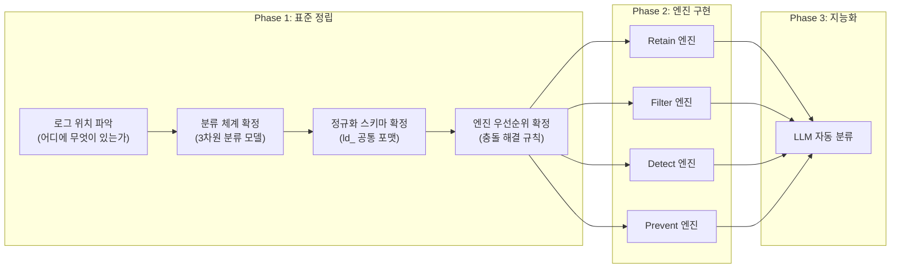

# Log Doctor: 로그 표준화 가이드

> 엔진을 만들기 전에 **"어떤 로그가 어디에 있어야 하고, 어떤 형태여야 하는가"**를 먼저 정하는 문서입니다.
> 표준이 없으면 4개 엔진(Retain/Prevent/Detect/Filter)이 각각 다른 기준으로 로그를 판단하게 되어—결과적으로 고객에게 엉뚱한 추천을 하게 됩니다.

---

## 1. 왜 표준화가 먼저인가?

```
표준 없이 엔진을 먼저 만들면:

  Retain 엔진: "이 로그는 Error야 → 1년 보존!"
  Filter 엔진: "이 로그는 노이즈야 → 삭제!"
  Detect 엔진: "이 로그는 공격 징후야 → 알림!"

  → 같은 로그를 3개 엔진이 다르게 판단
  → 고객: "보존하라면서 왜 삭제해?"

표준을 먼저 정하면:

  표준 분류표: "이 로그 = Security/Error/Critical"
  → Retain: Critical이니 1년 보존 ✓
  → Filter: Critical이니 삭제하면 안 됨 ✓
  → Detect: Security니 공격 패턴 분석 대상 ✓

  → 모든 엔진이 같은 기준으로 판단
```

---

## 2. 로그의 위치: 어디에 무엇이 있는가?

### 2-1. Azure 환경에서 로그가 생성되는 레이어

```
┌─────────────────────────────────────────────────────────────────┐
│                      고객 Azure 환경                             │
│                                                                  │
│  Layer 1: 인프라 (Azure Platform)                                │
│  ├── AzureActivity         → 리소스 생성/삭제/변경                │
│  ├── AzureMetrics          → CPU, 메모리, 네트워크 수치           │
│  └── AzureDiagnostics      → 각 서비스의 진단 로그               │
│                                                                  │
│  Layer 2: 런타임 (컨테이너 / Functions)                           │
│  ├── ContainerAppConsoleLogs → Container App stdout/stderr       │
│  ├── FunctionAppLogs         → Functions 실행 로그               │
│  └── AppServiceHTTPLogs      → HTTP 요청/응답 로그               │
│                                                                  │
│  Layer 3: 애플리케이션 (개발자가 직접 작성)                         │
│  ├── AppTraces              → logger.info(), logger.error()      │
│  ├── AppExceptions          → 에러 스택 트레이스                  │
│  └── AppDependencies        → 외부 API/DB 호출 로그              │
│                                                                  │
│  Layer 4: 보안 (Entra ID / Network)                              │
│  ├── SigninLogs             → 사용자 로그인 기록                   │
│  ├── AADNonInteractiveUserSignInLogs → 서비스 토큰 인증           │
│  ├── AuditLogs              → 디렉토리 변경 (권한 부여 등)         │
│  └── AzureFirewall/NSG      → 네트워크 차단/허용 로그             │
│                                                                  │
└─────────────────────────────────────────────────────────────────┘
         │
         ▼ (Diagnostic Settings)
┌─────────────────────────────────────────────────────────────────┐
│                   Log Analytics Workspace (LAW)                  │
│                                                                  │
│  모든 레이어의 로그가 여기에 모인다.                                │
│  → Log Doctor Agent가 분석하는 대상                               │
└─────────────────────────────────────────────────────────────────┘
```

### 2-2. 레이어별 Log Doctor 엔진 매핑

어떤 레이어의 로그를 어떤 엔진이 주로 담당하는지 정의합니다.

| 레이어        | 대표 테이블                                   |   Retain   |    Prevent    |   Detect    |   Filter   |
| ---------- | ---------------------------------------- | :--------: | :-----------: | :---------: | :--------: |
| **인프라**    | AzureActivity, AzureMetrics              | ✅ 보존 기간 관리 |       -       | ✅ 리소스 변조 탐지 | 🟡 메트릭 샘플링 |
| **런타임**    | ContainerAppConsoleLogs, FunctionAppLogs | ✅ 보존 기간 관리 | ✅ Debug 레벨 감지 |      -      | ✅ 반복 로그 필터 |
| **애플리케이션** | AppTraces, AppExceptions                 |  ✅ 등급별 보존  |  ✅ 레벨/빈도 감지   |      -      |  ✅ 노이즈 제거  |
| **보안**     | SigninLogs, AuditLogs                    | ✅ 필수 장기 보존 |       -       | ✅ 공격 패턴 탐지  | ❌ 절대 필터 금지 |
|            |                                          |            |               |             |            |

> [!IMPORTANT] 핵심 규칙
> **보안 레이어(Layer 4)의 로그는 어떤 엔진도 삭제하거나 필터링해서는 안 됩니다.**
> ISMS, SOC2, GDPR 등 컴플라이언스 요건 상 최소 1년 보존이 필수입니다.

---

## 3. 로그 분류 체계 (Classification Taxonomy)

엔진을 만들기 전에 "이 로그가 무엇인가"를 판단하는 공통 분류 기준이 필요합니다.

### 3-1. 3차원 분류 모델

하나의 로그를 **3가지 축**으로 동시에 분류합니다:

```
                    목적 (Purpose)
                    ├── 운영 (Operational)
                    ├── 보안 (Security)
                    ├── 감사 (Audit)
                    └── 비즈니스 (Business)
                          │
    ┌─────────────────────┼─────────────────────┐
    │                     │                     │
심각도 (Severity)     중요도 (Criticality)
├── FATAL              ├── Critical  → 삭제 불가, 1년+ 보존
├── ERROR              ├── High      → 보존 30일+, 필터 불가
├── WARNING            ├── Medium    → 보존 7~14일, 조건부 필터
├── INFO               ├── Low       → 보존 3~7일, 필터/샘플링 가능
├── DEBUG              └── Noise     → 보존 1~3일, 적극 필터
└── TRACE
```

### 3-2. 중요도(Criticality) 결정 기준

"이 로그가 얼마나 중요한가"를 판단하는 점수 체계:

| 기준 | Critical (4점) | High (3점) | Medium (2점) | Low (1점) | Noise (0점) |
| --- | --- | --- | --- | --- | --- |
| **컴플라이언스** | 법적 보존 의무 | 내부 감사 필요 | 권장 | 불필요 | 불필요 |
| **장애 대응** | 장애 원인 추적 필수 | 장애 분석에 유용 | 참고용 | 거의 불필요 | 무관 |
| **보안** | 공격 추적 필수 | 이상 탐지에 사용 | 참고용 | 무관 | 무관 |
| **재현 가능성** | 재생성 불가 | 재생성 어려움 | 조건부 가능 | 쉽게 재생성 | 항상 재생성 |

**점수 합산:**
- 12점 이상 → **Critical**
- 8~11점 → **High**
- 5~7점 → **Medium**
- 2~4점 → **Low**
- 0~1점 → **Noise**

### 3-3. 분류 적용 예시

| 테이블 | 로그 예시 | 목적 | 심각도 | 중요도 | 엔진 행동 |
| --- | --- | --- | --- | --- | --- |
| SigninLogs | 로그인 실패 3회 | Security | WARNING | **Critical** | Retain: 1년, Detect: 분석 |
| AppTraces | "Processing order #123" | Operational | INFO | **Low** | Retain: 7일, Filter: 패스 |
| AppTraces | "Health check OK" | Operational | DEBUG | **Noise** | Filter: DROP |
| AzureActivity | 리소스 삭제됨 | Audit | WARNING | **Critical** | Retain: 1년, Detect: 알림 |
| ContainerAppConsoleLogs | NullPointerException | Operational | ERROR | **High** | Retain: 30일, Prevent: 알림 |
| AppServiceHTTPLogs | GET /favicon.ico 200 | Operational | INFO | **Noise** | Filter: DROP |
| AppServiceHTTPLogs | POST /api/payment 500 | Operational | ERROR | **High** | Retain: 30일, Detect: 분석 |

---

## 4. 표준 스키마: Log Doctor가 이해하는 공통 포맷

### 4-1. 정규화(Normalization)가 필요한 이유

LAW에 들어오는 로그는 테이블마다 필드명이 다릅니다:

```
같은 "레벨" 정보인데:
├── AppTraces         → SeverityLevel (숫자: 0,1,2,3,4)
├── AzureDiagnostics  → Level (문자열: "Error", "Warning")
├── Syslog            → SeverityLevel (문자열: "err", "warning")
└── SigninLogs        → (필드 없음 — Status.errorCode로 추론)

같은 "시간" 정보인데:
├── AppTraces         → TimeGenerated
├── AzureActivity     → TimeGenerated
└── 커스텀 로그        → Timestamp 또는 time 또는 ts
```

Agent가 매번 테이블마다 다른 필드를 처리하면 엔진 코드가 복잡해집니다.

### 4-2. Log Doctor 내부 정규화 스키마

Agent가 LAW에서 로그를 읽은 후, 내부적으로 변환하는 공통 구조:

```json
{
  "ld_timestamp": "2026-02-25T14:00:00.000+09:00",
  "ld_source_table": "AppTraces",
  "ld_layer": "application",
  "ld_severity": "ERROR",
  "ld_purpose": "operational",
  "ld_criticality": "high",
  "ld_message": "Payment gateway timeout after 30s",

  "ld_context": {
    "service": "payment-service",
    "resource_id": "/subscriptions/.../resourceGroups/.../...",
    "trace_id": "abc-xyz-123",
    "user_id": "U-456"
  },

  "ld_classification": {
    "retain_class": "B",
    "retain_days_hot": 14,
    "retain_days_archive": 90,
    "filterable": false,
    "detect_relevant": false,
    "prevent_relevant": true
  },

  "raw": { ... }
}
```

| 접두사 `ld_` 필드 | 설명 |
| --- | --- |
| `ld_timestamp` | 정규화된 시간 (항상 ISO 8601 + 시간대) |
| `ld_source_table` | LAW 원본 테이블명 |
| `ld_layer` | 인프라/런타임/애플리케이션/보안 |
| `ld_severity` | 정규화된 심각도 (TRACE~FATAL) |
| `ld_purpose` | 목적 (operational/security/audit/business) |
| `ld_criticality` | 중요도 (critical/high/medium/low/noise) |
| `ld_classification` | **4개 엔진이 공유하는 분류 결과** |
| `raw` | LAW 원본 데이터 (변환 전 보존) |

> [!NOTE] 왜 `ld_` 접두사를 사용하는가?
> LAW 원본 필드와 Log Doctor가 추가한 필드를 명확히 구분하기 위해서입니다. `severity`라는 필드가 원본에도 있을 수 있기 때문에, `ld_severity`로 "이건 우리가 정규화한 값"임을 표시합니다.

### 4-3. LAW 테이블 → 정규화 매핑 테이블

Agent가 참조할 변환 규칙:

| LAW 테이블 | 레이어 | 심각도 매핑 | 기본 중요도 |
| --- | --- | --- | --- |
| SigninLogs | security | Status.errorCode == 0 → INFO, else → WARNING | critical |
| AuditLogs | security | - | critical |
| AzureActivity | infrastructure | Level 필드 그대로 | high |
| AzureDiagnostics | infrastructure | Level 필드 그대로 | medium |
| AppTraces | application | SeverityLevel: 0=TRACE, 1=DEBUG, 2=INFO, 3=WARNING, 4=ERROR | severity 기반 |
| AppExceptions | application | 항상 ERROR | high |
| AppServiceHTTPLogs | runtime | 상태코드: 2xx=INFO, 4xx=WARNING, 5xx=ERROR | medium |
| ContainerAppConsoleLogs | runtime | Log_s 내용 파싱 필요 | medium |
| FunctionAppLogs | runtime | Level 필드 | medium |

---

## 5. 엔진 간 우선순위 충돌 해결

### 5-1. 문제: 같은 로그에 대해 엔진이 서로 다른 결정을 내릴 때

```
시나리오: AppServiceHTTPLogs에서 "GET /health 200" 로그

  Filter 엔진: "반복 노이즈니까 DROP"     → 삭제하고 싶음
  Retain 엔진: "HTTP 로그니까 7일 보존"    → 보존하고 싶음
  Detect 엔진: "관심 없음"                → 무관

→ 누구 말을 들어야 하는가?
```

### 5-2. 해결: 엔진 우선순위 체인

```
판단 순서:

  ① Detect (보안)   → "이 로그에 위협 징후가 있는가?"
     │                  YES → 절대 삭제 금지, 장기 보존 강제
     │                  NO  → 다음 단계
     ▼
  ② Retain (보존)   → "이 로그의 보존 등급은?"
     │                  Critical/High → 보존 기간 설정, Filter 제한
     │                  Medium 이하   → 다음 단계
     ▼
  ③ Filter (필터)   → "이 로그를 필터링해도 되는가?"
     │                  Criticality가 Low/Noise인 경우만 필터 가능
     ▼
  ④ Prevent (예방)  → "이 로그 패턴에 개선이 필요한가?"
                        (다른 엔진의 판단과 독립적으로 실행)
```

### 5-3. 충돌 해결 매트릭스

| 상황 | Detect | Retain | Filter | 최종 결정 |
| --- | --- | --- | --- | --- |
| 보안 로그 + 노이즈 | 위협 징후 | 1년 보존 | DROP 요청 | ❌ **Filter 거부** — 보안 우선 |
| 일반 Debug 로그 | 무관 | 3일 보존 | DROP 요청 | ✅ **Filter 허용** — Noise등급 |
| Error 로그 + 반복 | 무관 | 30일 보존 | 샘플링 요청 | 🟡 **샘플링만 허용** — 완전 삭제 금지 |
| 정상 HTTP 200 GET /health | 무관 | Low | DROP 요청 | ✅ **Filter 허용** |

---

## 6. 표준화 체크리스트

엔진 개발을 시작하기 전에 아래 항목이 모두 결정되어야 합니다.

### 기본 분류

- [ ] 고객사별 LAW 테이블 목록을 자동으로 수집하는 KQL 쿼리 확정
- [ ] 각 테이블의 레이어(인프라/런타임/애플리케이션/보안) 매핑 완료
- [ ] 심각도 정규화 규칙 (테이블별 필드 → ld_severity) 확정
- [ ] 중요도 점수 체계 확정 및 팀 합의

### 엔진 규칙

- [ ] 엔진 우선순위 체인 확정 (Detect > Retain > Filter > Prevent)
- [ ] 보안 로그 "절대 삭제 금지" 테이블 목록 확정
- [ ] Filter가 동작 가능한 최대 중요도 기준 확정 (Low/Noise만 가능?)
- [ ] Retain 등급(A/B/C)과 중요도(Critical~Noise) 매핑 확정

### 정규화 스키마

- [ ] `ld_` 접두사 내부 스키마 최종 확정
- [ ] LAW 테이블별 정규화 매핑 테이블 작성 완료
- [ ] 커스텀 테이블(고객이 직접 만든 테이블) 처리 방침 결정
- [ ] raw 원본 데이터 보존 범위 결정 (전체? 요약만?)

### 운영 기준

- [ ] 분류 결과를 Cosmos DB에 어떤 구조로 저장할지 결정
- [ ] 분류 기준이 변경될 때 기존 분류 결과 재처리 방침 결정
- [ ] 고객사별 분류 커스터마이징 허용 범위 결정

---

## 7. 요약: 표준화 → 엔진 → 서비스 순서



> [!TIP] 핵심 메시지
> **엔진은 도구일 뿐이고, 표준이 서비스의 품질을 결정합니다.**
> 잘 짠 표준 위에서는 어떤 엔진이든 올바른 결정을 내릴 수 있지만,
> 표준 없이 만든 엔진은 아무리 정교해도 엉뚱한 결정을 합니다.
