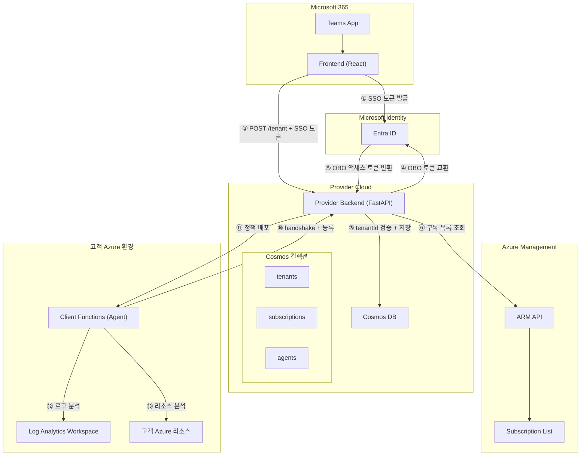
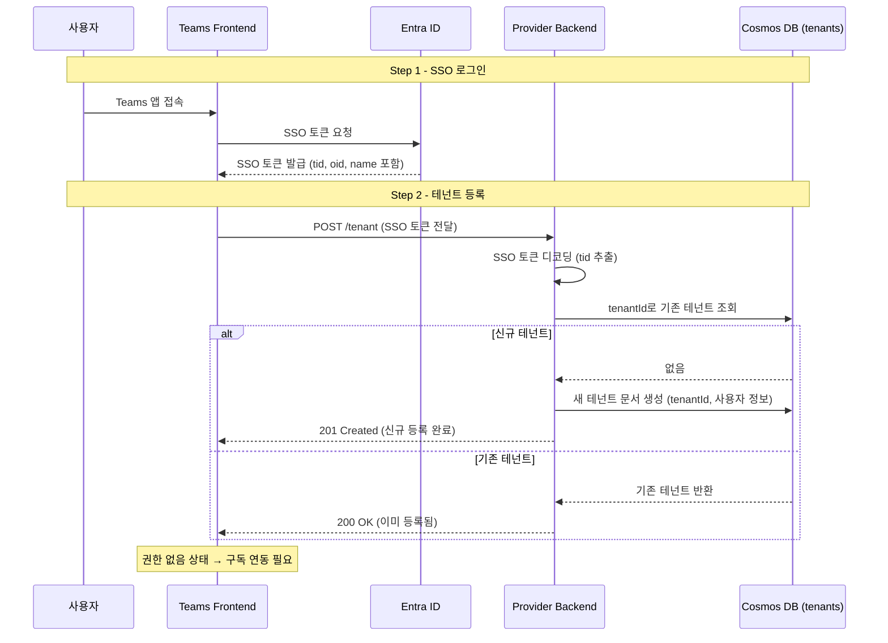
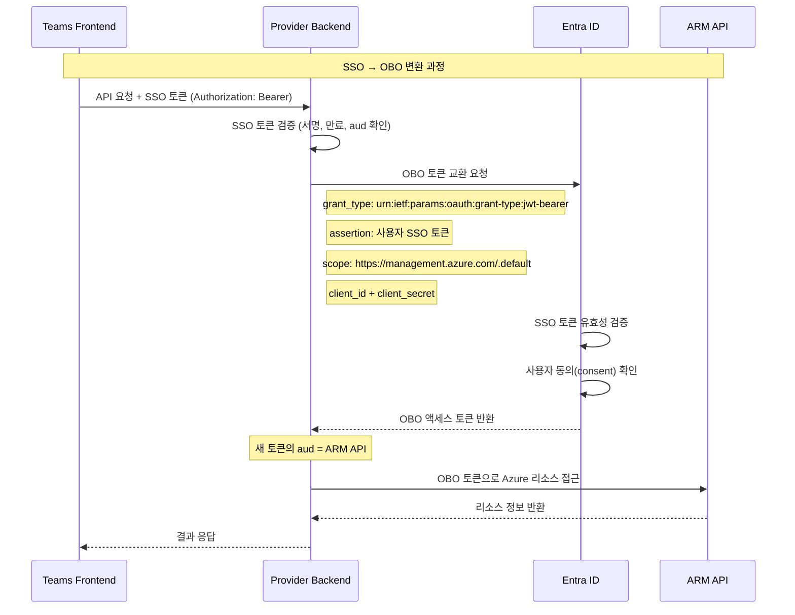
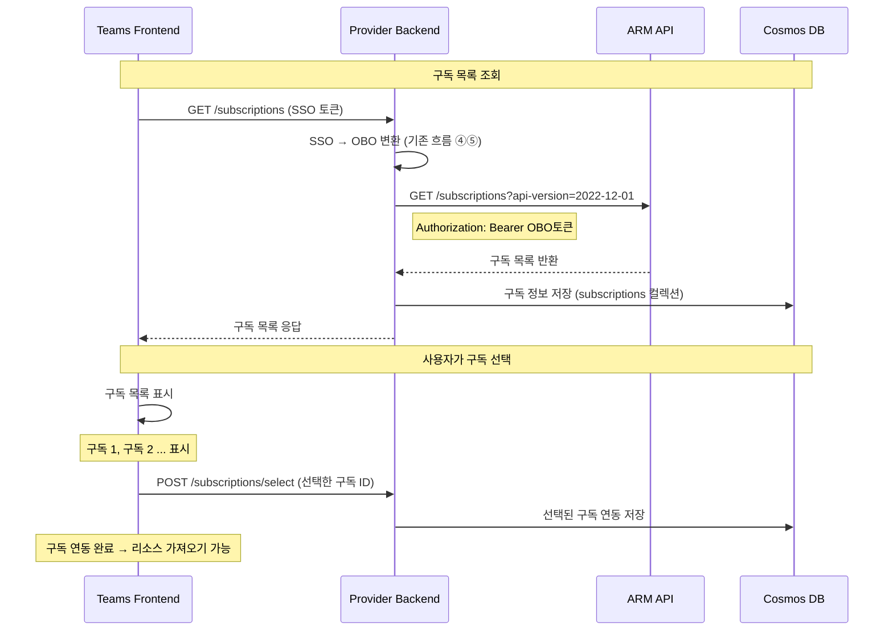
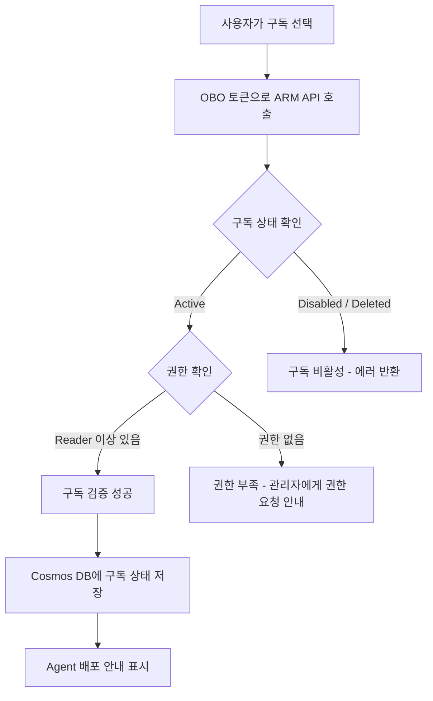
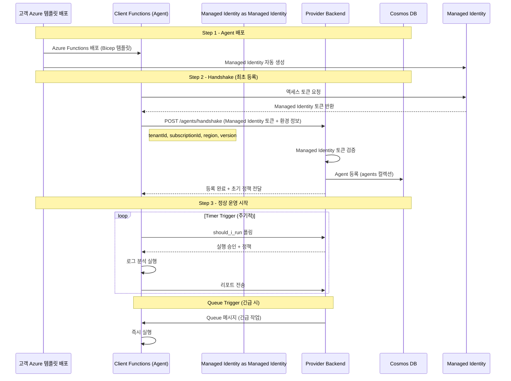
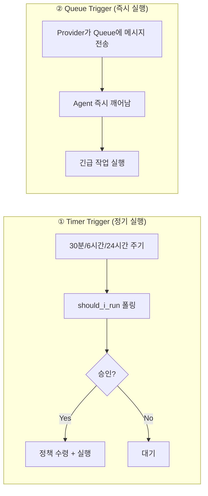
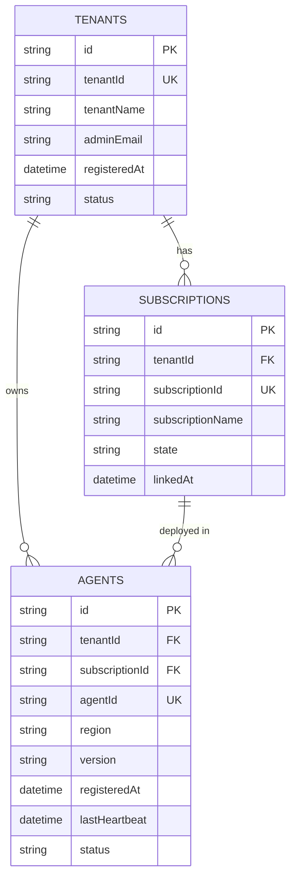
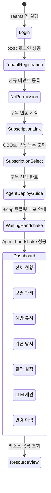
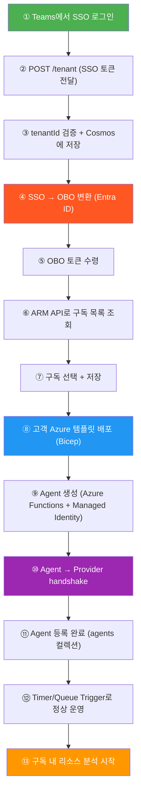

# Log Doctor: 온보딩 아키텍처

> [!NOTE] 원본
> 이 문서는 화이트보드 회의 내용을 Mermaid 다이어그램으로 정리한 것입니다.

---

## 1. 전체 시스템 아키텍처

Teams Frontend, Provider Backend, Entra ID, Client Agent 간의 전체 관계를 보여줍니다.



---

## 2. 테넌트 등록 흐름 (Tenant Registration Flow)

사용자가 Teams 앱에서 처음 로그인할 때의 흐름입니다.



---

## 3. SSO → OBO 토큰 교환 흐름

Provider가 사용자를 대신하여 Azure 리소스에 접근하기 위해 OBO 토큰을 교환하는 흐름입니다.



---

## 4. 구독 조회 및 연동 (Subscription Flow)

OBO 토큰으로 고객사 Azure 구독 목록을 가져오는 흐름입니다.



---

## 5. 구독 검증 흐름 (Subscription Verification)

선택된 구독이 유효한지, 필요한 권한이 있는지 검증합니다.



---

## 6. Client Agent 등록 흐름 (Handshake)

고객사 환경에 Agent(Azure Functions)가 배포된 후, Provider에 등록하는 흐름입니다.



---

## 7. Agent 실행 방식 (Trigger 비교)

Agent가 작업을 실행하는 두 가지 방식입니다.



| 방식 | 용도 | 주기 | 예시 |
| --- | --- | --- | --- |
| Timer Trigger | 정기 분석/점검 | 30분 ~ 24시간 | Retain, Prevent, Detect |
| Queue Trigger | 긴급/즉시 실행 | 즉시 | Rollback 원복, Filter 긴급 적용 |

---

## 8. Cosmos DB 컬렉션 구조



---

### 왜 이렇게 설계했는가?

#### 컬렉션을 3개로 나눈 이유

하나의 컬렉션에 모든 정보를 넣을 수도 있지만, **역할과 생명주기(Lifecycle)가 다르기 때문에** 3개로 분리했습니다.

| 컬렉션 | 핵심 질문 | 변경 빈도 |
| --- | --- | --- |
| `tenants` | "이 회사가 우리 서비스를 쓰는가?" | 거의 없음 (등록 1회) |
| `subscriptions` | "이 회사의 어떤 Azure 구독을 관리하는가?" | 가끔 (구독 추가/제거) |
| `agents` | "지금 Agent가 살아있는가? 최근에 언제 실행했는가?" | 자주 (heartbeat, 버전 업데이트) |

`agents`는 heartbeat 때문에 **30분마다 업데이트**됩니다. 만약 하나의 컬렉션에 모든 정보를 넣으면, 불필요하게 tenantName 같은 거의 바뀌지 않는 데이터까지 매번 덮어쓰게 되어 Cosmos DB RU(비용) 낭비가 발생합니다.

---

#### TENANTS 컬렉션

```json
{
  "id": "uuid",
  "tenantId": "a1b2c3d4-xxxx-xxxx-xxxx (SSO 토큰의 tid)",
  "tenantName": "Contoso Inc.",
  "adminEmail": "admin@contoso.com",
  "registeredAt": "2025-02-24T...",
  "status": "active"
}
```

> **tenantId를 왜 따로 저장하는가?**
> SSO 토큰의 `tid` 클레임이 곧 Azure AD Tenant ID입니다. 이 값이 "고객사를 구별하는 유일한 키"입니다. `id`(Cosmos 내부 PK)와 `tenantId`(Azure AD 키)를 분리한 이유는, Cosmos DB는 `id`를 파티션 키로 사용하지만 우리 비즈니스 로직은 항상 `tenantId`로 조회하기 때문입니다. 두 역할을 분리해야 인덱스 설계가 명확해집니다.

> **status 필드가 필요한 이유?**
> 고객사가 구독을 해지하거나 서비스를 중단할 때, 실제 데이터를 삭제하면 감사 이력이 사라집니다. `status`를 `"suspended"` 또는 `"inactive"`로 바꾸는 **소프트 삭제(Soft Delete)** 방식을 쓰면 이력이 보존됩니다.

---

#### SUBSCRIPTIONS 컬렉션

```json
{
  "id": "uuid",
  "tenantId": "a1b2c3d4-xxxx (TENANTS와 연결)",
  "subscriptionId": "sub-yyyy-zzzz (Azure 구독 ID)",
  "subscriptionName": "Contoso-Production",
  "state": "linked",
  "linkedAt": "2025-02-24T..."
}
```

> **왜 TENANTS와 분리했는가?**
> 하나의 고객사(테넌트)가 **여러 개의 Azure 구독**을 가질 수 있습니다. 예를 들어 "개발 구독", "운영 구독", "DR 구독"이 별도로 존재할 수 있습니다. TENANTS 안에 구독 목록을 배열로 넣으면 구독이 추가/삭제될 때마다 테넌트 문서 전체를 업데이트해야 하고, 쿼리도 복잡해집니다. 분리하면 구독 하나만 조회/수정이 가능합니다.

> **subscriptionId를 왜 저장하는가?**
> 이 값이 OBO 토큰으로 ARM API를 호출할 때 사용하는 Azure 구독 식별자입니다. Agent가 `should_i_run` 폴링 시 Provider에게 "나는 이 구독에 속한 Agent다"를 알릴 때도 이 ID를 사용합니다.

---

#### AGENTS 컬렉션

```json
{
  "id": "uuid",
  "tenantId": "a1b2c3d4-xxxx",
  "subscriptionId": "sub-yyyy-zzzz",
  "agentId": "agent-고유-식별자 (Functions App 이름 등)",
  "region": "koreacentral",
  "version": "1.2.0",
  "registeredAt": "2025-02-24T...",
  "lastHeartbeat": "2025-02-24T14:30:00Z",
  "status": "healthy"
}
```

> **lastHeartbeat가 핵심인 이유?**
> Agent가 살아있는지 죽었는지 확인하는 유일한 방법입니다. Agent는 `should_i_run` 폴링을 할 때마다 이 값을 업데이트합니다. Provider가 "30분 이상 heartbeat가 없다"는 것을 감지하면 Teams에 알림을 보낼 수 있습니다. 이 필드 없이는 Agent가 고장나도 아무도 모릅니다.

> **tenantId + subscriptionId를 둘 다 저장하는 이유?**
> Agent는 특정 구독 안에 배포되어 있지만, 정책을 조회할 때는 테넌트 전체 정책도 필요할 수 있습니다. `tenantId`로 "이 테넌트의 공통 정책"을, `subscriptionId`로 "이 구독 전용 정책"을 구분하여 조회할 수 있습니다. 두 ID를 모두 저장해 두면 쿼리 한 번으로 필요한 범위를 자유롭게 결정할 수 있습니다.

> **version 필드가 필요한 이유?**
> Agent는 고객사 환경에 배포된 코드이기 때문에, Provider와 버전이 맞지 않으면 API 호환성 문제가 생길 수 있습니다. Provider는 `version`을 보고 "이 Agent는 구버전이니 업데이트가 필요하다"는 메시지를 handshake 응답에 포함시킬 수 있습니다.

---

#### 전체 설계 원칙 요약

| 원칙 | 적용 내용 |
| --- | --- |
| **멀티테넌트 격리** | 모든 컬렉션에 `tenantId`를 포함 — 고객사 간 데이터가 절대 섞이지 않음 |
| **생명주기 분리** | 변경 빈도가 다른 데이터를 다른 컬렉션에 저장 — Cosmos RU 최소화 |
| **소프트 삭제** | `status` 필드로 삭제 처리 — 감사/이력 보존 |
| **Cosmos 파티션 전략** | `tenantId`를 파티션 키로 설정하면 같은 테넌트의 데이터가 같은 물리 파티션에 모임 — 조회 성능 최적화 |

---

## 9. Teams Frontend 화면 흐름

사용자가 Teams 앱에서 보는 화면 전환 순서입니다.



---

## 10. 전체 번호 흐름 요약 (화이트보드 원본 기준)

화이트보드에 적힌 번호 순서대로의 전체 흐름입니다.


