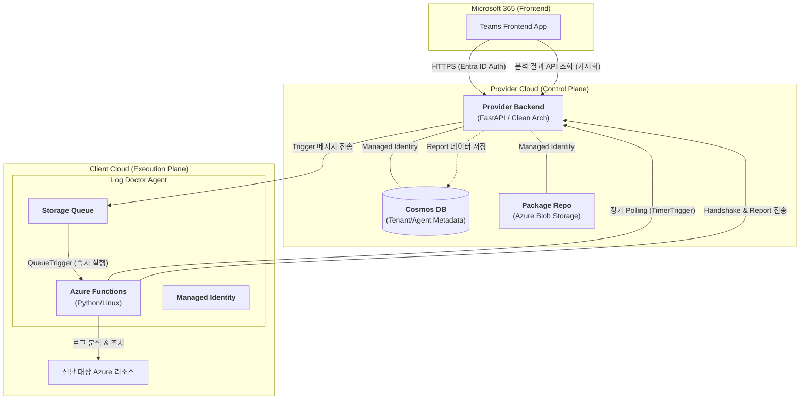
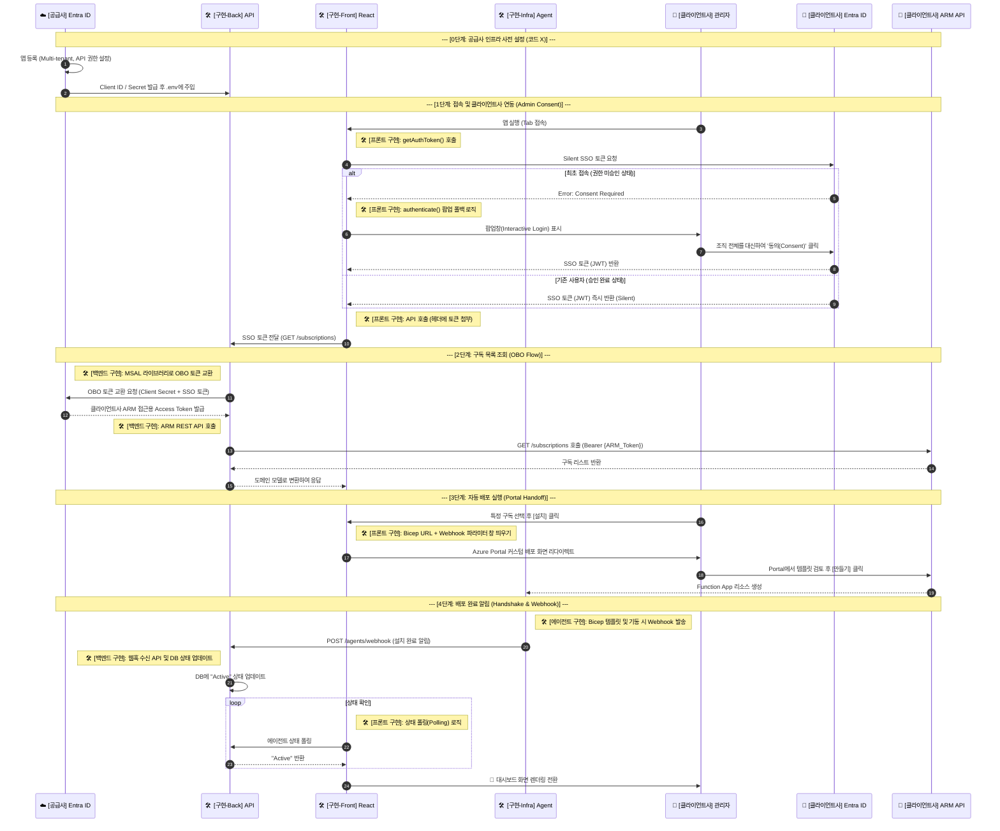
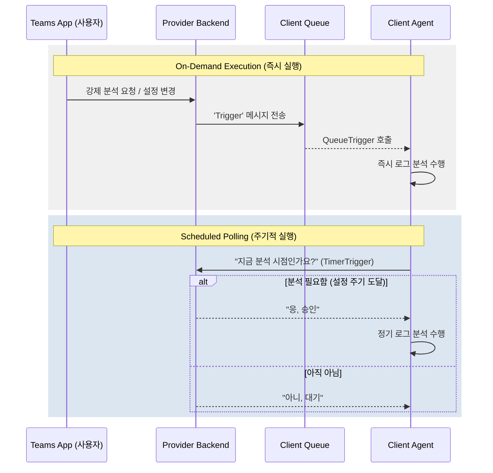
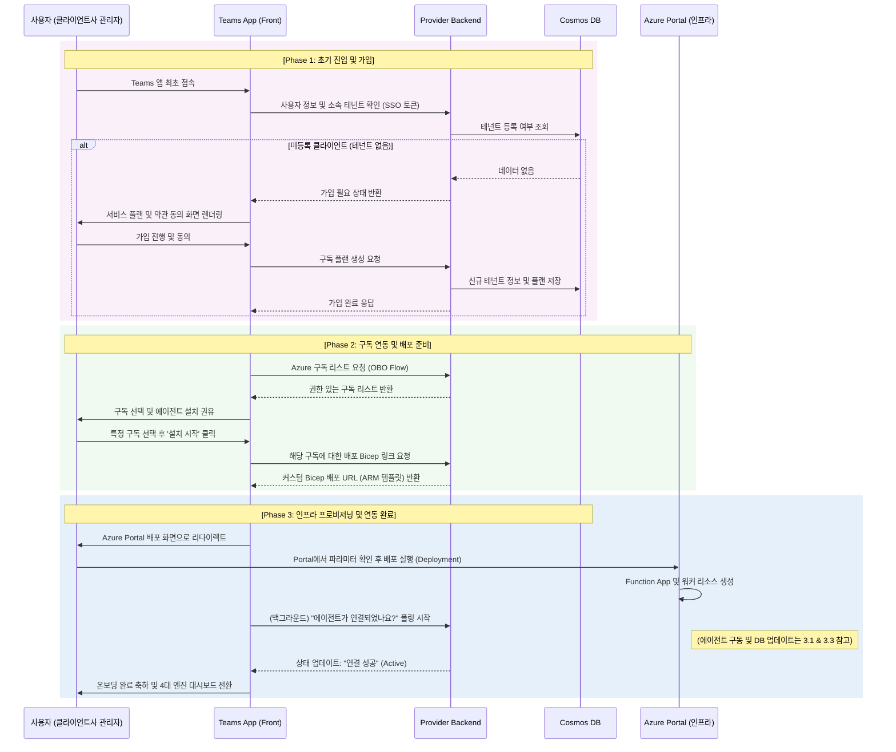
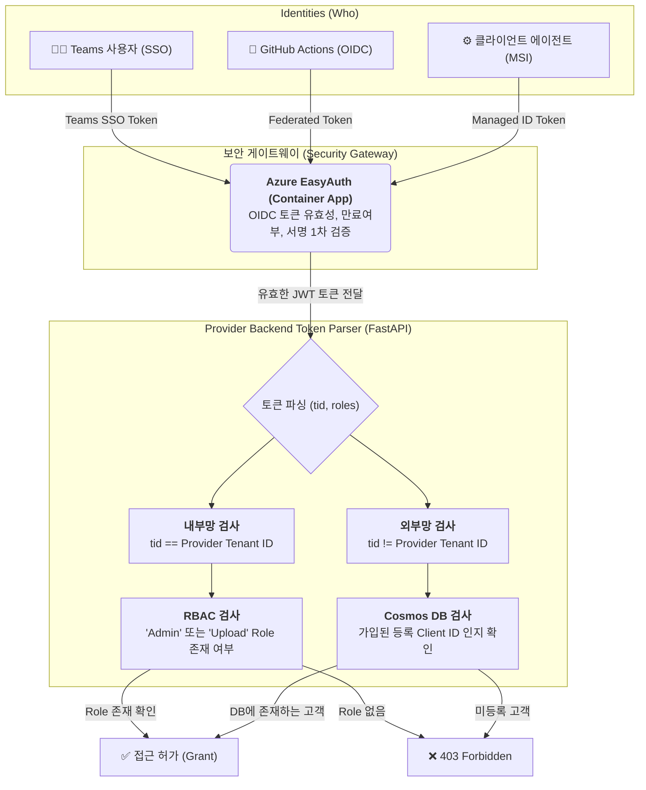

# Log Doctor 통합 시스템 아키텍처 및 보안 설계서

## 1. 시스템 개요 (System Overview)

Log Doctor는 Azure 기반 인프라 로깅 및 진단을 위한 서비스로, 고객사의 비용 효율성과 시스템 안정성을 위해 4가지 핵심 엔진(Detect, Filter, Prevent, Retain)을 제공합니다. 본 시스템은 독립적인 세 가지 주요 컴포넌트로 구성된 **하이브리드 배포 아키텍처(Hybrid Deployment Architecture)**를 따릅니다.

1. **Provider Frontend (`log-doctor-provider-front`)**: Microsoft Teams 기반의 운영자 및 사용자 인터페이스 (React, Vite, Teams Toolkit).
2. **Provider Backend (`log-doctor-provider-back`)**: 중앙 제어 및 메타데이터 관리 시스템 (FastAPI, Cosmos DB, Clean Architecture).
3. **Agent Backend (`log-doctor-client-back`)**: 고객사 Azure 환경 내부에 배포되어 실제 로그 분석을 수행하는 워커 (Azure Functions, Python).

---

## 2. 통합 아키텍처 (Integrated Architecture)

### 2.1. 하이레벨 뷰 (ASCII Art)

```text
    [ Microsoft Teams (M365) ]               [ Provider Cloud Environment ]
   +--------------------------+             +--------------------------------+
   | (1) Provider Frontend    |             | (2) Provider Backend (FastAPI) |
   |  - Teams Personal Tab    | ====HTTP==> |  - Central Control Plane       |
   |  - UI for 4 Engines      |             |  - Azure Managed Identity      |
   +--------------------------+             +--------------------------------+
                                                           | (Polling & Triggering)
                                                           |
                                            [ Customer Azure Environment ]
                                            +--------------------------------+
                                            | (3) Customer Agent (Functions) |
                                            |  - Log Scraping & Analysis     |
                                            |  - Queue / Timer Trigger       |
                                            +--------------------------------+
                                                           |
                                                    [ Target Resources / Logs ]
```

### 2.2. 상세 시스템 흐름도 (Mermaid)



---

## 3. 핵심 유즈케이스 (Core Use Cases)

본 시스템은 관리자와 클라이언트사 에이전트 관점에서 크게 3가지의 주요 유즈케이스를 가집니다.

### 3.1. 에이전트 통합 배포 (Agent Deployment)

운영자 및 CI/CD 시스템에서 패키지를 등록하면, 클라이언트사가 손쉽게 템플릿을 통해 자신의 구독에 에이전트를 프로비저닝하는 과정입니다.

1. **Provider 업로드**: 운영자 혹은 GitHub Actions가 새 에이전트 패키지(Zip)를 Provider Backend (Blob Storage)에 업로드합니다.
2. **Bicep 템플릿 생성**: 클라이언트사가 **Teams 앱 대시보드**를 통해 특정 구독에 대한 에이전트 배포용 Bicep 링크를 요청합니다.
3. **클라이언트 배포**: 클라이언트사가 "Deploy to Azure" 버튼을 클릭하여 Azure Portal 인프라를 프로비저닝합니다.
4. **코드 획득**: 배포된 클라이언트사 Function App이 Provider Backend로부터 `WEBSITE_RUN_FROM_PACKAGE`를 사용해 에이전트 코드를 스트리밍 받아 구동됩니다.

#### 통합 배포 및 연동 체계 상세 흐름도 (Implementation Details)



### 3.2. 지능형 트리거를 통한 로그 분석 (Intelligent Trigger & Analysis)

클라이언트사 인프라 보호를 위해 최소 권한 원칙으로 에이전트를 동작시킵니다. 수집, 필터, 탐지 모델(4대 엔진)이 수행됩니다.

1. **정기 실행 (TimerTrigger)**: 에이전트는 30분 주기로 깨어나 Provider Backend에 "지금 분석할 시점인가요?"라고 폴링(`should_i_run?`)합니다. 승인될 경우 분석 파이프라인을 실행합니다.
2. **즉시 실행 (QueueTrigger)**: 사용자가 Teams 탭(Frontend)에서 강제 분석이나 설정을 변경하면, Provider Backend가 클라이언트사 Storage Queue에 메시지를 전송하고 에이전트가 즉각 반응하여 분석을 수행합니다.

#### 사용자 요청 및 에이전트 동작 시퀀스



### 3.3. 시스템 핸드쉐이크 및 상태 보고 (Handshake & Reporting)

상태리스(Stateless)한 FunctionApp 환경에서 에이전트의 구동 신뢰성을 보장하기 위한 유즈케이스입니다.

1. **가동 확인**: 에이전트가 구동되자마자 백엔드에 Handshake 요청을 보내 활성화 상태를 등록합니다.
2. **리포트 제출**: 파이프라인 분석이 완료되면 결과 메타데이터를 Provider Backend로 전송하여 Cosmos DB에 저장합니다. Front앱은 이 DB를 통해 결과를 가시화합니다.

### 3.4. 사용자 온보딩 과정 (User Onboarding Flow)

초기 사용자가 시스템에 어떻게 가입하고 에이전트를 연동하여 대시보드에 접근하는지를 보여주는 엔드투엔드 온보딩 흐름입니다.



---

## 4. 보안 아키텍처 (Security Architecture)

본 시스템은 신원(Identity)과 토큰 소유권(Token Ownership)을 정확하게 분리하여 **Zero Trust** 보안 모델을 채택하였습니다. 연결 문자열이나 시크릿 키는 절대 코드나 설정에 하드코딩하지 않으며, **Entra ID(Azure AD)**와 **Managed Identity** 기반으로만 작동합니다.

### 4.1. 다층적 인증 주체 (Multi-layered Identities)

시스템에 접근하는 3가지 주요 액터들의 인증 수단과 목적을 분리합니다.

| 구분                  | 주체 (Who)                | 소속 Entra ID         | 인증 수단 (How)                     | 토큰 세부 유형 (What)                                                                                               | 주요 목적                                    |
| :-------------------- | :------------------------ | :-------------------- | :---------------------------------- | :------------------------------------------------------------------------------------------------------------------ | :------------------------------------------- |
| **관리자/사용자**     | Teams 앱 접속자           | **Provider Entra ID** | 브라우저 SSO (Interactive/Silent)   | **1. Teams SSO Token**: Frontend ➡️ Backend 인증용<br/>**2. OBO ARM Token**: Backend ➡️ 클라이언트사 ARM API 인증용 | 대시보드 조회, 강제 트리거 실행, 인프라 배포 |
| **에이전트 (워커)**   | 클라이언트사 Function App | **Client Entra ID**   | System-Assigned Managed Identity    | **Managed ID Token** `(App Context)`                                                                                | 백엔드 핸드쉐이크, 분석 리포트 제출          |
| **자동화 파이프라인** | GitHub Actions            | **Provider Entra ID** | OIDC 연합 신원 (Federated Identity) | **Federated Token** `(App Context)`                                                                                 | 최신 에이전트 패키지(Zip) 자동 배포          |

### 4.2. 토큰 검증 및 인가 메커니즘 (AuthZ Flow)

Provider Backend(API)에 요청이 도달하면 토큰의 `iss`(발급자)와 `tid`(테넌트 ID) 필드를 파싱하여 철저히 교차 검증합니다. 단순히 유효한 토큰인지 확인하는 것을 넘어, "우리 시스템에 등록된 합당한 사용자인가?"를 확인합니다.



### 4.3. 핵심 보안 원칙 요약

1. **EasyAuth 도입**: 인증 오프로딩(Off-loading)을 통해 백엔드 애플리케이션 코드가 도달하기 전 인프라(Azure Container App) 레벨에서 잘못된 토큰을 즉시 차단합니다.
2. **Role-Based Access Control (RBAC)**: 내부 운영자의 토큰일지라도 인증(Authentication)만 믿지 않고 "Admin", "Upload" 등의 Application Role이 토큰에 명시되어 있는지 인가(Authorization) 절차를 필수로 거칩니다.
3. **OBO (On-Behalf-Of) 흐름**: 단순한 "Access Token"이라는 용어의 모호성을 해결하기 위해 토큰 용도를 분리합니다.
   - **Teams SSO Token**: 클라이언트(프론트엔드)가 백엔드 API를 호출할 때 사용하는 JWT입니다. (`aud`가 공급사 백엔드로 설정됨)
   - **OBO ARM Token**: 백엔드가 방금 받은 SSO 토큰을 사용자 '대신하여(On-Behalf-Of)' 클라이언트사 ARM API(Azure)를 찌를 수 있는 토큰으로 교환한 것입니다. 이를 통해 프론트엔드에 민감한 Azure 제어 특권이 직접 노출되는 것을 방지하고 백엔드에서 통제합니다.

### 4.4. Swagger UI (API 문서) 보안 로직

로그 닥터 백엔드는 FastAPI의 기본 기능인 Swagger UI(`/docs`)를 개발 및 디버깅 목적으로 활성화해두고 있습니다. 코드 상에는 별도의 Swagger 제한 로직(`docs_url=None` 등)이 없으나, 인프라 레벨의 EasyAuth를 통해 원천적으로 보호됩니다.

1. **내부망 접근 불능**: 모든 HTTP 요청은 Azure Container App 인그레스(Ingress)를 거쳐야 하므로, EasyAuth가 활성화된 상태에서는 유효한 Entra ID 토큰 없이는 `/docs` 엔드포인트 자체에 도달할 수 없습니다. (302 Redirect to Microsoft Login 발생)
2. **권한 분리**: 인증을 통과하여 Swagger UI에 접속하더라도, 각 API 엔드포인트에 걸린 `@identity_required`, `@admin_required`, `@tenant_required` 가드(Guard)들에 의해 실제 API 호출 시 세분화된 인가(AuthZ) 검증을 거치게 됩니다.
