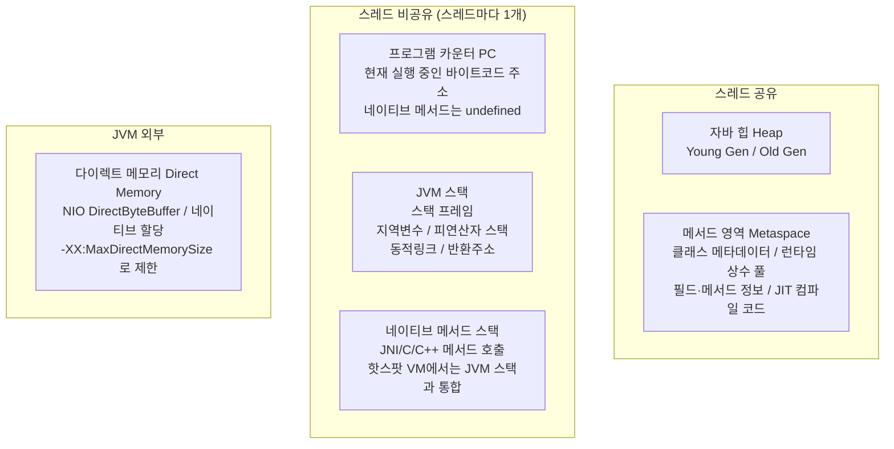
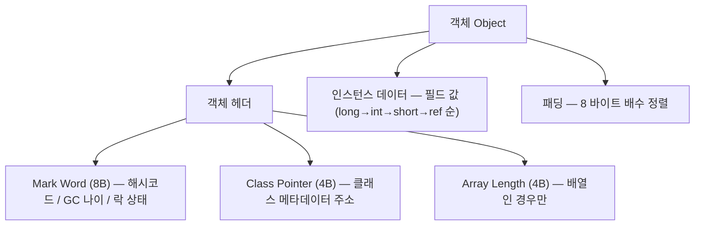
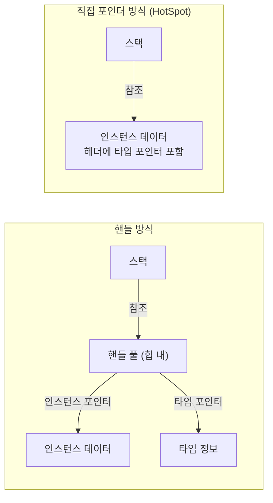

# 2장 자바 메모리 영역과 메모리 오버플로

> **"JVM 밑바닥까지 파헤치기"** (深入理解Java虚拟机 3판, 저우즈밍)

---

## 핵심 개념 --- 런타임 데이터 영역

JVM이 자바 프로그램을 실행하면 메모리를 여러 영역으로 나누어 관리한다. 각 영역은 고유한 목적과 생명주기를 갖는다.



### 각 영역 상세

| 영역 | 스레드 공유 | 목적 | 크기 설정 | OOM 발생 여부 |
| --- | --- | --- | --- | --- |
| **프로그램 카운터** | 비공유 | 현재 실행 중인 바이트코드 명령어 주소. 스레드 전환 후 복귀 지점 기억 | 고정 (매우 작음) | 유일하게 OOM **없음** |
| **JVM 스택** | 비공유 | 메서드 호출마다 스택 프레임 생성. 지역 변수, 피연산자 스택, 동적 링크, 반환 주소 | `-Xss` (기본 512K~1M) | StackOverflowError / OOM |
| **네이티브 메서드 스택** | 비공유 | JNI를 통한 네이티브 메서드 호출 | 구현체마다 다름 | StackOverflowError / OOM |
| **자바 힙** | **공유** | 모든 객체 인스턴스와 배열 저장. GC의 주요 대상 | `-Xms` / `-Xmx` | OutOfMemoryError |
| **메서드 영역** | **공유** | 클래스 구조 정보, 상수, 정적 변수, JIT 코드. JDK 8+에서 Metaspace로 변경 | `-XX:MetaspaceSize` / `-XX:MaxMetaspaceSize` | OutOfMemoryError |
| **런타임 상수 풀** | **공유** | 메서드 영역의 일부. 컴파일 시 생성된 리터럴/심볼릭 참조 + 런타임에 추가된 상수 | 메서드 영역에 포함 | OutOfMemoryError |
| **다이렉트 메모리** | - | NIO의 `DirectByteBuffer`가 네이티브 메모리를 직접 할당 | `-XX:MaxDirectMemorySize` | OutOfMemoryError |

### 핫스팟 VM의 메서드 영역 변천사

```text
JDK 6 이전:  PermGen (힙의 일부로 관리)
  └── 상수 풀, 클래스 메타데이터, 정적 변수 모두 PermGen에

JDK 7:       PermGen (일부 이전 시작)
  └── 문자열 상수 풀 → 힙으로 이동
  └── 정적 변수 → 힙으로 이동

JDK 8+:      Metaspace (네이티브 메모리)
  └── PermGen 완전 제거
  └── 클래스 메타데이터 → 네이티브 메모리(Metaspace)
  └── 상수 풀/정적 변수 → 힙에 유지
```

---

## 핵심 개념 --- 객체 생성 과정

`new` 키워드 하나로 시작되는 객체 생성은 내부적으로 복잡한 단계를 거친다.


### 객체 메모리 레이아웃 (64-bit HotSpot)



### 객체 접근 방식



- **핸들 방식**: GC 이동 시 핸들만 갱신하면 됨 / 단점: 간접 참조 2회
- **직접 포인터 방식**: 접근 속도 빠름 (1회) / 단점: GC 이동 시 참조 전체 갱신

---

## 핵심 개념 --- OOM 유형별 원인과 대응

| OOM 유형 | 에러 메시지 | 주요 원인 | 진단 방법 | 대응 |
| --- | --- | --- | --- | --- |
| **힙 OOM** | `Java heap space` | 메모리 누수, 과다 객체 생성, 힙 크기 부족 | `-XX:+HeapDumpOnOutOfMemoryError` → MAT/VisualVM으로 분석 | 누수면 코드 수정, 용량 부족이면 `-Xmx` 증가 |
| **스택 오버플로** | `StackOverflowError` | 재귀 호출 깊이 초과, 과도한 메서드 호출 체인 | 스택 트레이스 분석 | 재귀를 반복으로 변환, `-Xss` 조정 |
| **스택 OOM** | `unable to create native thread` | 스레드 수 과다 (각 스레드마다 스택 메모리 소비) | `jstack`으로 스레드 수 확인 | 스레드 풀 사용, `-Xss` 줄이기, OS 제한 확인 |
| **메서드 영역 OOM** | `Metaspace` | 동적 프록시/CGLIB 남용, 클래스 로더 누수, JSP 다량 생성 | `-XX:+TraceClassLoading`, `jcmd VM.classloader_stats` | `-XX:MaxMetaspaceSize` 증가, 클래스 언로딩 확인 |
| **다이렉트 메모리 OOM** | `Direct buffer memory` | NIO DirectByteBuffer 과다 할당, 해제 지연 | NMT(`-XX:NativeMemoryTracking`) 활성화 | `-XX:MaxDirectMemorySize` 조정, 명시적 `Cleaner` 호출 |
| **GC 오버헤드** | `GC overhead limit exceeded` | GC에 98% 이상 시간 소비하면서 힙 2% 미만 회수 | GC 로그 분석 | 메모리 누수 해결, 힙 증가 |

### 실전 코드 예시: 힙 OOM 유발

```java
// VM 옵션: -Xms20m -Xmx20m -XX:+HeapDumpOnOutOfMemoryError
public class HeapOOM {
    static class OOMObject {}
    public static void main(String[] args) {
        List<OOMObject> list = new ArrayList<>();
        while (true) {
            list.add(new OOMObject());  // GC Root(list)에서 도달 가능 → 회수 불가
        }
    }
}
```

### 실전 코드 예시: 메서드 영역 OOM (Metaspace)

```java
// VM 옵션: -XX:MetaspaceSize=10m -XX:MaxMetaspaceSize=10m
// CGLIB/ByteBuddy로 동적 클래스를 끊임없이 생성하면 Metaspace 소진
public class MetaspaceOOM {
    public static void main(String[] args) {
        while (true) {
            Enhancer enhancer = new Enhancer();
            enhancer.setSuperclass(Object.class);
            enhancer.setUseCache(false);
            enhancer.setCallback((MethodInterceptor) (o, m, a, p) -> p.invokeSuper(o, a));
            enhancer.create();  // 매번 새로운 클래스 생성 → Metaspace 소진
        }
    }
}
```

---

## 학습 완료 체크리스트

- [ ] 5개 런타임 데이터 영역(PC, JVM 스택, 네이티브 스택, 힙, 메서드 영역)의 역할과 스레드 공유 여부를 설명할 수 있다
- [ ] 다이렉트 메모리가 힙 외부에 할당되는 이유와 GC와의 관계를 설명할 수 있다
- [ ] 객체 생성 5단계(클래스 로딩 → 메모리 할당 → 초기화 → 헤더 설정 → `<init>`)를 순서대로 설명할 수 있다
- [ ] TLAB의 목적과 동시 할당 문제 해결 방식을 설명할 수 있다
- [ ] 4가지 OOM 유형(힙, 스택, Metaspace, 다이렉트 메모리)의 원인과 진단 방법을 구분할 수 있다

---

## 핵심 질문

### Q1. JVM 런타임 데이터 영역 중 OOM이 발생하지 않는 곳은?

**프로그램 카운터(PC Register)**가 유일하다. JVM 명세에서 이 영역에 대해 OutOfMemoryError를 정의하지 않는다. 크기가 고정적이고 매우 작으며, 각 스레드가 현재 실행 중인 바이트코드 주소만 저장한다.

### Q2. 핫스팟 VM에서 객체 접근 방식이 핸들이 아닌 직접 포인터인 이유는?

직접 포인터 방식은 참조를 따라가는 데 한 번의 메모리 접근만 필요하다 (핸들은 두 번). 자바 프로그램의 객체 접근 빈도가 매우 높으므로 이 차이가 누적되면 큰 성능 차이가 된다. 대신 GC가 객체를 이동시킬 때 모든 참조를 갱신해야 하는 부담이 있다.
