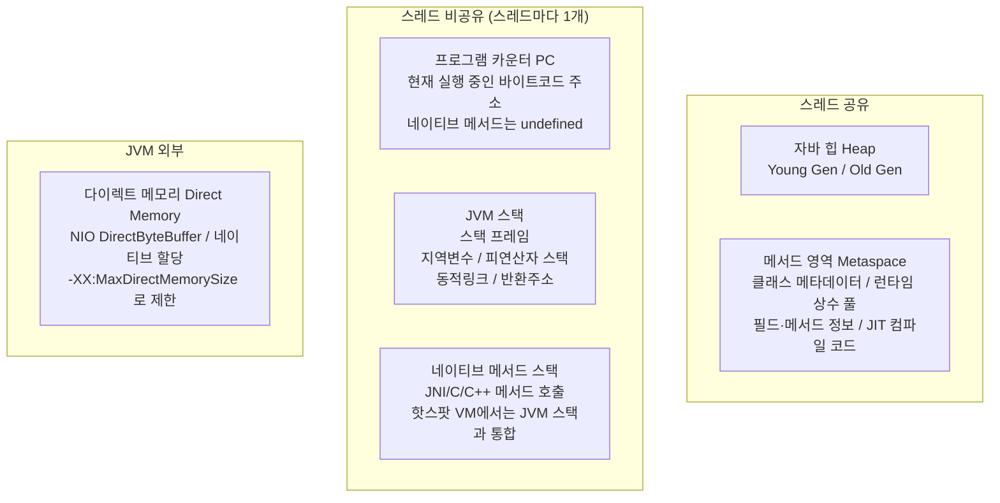
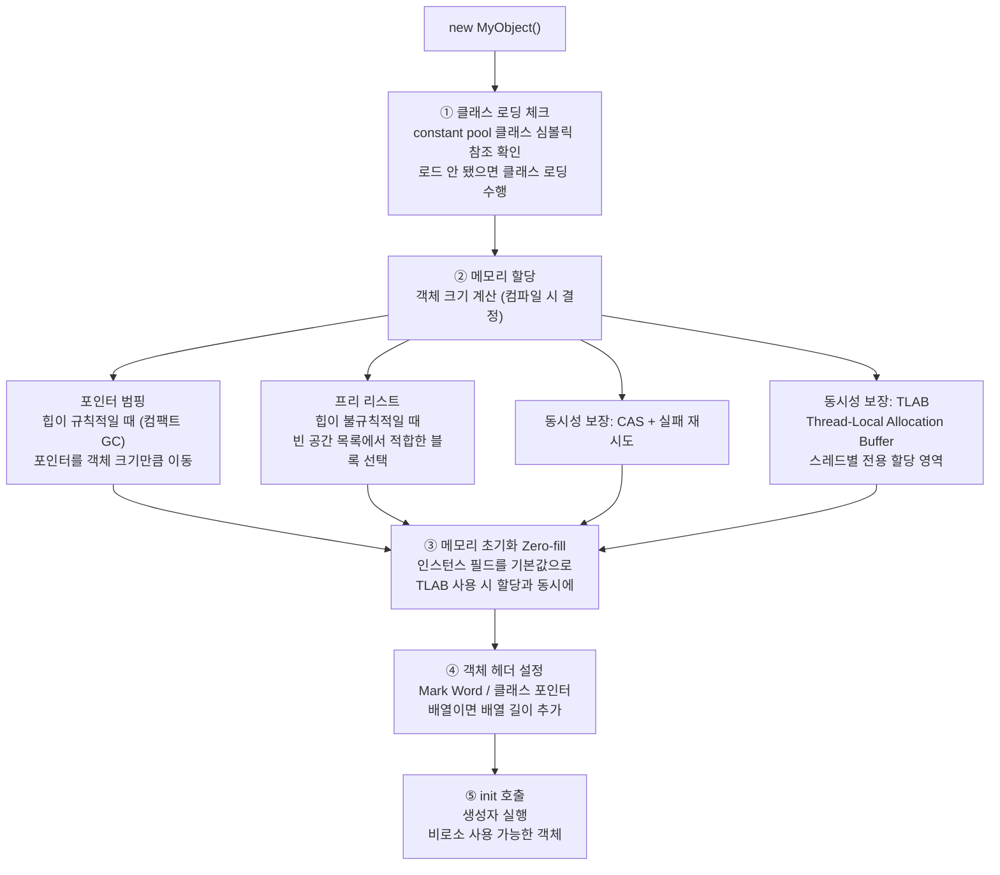
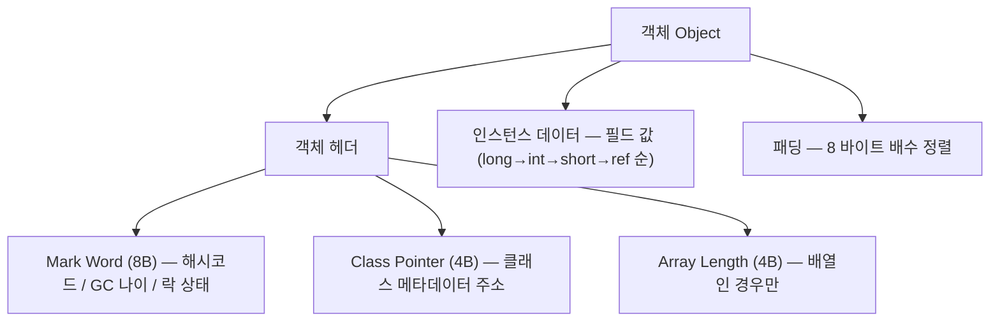
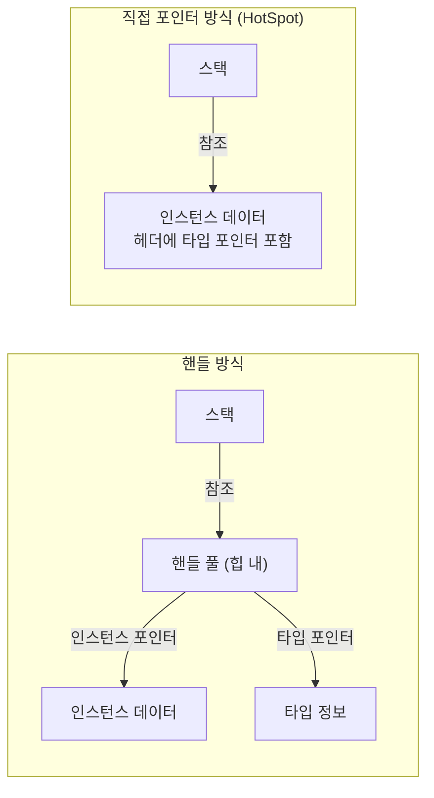
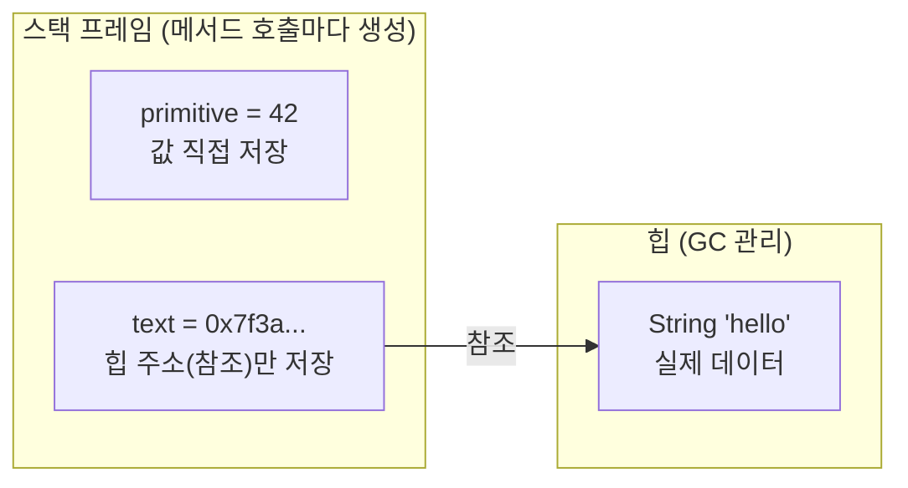

# 2장 자바 메모리 영역과 메모리 오버플로

> **"JVM 밑바닥까지 파헤치기"** (深入理解Java虚拟机 3판, 저우즈밍)

---

## 핵심 개념 --- 런타임 데이터 영역

JVM이 자바 프로그램을 실행하면 메모리를 여러 영역으로 나누어 관리한다. 각 영역은 고유한 목적과 생명주기를 갖는다.



### 각 영역 상세

| 영역 | 스레드 공유 | 목적 | 크기 설정 | OOM 발생 여부 |
| --- | --- | --- | --- | --- |
| **프로그램 카운터** | 비공유 | 현재 실행 중인 바이트코드 명령어 주소. 스레드 전환 후 복귀 지점 기억 | 고정 (매우 작음) | 유일하게 OOM **없음** |
| **JVM 스택** | 비공유 | 메서드 호출마다 스택 프레임 생성. 지역 변수, 피연산자 스택, 동적 링크, 반환 주소 | `-Xss` (기본 512K~1M) | StackOverflowError / OOM |
| **네이티브 메서드 스택** | 비공유 | JNI를 통한 네이티브 메서드 호출 | 구현체마다 다름 | StackOverflowError / OOM |
| **자바 힙** | **공유** | 모든 객체 인스턴스와 배열 저장. GC의 주요 대상 | `-Xms` / `-Xmx` | OutOfMemoryError |
| **메서드 영역** | **공유** | 클래스 구조 정보, 상수, 정적 변수, JIT 코드. JDK 8+에서 Metaspace로 변경 | `-XX:MetaspaceSize` / `-XX:MaxMetaspaceSize` | OutOfMemoryError |
| **런타임 상수 풀** | **공유** | 메서드 영역의 일부. 컴파일 시 생성된 리터럴/심볼릭 참조 + 런타임에 추가된 상수 | 메서드 영역에 포함 | OutOfMemoryError |
| **다이렉트 메모리** | - | NIO의 `DirectByteBuffer`가 네이티브 메모리를 직접 할당 | `-XX:MaxDirectMemorySize` | OutOfMemoryError |

### 각 영역을 왜 이렇게 설계했나

#### ① 프로그램 카운터 (PC Register) — 스레드마다 독립

CPU는 여러 스레드를 번갈아 실행한다. 스레드 A가 실행 중이다가 스레드 B로 전환될 때, A가 어디까지 실행했는지 기억해두지 않으면 돌아왔을 때 처음부터 다시 실행하게 된다. PC는 "내가 다음에 실행할 바이트코드 주소"를 저장한다. 스레드마다 독립적으로 가져야 하는 이유가 바로 이것이다. 크기가 매우 작고 고정적이라 OOM이 발생하지 않는 유일한 영역이다.

#### ② JVM 스택 — 메서드 호출의 기록장

메서드를 호출할 때마다 **스택 프레임** 하나가 생성된다. 프레임 안에는 4가지가 들어간다.

```text
스택 프레임 구조
├── 지역 변수 테이블  메서드 파라미터 + 내부 변수 (원시 타입은 값, 객체는 힙 주소)
├── 피연산자 스택    계산 중간값 임시 저장 (CPU 레지스터 역할)
├── 동적 링크       현재 메서드가 속한 클래스의 런타임 상수 풀 참조
└── 반환 주소       이 메서드가 끝나면 어디로 돌아갈지
```

메서드가 끝나면 프레임이 사라진다. 재귀 호출을 계속하면 프레임이 무한히 쌓여 `StackOverflowError`가 발생한다.

#### ③ 힙 — 모든 스레드가 공유하는 객체 창고

`new`로 만든 객체는 전부 힙에 저장된다. 여러 스레드가 같은 객체를 참조할 수 있기 때문에 공유 영역이다. 힙은 Young Generation(Eden + Survivor)과 Old Generation으로 나뉘며, GC가 주기적으로 죽은 객체를 수거한다.

#### ④ 메서드 영역 — 클래스 자체에 대한 정보

클래스를 로드하면 그 클래스의 구조 정보(필드명, 메서드 시그니처, 접근제어자 등)가 메서드 영역에 저장된다. 모든 스레드가 같은 클래스 정의를 공유하므로 공유 영역이다. JDK 8부터는 JVM 힙이 아닌 OS 네이티브 메모리(Metaspace)를 사용한다. 기존 PermGen이 고정 크기라 OOM이 잦았던 문제를 해결하기 위해서다.

#### ⑤ 다이렉트 메모리 — 왜 힙 밖에 두나

파일이나 네트워크에서 데이터를 읽을 때 일반적인 흐름은 다음과 같다.

```text
[전통 방식]  디스크/네트워크 → OS 커널 버퍼 → JVM 힙 복사 → 애플리케이션
[다이렉트]   디스크/네트워크 → 네이티브 메모리 (JVM과 OS가 공유) → 애플리케이션
```

힙을 거치지 않으므로 복사가 1회 줄고, GC STW 동안 I/O가 멈추는 문제도 없다. 단점은 GC가 자동으로 수거하지 않아 직접 해제해야 한다는 것이다. Netty, NIO, log-friends BatchTransporter가 이 방식을 쓴다.

### 핫스팟 VM의 메서드 영역 변천사

```text
JDK 6 이전:  PermGen (힙의 일부로 관리)
  └── 상수 풀, 클래스 메타데이터, 정적 변수 모두 PermGen에

JDK 7:       PermGen (일부 이전 시작)
  └── 문자열 상수 풀 → 힙으로 이동
  └── 정적 변수 → 힙으로 이동

JDK 8+:      Metaspace (네이티브 메모리)
  └── PermGen 완전 제거
  └── 클래스 메타데이터 → 네이티브 메모리(Metaspace)
  └── 상수 풀/정적 변수 → 힙에 유지
```

---

## 핵심 개념 --- 객체 생성 과정

`new` 키워드 하나로 시작되는 객체 생성은 내부적으로 복잡한 단계를 거친다.



### 객체 생성 5단계 상세

#### ① 클래스 로딩 체크

`new MyObject()`를 만나면 JVM은 먼저 `MyObject` 클래스가 이미 로드되어 있는지 확인한다. 런타임 상수 풀에서 심볼릭 참조(`MyObject`라는 이름)를 찾아 실제 클래스로 해석한다. 아직 로드되지 않았다면 클래스 로더가 `.class` 파일을 읽어 메서드 영역에 등록한다.

#### ② 메모리 할당

클래스가 로드되면 객체 크기가 컴파일 시점에 이미 결정되어 있다. JVM은 힙에서 그만큼의 공간을 예약한다. 힙 상태에 따라 두 가지 방식으로 할당한다.

- **포인터 범핑**: G1 같은 컴팩트 GC가 힙을 정리해 빈 공간이 연속적일 때. 경계 포인터를 객체 크기만큼 앞으로 밀기만 하면 된다. 매우 빠름.
- **프리 리스트**: CMS처럼 힙에 구멍이 많을 때. 빈 공간 목록에서 맞는 크기를 찾아야 한다. 상대적으로 느림.

멀티스레드 환경에서 두 스레드가 동시에 같은 포인터를 가져가는 충돌을 막기 위해 **TLAB**을 사용한다 (아래 섹션 참조).

#### ③ 메모리 초기화 (Zero-fill)

할당된 공간을 전부 0으로 채운다. 이 덕분에 개발자가 명시적으로 초기화하지 않아도 `int` 필드는 0, `boolean`은 false, 참조 타입은 null이 된다. TLAB을 쓰면 할당과 동시에 초기화가 이루어진다.

#### ④ 객체 헤더 설정

객체 헤더에 두 가지를 기록한다.

- **Mark Word**: 해시코드, GC 나이(Minor GC를 몇 번 살아남았는지), 락 상태
- **Class Pointer**: 이 객체가 어떤 클래스인지 메서드 영역의 클래스 정보를 가리키는 포인터

#### ⑤ `<init>` 호출 (생성자 실행)

JVM 입장에서는 여기서 비로소 진짜 초기화가 시작된다. 개발자가 작성한 생성자 코드가 실행되고, 필드에 초기값이 할당된다. 이 단계가 끝나야 사용 가능한 객체가 된다.

### TLAB — 동시 할당 문제 해결

힙은 모든 스레드가 공유한다. 스레드 A와 B가 동시에 `new`를 호출하면 같은 힙 포인터를 가져가는 충돌이 발생할 수 있다.

```text
문제 상황
  스레드 A: 포인터 위치 확인 → (스레드 전환) → 스레드 B: 같은 위치 확인
  → 두 스레드가 같은 메모리에 객체를 덮어쓰는 충돌 발생
```

**TLAB 해결 방식**: 각 스레드가 Eden 영역의 일부를 미리 독점 예약한다. 스레드가 `new`를 호출하면 자기 전용 구역에서만 할당하므로 다른 스레드와 경쟁할 필요가 없다.

```text
TLAB 구조
  힙 Eden 영역
  ├── 스레드 A 전용 구역 (TLAB-A) ← A는 여기서만 할당
  ├── 스레드 B 전용 구역 (TLAB-B) ← B는 여기서만 할당
  └── 스레드 C 전용 구역 (TLAB-C) ← C는 여기서만 할당

  TLAB 가득 참 → 새 TLAB 발급 (이때만 락 필요)
  평소 new = 포인터 bump 1번 = 락 없음 = malloc보다 빠름
```

### 객체 메모리 레이아웃 (64-bit HotSpot)



### 객체 접근 방식



- **핸들 방식**: GC 이동 시 핸들만 갱신하면 됨 / 단점: 간접 참조 2회
- **직접 포인터 방식**: 접근 속도 빠름 (1회) / 단점: GC 이동 시 참조 전체 갱신

### 변수 저장 위치 — 스택 vs 힙



| 변수 종류 | 저장 위치 | 내용 | 정리 시점 |
| --- | --- | --- | --- |
| 원시 타입 지역 변수 (`Int`, `Long`, `Double` ...) | **스택** | 값 직접 | 메서드 종료 시 자동 |
| 객체 타입 지역 변수 (`String`, 배열, 클래스 ...) | 스택 + **힙** | 스택에 힙 주소, 힙에 실제 값 | GC가 힙 정리 |
| 클래스/파일 수준 변수 (`var depth = 0` 등) | **힙** | 클래스 필드로 컴파일됨 | GC |

> 스택은 힙을 **참조(주소)** 로 가리킨다. 힙이 기준이고 스택이 따라간다.

---

## 핵심 개념 --- OOM 유형별 원인과 대응

| OOM 유형 | 에러 메시지 | 주요 원인 | 진단 방법 | 대응 |
| --- | --- | --- | --- | --- |
| **힙 OOM** | `Java heap space` | 메모리 누수, 과다 객체 생성, 힙 크기 부족 | `-XX:+HeapDumpOnOutOfMemoryError` → MAT/VisualVM으로 분석 | 누수면 코드 수정, 용량 부족이면 `-Xmx` 증가 |
| **스택 오버플로** | `StackOverflowError` | 재귀 호출 깊이 초과, 과도한 메서드 호출 체인 | 스택 트레이스 분석 | 재귀를 반복으로 변환, `-Xss` 조정 |
| **스택 OOM** | `unable to create native thread` | 스레드 수 과다 (각 스레드마다 스택 메모리 소비) | `jstack`으로 스레드 수 확인 | 스레드 풀 사용, `-Xss` 줄이기, OS 제한 확인 |
| **메서드 영역 OOM** | `Metaspace` | 동적 프록시/CGLIB 남용, 클래스 로더 누수, JSP 다량 생성 | `-XX:+TraceClassLoading`, `jcmd VM.classloader_stats` | `-XX:MaxMetaspaceSize` 증가, 클래스 언로딩 확인 |
| **다이렉트 메모리 OOM** | `Direct buffer memory` | NIO DirectByteBuffer 과다 할당, 해제 지연 | NMT(`-XX:NativeMemoryTracking`) 활성화 | `-XX:MaxDirectMemorySize` 조정, 명시적 `Cleaner` 호출 |
| **GC 오버헤드** | `GC overhead limit exceeded` | GC에 98% 이상 시간 소비하면서 힙 2% 미만 회수 | GC 로그 분석 | 메모리 누수 해결, 힙 증가 |

### OOM 4가지 유형 — 왜 발생하나

#### ① 힙 OOM — `Java heap space`

GC는 더 이상 참조되지 않는 객체만 수거한다. 객체가 GC Root(스택 변수, 정적 변수 등)에서 계속 도달 가능하면 수거할 수 없다. 리스트에 계속 객체를 추가하면서 리스트를 버리지 않으면 힙이 가득 찰 때까지 객체가 쌓인다.

```text
GC Root(list) → OOMObject → OOMObject → OOMObject → ...
                모두 도달 가능 → GC가 하나도 못 버림 → 힙 꽉 참
```

#### ② 스택 OOM — `StackOverflowError` / `unable to create native thread`

두 가지 다른 원인이다.

- `StackOverflowError`: 재귀 호출이 너무 깊어 한 스레드의 스택 공간(`-Xss`) 초과
- `unable to create native thread`: 스레드를 너무 많이 만들어 OS 메모리 부족. 각 스레드는 자기 스택 공간을 가지므로 스레드 1000개 × 1MB = 1GB 소비

#### ③ Metaspace OOM — `Metaspace`

CGLIB, ByteBuddy 같은 라이브러리는 런타임에 새로운 클래스를 동적으로 생성한다. 스프링의 AOP 프록시, Hibernate의 지연 로딩 프록시가 대표적이다. `useCache(false)` 옵션으로 캐시를 끄거나, 클래스 로더를 제대로 닫지 않으면 클래스가 계속 누적되어 Metaspace가 가득 찬다.

#### ④ 다이렉트 메모리 OOM — `Direct buffer memory`

`ByteBuffer.allocateDirect()`는 힙 밖 네이티브 메모리를 할당한다. GC 대상이 아니므로 명시적으로 해제하지 않으면 계속 쌓인다. `-XX:MaxDirectMemorySize`에 도달하면 OOM이 발생한다. Full GC가 일어날 때 간접적으로 정리되기도 하지만 보장되지 않는다.

### 실전 코드 예시: 힙 OOM 유발

```java
// VM 옵션: -Xms20m -Xmx20m -XX:+HeapDumpOnOutOfMemoryError
public class HeapOOM {
    static class OOMObject {}
    public static void main(String[] args) {
        List<OOMObject> list = new ArrayList<>();
        while (true) {
            list.add(new OOMObject());  // GC Root(list)에서 도달 가능 → 회수 불가
        }
    }
}
```

### 실전 코드 예시: 메서드 영역 OOM (Metaspace)

```java
// VM 옵션: -XX:MetaspaceSize=10m -XX:MaxMetaspaceSize=10m
// CGLIB/ByteBuddy로 동적 클래스를 끊임없이 생성하면 Metaspace 소진
public class MetaspaceOOM {
    public static void main(String[] args) {
        while (true) {
            Enhancer enhancer = new Enhancer();
            enhancer.setSuperclass(Object.class);
            enhancer.setUseCache(false);
            enhancer.setCallback((MethodInterceptor) (o, m, a, p) -> p.invokeSuper(o, a));
            enhancer.create();  // 매번 새로운 클래스 생성 → Metaspace 소진
        }
    }
}
```

---

## 학습 완료 체크리스트

- [ ] 5개 런타임 데이터 영역(PC, JVM 스택, 네이티브 스택, 힙, 메서드 영역)의 역할과 스레드 공유 여부를 설명할 수 있다
- [ ] 다이렉트 메모리가 힙 외부에 할당되는 이유와 GC와의 관계를 설명할 수 있다
- [ ] 객체 생성 5단계(클래스 로딩 → 메모리 할당 → 초기화 → 헤더 설정 → `<init>`)를 순서대로 설명할 수 있다
- [ ] TLAB의 목적과 동시 할당 문제 해결 방식을 설명할 수 있다
- [ ] 4가지 OOM 유형(힙, 스택, Metaspace, 다이렉트 메모리)의 원인과 진단 방법을 구분할 수 있다

---

## 핵심 질문

### Q1. JVM 런타임 데이터 영역 중 OOM이 발생하지 않는 곳은?

**프로그램 카운터(PC Register)**가 유일하다. JVM 명세에서 이 영역에 대해 OutOfMemoryError를 정의하지 않는다. 크기가 고정적이고 매우 작으며, 각 스레드가 현재 실행 중인 바이트코드 주소만 저장한다.

### Q2. 핫스팟 VM에서 객체 접근 방식이 핸들이 아닌 직접 포인터인 이유는?

직접 포인터 방식은 참조를 따라가는 데 한 번의 메모리 접근만 필요하다 (핸들은 두 번). 자바 프로그램의 객체 접근 빈도가 매우 높으므로 이 차이가 누적되면 큰 성능 차이가 된다. 대신 GC가 객체를 이동시킬 때 모든 참조를 갱신해야 하는 부담이 있다.
