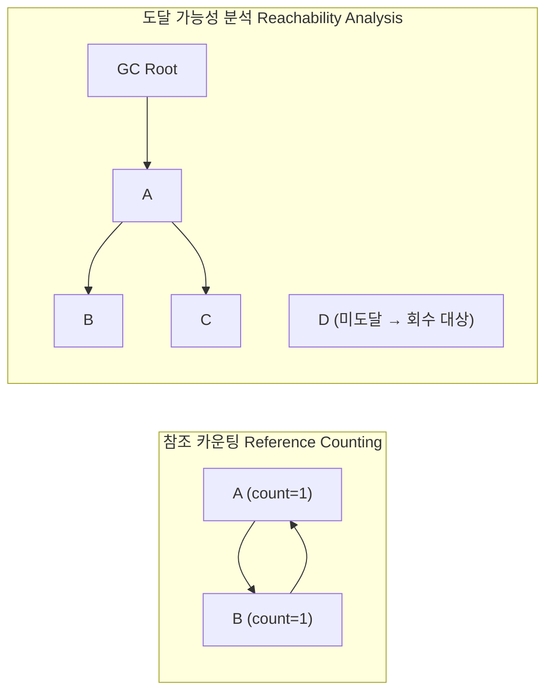
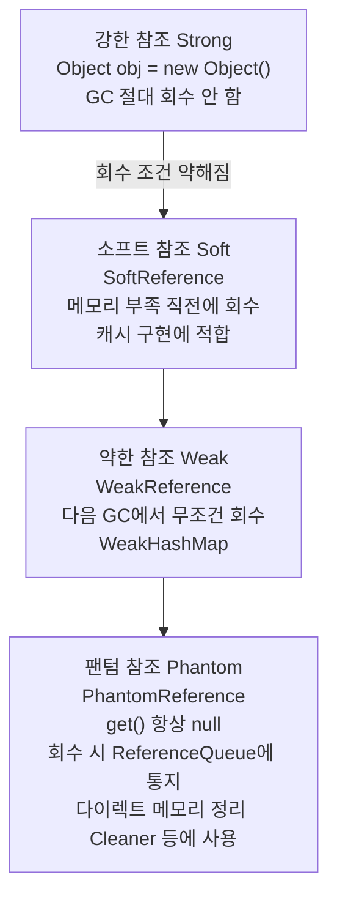
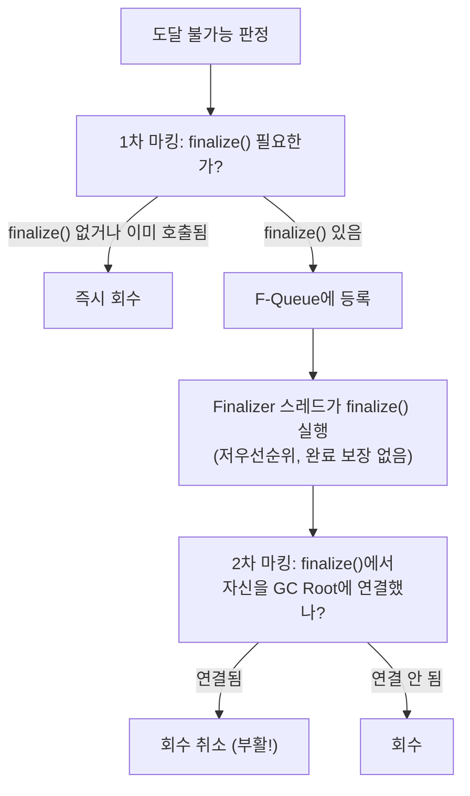
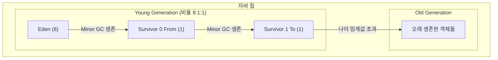
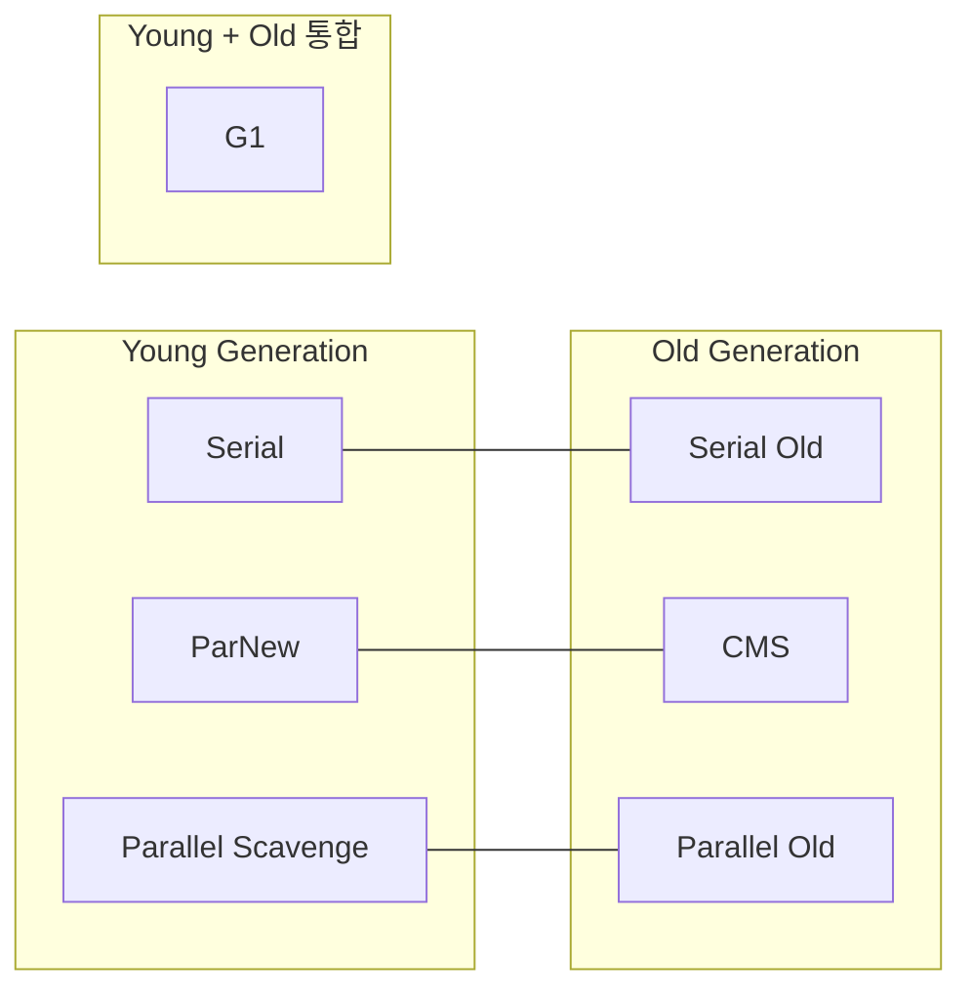
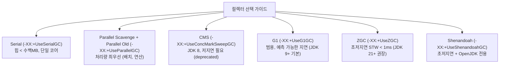

# 3장 가비지 컬렉터와 메모리 할당 전략

> **"JVM 밑바닥까지 파헤치기"** (深入理解Java虚拟机 3판, 저우즈밍)

---

## 핵심 개념 --- 도달 가능성 분석과 GC Roots

### 참조 카운팅 vs 도달 가능성 분석



- **참조 카운팅**: 순환 참조 시 count=1로 남아 회수 불가
- **도달 가능성 분석**: GC Roots에서 참조 체인을 따라 도달 불가능한 객체를 쓰레기로 판정
- JVM은 도달 가능성 분석을 사용한다.

### GC Roots가 될 수 있는 객체

| GC Root 종류 | 설명 | 예시 |
|-------------|------|------|
| **JVM 스택의 지역 변수** | 현재 실행 중인 메서드의 스택 프레임에 있는 참조 | 메서드 내 `Object obj = new Object()` |
| **메서드 영역의 정적 필드** | 클래스의 `static` 필드가 참조하는 객체 | `static List<String> cache = ...` |
| **메서드 영역의 상수** | 상수 풀에서 참조되는 객체 | `static final String S = "hello"` |
| **JNI 참조** | 네이티브 메서드가 생성한 글로벌/로컬 참조 | JNI의 `NewGlobalRef()` |
| **동기화 모니터** | `synchronized`로 잠긴 객체 | `synchronized(lockObj) { ... }` |
| **JVM 내부 참조** | 기본 타입 래퍼, 시스템 클래스 로더, 예외 클래스 등 | `Class`, `ClassLoader`, `Thread` 객체 |
| **JVMTI 콜백 참조** | JVMTI 에이전트가 등록한 참조 | 디버거, 프로파일러 |

### 네 가지 참조 강도



### finalize() 메서드와 두 번의 마킹



> 주의: `finalize()`는 한 번만 호출. 두 번째 GC에서는 부활 기회 없음.
> 결론: `finalize()` 사용을 피하라. `try-finally` 또는 `Cleaner`를 사용.

---

## 핵심 개념 --- GC 알고리즘 4종

### 세대 단위 컬렉션 이론 (Generational Collection)

세 가지 가설에 기반한다:

1. **약한 세대 가설**: 대부분의 객체는 일찍 죽는다 (Infant Mortality)
2. **강한 세대 가설**: 여러 번 GC를 살아남은 객체는 앞으로도 살아남을 가능성이 높다
3. **세대 간 참조 가설**: 세대 간 참조는 전체 참조 중 극소수다



- **Minor GC**: Young 영역만 수집 (빈번, 빠름)
- **Major GC**: Old 영역 수집
- **Full GC**: 전체 힙 수집 (느림, 가급적 회피)

### 알고리즘 1: 마크-스윕 (Mark-Sweep)

```
마킹 전:
┌──┬──┬──┬──┬──┬──┬──┬──┬──┬──┐
│ A│  │ B│ C│  │ D│  │ E│  │ F│   A,C,E = 생존  B,D,F = 쓰레기
└──┴──┴──┴──┴──┴──┴──┴──┴──┴──┘

마킹 후:
┌──┬──┬──┬──┬──┬──┬──┬──┬──┬──┐
│ A│  │ x│ C│  │ x│  │ E│  │ x│   x = 마킹된 쓰레기
└──┴──┴──┴──┴──┴──┴──┴──┴──┴──┘

스윕 후:
┌──┬──┬──┬──┬──┬──┬──┬──┬──┬──┐
│ A│  │__│ C│  │__│  │ E│  │__│   __ = 빈 공간 (단편화 발생!)
└──┴──┴──┴──┴──┴──┴──┴──┴──┴──┘

장점: 구현 단순, 기본 알고리즘
단점: ① 실행 효율 불안정 (객체 수에 비례)
      ② 메모리 단편화 → 큰 객체 할당 실패 가능 → 또 다른 GC 유발
```

### 알고리즘 2: 마크-카피 (Mark-Copy)

```
할당 전 (메모리를 둘로 나눔):
┌──────── 사용 중 ────────┐┌──────── 비어 있음 ───────┐
│ A│ B│ C│ D│ E│ F│  │  │ ││                          │
└─────────────────────────┘└──────────────────────────┘

복사 후 (생존 객체만 빈 쪽으로):
┌──────── 비어 있음 ───────┐┌──────── 사용 중 ────────┐
│                          ││ A│ C│ E│              │ │
└──────────────────────────┘└──────────────────────────┘
                              ^ 연속 배치, 단편화 없음!

장점: 단편화 없음, 할당이 포인터 범핑만으로 가능 (매우 빠름)
단점: 메모리 50% 낭비 → 개선안: Eden:S0:S1 = 8:1:1 (낭비 10%만)

Young Generation에서 주로 사용 (대부분 일찍 죽으므로 복사할 객체가 적음)
```

### 알고리즘 3: 마크-컴팩트 (Mark-Compact)

```
마킹 후:
┌──┬──┬──┬──┬──┬──┬──┬──┬──┬──┐
│ A│  │ x│ C│  │ x│  │ E│  │ x│
└──┴──┴──┴──┴──┴──┴──┴──┴──┴──┘

컴팩트 후 (생존 객체를 한쪽으로 밀어넣음):
┌──┬──┬──┬──┬──┬──┬──┬──┬──┬──┐
│ A│ C│ E│  │  │  │  │  │  │  │
└──┴──┴──┴──┴──┴──┴──┴──┴──┴──┘
         ↑ 여기부터 포인터 범핑으로 할당 가능

장점: 단편화 없음, 메모리 낭비 없음 (카피와 달리)
단점: 이동 비용 높음, STW 시간 증가 (특히 Old Gen에서)

Old Generation에서 주로 사용 (생존 객체가 많아 카피 비용이 큼)
```

### 알고리즘 비교 종합

| 항목 | 마크-스윕 | 마크-카피 | 마크-컴팩트 |
|------|----------|----------|------------|
| **단편화** | 발생 | 없음 | 없음 |
| **메모리 효율** | 높음 | 낮음 (50% 또는 10% 낭비) | 높음 |
| **이동 비용** | 없음 | 있음 (복사) | 있음 (이동) |
| **할당 속도** | 느림 (프리 리스트) | 빠름 (포인터 범핑) | 빠름 (포인터 범핑) |
| **STW 시간** | 중간 | 짧음 (Young에서) | 길 수 있음 |
| **적합 영역** | CMS의 Old Gen | Young Gen | Serial Old, G1의 Old Gen |

---

## 핵심 개념 --- 핫스팟 알고리즘 상세 구현

### 루트 노드 열거 (Root Enumeration)

GC Roots를 찾기 위해 전체 스택/상수 풀을 훑으면 너무 느리다. 핫스팟은 **OopMap**(Ordinary Object Pointer Map)이라는 자료구조를 사용한다.

```
OopMap: 스택 프레임/레지스터 어디에 참조가 있는지 컴파일 시 미리 기록

JIT 컴파일 코드:
  mov [rbp-0x10], rax   ; OopMap에 "rbp-0x10에 참조 있음" 기록
  call some_method       ; ← 안전 지점, OopMap 스냅샷 존재
  ...

GC 시: OopMap을 읽어서 GC Roots를 빠르게 열거 (전체 스캔 불필요)
```

### 안전 지점 (Safepoint)과 안전 지역 (Safe Region)

```
OopMap이 기록되는 지점 = 안전 지점 (모든 명령어에 다 기록하면 공간 낭비)

안전 지점이 되는 곳:
  - 메서드 호출 (call)
  - 루프의 백엣지 (back-edge, 루프 반복 지점)
  - 예외가 발생할 수 있는 지점

GC가 "멈추세요!" → 각 스레드가 가장 가까운 안전 지점까지 달려간 후 정지

두 가지 인터럽트 방식:
┌─ 선점형 (Preemptive): JVM이 강제로 스레드 중단 → 거의 사용하지 않음
└─ 자발형 (Voluntary): 폴링 플래그를 세팅 → 스레드가 안전 지점에서 확인 후 자발적 정지
   핫스팟은 자발형 사용. 폴링은 메모리 보호 트랩 (효율적)

안전 지역 (Safe Region):
  스레드가 sleep/blocked 상태면 안전 지점까지 갈 수 없다.
  → "이 코드 영역 안에서는 참조가 변하지 않는다"고 선언 = 안전 지역
  → GC는 안전 지역에 있는 스레드를 무시하고 진행
  → 스레드가 안전 지역을 빠져나갈 때 GC 완료 여부 확인
```

### 기억 집합 (Remembered Set)과 카드 테이블 (Card Table)

```
문제: Old → Young 참조가 있으면 Minor GC 시 Old 전체를 스캔해야 하나?
해결: 기억 집합 (Remembered Set) - Old에서 Young을 가리키는 포인터들을 기록

구현: 카드 테이블 (Card Table)
┌─────────────────────────────────────────────────┐
│          Old Generation 메모리                   │
│  ┌─────┐┌─────┐┌─────┐┌─────┐┌─────┐┌─────┐   │
│  │Card0││Card1││Card2││Card3││Card4││Card5│   │
│  │     ││ ★   ││     ││ ★   ││     ││     │   │
│  └─────┘└─────┘└─────┘└─────┘└─────┘└─────┘   │
│                                                 │
│  카드 테이블: [0, 1, 0, 1, 0, 0]                │
│  ★ = dirty (이 카드 안에 Young을 가리키는 참조 있음) │
│                                                 │
│  Minor GC 시: dirty 카드만 스캔 → 효율적!        │
└─────────────────────────────────────────────────┘

카드 크기: 보통 512 바이트 (2^9)
바이트 배열로 구현: CARD_TABLE[address >> 9] = 1 (dirty)
```

### 쓰기 장벽 (Write Barrier)

```java
// 참조 필드에 값을 쓸 때 카드를 dirty로 만들어야 한다.
// AOP의 Around Advice처럼, 참조 대입 전후에 코드를 삽입

// 의사 코드:
void oop_field_store(oop* field, oop new_value) {
    // 쓰기 전 장벽 (Pre-Write Barrier) — G1, Shenandoah에서 SATB용
    pre_write_barrier(field);

    *field = new_value;  // 실제 참조 대입

    // 쓰기 후 장벽 (Post-Write Barrier) — 카드 테이블 갱신
    post_write_barrier(field, new_value);
    // → CARD_TABLE[field의 카드 인덱스] = DIRTY
}
```

**거짓 공유 (False Sharing) 문제**: 여러 스레드가 같은 캐시 라인에 속하는 카드 테이블 엔트리를 갱신하면 성능 저하. JDK 7+에서 `-XX:+UseCondCardMark` 옵션으로 "이미 dirty인 카드는 갱신하지 않음" 최적화.

### 동시 접근 가능성 분석 (Tri-color Marking)

```
삼색 표시법:
  ■ 흰색: 아직 방문 안 됨 (GC 후에도 흰색이면 회수)
  ■ 회색: 방문했지만 자식을 아직 다 처리 안 함
  ■ 검정: 방문 완료, 모든 자식도 처리

문제: GC와 애플리케이션이 동시에 실행 → 참조가 변할 수 있음

위험한 시나리오 ("객체 소실"):
  1. 검정 객체(A)가 흰색 객체(C)를 새로 참조 (A→C 추가)
  2. 회색 객체(B)가 흰색 객체(C)의 참조를 끊음 (B→C 삭제)
  → C는 검정(A)에서만 도달 가능하지만 이미 검정은 재방문 안 함
  → C가 살아있는데 회수됨!

이 두 조건이 동시에 만족되면 살아있는 객체가 잘못 회수된다.
해결법 (둘 중 하나만 깨면 됨):

┌── 증분 갱신 (Incremental Update) ─── CMS 사용 ──┐
│ 검정→흰색 참조가 추가되면 검정을 회색으로 되돌림  │
│ → 재마킹(Remark) 단계에서 다시 스캔              │
└─────────────────────────────────────────────────┘

┌── SATB (Snapshot-At-The-Beginning) ─── G1 사용 ──┐
│ 회색→흰색 참조가 삭제되면 삭제 전 참조를 기록     │
│ → 마킹 시작 시점의 스냅샷 기준으로 판정           │
│ → 일부 플로팅 가비지 발생 가능 (다음 GC에서 회수) │
└──────────────────────────────────────────────────┘
```

---

## 핵심 개념 --- 클래식 GC 비교

### 컬렉터 관계도



### 각 컬렉터 상세

**1. Serial / Serial Old**

```
단일 스레드. GC 동안 모든 애플리케이션 스레드 정지 (STW).

App Thread  ─────────│ STW │─────────────────│ STW │──────────
                      └─────┘                 └─────┘
GC Thread             [GC]                    [GC]

Young: 마크-카피
Old:   마크-컴팩트

용도: 클라이언트 모드, 소규모 힙 (수십~수백 MB)
장점: 단순, 오버헤드 최소 (단일 코어에서 최적)
```

**2. ParNew**

```
Serial의 멀티스레드 버전. CMS와 조합하기 위해 존재.

App Thread  ─────────│    STW    │─────────
                      └───────────┘
GC Thread 1           [   GC    ]
GC Thread 2           [   GC    ]
GC Thread N           [   GC    ]

Young: 마크-카피 (병렬)
스레드 수: -XX:ParallelGCThreads (기본 = CPU 코어 수)

JDK 9부터 G1의 기본 채택으로 중요도 감소
```

**3. Parallel Scavenge / Parallel Old**

```
"처리량(Throughput) 우선" 컬렉터.
처리량 = 애플리케이션 실행 시간 / (애플리케이션 실행 시간 + GC 시간)

핵심 파라미터:
  -XX:MaxGCPauseMillis=<N>     GC 최대 중지 시간 목표
  -XX:GCTimeRatio=<N>          처리량 목표 (기본 99 → GC 시간 1% 이하)
  -XX:+UseAdaptiveSizePolicy   자동 튜닝 (Eden, Survivor 비율, 승격 임계값)

Young: 마크-카피 (병렬)
Old:   마크-컴팩트 (병렬)

용도: 배치 처리, 백그라운드 연산 (응답 시간보다 처리량 중시)
```

**4. CMS (Concurrent Mark Sweep)**

```
"최단 중지 시간(Low Latency)" 컬렉터. Old Gen에 마크-스윕 사용.

App  ──│STW│──────────────────────│STW│──────────────────────────
       └───┘                      └───┘
GC   [초기마킹]  [동시 마킹]   [재마킹]  [동시 스윕]

4단계:
1. 초기 마킹 (Initial Mark) — STW
   GC Roots에서 직접 참조하는 객체만 마킹 (매우 빠름)

2. 동시 마킹 (Concurrent Mark)
   애플리케이션과 동시 실행. GC Roots에서 도달 가능한 전체 그래프 탐색
   → 증분 갱신(Incremental Update)으로 참조 변경 추적

3. 재마킹 (Remark) — STW
   동시 마킹 중 변경된 참조를 재처리 (보통 초기 마킹보다 약간 김)

4. 동시 스윕 (Concurrent Sweep)
   애플리케이션과 동시에 쓰레기 회수. 객체 이동 없음.

단점:
  ① CPU 민감: 동시 단계에서 GC 스레드가 CPU 점유 → 처리량 감소
  ② 부유 쓰레기: 동시 스윕 중 새로 발생한 쓰레기는 다음 GC에서 회수
  ③ 메모리 단편화: 마크-스윕 → 단편화 → Concurrent Mode Failure 시 Serial Old로 풀백
  ④ 예약 공간: Old가 가득 차기 전에 GC 시작 (-XX:CMSInitiatingOccupancyFraction)

JDK 9에서 deprecated, JDK 14에서 제거
```

**5. G1 (Garbage First)**

```
"서버급 기본 컬렉터" (JDK 9+). 힙을 동일 크기 Region으로 분할.

┌────┬────┬────┬────┬────┬────┬────┬────┐
│ E  │ E  │ S  │    │ O  │ O  │ H  │ H  │
├────┼────┼────┼────┼────┼────┼────┼────┤
│ O  │ E  │    │ O  │    │ E  │ O  │    │
├────┼────┼────┼────┼────┼────┼────┼────┤
│    │ O  │ E  │ S  │ O  │    │ O  │ E  │
└────┴────┴────┴────┴────┴────┴────┴────┘

E = Eden   S = Survivor   O = Old   H = Humongous(거대 객체)

핵심 아이디어:
  - 힙을 2048개 Region으로 분할 (1~32MB each)
  - Region 단위로 회수 가치(쓰레기 비율)를 추적
  - 정해진 STW 시간 내에서 가장 가치 높은 Region부터 수집 = "Garbage First"
  - Mixed GC: Young + 일부 Old Region을 함께 수집

GC 사이클:
1. Young-only 단계
   - Minor GC (Young Region만 수집)
   - 반복하다가 Old 점유율이 임계값(-XX:InitiatingHeapOccupancyPercent, 기본 45%) 도달

2. 동시 마킹 사이클 (Concurrent Marking Cycle)
   ① 초기 마킹 (Initial Mark, STW) — Minor GC에 편승
   ② 동시 마킹 (Concurrent Mark) — SATB 방식
   ③ 최종 마킹 (Final Mark, STW) — SATB 버퍼 처리
   ④ 정리 (Cleanup, STW) — 빈 Region 회수, 회수 가치 정렬

3. Mixed GC 단계
   - Young + 수익성 높은 Old Region을 함께 수집 (카피 방식)
   - 여러 회의 Mixed GC로 나눠서 Old 정리

핵심 파라미터:
  -XX:MaxGCPauseMillis=200          목표 STW 시간 (기본 200ms)
  -XX:G1HeapRegionSize=<N>          Region 크기
  -XX:InitiatingHeapOccupancyPercent=45

장점: 예측 가능한 STW, Region 단위 유연한 수집, CMS의 단편화 문제 해소
한계: 메모리 오버헤드 (Remembered Set이 힙의 20% 이상 차지 가능)
```

### 클래식 GC 비교표

| 항목 | Serial | ParNew | Parallel Scavenge | CMS | G1 |
|------|--------|--------|-------------------|-----|-----|
| **대상** | Young/Old | Young | Young/Old | Old | Young+Old |
| **알고리즘** | 카피/컴팩트 | 카피 | 카피/컴팩트 | 마크-스윕 | 카피+컴팩트 |
| **스레드** | 단일 | 병렬 | 병렬 | 동시+병렬 | 동시+병렬 |
| **STW** | 전체 | 전체 | 전체 | 초기마킹+재마킹만 | 초기마킹+최종마킹+정리 |
| **목표** | 단순성 | CMS 호환 | 처리량 | 저지연 | 균형 (예측 가능한 지연) |
| **힙 크기** | ~수백MB | ~수GB | ~수GB | ~수GB | 수GB~수십GB |
| **단편화** | 없음 | 없음 | 없음 | **발생** | 없음 |
| **기본 사용** | 클라이언트 | (deprecated) | JDK 8 서버 기본 | (JDK 14 제거) | **JDK 9+ 서버 기본** |

---

## 핵심 개념 --- ZGC와 셰넌도어

### Shenandoah GC

```
목표: GC 중지 시간을 힙 크기와 무관하게 10ms 이하로

핵심 기술: 동시 컴팩션 (Concurrent Compaction)

Brooks Pointer (전달 포인터):
  모든 객체 앞에 추가 포인터 하나 (자기 자신 또는 새 위치)
  ┌──────────┬────────────────────┐
  │ fwd ptr  │  객체 데이터        │ → 이동 전: fwd ptr = 자기 자신
  └──────────┴────────────────────┘
  이동 후: fwd ptr = 새 위치 → 모든 접근이 fwd ptr를 경유

9단계 GC 사이클:
  1. 초기 마킹 (STW, 짧음)
  2. 동시 마킹
  3. 최종 마킹 (STW, 짧음)
  4. 동시 정리 — 완전히 빈 Region 즉시 회수
  5. 동시 이동 준비 — 이동할 Region 선택 (Collection Set)
  6. 초기 이동 (STW, 짧음) — GC Roots가 가리키는 Collection Set 내 객체만 이동
  7. 동시 이동 — 나머지 객체를 애플리케이션과 동시에 이동!
  8. 참조 갱신 시작 (STW, 짧음)
  9. 동시 참조 갱신 + 정리

읽기 장벽 + 쓰기 장벽 모두 사용 → JDK 13+에서 로드 참조 장벽으로 전환
```

### ZGC (Z Garbage Collector)

```
목표: STW 시간 1ms 이하 (JDK 21에서 세대 구분 ZGC로 진화)

핵심 기술 1: 컬러드 포인터 (Colored Pointers)
  64-bit 객체 참조에 메타데이터를 인코딩 (x86-64에서 48비트 주소 중 4비트 활용)

  ┌───────┬───┬───┬───┬───┬─────────────────────────────────────┐
  │unused │ M0│ M1│Rem│Fin│          객체 주소 (44 bit)          │
  │(16bit)│   │   │ap │   │          = 16TB 주소 공간            │
  └───────┴───┴───┴───┴───┴─────────────────────────────────────┘
  M0/M1: 마킹 비트 (삼색 표시용, GC 사이클마다 교대)
  Remap: 재배치 완료 표시
  Fin:   finalize 대상

핵심 기술 2: 로드 배리어 (Load Barrier)
  객체 참조를 "읽을 때" 배리어 실행 (쓰기 장벽이 아님!)
  → 참조의 컬러 비트를 검사, 필요하면 포인터를 자가 치유 (Self-Healing)

  if (ptr의 컬러가 잘못됨) {
      ptr = slow_path(ptr);  // 재배치된 객체의 새 주소로 갱신
      *field = ptr;           // 자가 치유: 다음번엔 배리어 안 탐
  }

핵심 기술 3: 멀티 매핑 (Multi-Mapping)
  같은 물리 메모리를 3개의 가상 주소에 매핑
  → 컬러드 포인터의 비트가 달라도 같은 물리 메모리 접근 가능

ZGC 사이클:
  1. STW: 마킹 시작 (GC Roots만, ~1ms)
  2. 동시 마킹 + 참조 처리
  3. STW: 마킹 종료 (~1ms)
  4. 동시 재배치 준비 (Relocation Set 선정)
  5. STW: 재배치 시작 (GC Roots만, ~1ms)
  6. 동시 재배치
     → 로드 배리어가 아직 재배치 안 된 참조를 만나면 즉석에서 갱신

STW는 3회, 각각 ~1ms (힙 크기와 무관!)
```

### 세대 구분 ZGC (Generational ZGC, JDK 21+)

```
기존 ZGC의 약점:
  - 세대 구분 없이 전체 힙을 동시 처리 → 수명이 짧은 객체에도 동일한 비용
  - 할당 속도가 GC 속도를 초과하면 "Allocation Stall" 발생

Generational ZGC:


- Young/Old을 독립적으로 동시 수집
- 기억 집합: 비트맵 기반 (G1의 카드 테이블보다 효율적)
- Young GC가 Old와 완전히 독립 → 더 빈번한 Young 수집 가능
- STW 여전히 ~1ms

JDK 21: `-XX:+UseZGC` (세대 구분 ZGC 기본 활성화), `-XX:-ZGenerational` 으로 비세대 모드 전환 가능 (JDK 23에서 제거 예정)

### 저지연 GC 비교

| 항목 | Shenandoah | ZGC | Generational ZGC |
|------|-----------|-----|------------------|
| **개발** | Red Hat (OpenJDK) | Oracle (OpenJDK) | Oracle |
| **최초 버전** | JDK 12 | JDK 11 | JDK 21 |
| **동시 컴팩션** | Brooks Pointer | 컬러드 포인터 + 로드 배리어 | 동일 + 세대 구분 |
| **배리어** | 로드 참조 장벽 | 로드 배리어 | 로드 배리어 + 기억 집합 |
| **STW 목표** | <10ms | <1ms | <1ms |
| **세대 구분** | 없음 | 없음 | **있음** |
| **힙 제한** | 없음 | 16TB (44-bit) | 16TB |
| **Oracle JDK** | 미포함 | 포함 | 포함 |

---

## 핵심 개념 --- 적합한 컬렉터 선택



---

## 핵심 개념 --- 메모리 할당과 회수 전략

1. **객체는 먼저 Eden에 할당** — Eden이 가득 → Minor GC 발생
2. **큰 객체는 Old Gen에 직접 할당** — `-XX:PretenureSizeThreshold=<bytes>` / 긴 배열·큰 문자열이 Eden을 경유하지 않고 바로 Old로
3. **장기 생존 객체는 Old Gen으로 승격** — 객체 나이 = GC 생존 횟수 / `-XX:MaxTenuringThreshold=15` (기본) → 15번 Minor GC 생존 시 Old로 이동
4. **동적 나이 판정** — Survivor 영역에서 같은 나이 객체 합이 Survivor의 50%를 넘으면 그 나이 이상의 객체를 즉시 Old로 승격
5. **공간 할당 보장 (HandlePromotionFailure)** — Minor GC 전 "Old 여유 공간 ≥ Young 전체 객체" 체크, 부족하면 Full GC 먼저 수행

---

## 이 프로젝트(log-friends)와의 연결

### 1. BatchTransporter의 LinkedBlockingQueue(10000)와 GC 압력

```kotlin
// BatchTransporter.kt
val queueCapacity = System.getProperty("logfriends.queue.capacity", "10000").toInt()
queue = LinkedBlockingQueue(queueCapacity)
```

`LinkedBlockingQueue`는 각 요소를 `Node` 객체로 래핑한다. 최대 10,000개 이벤트가 큐에 쌓이면:

- **각 AgentEvent(Protobuf 객체)** + **Node 래퍼** = 약 10,000 * 2 = 20,000개 단명 객체
- 500ms마다 `flush()` → `drainTo()` → 한꺼번에 20,000개 객체가 unreachable
- Minor GC에서 한 번에 대량 수거 발생

**최적화 포인트:**
- 큐가 지속적으로 가득 차면 `dropCount`가 증가하면서 이벤트 손실. 동시에 offer 실패한 이벤트는 즉시 unreachable이 되어 Eden에서 Minor GC 대상
- `ArrayList<AgentEvent>(batchSize)`가 `flush()`마다 생성 → 매 500ms마다 100-크기 ArrayList 할당+폐기
- 개선 가능: `ThreadLocal` 재사용 버퍼 또는 오브젝트 풀링

### 2. ByteBuddy 프록시 클래스와 Metaspace

```kotlin
// InstrumentationRegistry.kt — 5개 인터셉터가 각각 AgentBuilder를 생성
AgentBuilder.Default()
    .with(AgentBuilder.RedefinitionStrategy.RETRANSFORMATION)
    .type(ElementMatchers.named("org.springframework.web.servlet.DispatcherServlet"))
    .transform { builder, _, _, _, _ ->
        builder.method(ElementMatchers.named("doService"))
            .intercept(MethodDelegation.to(SpringInterceptor::class.java))
    }.installOn(inst)
```

ByteBuddy는 **RETRANSFORMATION** 전략으로 기존 클래스를 변형한다:
- 변형된 클래스의 메타데이터가 Metaspace에 적재
- `MethodDelegation` 시 위임 클래스(SpringInterceptor 등)의 바인딩 정보도 Metaspace 차지
- 5개 인터셉터 × 대상 클래스 수 = Metaspace 사용량 증가

**위험 시나리오:**
- `installLogEvent()`에서 `@LogEvent` 어노테이션이 많은 클래스에 적용되면 변형 클래스 수 급증
- `installMethodTrace()`는 `@Service` 전체를 대상으로 하므로 서비스 클래스가 많으면 Metaspace 압력 상승
- 모니터링 권장: `-XX:MetaspaceSize=128m -XX:MaxMetaspaceSize=256m -verbose:class`

### 3. KafkaProducer의 버퍼와 다이렉트 메모리

```kotlin
// BatchTransporter.kt — lazy 초기화
private val producer: KafkaProducer<String, ByteArray> by lazy {
    val props = Properties().apply {
        put(ProducerConfig.LINGER_MS_CONFIG, 5)
        // buffer.memory 기본값: 32MB
    }
    KafkaProducer(props)
}
```

`KafkaProducer`의 내부 구조:
- `RecordAccumulator`가 **32MB 기본 버퍼**를 사용 (`buffer.memory`)
- 네트워크 전송 시 `java.nio.ByteBuffer` 사용 → **다이렉트 메모리** 할당 가능
- Kafka 클라이언트의 `ByteBufferPool`이 off-heap 메모리를 관리

**GC 관점에서의 영향:**
- lazy 초기화이므로 첫 `flush()` 시점에 32MB 버퍼가 한꺼번에 할당 → Old Gen으로 바로 승격 가능 (큰 객체 직접 할당)
- 다이렉트 메모리는 `Full GC` 시에만 정리되므로, Young GC만 반복되면 다이렉트 메모리가 계속 쌓일 수 있음
- `-XX:MaxDirectMemorySize`를 명시적으로 설정하여 한도를 관리해야 함

### 4. JDK 21에서 ZGC 기본 활성화 고려

log-friends는 JDK 21을 대상으로 한다:

```
# 권장 JVM 옵션 조합
java -Djdk.attach.allowAttachSelf=true \
     -XX:+UseZGC \
     -XX:MaxMetaspaceSize=256m \
     -XX:MaxDirectMemorySize=128m \
     -Xmx512m \
     -jar application.jar
```

**ZGC 선택 이유:**
- Agent가 삽입하는 인터셉터가 요청마다 `AgentEvent` Protobuf 객체를 생성 → 단명 객체 대량 발생
- ZGC의 동시 수집은 이런 패턴에서 STW를 최소화
- Generational ZGC(JDK 21 기본)는 Young 객체를 독립 수집하므로 더 효율적
- `LinkedBlockingQueue`의 Node 객체 + Protobuf Builder 객체가 Young Gen에서 빠르게 수거됨

### 5. 싱글톤 패턴과 GC Root

```kotlin
// BatchTransporter.kt — companion object의 @Volatile 정적 필드
companion object {
    @Volatile
    private var instance: BatchTransporter? = null

    @JvmStatic
    fun getInstance(): BatchTransporter { ... }
}
```

`companion object`의 `instance` 필드는 **정적 필드 = GC Root**다:
- `BatchTransporter` 인스턴스는 프로그램 종료까지 절대 GC 대상이 아님
- `BatchTransporter`가 참조하는 `queue`, `scheduler`, `producer` 모두 참조 체인을 통해 생존
- 메모리 누수가 아님 (의도된 설계)
- 단, `shutdown()` 호출 없이 애플리케이션이 종료되면 큐에 남은 이벤트 손실

---

## 학습 완료 체크리스트

- [ ] 도달 가능성 분석 알고리즘과 GC Roots 7가지 종류를 열거할 수 있다
- [ ] 4가지 참조 강도(Strong, Soft, Weak, Phantom)의 GC 동작 차이를 설명할 수 있다
- [ ] 마크-스윕, 마크-카피, 마크-컴팩트의 장단점을 비교할 수 있다
- [ ] 세대 단위 컬렉션의 3가지 가설을 설명할 수 있다
- [ ] OopMap, 안전 지점, 안전 지역의 역할과 관계를 설명할 수 있다
- [ ] 카드 테이블과 쓰기 장벽이 세대 간 참조 문제를 어떻게 해결하는지 설명할 수 있다
- [ ] 삼색 마킹에서 "객체 소실" 조건 2가지와 SATB/증분 갱신의 해결 방식을 설명할 수 있다
- [ ] Serial, ParNew, Parallel Scavenge, CMS, G1의 알고리즘과 적합 시나리오를 비교할 수 있다
- [ ] CMS의 4단계와 3가지 단점을 설명할 수 있다
- [ ] G1의 Region 설계, Mixed GC, Humongous 할당을 설명할 수 있다
- [ ] ZGC의 컬러드 포인터와 로드 배리어 원리를 설명할 수 있다
- [ ] Generational ZGC가 기존 ZGC 대비 개선된 점을 설명할 수 있다
- [ ] Eden → Survivor → Old 승격 과정과 동적 나이 판정을 설명할 수 있다

---

## 핵심 질문

### Q3. 참조 카운팅이 아닌 도달 가능성 분석을 사용하는 근본적인 이유는?

순환 참조 문제 때문이다. A→B, B→A로 서로 참조하면 참조 수가 0이 되지 않아 영원히 회수 불가능하다. 도달 가능성 분석은 GC Roots에서 출발하므로 순환 참조와 무관하게 도달 불가능한 객체를 정확히 식별한다.

### Q4. SATB(Snapshot-At-The-Beginning)와 증분 갱신(Incremental Update)의 차이는?

둘 다 동시 마킹 중 참조 변경으로 인한 "객체 소실"을 방지한다. **증분 갱신**(CMS)은 "검정 → 흰색" 참조가 추가되면 검정을 회색으로 되돌려 재스캔한다. **SATB**(G1)는 "회색 → 흰색" 참조가 삭제될 때 삭제 전 참조를 기록하여 마킹 시작 시점의 스냅샷을 보존한다. SATB는 재마킹이 더 빠르지만 플로팅 가비지가 더 많을 수 있다.

### Q5. G1의 Region 기반 설계가 CMS 대비 갖는 핵심 이점은?

1) **단편화 해소**: Region 내에서 카피 방식을 쓰므로 CMS의 마크-스윕 단편화 문제가 없다. 2) **예측 가능한 STW**: Region별 쓰레기 비율을 추적하여 목표 시간 내에 가장 수익성 높은 Region만 수집한다. 3) **Mixed GC**: Young과 Old를 함께 수집하여 Full GC 빈도를 줄인다.

### Q6. ZGC의 컬러드 포인터가 32-bit JVM에서 작동하지 않는 이유는?

컬러드 포인터는 64-bit 참조의 상위 비트(4비트)에 마킹/재배치 메타데이터를 인코딩한다. 32-bit 참조는 4GB 주소 공간 전체가 필요하므로 메타데이터를 저장할 여유 비트가 없다. 이것이 ZGC가 64-bit JVM 전용인 이유다.

### Q7. KafkaProducer의 버퍼가 다이렉트 메모리를 사용하면 GC에 어떤 영향이 있는가?

다이렉트 메모리는 자바 힙 밖에 할당되므로 Minor/Major GC의 직접 대상이 아니다. `DirectByteBuffer` 객체 자체는 힙에 있지만 실제 데이터는 네이티브 메모리에 있다. `DirectByteBuffer`가 GC로 수거될 때 `Cleaner`가 네이티브 메모리를 해제한다. 문제는 `DirectByteBuffer` 객체가 Old Gen에 승격되면 Full GC까지 네이티브 메모리가 해제되지 않아 다이렉트 메모리 OOM이 발생할 수 있다는 점이다.

### Q8. ByteBuddy의 RETRANSFORMATION이 Metaspace에 미치는 영향은?

RETRANSFORMATION은 이미 로딩된 클래스를 변환한다. 변환된 클래스의 새로운 바이트코드와 메타데이터가 Metaspace에 추가 적재된다. 원본 클래스 정보도 일부 유지되므로 Metaspace 사용량이 증가한다. log-friends의 5개 인터셉터가 대상 클래스마다 변환을 수행하므로, `@Service` 클래스가 많은 애플리케이션에서는 `-XX:MaxMetaspaceSize`를 충분히 설정해야 한다.

### Q9. LinkedBlockingQueue vs ArrayBlockingQueue — GC 관점 차이는?

`LinkedBlockingQueue`는 각 요소를 `Node` 객체로 래핑 → 요소마다 추가 객체 할당 → GC 압력 증가. `ArrayBlockingQueue`는 고정 배열을 사용 → Node 래핑 없음 → GC 압력 낮음. 단, `ArrayBlockingQueue`는 생성 시 전체 배열을 할당하므로 초기 메모리 사용이 크고, 용량 변경이 불가능하다. log-friends에서는 `LinkedBlockingQueue`를 사용 중이며, 높은 처리량 환경에서는 `ArrayBlockingQueue`로 전환하면 GC 부담을 줄일 수 있다.

### Q10. 안전 지점(Safepoint)이 log-friends의 flush() 스레드에 미치는 영향은?

`flush()`는 `@Synchronized`이므로 모니터를 획득한다. GC가 시작되면 모든 스레드는 안전 지점에서 멈춰야 한다. `flush()` 내부의 `drainTo()` + Kafka `send()`가 진행 중이면, 다음 안전 지점에 도달할 때까지 GC STW가 지연될 수 있다. 다만 이 메서드들 내부에 메서드 호출이 포함되어 있으므로 안전 지점이 존재하며, 실질적인 지연은 미미하다.

### Q11. Young GC 빈도가 높은 환경에서 log-friends 에이전트의 동작은?

매 HTTP 요청마다 `AgentEvent` Protobuf 객체가 Eden에 생성된다. 초당 수천 건의 요청이 들어오면 Eden이 빠르게 채워져 Minor GC가 빈번해진다. Protobuf 객체는 대부분 단명(큐에서 flush 후 즉시 unreachable)이므로 Minor GC의 회수 효율이 높다. 문제는 GC 중 `enqueue()`가 STW에 걸려 이벤트 처리 지연이 발생할 수 있다는 점이다.

### Q12. G1의 Humongous Region은 언제 문제가 되는가?

Region 크기의 50% 이상인 객체는 Humongous로 분류되어 Old Gen에 직접 할당된다. log-friends에서 매우 긴 SQL 쿼리나 대용량 로그 메시지가 Protobuf로 직렬화될 때 큰 `byte[]`가 생성될 수 있다. 이런 Humongous 객체는 단명이어도 Old Gen에 할당되어 Mixed GC까지 회수되지 않으므로 메모리를 오래 점유한다.

### Q13. JDK 21에서 Generational ZGC를 log-friends에 적용할 때 주의할 점은?

Generational ZGC는 Young/Old을 독립 수집하므로 log-friends의 단명 객체(AgentEvent, Protobuf Builder)가 Young에서 빠르게 수거된다. 주의할 점: 1) ZGC는 `-XX:SoftMaxHeapSize`를 사용한 탄력적 힙 관리가 가능하므로 컨테이너 환경에서 유용. 2) 컬러드 포인터로 인해 네이티브 메모리를 더 사용하므로 컨테이너 메모리 한도에 여유가 필요. 3) ZGC + ByteBuddy 조합에서 알려진 호환성 문제는 없으나, `-Djdk.attach.allowAttachSelf=true`는 여전히 필수.
