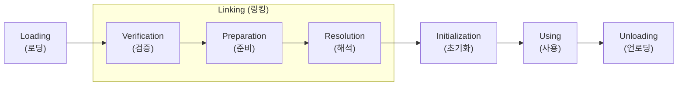
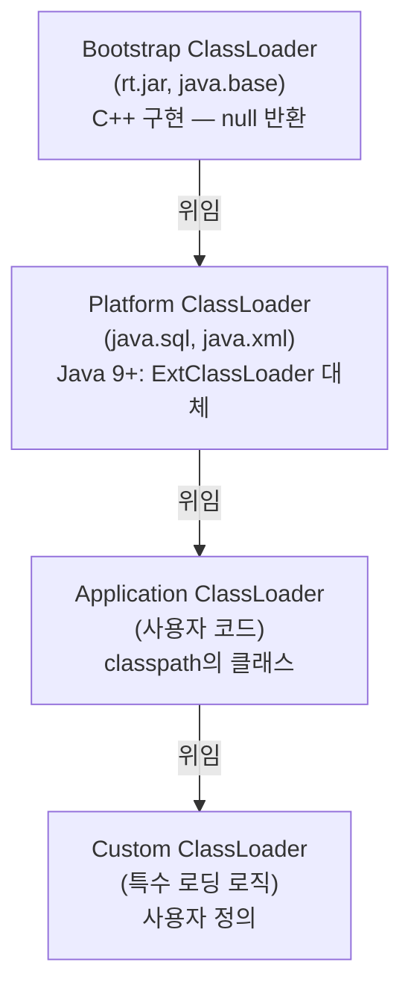
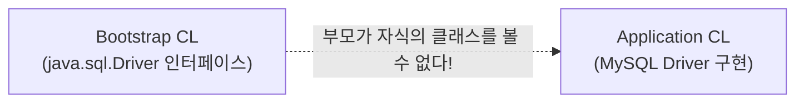

## 7장: 클래스 로딩 메커니즘

### 핵심 개념 --- 클래스 로딩 시점

JVM 명세는 클래스를 **"처음 능동적으로 사용(active use)할 때"** 초기화하도록 규정한다.

**6가지 능동적 사용 (초기화 트리거):**

1. `new`, `getstatic`, `putstatic`, `invokestatic` 명령어를 만났을 때
2. `java.lang.reflect` 패키지로 리플렉션 호출할 때
3. 부모 클래스가 아직 초기화되지 않았을 때 (부모 먼저)
4. JVM 시작 시 main 메서드를 포함한 클래스
5. `MethodHandle` 최종 해석 결과가 `REF_getStatic`, `REF_putStatic`, `REF_invokeStatic`, `REF_newInvokeSpecial`일 때
6. `default` 메서드를 가진 인터페이스의 구현 클래스가 초기화될 때

**수동적 사용 (초기화되지 않는 경우):**

```java
// 부모 클래스의 정적 필드를 자식 클래스로 접근 → 부모만 초기화
class Parent { static int value = 42; }
class Child extends Parent {}
System.out.println(Child.value);  // Parent만 초기화됨

// 배열 정의 → 원소 클래스는 초기화되지 않음
Parent[] arr = new Parent[10];    // Parent 초기화 안 됨

// 컴파일 타임 상수 → 상수 풀로 전파되어 참조 클래스 초기화 안 됨
class Const { static final String NAME = "log-friends"; }
System.out.println(Const.NAME);   // Const 초기화 안 됨 (상수 풀에 직접 저장)
```

> **log-friends 연결:** `LogFriendsInstaller`는 `EnvironmentPostProcessor` 시점에 ByteBuddy를 설치한다. 이 시점은 아직 대부분의 애플리케이션 클래스가 로딩되기 전이므로, `RETRANSFORMATION` 전략으로 이미 로딩된 클래스와 앞으로 로딩될 클래스 모두를 계측할 수 있다.

### 핵심 개념 --- 클래스 로딩 5단계



#### 1단계: 로딩 (Loading)

바이트 스트림을 얻어 메서드 영역에 런타임 데이터 구조로 저장하고, `java.lang.Class` 객체를 힙에 생성한다.

- 바이트 스트림의 출처: `.class` 파일, JAR/WAR, 네트워크, 런타임 생성(Proxy, ByteBuddy), 데이터베이스 등
- **비배열 클래스**: 클래스 로더의 `defineClass()`가 담당. 개발자가 커스터마이징 가능
- **배열 클래스**: JVM이 직접 생성. 원소 타입이 참조형이면 해당 클래스를 재귀 로딩

> **log-friends 연결:** ByteBuddy의 `AgentBuilder`는 `ClassFileTransformer`를 `Instrumentation`에 등록한다. 이후 클래스가 로딩될 때마다 JVM이 이 transformer를 호출하여, `type()` 매처에 부합하면 바이트코드를 변환한 후 `defineClass()`에 전달한다.

#### 2단계: 검증 (Verification)

로딩된 바이트 스트림이 JVM 명세에 부합하는지 검증한다. 4단계로 구성:

| 검증 단계 | 검증 내용 |
|---|---|
| **파일 형식 검증** | 매직 넘버, 버전, 상수 풀 태그, UTF-8 인코딩 |
| **메타데이터 검증** | 부모 클래스 존재 여부, final 상속 금지, 추상 메서드 구현 |
| **바이트코드 검증** | 타입 안전성, 스택 오버플로, 분기 대상 유효성 (StackMapTable 활용) |
| **심볼릭 레퍼런스 검증** | 접근 권한, 클래스/필드/메서드 존재 여부 |

> `-Xverify:none` (Java 13부터 deprecated)으로 검증을 생략할 수 있지만 권장하지 않는다.

#### 3단계: 준비 (Preparation)

**클래스 변수**(static 필드)에 대해 메모리를 할당하고 **제로값**으로 초기화한다.

```java
// 준비 단계: value = 0 (int의 제로값)
// 초기화 단계: value = 123 (<clinit>에서 대입)
public static int value = 123;

// 예외: ConstantValue 속성이 있으면 준비 단계에서 바로 대입
public static final int CONST = 123;  // 준비 단계에서 CONST = 123
```

#### 4단계: 해석 (Resolution)

상수 풀의 **심볼릭 레퍼런스**를 **다이렉트 레퍼런스**(메모리 포인터)로 변환한다.

- **심볼릭 레퍼런스**: `CONSTANT_Class_info`, `CONSTANT_Fieldref_info` 등 문자열 기반
- **다이렉트 레퍼런스**: 런타임 메모리 주소, vtable 오프셋 등

해석 대상: 클래스/인터페이스, 필드, 메서드, 인터페이스 메서드, 메서드 타입, 메서드 핸들, 호출 사이트 한정자

> 해석 시점은 JVM 구현에 따라 다르다. "lazy resolution"이면 실제 사용 시점까지 지연, "eager resolution"이면 로딩 직후 수행.

#### 5단계: 초기화 (Initialization)

`<clinit>()` 메서드를 실행한다. 이 메서드는 컴파일러가 자동 생성하며, static 변수 대입문과 static 블록을 순서대로 합친 것이다.

```java
class Example {
    static int a = 1;           // (1)
    static { a = 2; }          // (2)
    static int b = a;          // (3) → b = 2
}
```

**`<clinit>()` 특성:**
- JVM이 멀티스레드 환경에서 하나의 스레드만 `<clinit>()`을 실행하도록 보장 (락)
- 부모의 `<clinit>()`이 먼저 실행됨
- `<clinit>()`이 없으면 (static 변수/블록이 없으면) 생성되지 않음
- 인터페이스의 `<clinit>()`은 부모 인터페이스의 것을 먼저 호출하지 않음

> **주의:** `<clinit>()` 내에서 무한 루프에 빠지면 다른 스레드가 영원히 블로킹된다.

### 핵심 개념 --- 부모 위임 모델 (Parent Delegation Model)



**동작 원리:**

1. 클래스 로딩 요청이 들어오면 **먼저 부모에게 위임**
2. 부모가 로딩에 실패하면 (ClassNotFoundException) 자신이 시도
3. 최상위 Bootstrap까지 올라갔다가 내려오는 구조

**`ClassLoader.loadClass()` 핵심 코드:**

```java
protected Class<?> loadClass(String name, boolean resolve) throws ClassNotFoundException {
    synchronized (getClassLoadingLock(name)) {
        // 1. 이미 로딩된 클래스 확인
        Class<?> c = findLoadedClass(name);
        if (c == null) {
            try {
                // 2. 부모에게 위임
                if (parent != null) {
                    c = parent.loadClass(name, false);
                } else {
                    c = findBootstrapClassOrNull(name);
                }
            } catch (ClassNotFoundException e) {
                // 부모가 못 찾음
            }
            if (c == null) {
                // 3. 자신이 로딩 시도
                c = findClass(name);
            }
        }
        return c;
    }
}
```

**부모 위임 모델의 장점:**
- **안전성**: 사용자가 `java.lang.Object`를 만들어도 Bootstrap이 진짜를 로딩
- **유일성**: 같은 클래스가 서로 다른 로더에 의해 중복 로딩되는 것을 방지
- **계층 구조**: 기본 라이브러리 → 확장 라이브러리 → 애플리케이션 코드의 명확한 구분

### 핵심 개념 --- 부모 위임 모델의 도전

부모 위임 모델은 세 차례 큰 "파괴"를 겪었다:

#### 1차 파괴: JDK 1.2 이전의 호환성

- `ClassLoader`에 `loadClass()` 밖에 없었으므로 사용자가 직접 오버라이드
- JDK 1.2에서 `findClass()`를 추가하여 오버라이드 대상을 분리
- 하지만 `loadClass()` 오버라이드를 막을 수 없으므로 완전한 강제는 불가

#### 2차 파괴: SPI (Service Provider Interface)

**문제:** Bootstrap ClassLoader가 로딩하는 `java.sql.DriverManager`가 classpath의 JDBC 드라이버를 찾아야 함



**해결: Thread Context ClassLoader**

```java
// DriverManager 내부 (Bootstrap 영역)
ClassLoader cl = Thread.currentThread().getContextClassLoader();
ServiceLoader<Driver> sl = ServiceLoader.load(Driver.class, cl);
// → Application ClassLoader를 사용하여 드라이버 구현체 로딩
```

이것은 부모가 자식 로더에게 로딩을 요청하는 것이므로, 부모 위임의 역전이다.

> **log-friends 연결:** log-friends SDK는 `compileOnly`로 Spring Boot에 의존한다. 실행 시에는 Spring Boot의 `LaunchedURLClassLoader`가 fat JAR 내부의 `BOOT-INF/lib/`에서 SDK를 로딩한다. 이 로더 자체가 부모 위임을 일부 변형한 구현이다.

#### 3차 파괴: OSGi와 모듈화

OSGi는 번들마다 독립적인 클래스 로더를 가지며, 패키지 단위로 **네트워크형** 위임 구조를 만든다:

1. `java.*` → 부모 위임 (Bootstrap)
2. 위임 목록에 있는 패키지 → 부모 위임
3. Import-Package → 해당 패키지를 Export하는 번들의 로더
4. 자기 자신의 번들 ClassPath
5. Fragment Bundle
6. Dynamic Import

### 핵심 개념 --- 자바 모듈 시스템 (JDK 9+)

JDK 9에서 도입된 모듈 시스템(JPMS)은 클래스 로딩에 근본적인 변화를 가져왔다.

**모듈의 핵심 개념:**

```java
// module-info.java
module java.sql {
    requires java.base;         // 의존 모듈
    exports java.sql;           // 외부 공개 패키지
    exports javax.sql;
    uses java.sql.Driver;       // SPI 소비자 선언
}
```

**모듈 시스템에서의 클래스 로더 변화:**

| JDK 8 이전 | JDK 9 이후 |
|---|---|
| Bootstrap + Extension + Application | Bootstrap + **Platform** + Application |
| Extension ClassLoader (`ext/`) | Platform ClassLoader (모듈 기반) |
| `URLClassLoader` 상속 | `BuiltinClassLoader` 내부 클래스 |

**모듈 로딩 규칙:**
- 각 모듈은 하나의 클래스 로더에 소속
- 하나의 클래스 로더는 여러 모듈을 로딩 가능
- `exports` 되지 않은 패키지는 다른 모듈에서 접근 불가 (리플렉션 포함)
- `--add-opens`, `--add-exports`로 런타임에 열 수 있음

> **log-friends 연결:** ByteBuddy가 내부 API(`sun.misc.Unsafe` 등)에 접근할 때 모듈 시스템의 제약을 받는다. 이것이 `--add-opens java.base/java.lang=ALL-UNNAMED` 같은 JVM 옵션이 필요한 이유이며, `-Djdk.attach.allowAttachSelf=true`도 같은 맥락이다.

---

## 핵심 질문 (7장)

5. **`LogFriendsInstaller`가 `EnvironmentPostProcessor` 시점에 실행되는 것과 `ApplicationReadyEvent` 시점에 실행되는 것의 차이는? 왜 전자를 선택했는가?**
   - 힌트: 클래스 로딩 시점과 `ClassFileTransformer` 등록 타이밍의 관계.

6. **`Thread.currentThread().getContextClassLoader()`가 부모 위임 모델을 어떻게 우회하며, JDBC DriverManager가 이를 활용하는 구체적인 흐름은?**

7. **Spring Boot의 `LaunchedURLClassLoader`가 Nested JAR를 처리하는 방식과, 이것이 `log-friends-sdk`의 클래스 로딩에 미치는 영향은?**

8. **JDK 9 모듈 시스템에서 `--add-opens`가 필요한 이유를 설명하고, ByteBuddy가 모듈 경계를 넘어 계측할 때의 제약은?**

## 학습 완료 체크리스트

- [ ] 클래스 로딩 5단계의 순서와 각 단계의 역할을 설명할 수 있다
- [ ] 능동적 사용과 수동적 사용의 차이를 예시로 설명할 수 있다
- [ ] 부모 위임 모델의 동작 원리와 장단점을 설명할 수 있다
- [ ] Thread Context ClassLoader를 통한 SPI 메커니즘을 이해한다
- [ ] `LogFriendsInstaller`의 실행 시점이 클래스 로딩과 어떻게 맞물리는지 설명할 수 있다
- [ ] JDK 9 모듈 시스템이 클래스 로딩에 미치는 영향을 이해한다
