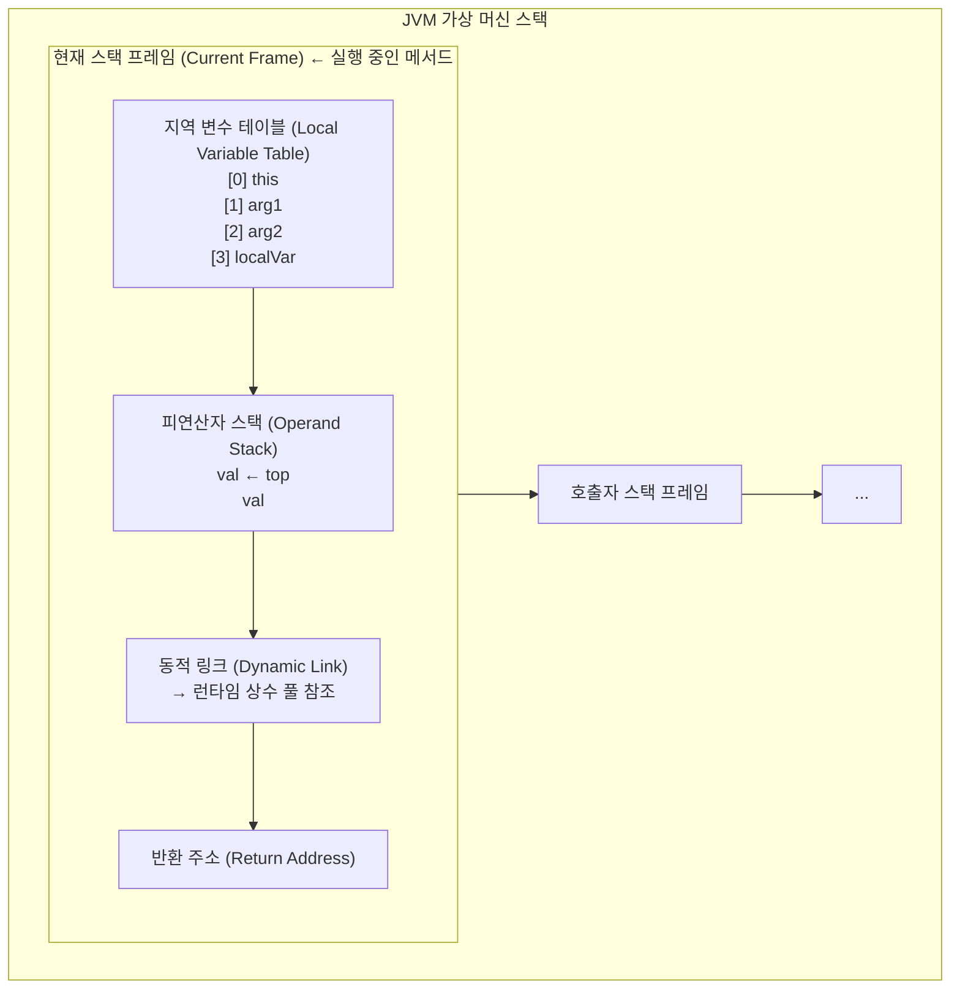
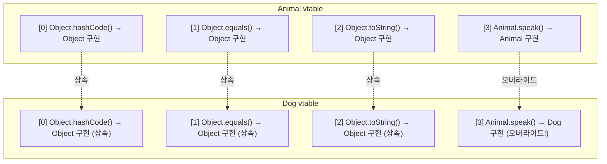
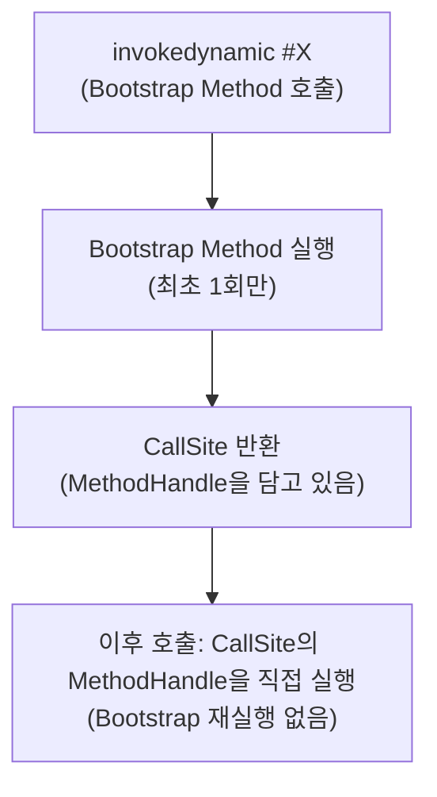

## 8장: 바이트코드 실행 엔진

### 핵심 개념 --- 스택 프레임 구조

메서드가 호출될 때마다 JVM은 가상 머신 스택에 **스택 프레임(Stack Frame)** 을 push한다.



#### 지역 변수 테이블 (Local Variable Table)

- **슬롯(Slot)** 단위로 구성. 32비트 이하 타입은 1슬롯, `long`/`double`은 2슬롯
- 인스턴스 메서드의 슬롯 0은 항상 `this`
- 메서드 파라미터 → 선언 순서대로 슬롯 할당 → 지역 변수
- 슬롯 재사용(reuse): 스코프가 끝난 변수의 슬롯을 다른 변수가 재사용

```java
public void example(int a, long b) {
    // 슬롯 0: this
    // 슬롯 1: a (int, 1슬롯)
    // 슬롯 2-3: b (long, 2슬롯)
    String s = "hello";
    // 슬롯 4: s (reference, 1슬롯)
}
```

> **GC 관련 주의:** 슬롯이 재사용되지 않으면, 스코프를 벗어난 객체라도 지역 변수 테이블이 참조를 유지하여 GC되지 않을 수 있다. 하지만 JIT 컴파일러가 이를 최적화하므로 실무에서 `var = null` 패턴은 불필요하다.

#### 피연산자 스택 (Operand Stack)

- LIFO 구조, 최대 깊이는 컴파일 타임에 결정 (`max_stack`)
- 바이트코드 명령어가 값을 push/pop하며 연산 수행
- 산술 예: `iadd`는 스택에서 두 int를 pop → 더한 결과를 push

```
// 1 + 2 계산
iconst_1    // 스택: [1]
iconst_2    // 스택: [1, 2]
iadd        // 스택: [3]
```

#### 동적 링크 (Dynamic Link)

상수 풀의 심볼릭 레퍼런스 중 일부는 클래스 로딩 또는 첫 사용 시 다이렉트 레퍼런스로 변환된다(정적 해석). 나머지는 **매 호출 시마다** 해석된다(동적 링크).

- 정적 해석: `invokestatic`, `invokespecial` 대상 메서드
- 동적 링크: `invokevirtual`, `invokeinterface` 대상 메서드 (런타임 타입에 따라 결정)

#### 반환 주소 (Return Address)

메서드가 반환될 때 실행을 이어갈 PC 카운터 값. 두 가지 종료 방식:

1. **정상 종료**: `return`/`ireturn`/`areturn` 등 → 호출자의 PC 카운터를 복원
2. **예외 종료**: 미처리 예외 → 예외 테이블에서 핸들러를 찾아 PC 설정. 반환 주소 없음

### 핵심 개념 --- 메서드 디스패치

#### 정적 디스패치 (Static Dispatch) = 오버로딩 해석

**컴파일 타임**에 매개변수의 **정적 타입(Static Type)** 을 기준으로 호출할 메서드를 결정한다.

```java
class Overload {
    void say(Object arg)  { System.out.println("Object"); }
    void say(String arg)  { System.out.println("String"); }
    void say(int arg)     { System.out.println("int"); }

    public static void main(String[] args) {
        Overload o = new Overload();
        Object str = "hello";
        o.say(str);       // "Object" 출력 — 정적 타입이 Object
        o.say("hello");   // "String" 출력 — 정적 타입이 String
    }
}
```

```
$ javap -c Overload.class

// o.say(str)
invokevirtual #7  // Overload.say:(Ljava/lang/Object;)V  ← 컴파일 타임에 Object 버전 선택

// o.say("hello")
invokevirtual #8  // Overload.say:(Ljava/lang/String;)V  ← 컴파일 타임에 String 버전 선택
```

> 오버로딩 해석은 컴파일러가 수행하며, 바이트코드에는 이미 구체적인 디스크립터가 고정되어 있다.

#### 동적 디스패치 (Dynamic Dispatch) = 오버라이딩

**런타임**에 객체의 **실제 타입(Actual Type)** 을 기준으로 호출할 메서드를 결정한다.

```java
class Animal {
    void speak() { System.out.println("..."); }
}
class Dog extends Animal {
    @Override void speak() { System.out.println("Woof!"); }
}
class Cat extends Animal {
    @Override void speak() { System.out.println("Meow!"); }
}

Animal a = new Dog();
a.speak();  // "Woof!" — 런타임에 Dog.speak() 선택
```

**`invokevirtual` 실행 과정:**

1. 피연산자 스택 top에서 객체 참조를 꺼냄
2. 객체의 **실제 클래스**에서 디스크립터와 이름이 일치하는 메서드를 검색
3. 접근 권한 검증 → 통과하면 다이렉트 레퍼런스 반환
4. 없으면 상위 클래스로 올라가며 반복 검색
5. 최종적으로 못 찾으면 `AbstractMethodError`

#### 가상 메서드 테이블 (vtable)

매번 클래스 계층을 탐색하면 성능이 나쁘므로, JVM은 **vtable(Virtual Method Table)** 을 사용한다.



- vtable은 **준비(Preparation)** 단계에서 초기화
- 오버라이드된 메서드는 같은 인덱스에 자식의 구현으로 교체
- `invokeinterface`는 **itable(Interface Method Table)** 을 사용

> **log-friends 연결:** `InstrumentationRegistry.installSpring()`이 `DispatcherServlet.doService()`를 계측할 때, ByteBuddy는 `MethodDelegation`으로 원래 메서드 호출을 `@SuperCall callable`로 감싼다. 이때 원본 메서드 호출은 내부적으로 `invokevirtual` 또는 `invokespecial`로 이루어지며, vtable을 통한 동적 디스패치가 작동한다.

### 핵심 개념 --- invokedynamic과 동적 타입 언어 지원

#### invokedynamic의 탄생 배경

Java 7 이전의 4가지 호출 명령어(`invokestatic`, `invokespecial`, `invokevirtual`, `invokeinterface`)는 모두 **컴파일 타임에 호출 대상의 심볼릭 레퍼런스가 결정**된다. 동적 타입 언어(Groovy, JRuby 등)를 JVM 위에서 효율적으로 실행하려면 런타임에 호출 대상을 결정할 수 있는 메커니즘이 필요했다.

#### java.lang.invoke 패키지

```java
// MethodHandle — 리플렉션보다 가볍고, JIT 최적화 가능
MethodHandles.Lookup lookup = MethodHandles.lookup();
MethodType mt = MethodType.methodType(void.class, String.class);
MethodHandle mh = lookup.findVirtual(PrintStream.class, "println", mt);
mh.invoke(System.out, "Hello via MethodHandle");
```

**MethodHandle vs Reflection:**

| 비교 항목 | Reflection | MethodHandle |
|---|---|---|
| 추상 수준 | Java API 수준 | 바이트코드 명령어 수준 |
| 타입 검사 | 런타임 (비용 높음) | 링크 타임 (MethodType) |
| JIT 최적화 | 제한적 | 인라이닝 가능 |
| 접근 제어 | 호출 시점 검사 | lookup 생성 시점 검사 |

#### invokedynamic 동작 메커니즘



**람다에서의 활용 (Java 8+):**

```java
Runnable r = () -> System.out.println("lambda");
```

```
$ javap -c -p LambdaExample.class

// 람다 생성 부분
invokedynamic #2, 0
  // InvokeDynamic #0:run:()Ljava/lang/Runnable;
  // Bootstrap: LambdaMetafactory.metafactory(...)

// 컴파일러가 생성한 private static 메서드
private static void lambda$main$0();
  Code:
    0: getstatic     #3    // System.out
    3: ldc           #4    // "lambda"
    5: invokevirtual #5    // println
    8: return

// BootstrapMethods 속성:
// 0: #28 LambdaMetafactory.metafactory
//   Method arguments:
//     #29 ()V                                    // 함수형 인터페이스 메서드 시그니처
//     #30 invokestatic LambdaExample.lambda$main$0  // 실제 구현
//     #31 ()V                                    // 인스턴스화된 메서드 타입
```

**실행 흐름:**

1. `invokedynamic` 최초 실행 시 `LambdaMetafactory.metafactory()` 호출
2. `metafactory`가 런타임에 `Runnable` 구현 클래스를 동적 생성
3. `CallSite`에 해당 클래스의 생성 `MethodHandle`을 설정
4. 이후 호출은 `CallSite`를 통해 직접 실행 (Bootstrap 재실행 없음)

> **log-friends 연결:** ByteBuddy는 내부적으로 `invokedynamic`과 유사한 메커니즘을 활용한다. `MethodDelegation.to(SpringInterceptor::class.java)`는 대상 메서드 호출을 인터셉터로 위임하는 바이트코드를 생성하며, `@SuperCall Callable<*>`은 원래 메서드를 호출하는 `MethodHandle` 기반의 callable을 런타임에 생성한다.

### 핵심 개념 --- 스택 기반 바이트코드 해석 및 실행 엔진

JVM의 명령어 집합은 **스택 기반(Stack-based)** 아키텍처다. 대부분의 하드웨어 CPU는 **레지스터 기반(Register-based)** 이다.

**스택 기반 vs 레지스터 기반:**

```
// 1 + 2 계산

// 스택 기반 (JVM)
iconst_1          // 스택: [1]
iconst_2          // 스택: [1, 2]
iadd              // 스택: [3]
istore_0          // 결과를 지역변수 0에 저장

// 레지스터 기반 (x86 유사)
mov  eax, 1       // eax = 1
add  eax, 2       // eax = 3
```

| 비교 | 스택 기반 | 레지스터 기반 |
|---|---|---|
| **이식성** | 높음 (하드웨어 독립) | 낮음 (레지스터 수/종류 의존) |
| **코드 크기** | 작음 (오퍼랜드 없음) | 큼 (레지스터 번호 필요) |
| **실행 속도** | 느림 (메모리 접근 많음) | 빠름 (레지스터 접근) |
| **구현 난이도** | 쉬움 | 어려움 |
| **최적화** | JIT 컴파일러가 레지스터로 변환 | 하드웨어 직접 실행 |

> JVM이 스택 기반을 선택한 핵심 이유는 **플랫폼 독립성**이다. 레지스터 수와 종류에 의존하지 않으므로 "Write Once, Run Anywhere"가 가능하다. 실행 성능은 JIT 컴파일러가 네이티브 코드로 변환할 때 레지스터 할당을 수행하여 보완한다.

**실행 예시 --- 전체 흐름:**

```java
public int calculate() {
    int a = 100;
    int b = 200;
    int c = 300;
    return (a + b) * c;
}
```

```
$ javap -c

public int calculate();
  Code:
    0: bipush   100     // 100을 스택에 push       스택: [100]
    2: istore_1         // 슬롯1(a)에 저장          스택: []
    3: sipush   200     // 200을 스택에 push       스택: [200]
    6: istore_2         // 슬롯2(b)에 저장          스택: []
    7: sipush   300     // 300을 스택에 push       스택: [300]
   10: istore_3         // 슬롯3(c)에 저장          스택: []
   11: iload_1          // 슬롯1(a)을 push         스택: [100]
   12: iload_2          // 슬롯2(b)을 push         스택: [100, 200]
   13: iadd             // 100+200=300 push       스택: [300]
   14: iload_3          // 슬롯3(c)을 push         스택: [300, 300]
   15: imul             // 300*300=90000 push     스택: [90000]
   16: ireturn          // 90000 반환
```

---

## 핵심 질문 (8장)

9. **스택 프레임의 지역 변수 테이블에서 슬롯 재사용이 GC에 미칠 수 있는 영향을 설명하라. JIT 컴파일러가 이를 어떻게 해결하는가?**

10. **정적 디스패치(오버로딩)와 동적 디스패치(오버라이딩)의 차이를 바이트코드 수준에서 설명하라. `invokevirtual`이 vtable을 탐색하는 과정은?**

11. **`@SuperCall Callable<*>`이 내부적으로 어떻게 동작하는가? ByteBuddy가 이를 위해 생성하는 바이트코드의 구조를 추론하라.**
    - 힌트: `Callable.call()` 내부에서 원본 메서드를 `invokespecial` 또는 별도의 메서드로 호출.

12. **JVM이 스택 기반 아키텍처를 선택한 이유와, JIT 컴파일러가 이를 레지스터 기반 네이티브 코드로 변환할 때의 주요 최적화는?**

## 학습 완료 체크리스트

- [ ] 스택 프레임의 4가지 구성 요소를 설명할 수 있다
- [ ] 지역 변수 테이블의 슬롯 할당 규칙을 이해한다
- [ ] 정적 디스패치와 동적 디스패치의 차이를 바이트코드 수준에서 설명할 수 있다
- [ ] vtable의 구조와 역할을 설명할 수 있다
- [ ] `invokedynamic`의 Bootstrap Method → CallSite → MethodHandle 흐름을 이해한다
- [ ] 스택 기반 vs 레지스터 기반 아키텍처의 트레이드오프를 설명할 수 있다
