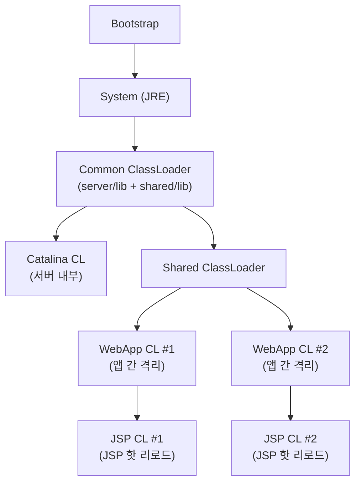

## 9장: 클래스 로딩과 실행 서브시스템 사례

### 사례 분석

#### 톰캣의 클래스 로더 아키텍처

톰캣은 부모 위임 모델을 변형하여 웹 애플리케이션 간 격리를 구현한다:



- **WebAppClassLoader**: 부모 위임을 **역전** — 자기 자신이 먼저 로딩 시도 (`/WEB-INF/classes`, `/WEB-INF/lib`)
- **JSP ClassLoader**: JSP 변경 시 기존 CL을 버리고 새로 생성 → 핫 리로드
- 각 웹 앱이 서로 다른 버전의 같은 라이브러리를 사용할 수 있음

#### Spring Boot Fat JAR와 LaunchedURLClassLoader

```
application.jar
├── META-INF/
│   └── MANIFEST.MF          → Main-Class: JarLauncher
├── org/springframework/boot/loader/   → 런처 코드
├── BOOT-INF/
│   ├── classes/              → 애플리케이션 코드
│   └── lib/                  → 의존 라이브러리 JAR들
```

```java
// Spring Boot의 LaunchedURLClassLoader
public class LaunchedURLClassLoader extends URLClassLoader {
    // BOOT-INF/classes/ 와 BOOT-INF/lib/*.jar를 URL로 등록
    // Nested JAR를 처리하기 위한 커스텀 프로토콜 핸들러

    @Override
    protected Class<?> loadClass(String name, boolean resolve) {
        // 1. 이미 로딩된 클래스 확인
        // 2. 부모 위임 (java.*, javax.* 등)
        // 3. 자기 자신에서 로딩 (BOOT-INF/)
    }
}
```

> **log-friends 연결:** `log-friends-sdk`는 `compileOnly`로 선언되어 별도의 JAR로 배포되지 않고, 사용하는 프로젝트의 `BOOT-INF/lib/`에 포함된다. `LogFriendsInstaller`가 `spring.factories`를 통해 발견되는 것도 `LaunchedURLClassLoader`가 `BOOT-INF/classes/META-INF/spring.factories`를 스캔하기 때문이다.

#### 바이트코드 생성 기술과 동적 프락시

**JDK 동적 프락시:**

```java
// InvocationHandler를 구현하면 JVM이 프락시 클래스를 런타임 생성
Object proxy = Proxy.newProxyInstance(
    target.getClass().getClassLoader(),
    target.getClass().getInterfaces(),
    (proxyObj, method, args) -> {
        System.out.println("Before: " + method.getName());
        Object result = method.invoke(target, args);
        System.out.println("After: " + method.getName());
        return result;
    }
);
```

- `sun.misc.ProxyGenerator`가 바이트코드를 동적 생성
- 인터페이스만 프락시 가능 (클래스 프락시 불가)
- 생성된 프락시 클래스는 `$Proxy0`, `$Proxy1` 등의 이름

**CGLIB:**

```java
Enhancer enhancer = new Enhancer();
enhancer.setSuperclass(TargetClass.class);  // 클래스도 프락시 가능!
enhancer.setCallback((MethodInterceptor) (obj, method, args, proxy) -> {
    System.out.println("Before");
    Object result = proxy.invokeSuper(obj, args);
    System.out.println("After");
    return result;
});
TargetClass proxy = (TargetClass) enhancer.create();
```

- ASM 라이브러리로 서브클래스를 바이트코드 수준에서 생성
- `final` 클래스/메서드는 프락시 불가 (상속 기반이므로)

**ByteBuddy (log-friends가 사용하는 방식):**

```kotlin
// log-friends의 InstrumentationRegistry에서 사용하는 패턴
AgentBuilder.Default()
    .with(AgentBuilder.RedefinitionStrategy.RETRANSFORMATION)
    .type(ElementMatchers.named("org.springframework.web.servlet.DispatcherServlet"))
    .transform { builder, _, _, _, _ ->
        builder.method(ElementMatchers.named("doService"))
            .intercept(MethodDelegation.to(SpringInterceptor::class.java))
    }.installOn(inst)
```

**세 가지 접근 방식 비교:**

| 비교 항목 | JDK Proxy | CGLIB | ByteBuddy Agent |
|---|---|---|---|
| 대상 | 인터페이스만 | 클래스 (서브클래싱) | 모든 클래스 (기존 클래스 수정) |
| 원리 | `Proxy.newProxyInstance` | ASM으로 서브클래스 생성 | `Instrumentation.retransformClasses` |
| 성능 | 보통 | 빠름 | 최적 (원본 클래스 자체 수정) |
| 코드 수정 | 불필요 (인터페이스 필요) | 불필요 (상속 가능해야 함) | **완전히 불필요** (투명 계측) |
| 사용 사례 | Spring AOP (인터페이스) | Spring AOP (클래스) | Java Agent, APM 도구 |

> **핵심 차이:** JDK Proxy와 CGLIB는 **새로운 클래스**를 만들지만, ByteBuddy Agent는 `Instrumentation` API로 **기존 클래스의 바이트코드를 직접 수정**한다. 이것이 log-friends가 "코드 수정 없이" 계측할 수 있는 근본적인 이유다.

#### 바이트코드 수준에서 본 ByteBuddy의 계측

`MethodDelegation.to(SpringInterceptor::class.java)`가 `DispatcherServlet.doService()`에 적용되면, ByteBuddy는 대략 다음과 같은 변환을 수행한다:

```
// 변환 전 (원본 doService)
public void doService(HttpServletRequest req, HttpServletResponse res) {
    // 원래 로직
}

// 변환 후 (ByteBuddy가 수정한 doService) — 개념적 표현
public void doService(HttpServletRequest req, HttpServletResponse res) {
    // ByteBuddy가 삽입한 코드:
    // 1. SpringInterceptor.intercept()에 전달할 인자 준비
    //    - @Origin Method → 현재 메서드 리플렉션 객체
    //    - @Argument(0) → req
    //    - @Argument(1) → res
    //    - @SuperCall Callable → 원본 로직을 감싼 callable
    // 2. SpringInterceptor.intercept() 호출
    // 3. 반환값 처리

    return SpringInterceptor.intercept(method, req, res, originalCallable);
}
```

실제 바이트코드 수준에서는:

```
// 개념적 바이트코드 (실제는 더 복잡)
aload_0                          // this (DispatcherServlet)
aload_1                          // req
aload_2                          // res
// ... Callable 생성 (원본 코드를 감싸는 내부 클래스)
invokestatic SpringInterceptor.intercept(
    Ljava/lang/reflect/Method;
    Ljava/lang/Object;
    Ljava/lang/Object;
    Ljava/util/concurrent/Callable;
)Ljava/lang/Object;
areturn
```

### 이 프로젝트(log-friends)와의 연결 --- 종합

| 장 | 연결 포인트 | SDK 코드 |
|---|---|---|
| **6장** (클래스 파일 구조) | ByteBuddy가 상수 풀에 인터셉터 레퍼런스를 추가하고 Code 속성을 재작성 | `InstrumentationRegistry` 전체 |
| **7장** (클래스 로딩) | `EnvironmentPostProcessor` 시점에 agent 설치 → 클래스 로딩 전에 transformer 등록 | `LogFriendsInstaller.postProcessEnvironment()` |
| **7장** (부모 위임 도전) | Spring Boot `LaunchedURLClassLoader`가 `BOOT-INF/lib/`에서 SDK 로딩 | `spring.factories` / `AutoConfiguration` |
| **7장** (클래스 로딩 시점) | `@Service` 어노테이션이 붙은 클래스가 Spring에 의해 로딩될 때 계측 발생 | `installMethodTrace()` |
| **8장** (동적 디스패치) | `invokevirtual`로 `doService()` 호출 시 계측된 버전이 실행됨 (vtable 갱신) | `SpringInterceptor.intercept()` |
| **8장** (invokedynamic) | `@SuperCall Callable`이 MethodHandle 기반으로 원본 메서드 호출 | `callable.call()` in `SpringInterceptor` |
| **9장** (동적 프락시 비교) | JDK Proxy/CGLIB와 달리 기존 클래스를 직접 수정 → 코드 수정 불필요 | `AgentBuilder.RETRANSFORMATION` |
| **9장** (바이트코드 생성) | `MethodDelegation`이 인터셉터 호출 바이트코드를 동적 생성 | `MethodDelegation.to(...)` |

**`RETRANSFORMATION` 전략이 중요한 이유:**

```kotlin
// InstrumentationRegistry.kt
AgentBuilder.Default()
    .with(AgentBuilder.RedefinitionStrategy.RETRANSFORMATION)
```

- `RETRANSFORMATION`: 이미 로딩된 클래스도 다시 변환 가능. `Instrumentation.retransformClasses()` 사용
- `REDEFINITION`: 이미 로딩된 클래스를 완전히 재정의. 일부 JVM에서 제약
- 없음 (기본): 아직 로딩되지 않은 클래스만 변환

`LogFriendsInstaller`가 `EnvironmentPostProcessor` 시점에 실행되므로, `DispatcherServlet` 같은 Spring 클래스는 이미 로딩되어 있을 수 있다. `RETRANSFORMATION`이 이를 처리한다.

### 실습

#### 실습 1: javap로 바이트코드 분석

```bash
# Kotlin 클래스의 바이트코드 확인
javap -c -p build/classes/kotlin/main/com/logfriends/agent/SpringInterceptor.class

# 상수 풀까지 보기
javap -v -p build/classes/kotlin/main/com/logfriends/agent/SpringInterceptor.class

# 특정 메서드만 확인
javap -c -p -s build/classes/kotlin/main/com/logfriends/agent/BatchTransporter.class
```

**확인할 포인트:**
- `@RuntimeType`이 바이트코드에 어떻게 반영되는지
- `@SuperCall Callable` 파라미터의 디스크립터
- `invokevirtual` vs `invokestatic` vs `invokeinterface` 사용 패턴

#### 실습 2: ClassLoader 계층 확인

```java
// Spring Boot 애플리케이션 내에서 실행
public class ClassLoaderInspector {
    public static void inspect() {
        ClassLoader cl = ClassLoaderInspector.class.getClassLoader();
        System.out.println("=== ClassLoader Hierarchy ===");
        while (cl != null) {
            System.out.println(cl.getClass().getName() + ": " + cl);
            cl = cl.getParent();
        }
        System.out.println("Bootstrap ClassLoader (null)");

        // log-friends SDK의 클래스 로더 확인
        System.out.println("\n=== Log Friends Classes ===");
        System.out.println("LogFriendsInstaller: " +
            LogFriendsInstaller.class.getClassLoader());
        System.out.println("SpringInterceptor: " +
            SpringInterceptor.class.getClassLoader());
    }
}
```

**예상 출력 (Spring Boot Fat JAR 환경):**

```
=== ClassLoader Hierarchy ===
org.springframework.boot.loader.LaunchedURLClassLoader: ...
jdk.internal.loader.ClassLoaders$AppClassLoader: ...
jdk.internal.loader.ClassLoaders$PlatformClassLoader: ...
Bootstrap ClassLoader (null)
```

#### 실습 3: ByteBuddy 계측 전후 바이트코드 비교

```bash
# ByteBuddy 디버깅 모드로 변환된 클래스 파일 저장
# JVM 옵션에 추가:
# -Dnet.bytebuddy.dump=/tmp/bytebuddy-dump

# 변환 후 클래스 확인
javap -c -p /tmp/bytebuddy-dump/org/springframework/web/servlet/DispatcherServlet.class

# 원본과 비교하여 ByteBuddy가 삽입한 코드 확인
```

#### 실습 4: Instrumentation API 직접 사용

```java
// 간단한 Java Agent 구현 (log-friends의 원리 이해용)
public class SimpleAgent {
    public static void premain(String args, Instrumentation inst) {
        inst.addTransformer((loader, className, classBeingRedefined,
                             protectionDomain, classfileBuffer) -> {
            if ("com/example/Target".equals(className)) {
                System.out.println("Transforming: " + className);
                System.out.println("ClassLoader: " + loader);
                System.out.println("Buffer size: " + classfileBuffer.length);
                // 바이트코드 수정 로직 (ASM/ByteBuddy 사용)
            }
            return null; // null = 변환하지 않음
        });
    }
}
```

---

## 핵심 질문 (9장)

13. **JDK 동적 프락시, CGLIB, ByteBuddy Agent의 차이를 클래스 파일 생성 관점에서 비교하라. log-friends가 ByteBuddy Agent 방식을 선택한 이유는?**
    - 힌트: "코드 수정 없이" 계측하려면 기존 클래스를 수정해야 하며, 새 클래스 생성으로는 불가능.

14. **`AgentBuilder.RedefinitionStrategy.RETRANSFORMATION`과 `REDEFINITION`의 차이를 설명하고, `LogFriendsInstaller`의 실행 시점을 고려할 때 왜 `RETRANSFORMATION`이 필요한가?**

15. **톰캣의 WebAppClassLoader와 Spring Boot의 LaunchedURLClassLoader가 각각 부모 위임을 변형하는 방식의 차이는?**

## 학습 완료 체크리스트

- [ ] 톰캣/Spring Boot의 클래스 로더 아키텍처를 도식화할 수 있다
- [ ] JDK Proxy, CGLIB, ByteBuddy의 차이를 명확히 설명할 수 있다
- [ ] `RETRANSFORMATION` 전략의 필요성을 log-friends의 실행 시점과 연결하여 설명할 수 있다
- [ ] `Instrumentation` API의 기본 사용법을 이해한다
