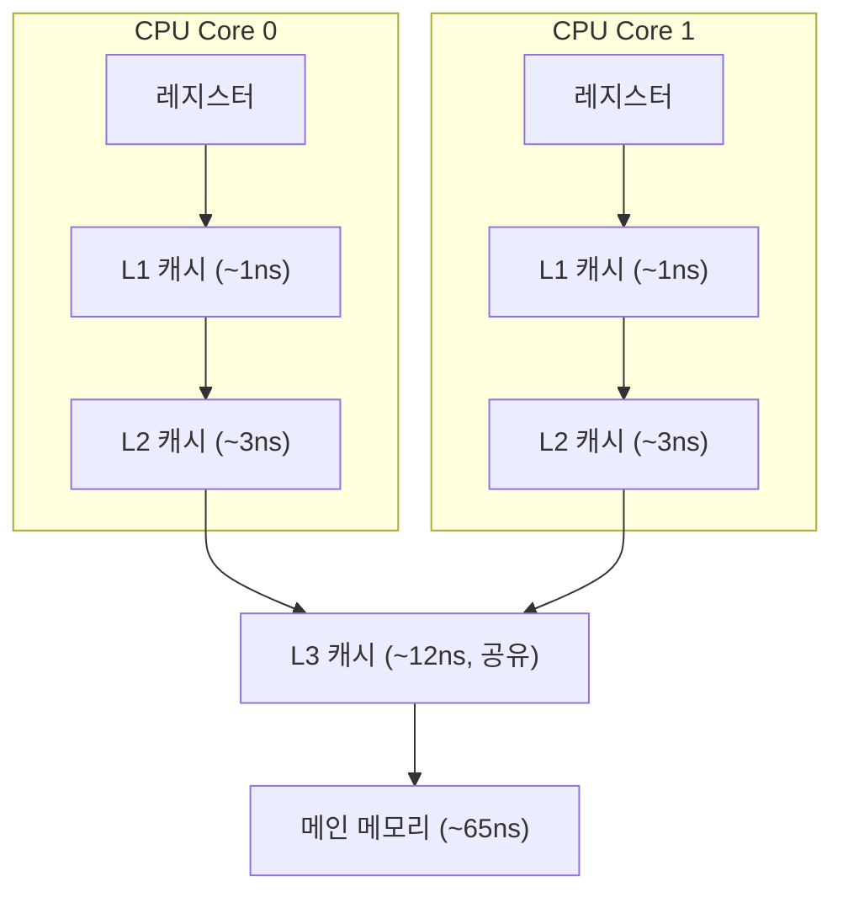
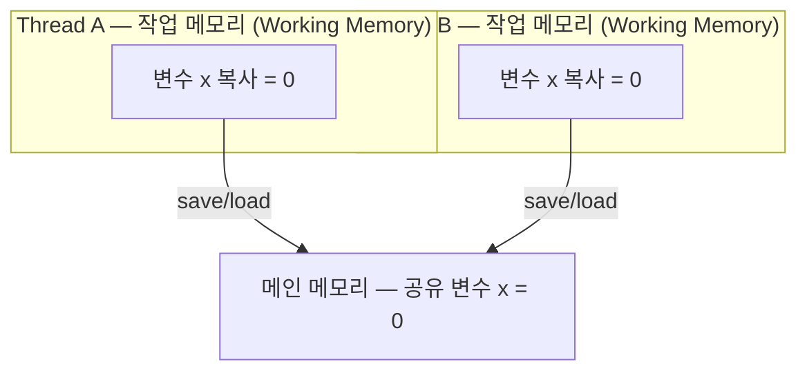
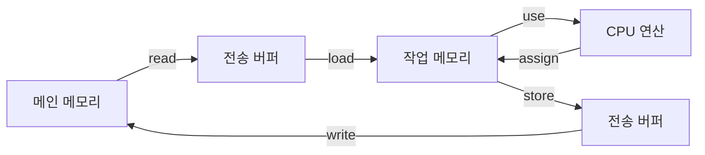
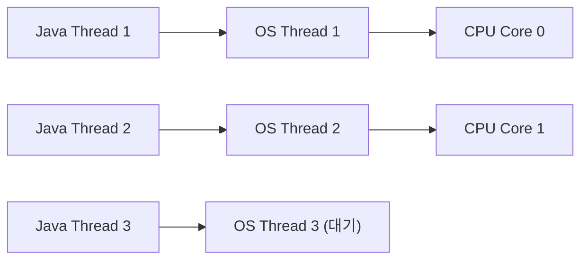
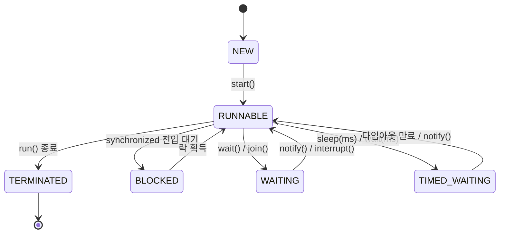
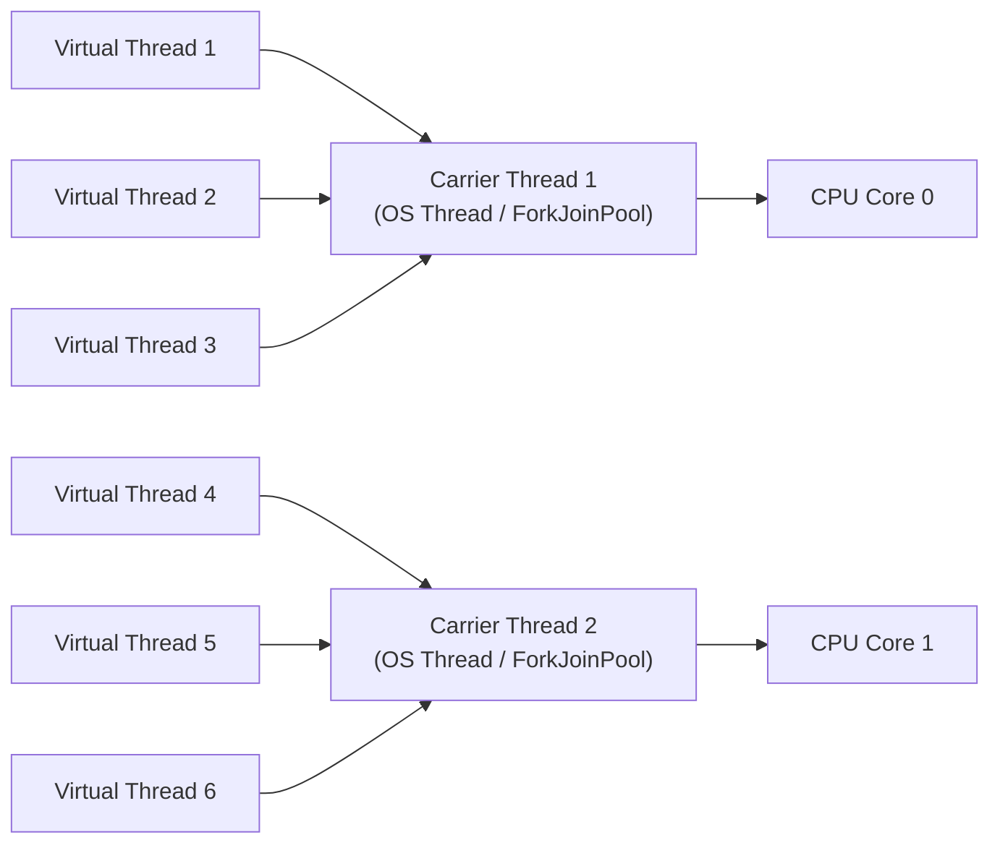

## 12장 자바 메모리 모델과 스레드

### 핵심 개념 --- 하드웨어 캐시와 메모리 일관성

현대 CPU는 메인 메모리와 프로세서 사이에 **캐시 계층**을 두어 속도 차이를 완충한다. 이 구조가 멀티코어 환경에서 **캐시 일관성(Cache Coherence)** 문제를 발생시킨다.

**CPU 캐시 계층 구조:**



**MESI 프로토콜** --- 캐시 라인의 4가지 상태:
| 상태 | 의미 | 다른 캐시에 존재? |
|------|------|-----------------|
| **M**odified | 이 캐시에서만 수정됨, 메인 메모리와 불일치 | No |
| **E**xclusive | 이 캐시에서만 보유, 메인 메모리와 일치 | No |
| **S**hared | 여러 캐시가 보유, 메인 메모리와 일치 | Yes |
| **I**nvalid | 무효화됨 | - |

**스토어 버퍼(Store Buffer)와 무효화 큐(Invalidate Queue):**
- CPU가 캐시에 쓸 때, MESI 응답을 기다리지 않고 **스토어 버퍼**에 먼저 적재 -> 비동기 처리
- 다른 코어의 무효화 요청도 **무효화 큐**에 쌓아두고 나중에 처리
- 이 최적화가 **메모리 가시성 문제**의 근본 원인
- **메모리 배리어(Memory Barrier)**: 스토어 버퍼/무효화 큐를 강제 비움 -> 가시성 보장

**x86은 비교적 강한 메모리 모델(TSO)**을 제공하지만, ARM/RISC-V는 약한 모델이라 배리어가 더 중요하다. JMM은 플랫폼 무관하게 동작을 보장하기 위해 존재한다.

---

### 핵심 개념 --- 자바 메모리 모델 (JMM)

JMM(Java Memory Model, JSR-133)은 **플랫폼 독립적인 메모리 가시성 규칙**을 정의한다. 하드웨어의 복잡한 캐시 계층을 추상화하여, 모든 자바 프로그램이 동일한 동시성 의미론을 갖도록 보장한다.

**메인 메모리와 작업 메모리:**



Thread A가 x = 1로 수정해도, Thread B의 작업 메모리에는
여전히 x = 0이 남아있을 수 있다 → 가시성 문제!

- **메인 메모리(Main Memory)**: 모든 스레드가 공유하는 변수 저장소. 물리적으로 힙(Heap)에 대응.
- **작업 메모리(Working Memory)**: 각 스레드 고유의 복사본. 물리적으로 CPU 캐시/레지스터에 대응.
- 스레드는 메인 메모리에 **직접 접근할 수 없고**, 반드시 작업 메모리를 통해 read/write한다.

**JMM이 정의하는 8가지 메모리 연산:**

- 메인 메모리 측: `lock` (스레드 전용 잠금), `unlock` (잠금 해제), `read` (메인→전송 버퍼), `write` (전송 버퍼→메인)
- 작업 메모리 측: `load` (전송 버퍼→작업 메모리), `use` (작업 메모리→CPU), `assign` (CPU→작업 메모리), `store` (작업 메모리→전송 버퍼)

**연산의 흐름:**



**8가지 연산에 대한 규칙(핵심만):**
1. `read`와 `load`, `store`와 `write`는 반드시 쌍으로 나타나야 함 (단독 불가)
2. `assign` 후 작업 메모리 변경을 메인 메모리에 동기화해야 함 (값 버림 금지)
3. `assign` 없이 `store/write`로 메인 메모리에 기록 불가 (변경 없는 쓰기 금지)
4. `lock`은 작업 메모리의 복사본을 무효화 -> 다시 `load` 필요
5. `unlock`은 반드시 `store/write` 이후에 수행 -> 변경사항 메인 메모리 반영 보장

---

### 핵심 개념 --- volatile의 동작 원리

`volatile`은 JMM에서 **가장 가벼운 동기화 메커니즘**이다. 두 가지 의미를 보장한다:

**1. 가시성(Visibility) 보장:**
```java
// volatile 쓰기 -> 메인 메모리에 즉시 반영 (store + write)
// volatile 읽기 -> 메인 메모리에서 항상 최신값 읽기 (read + load)

public class VisibilityExample {
    volatile boolean running = true;  // volatile 선언

    // Thread A
    void stop() {
        running = false;
        // volatile 쓰기: 작업 메모리 -> 메인 메모리 즉시 반영
        // 동시에 다른 코어의 캐시 라인을 무효화 (MESI Invalid)
    }

    // Thread B
    void run() {
        while (running) {  // volatile 읽기: 항상 메인 메모리에서 최신값
            doWork();
        }
        // running = false가 보인다 -> 루프 종료
    }
}
```

**하드웨어 수준 메커니즘:**
- `volatile` 쓰기 -> 컴파일 시 `lock` 접두사 명령어 삽입
- `lock` 접두사 -> CPU의 스토어 버퍼를 메인 메모리로 flush
- 동시에 다른 코어의 해당 캐시 라인을 **Invalid** 상태로 전환 (MESI 프로토콜)
- 다른 코어는 다음 읽기 시 캐시 미스 -> 메인 메모리에서 새 값 로드

**2. 명령어 재배열(Reordering) 방지:**
```java
public class Singleton {
    private static volatile Singleton instance;

    public static Singleton getInstance() {
        if (instance == null) {                    // 1차 체크
            synchronized (Singleton.class) {
                if (instance == null) {            // 2차 체크
                    instance = new Singleton();    // volatile 쓰기
                }
            }
        }
        return instance;
    }
}
```

`instance = new Singleton()`은 내부적으로 3단계:
1. 메모리 할당
2. 생성자 실행 (필드 초기화)
3. 참조를 `instance`에 할당

`volatile` 없이는 2와 3이 재배열될 수 있다 -> 다른 스레드가 **초기화 안 된 객체**를 볼 수 있음.
`volatile`은 **메모리 배리어**를 삽입하여 이 재배열을 금지한다.

**volatile이 원자성을 보장하지 않는 이유:**
```java
public class AtomicityProblem {
    volatile int count = 0;

    // 이 연산은 스레드 안전하지 않다!
    void increment() {
        count++;
        // 실제로는 3단계:
        //   1. count의 현재 값 읽기 (use)     -> volatile 보장: 최신값
        //   2. count + 1 계산                  -> CPU 연산
        //   3. 결과를 count에 쓰기 (assign)    -> volatile 보장: 즉시 반영
        //
        // 문제: 1~3 사이에 다른 스레드가 끼어들 수 있음!
        //   Thread A: read count = 10
        //   Thread B: read count = 10
        //   Thread A: write count = 11
        //   Thread B: write count = 11  <- 11이어야 할 값이 11 (Lost Update!)
    }

    // 해결: AtomicInteger 사용 (CAS 기반)
    AtomicInteger atomicCount = new AtomicInteger(0);
    void safeIncrement() {
        atomicCount.incrementAndGet();  // CAS 루프로 원자적 증가
    }
}
```

**volatile 사용이 적합한 경우:**
- 상태 플래그 (boolean running = true/false)
- DCL(Double-Checked Locking) 싱글톤
- 한 스레드만 쓰고, 여러 스레드가 읽는 패턴

---

### 핵심 개념 --- happens-before 원칙

`happens-before`는 JMM의 핵심 규칙으로, **두 연산 간의 가시성 관계**를 정의한다. "A happens-before B"이면 A의 결과는 B에게 반드시 보인다.

**6가지 happens-before 규칙:**

**1. 프로그램 순서 규칙 (Program Order Rule):**
```java
// 같은 스레드 내에서, 코드 순서대로 happens-before
int a = 1;        // (1)
int b = a + 1;    // (2)  <- (1) happens-before (2)
// (2)는 반드시 a = 1을 본다
```

**2. 모니터 락 규칙 (Monitor Lock Rule):**
```java
synchronized (lock) {
    x = 10;            // (1) 락 내부에서 쓰기
}                      // (2) unlock

synchronized (lock) {  // (3) lock  <- (2) happens-before (3)
    int y = x;         // (4) y는 반드시 10
}
// unlock happens-before 다음 lock -> 락 내부 변경이 보장됨
```

**3. volatile 변수 규칙 (Volatile Variable Rule):**
```java
volatile boolean ready = false;
int data = 0;

// Thread A
data = 42;             // (1)
ready = true;          // (2) volatile 쓰기

// Thread B
if (ready) {           // (3) volatile 읽기  <- (2) happens-before (3)
    int r = data;      // (4) r은 반드시 42
}
// volatile 쓰기 happens-before volatile 읽기
// + 프로그램 순서 규칙 + 전이성 -> data = 42도 보장!
```

**4. 스레드 시작 규칙 (Thread Start Rule):**
```java
int x = 10;
Thread t = new Thread(() -> {
    int y = x;  // 반드시 10을 본다
});
t.start();     // start() happens-before 새 스레드의 모든 연산
```

**5. 스레드 종료 규칙 (Thread Termination Rule):**
```java
Thread t = new Thread(() -> {
    data = 42;
});
t.start();
t.join();          // join() 반환 <- 스레드 종료 happens-before join 반환
int r = data;      // 반드시 42를 본다
```

**6. 전이성 규칙 (Transitivity):**
```java
// A happens-before B 이고 B happens-before C 이면
// A happens-before C
//
// 위 volatile 예시에서:
//   (1) hb (2)  [프로그램 순서]
//   (2) hb (3)  [volatile 규칙]
//   따라서 (1) hb (3)  [전이성] -> data = 42가 Thread B에 보장됨
```

**happens-before가 아닌 것 주의:**
- happens-before는 **실제 실행 순서**를 강제하지 않는다
- 컴파일러/CPU는 happens-before를 위반하지 않는 한 자유롭게 재배열 가능
- "프로그램 순서대로 실행"이 아니라, "프로그램 순서대로 **보이도록** 보장"

---

### 핵심 개념 --- 자바 스레드 구현과 가상 스레드

**OS 커널 스레드와 1:1 매핑 (HotSpot):**



- 스레드 생성/소멸 = 커널 시스템 콜 (무거움, ~1MB 스택)
- 컨텍스트 스위칭 비용: ~1~10us (커널 모드 전환)
- 실용적 한계: ~수천 개 스레드 (메모리 제한)

**스레드 스케줄링:**
- **협력적(Cooperative)**: 스레드가 자발적으로 양보. 구현 간단하지만 한 스레드가 독점 가능.
- **선점적(Preemptive)**: OS가 타임슬라이스 기반으로 강제 전환. Java가 사용하는 방식.
- `Thread.yield()`는 **권고**일 뿐, OS가 무시할 수 있다.

**스레드 상태 전이 (6가지):**



**JDK 21 가상 스레드 (Project Loom):**

커널 스레드의 한계:
- I/O 바운드 작업에서 대부분의 시간을 blocking 상태로 낭비
- 스레드 1개당 ~1MB 메모리 -> 10만 연결 = 100GB (비현실적)
- C10K 문제의 근본 원인

가상 스레드의 해결:



M:N 모델 — M개의 가상 스레드가 N개의 OS 스레드 위에서 다중화

```java
// JDK 21 가상 스레드 사용
try (var executor = Executors.newVirtualThreadPerTaskExecutor()) {
    for (int i = 0; i < 100_000; i++) {
        executor.submit(() -> {
            // I/O blocking -> 자동으로 carrier thread에서 unmount
            // 다른 가상 스레드가 같은 carrier를 사용
            Thread.sleep(Duration.ofSeconds(1));
            return fetchFromDB();
        });
    }
}
// 10만 개의 동시 작업을 수십 개의 OS 스레드로 처리!
```

**가상 스레드의 핵심 메커니즘:**
- I/O blocking 시 **자동 unmount**: 가상 스레드의 스택을 힙에 저장
- I/O 완료 시 **자동 mount**: 사용 가능한 carrier thread에 다시 배치
- 스택 크기: 동적 (수백 바이트~수 KB), 커널 스레드의 1/1000 이하

**Go 고루틴과 비교:**
| 항목 | Java Virtual Thread | Go Goroutine |
|------|-------------------|-------------|
| 스케줄러 | ForkJoinPool (work-stealing) | GMP 모델 (P-M-G) |
| 스택 | 힙에 동적 할당 | 2KB 초기, 동적 확장 |
| 양보 시점 | I/O blocking 자동 | 함수 호출 프롤로그 |
| 채널 | 아직 표준화 안 됨 | 언어 내장 (chan) |
| 성숙도 | JDK 21 (2023) | Go 1.0 (2012) |

**주의사항:**
- `synchronized` 블록 내에서는 unmount 불가 (pinning) -> `ReentrantLock` 사용 권장
- CPU 바운드 작업에는 이점 없음 (오히려 오버헤드)
- ThreadLocal 값이 가상 스레드마다 복사됨 -> 메모리 폭발 가능 -> ScopedValue 사용 권장
