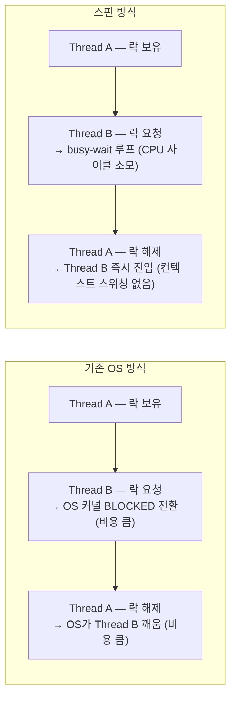
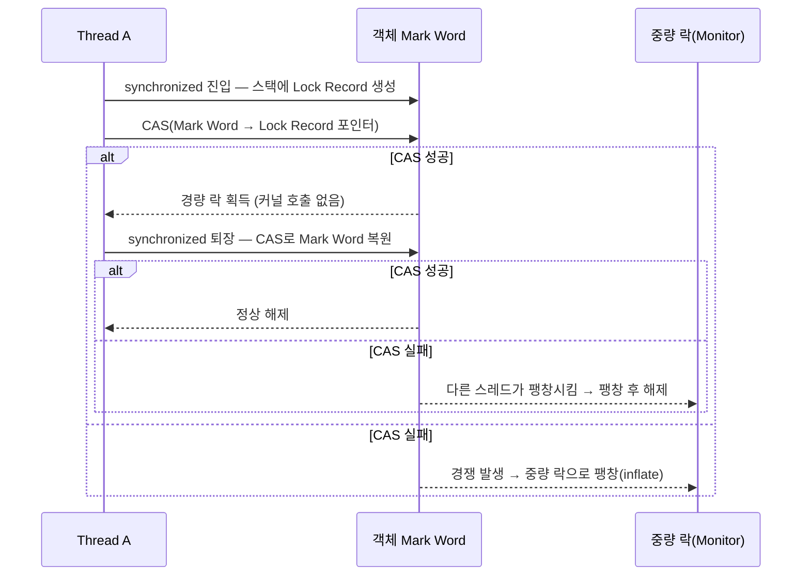
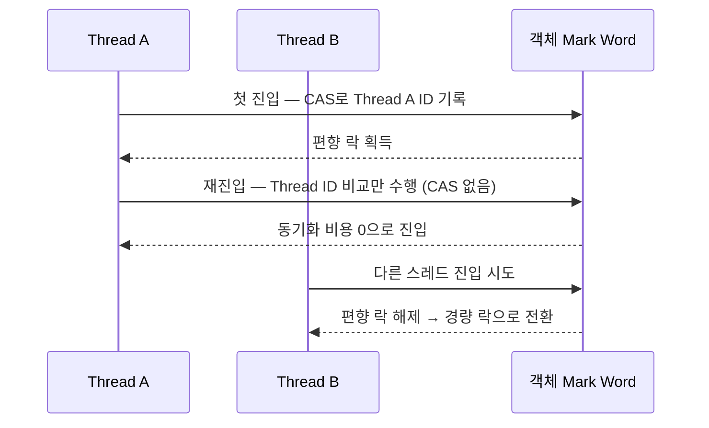

## 13장 스레드 안전성과 락 최적화

### 핵심 개념 --- 스레드 안전성 분류

Brian Goetz의 분류를 기반으로, 자바의 스레드 안전성을 5단계로 나눈다:

**1. 불변(Immutable) --- 가장 강한 안전성:**
```java
// final 필드 + 불변 객체 -> 동기화 불필요
public final class ImmutablePoint {
    private final int x;
    private final int y;

    public ImmutablePoint(int x, int y) {
        this.x = x;
        this.y = y;
    }
}

// 예시: String, Integer, Long 등 래퍼 클래스
// JMM 보장: final 필드는 생성자 완료 후 모든 스레드에 올바르게 보임
```

**2. 절대 스레드 안전(Absolute Thread Safety):**
```java
// 어떤 상황에서도 외부 동기화 없이 안전
// 실질적으로 달성하기 매우 어렵고 비용이 큼
// Java API에서 "스레드 안전"이라 명시된 클래스도 대부분 절대 안전은 아님

// 예시: Vector가 "스레드 안전"이라지만...
Vector<Integer> v = new Vector<>();
// Thread A
if (!v.isEmpty()) {
    v.remove(0);  // 이 사이에 Thread B가 마지막 원소를 제거할 수 있음!
}
// -> 복합 연산은 여전히 외부 동기화 필요 = 절대 안전이 아님
```

**3. 상대 스레드 안전(Relative Thread Safety):**
```java
// 개별 연산은 안전하지만, 복합 연산은 외부 동기화 필요
// Java의 대부분 "스레드 안전" 클래스가 이 수준
// 예시: ConcurrentHashMap, Vector, Collections.synchronizedList()

ConcurrentHashMap<String, Integer> map = new ConcurrentHashMap<>();
// 개별 연산은 안전
map.put("key", 1);           // OK
map.get("key");              // OK
// 복합 연산은 compute 계열 사용
map.compute("key", (k, v) -> v == null ? 1 : v + 1);  // 원자적 복합 연산
```

**4. 스레드 호환(Thread Compatible):**
```java
// 객체 자체는 스레드 안전하지 않지만,
// 호출 측에서 동기화하면 안전하게 사용 가능
// 예시: ArrayList, HashMap, StringBuilder

ArrayList<String> list = new ArrayList<>();
synchronized (list) {       // 호출 측이 동기화 책임
    list.add("item");
}
```

**5. 스레드 적대(Thread Hostile):**
```java
// 외부 동기화를 해도 안전하지 않은 코드
// 예시: Thread.suspend()/resume() -> 데드락 유발 가능 (deprecated)
// System.setOut() 등 전역 상태를 비원자적으로 변경하는 경우
```

---

### 핵심 개념 --- 동기화 구현 3가지

**1. 뮤텍스 동기화 (Mutual Exclusion) --- 비관적 전략:**

```java
// synchronized --- JVM 내장, 모니터 락 기반
public class Counter {
    private int count = 0;

    // 메서드 동기화 -> this 객체의 모니터 락
    public synchronized void increment() {
        count++;
    }

    // 블록 동기화 -> 특정 객체의 모니터 락
    public void decrement() {
        synchronized (this) {
            count--;
        }
    }
}

// 바이트코드 수준:
//   monitorenter -> 락 획득 (실패 시 blocking)
//   ... 임계 영역 ...
//   monitorexit  -> 락 해제

// ReentrantLock --- java.util.concurrent, 더 유연
public class FairCounter {
    private final ReentrantLock lock = new ReentrantLock(true); // 공정 락
    private int count = 0;

    public void increment() {
        lock.lock();
        try {
            count++;
        } finally {
            lock.unlock();  // 반드시 finally에서 해제!
        }
    }
}
```

| 비교 | synchronized | ReentrantLock |
|------|-------------|---------------|
| 구현 | JVM 내장 (monitorenter/exit) | java.util.concurrent API |
| 공정성 | 비공정만 지원 | 공정/비공정 선택 |
| 조건 대기 | wait/notify | Condition (다중 조건) |
| 타임아웃 | 불가 | tryLock(timeout) |
| 인터럽트 | 불가 | lockInterruptibly() |
| 성능 | JDK 6+ 최적화 후 동등 | 동등 |

**2. 비차단 동기화 (Non-blocking) --- 낙관적 전략:**

```java
// CAS (Compare-And-Swap): 하드웨어 원자 명령어
// "현재 값이 기대값과 같으면 새 값으로 교체, 아니면 실패"

// x86: LOCK CMPXCHG 명령어
// 의사코드:
boolean CAS(memory, expectedValue, newValue) {
    if (memory == expectedValue) {
        memory = newValue;
        return true;    // 성공
    }
    return false;       // 실패 -> 재시도
}

// Java에서 CAS 활용: AtomicInteger
public class CASCounter {
    private AtomicInteger count = new AtomicInteger(0);

    public void increment() {
        // 내부적으로 CAS 루프
        count.incrementAndGet();
        // 풀어쓰면:
        // int old;
        // do {
        //     old = count.get();
        // } while (!count.compareAndSet(old, old + 1));
    }
}
```

**CAS의 ABA 문제:**
```java
// Thread A: 값이 A -> CAS로 C로 변경하려 함
// Thread B: A -> B로 변경
// Thread C: B -> A로 변경 (다시 원래 A!)
// Thread A: "아직 A네?" -> CAS 성공 -> 하지만 중간에 변경이 있었음!

// 해결: AtomicStampedReference (버전 번호 추가)
AtomicStampedReference<Integer> ref =
    new AtomicStampedReference<>(100, 0);  // 값, 스탬프

int[] stampHolder = {0};
int value = ref.get(stampHolder);
ref.compareAndSet(value, 200, stampHolder[0], stampHolder[0] + 1);
// 값뿐 아니라 스탬프(버전)도 비교 -> ABA 방지
```

**3. 무동기화 (No Synchronization) --- 격리 전략:**

```java
// ThreadLocal --- 스레드마다 독립된 복사본
public class ConnectionManager {
    private static final ThreadLocal<Connection> connHolder =
        ThreadLocal.withInitial(() -> DriverManager.getConnection(URL));

    public static Connection getConnection() {
        return connHolder.get();  // 각 스레드가 자기만의 Connection 사용
    }
}

// 내부 구조:
// Thread 객체 내부에 ThreadLocalMap이 있음
// ThreadLocal<T> 인스턴스가 key, 값이 value
// -> 동기화 없이 스레드 안전!
```

---

### 핵심 개념 --- 락 최적화 4가지

HotSpot JVM은 동기화의 성능 비용을 줄이기 위해 다양한 최적화를 수행한다:

| 최적화 | 원리 | 효과 |
|--------|------|------|
| **스핀 락** | OS 스레드 전환 대신 루프 대기 | 짧은 대기 시 성능 향상 |
| **락 제거** | 탈출 분석으로 불필요한 동기화 제거 | 무의미한 synchronized 제거 |
| **락 범위 확장** | 연속 lock/unlock을 하나로 합침 | 락 획득 횟수 감소 |
| **경량 락/편향 락** | CAS로 경쟁 없는 락 최적화 | 대부분 시나리오에서 빠름 |

**1. 스핀 락과 적응형 스핀(Adaptive Spinning):**



적응형 스핀 (JDK 6+):

- 이전 스핀 성공 이력이 있으면 → 더 오래 스핀
- 이전에 성공한 적 없으면 → 스핀 건너뛰고 바로 blocking
- JVM이 런타임에 학습하여 최적 전략 결정

**2. 락 제거(Lock Elimination):**
```java
// JIT 컴파일러의 탈출 분석(Escape Analysis)
public String concat(String s1, String s2) {
    StringBuffer sb = new StringBuffer();  // sb는 이 메서드 안에서만 사용
    sb.append(s1);    // StringBuffer.append()는 synchronized
    sb.append(s2);    // 매번 lock/unlock
    return sb.toString();
}

// JIT가 분석: sb는 메서드 밖으로 탈출하지 않음 (escape 안 함)
// -> synchronized를 완전 제거!
// -> 사실상 StringBuilder처럼 동작
```

**3. 락 범위 확장(Lock Coarsening):**
```java
// 원본 코드
for (int i = 0; i < 100; i++) {
    synchronized (lock) {
        list.add(i);
    }
}
// 매 반복마다 lock/unlock = 200번의 락 연산

// JIT 최적화 후
synchronized (lock) {
    for (int i = 0; i < 100; i++) {
        list.add(i);
    }
}
// lock 1번, unlock 1번 = 2번의 락 연산
```

**4. 경량 락(Lightweight Lock)과 편향 락(Biased Locking):**

```
객체 헤더 (Mark Word) --- 64비트 환경:

┌─────────────────────────────────────────────────┬──────┬───┐
│                  Mark Word (62 bit)              │  Tag │   │
├─────────────────────────────────────────────────┼──────┼───┤
│  hashCode (31) | age (4) | biased(1) | 00       │  01  │ 무락 │
│  thread ID (54) | epoch (2) | age (4) | 1 | 00  │  01  │ 편향 │
│  Lock Record 포인터 (62) | 00                    │  00  │ 경량 │
│  Monitor 포인터 (62) | 10                        │  10  │ 중량 │
│  (비어있음) | 11                                  │  11  │ GC  │
└─────────────────────────────────────────────────┴──────┴───┘
```

**경량 락 동작 (경쟁이 없는 경우):**



**편향 락 동작 (한 스레드만 사용하는 경우):**



효과: 동기화된 코드를 실제로는 한 스레드만 사용하는 경우 (매우 흔함) 동기화 비용 = 0

**참고:** JDK 15부터 편향 락은 기본 비활성화 (`-XX:-UseBiasedLocking`). 최신 CAS 성능이 충분히 빨라졌고, 편향 락 해제(revocation) 비용이 오히려 부담이 되기 때문.

**락 팽창 과정 요약:**


※ 한 방향으로만 팽창 (역방향 축소 없음)

---

### 이 프로젝트(log-friends)와의 연결

log-friends SDK의 동시성 설계를 이 장의 개념으로 분석한다:

**1. BatchTransporter의 동기화 전략 --- 뮤텍스와 volatile의 조합:**

```kotlin
// BatchTransporter.kt --- 싱글톤 패턴에서 DCL + @Volatile
companion object {
    @Volatile
    private var instance: BatchTransporter? = null  // volatile!

    @JvmStatic
    fun getInstance(): BatchTransporter {
        return instance ?: synchronized(this) {     // 뮤텍스!
            instance ?: run {
                BatchTransporter(brokers, batch, interval).also { instance = it }
            }
        }
    }
}
```
- `@Volatile`: 12장에서 다룬 DCL 패턴의 명령어 재배열 방지
- `synchronized(this)`: 13장의 뮤텍스 동기화
- 이 조합이 없으면 **초기화 안 된 BatchTransporter 인스턴스**를 다른 스레드가 볼 수 있음

**2. AtomicBoolean/AtomicLong --- CAS 기반 비차단 동기화:**

```kotlin
// BatchTransporter.kt
private val running = AtomicBoolean(true)   // 종료 상태 플래그
private val sentCount = AtomicLong(0)        // 전송 카운트
private val dropCount = AtomicLong(0)        // 드랍 카운트
```
- 13장의 CAS 비차단 동기화 직접 적용
- 카운터 증가는 `incrementAndGet()` -> 내부 CAS 루프
- volatile + synchronized 대신 AtomicXxx를 선택한 이유: **단일 변수의 원자적 업데이트**에는 CAS가 가장 효율적

**3. `@Synchronized` flush() --- 뮤텍스로 배치 전송 보호:**

```kotlin
@Synchronized  // = synchronized(this)
private fun flush() {
    val buffer = ArrayList<AgentEvent>(batchSize)
    queue.drainTo(buffer, batchSize)  // 큐에서 배치 크기만큼 drain
    if (buffer.isEmpty()) return
    // Kafka 전송...
}
```
- `drainTo` 자체는 스레드 안전하지만, **drain + Kafka 전송**이라는 복합 연산을 원자적으로 묶음
- 스케줄러의 주기적 flush와 `enqueue`에서의 즉시 flush가 동시에 호출될 수 있기 때문

**4. LinkedBlockingQueue --- 내부적으로 ReentrantLock 2개 사용:**

```kotlin
private val queue: BlockingQueue<AgentEvent>
// ...
queue = LinkedBlockingQueue(queueCapacity)  // capacity=10000
```
- `LinkedBlockingQueue`는 내부적으로 **putLock**과 **takeLock** 두 개의 ReentrantLock 사용
- producer(enqueue)와 consumer(flush)가 **동시에** 동작 가능 (ArrayBlockingQueue보다 처리량 우수)
- `logfriends.queue.capacity=10000`: 큐 크기가 크면 락 경쟁 감소, 하지만 GC 압력 증가 (트레이드오프)

**5. KafkaProducer의 내부 동기화:**
- KafkaProducer 내부의 `RecordAccumulator`는 CAS 기반으로 배치에 레코드 추가
- `Sender` 스레드가 별도로 네트워크 I/O 처리 -> producer-consumer 패턴
- 이것이 13장에서 다룬 비차단 동기화의 실무 적용 사례

**6. JDK 21 가상 스레드로의 리팩토링 가능성:**
```kotlin
// 현재: 데몬 스레드 기반 스케줄러
scheduler = Executors.newSingleThreadScheduledExecutor { r ->
    Thread(r, "log-friends-batch-flush").apply { isDaemon = true }
}

// 미래: 가상 스레드 활용 가능성
// - flush()가 Kafka I/O blocking -> 가상 스레드에서 자동 unmount
// - 단, @Synchronized (synchronized) 블록 내 I/O -> pinning 발생!
// - 해결: ReentrantLock으로 교체 필요
// - ScheduledExecutorService는 아직 가상 스레드 미지원 -> 직접 구현 필요
```

**7. `@Volatile workerId` --- 상태 플래그 패턴:**
```kotlin
@Volatile
private var workerId: String = "unknown"
```
- 12장에서 다룬 volatile 사용의 전형적 사례: 한 스레드가 쓰고, 다른 스레드가 읽는 패턴
- `workerId`는 handshake 완료 후 설정되고, flush 스레드에서 읽힘

---

### 실습

**1. synchronized vs ReentrantLock 벤치마크:**
```bash
# JMH로 동기화 방식 성능 비교
# synchronized, ReentrantLock(fair), ReentrantLock(unfair), AtomicInteger
# 스레드 수: 1, 2, 4, 8, 16
./gradlew jmh
```

```java
@BenchmarkMode(Mode.Throughput)
@Warmup(iterations = 3, time = 1)
@Measurement(iterations = 5, time = 1)
@Fork(1)
@Threads(4)
public class LockBenchmark {
    private int syncCount = 0;
    private final ReentrantLock fairLock = new ReentrantLock(true);
    private final ReentrantLock unfairLock = new ReentrantLock(false);
    private final AtomicInteger atomicCount = new AtomicInteger(0);

    @Benchmark
    public void synchronizedIncrement() {
        synchronized (this) { syncCount++; }
    }

    @Benchmark
    public void fairLockIncrement() {
        fairLock.lock();
        try { syncCount++; } finally { fairLock.unlock(); }
    }

    @Benchmark
    public void unfairLockIncrement() {
        unfairLock.lock();
        try { syncCount++; } finally { unfairLock.unlock(); }
    }

    @Benchmark
    public void atomicIncrement() {
        atomicCount.incrementAndGet();
    }
}
```

**2. 편향 락 관찰 (JDK 15 이전):**
```bash
# 편향 락 활성화 + 로그 출력
java -XX:+UseBiasedLocking -XX:+PrintBiasedLockingStatistics \
     -jar examples/build/libs/examples.jar

# JDK 15+ 에서는 deprecated (기본 off)
# -XX:+UnlockDiagnosticVMOptions -XX:+PrintBiasedLockingStatistics
```

**3. jstack으로 스레드 상태 확인:**
```bash
# 애플리케이션 실행 중에 PID 확인
jps -l

# 스레드 덤프
jstack <PID>

# log-friends 관련 스레드 확인
jstack <PID> | grep -A 20 "log-friends"

# 관찰 포인트:
# - "log-friends-batch-flush" 스레드의 상태 (RUNNABLE vs TIMED_WAITING)
# - BLOCKED 상태의 스레드가 있다면 -> 락 경쟁 발생 중
# - "waiting on <0x...>" -> 어떤 모니터 락을 기다리는지 확인
```

**4. volatile 가시성 실험:**
```java
public class VolatilityTest {
    // volatile 제거하면 무한 루프 가능!
    static volatile boolean flag = false;

    public static void main(String[] args) throws Exception {
        new Thread(() -> {
            while (!flag) {
                // JIT가 flag를 레지스터에 캐시 -> 메인 메모리 변경 안 보임
                // volatile이면 매번 메인 메모리에서 읽기
            }
            System.out.println("Flag detected!");
        }).start();

        Thread.sleep(1000);
        flag = true;  // volatile 없으면 다른 스레드가 영원히 못 봄
        System.out.println("Flag set!");
    }
}
```

**5. BatchTransporter 동시성 스트레스 테스트:**
```kotlin
// 10개 스레드에서 동시에 10만 건 enqueue
val latch = CountDownLatch(10)
repeat(10) {
    Thread {
        repeat(10_000) {
            BatchTransporter.getInstance().enqueueLog(
                "INFO", "test", Thread.currentThread().name,
                "message-$it", null, null, null
            )
        }
        latch.countDown()
    }.start()
}
latch.await()
println(BatchTransporter.getInstance().stats)
// sent + dropped = 100,000 인지 확인 (유실 없음 검증)
```

---

### 핵심 질문

**Q1. volatile이 가시성은 보장하지만 원자성은 보장하지 않는 이유는?**

> volatile은 읽기/쓰기 시점에 메인 메모리와 동기화(load/store)를 강제하지만, **read-modify-write** 연산(예: count++)은 3단계로 구성된다. volatile은 각 단계를 원자적으로 만들어주지 않으므로, 두 스레드가 동시에 같은 값을 읽고 각자 +1한 뒤 쓰면 하나가 유실된다(Lost Update). 원자적 증가가 필요하면 `AtomicInteger`(CAS) 또는 `synchronized`를 사용해야 한다.

**Q2. happens-before가 "실제 실행 순서"와 다른 이유는?**

> happens-before는 **가시성 관계**만 정의한다. "A hb B"이면 A의 결과가 B에게 보이는 것이지, A가 물리적으로 B보다 먼저 실행되는 것이 아니다. JMM은 happens-before를 위반하지 않는 한 컴파일러/CPU가 자유롭게 명령어를 재배열하도록 허용한다. 이 여유가 성능 최적화(파이프라인, OoO 실행)를 가능하게 한다.

**Q3. BatchTransporter에서 DCL 패턴에 @Volatile이 빠지면 어떤 문제가 생기나?**

> `BatchTransporter` 생성자 실행(필드 초기화)과 `instance` 참조 할당이 재배열될 수 있다. 다른 스레드가 `instance != null`을 보고 synchronized 블록을 건너뛰었지만, 실제로는 아직 생성자가 실행되지 않은 **반쯤 초기화된 객체**를 사용하게 된다. `@Volatile`이 이 재배열을 방지한다.

**Q4. CAS의 ABA 문제는 실무에서 언제 문제가 되나?**

> 단순 카운터(`AtomicInteger`)에서는 문제가 안 된다. 하지만 **메모리 재사용**(예: lock-free 스택에서 노드 pop 후 같은 주소로 다른 노드 push)이나 **상태 전이**(A -> B -> A로 돌아왔지만 의미가 다른 경우)에서 위험하다. `AtomicStampedReference`로 버전 번호를 함께 비교하거나, `AtomicMarkableReference`로 마크 비트를 사용하여 해결한다.

**Q5. 경량 락에서 중량 락으로 팽창하면 다시 경량으로 돌아갈 수 있나?**

> 아니다. 한번 팽창(inflate)하면 역방향으로 축소되지 않는다. 중량 락은 OS 뮤텍스를 사용하므로 비용이 크다. 따라서 락 경쟁이 일시적인 경우, 스핀 락으로 중량 락 팽창을 방지하는 것이 중요하다. JVM은 적응형 스핀으로 이 결정을 런타임에 최적화한다.

**Q6. log-friends의 flush()를 가상 스레드로 전환할 때 주의점은?**

> 현재 `flush()`는 `@Synchronized` 어노테이션을 사용한다. JDK 21 가상 스레드는 `synchronized` 블록 내에서 blocking I/O를 하면 **pinning**(carrier thread에 고정)이 발생하여 가상 스레드의 이점이 사라진다. `flush()` 내부에서 Kafka I/O(`producer.send()`)가 발생하므로, 가상 스레드 전환 시 `@Synchronized`를 `ReentrantLock`으로 교체해야 한다. 또한 `ScheduledExecutorService`는 아직 가상 스레드를 네이티브로 지원하지 않으므로 스케줄링 로직도 재설계해야 한다.

**Q7. LinkedBlockingQueue vs ArrayBlockingQueue --- log-friends가 LinkedBlockingQueue를 선택한 이유는?**

> `ArrayBlockingQueue`는 put/take에 **하나의 ReentrantLock**을 공유하므로 producer와 consumer가 동시에 작업할 수 없다. `LinkedBlockingQueue`는 **putLock**과 **takeLock** 두 개를 분리하여 enqueue(producer)와 drain(consumer)이 동시에 동작한다. log-friends는 다수의 인터셉터 스레드(HTTP, LOG, JDBC 등)가 동시에 enqueue하고, 단일 flush 스레드가 drain하는 패턴이므로 lock 분리가 처리량에 유리하다. 단, 노드 할당으로 인한 GC 압력이 있으므로 `queue.capacity=10000`으로 상한을 제한한다.

**Q8. JMM의 8가지 연산 중 lock/unlock은 어떤 Java 구문에 대응하나?**

> `monitorenter` 바이트코드가 JMM의 `lock` 연산에, `monitorexit`가 `unlock` 연산에 대응한다. `synchronized` 키워드를 사용하면 컴파일러가 이 바이트코드를 생성한다. `lock` 연산은 작업 메모리의 변수를 무효화하여 다시 메인 메모리에서 load하게 만들고, `unlock`은 변경된 값을 메인 메모리에 store/write하도록 강제한다. 이것이 `synchronized`가 가시성을 보장하는 원리이다.

**Q9. 탈출 분석(Escape Analysis)이 실패하는 경우는?**

> 객체가 메서드 밖으로 반환되거나, 필드에 저장되거나, 다른 스레드에 전달되면 "탈출"한 것으로 간주되어 락 제거가 불가하다. 또한 JIT 컴파일 시점에 인라이닝이 충분히 되지 않으면 분석 범위가 좁아져 탈출로 판단될 수 있다. `-XX:+DoEscapeAnalysis`(기본 활성화)와 `-XX:+PrintEscapeAnalysis`로 확인 가능하다.

---

### 학습 완료 체크리스트

- [ ] CPU 캐시 계층(L1/L2/L3)과 MESI 프로토콜의 동작을 설명할 수 있다
- [ ] 스토어 버퍼와 메모리 배리어가 가시성에 미치는 영향을 이해한다
- [ ] JMM의 메인 메모리/작업 메모리 모델과 8가지 연산을 도식화할 수 있다
- [ ] volatile의 가시성 보장 + 재배열 방지 원리를 하드웨어 수준에서 설명할 수 있다
- [ ] volatile이 원자성을 보장하지 않는 이유를 코드로 증명할 수 있다
- [ ] happens-before 6가지 규칙을 각각 코드 예시와 함께 설명할 수 있다
- [ ] 1:1 커널 스레드 모델의 한계와 M:N 가상 스레드의 해결 방식을 비교할 수 있다
- [ ] 스레드 안전성 5단계 분류를 Java API 예시와 함께 구분할 수 있다
- [ ] synchronized vs ReentrantLock vs CAS의 사용 기준을 설명할 수 있다
- [ ] 4가지 락 최적화(스핀, 제거, 확장, 경량/편향)의 조건과 효과를 설명할 수 있다
- [ ] 락 팽창 과정(편향 -> 경량 -> 중량)을 객체 헤더 Mark Word와 함께 설명할 수 있다
- [ ] log-friends BatchTransporter의 동시성 설계를 이 장의 개념으로 분석할 수 있다
- [ ] jstack으로 스레드 상태를 확인하고 BLOCKED/WAITING 원인을 진단할 수 있다
