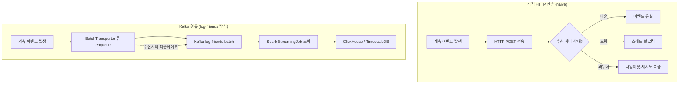
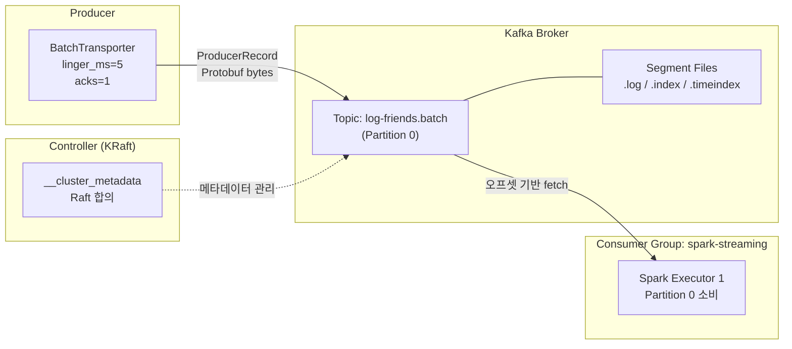
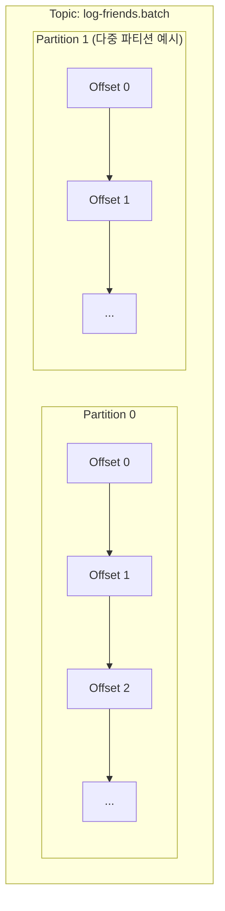
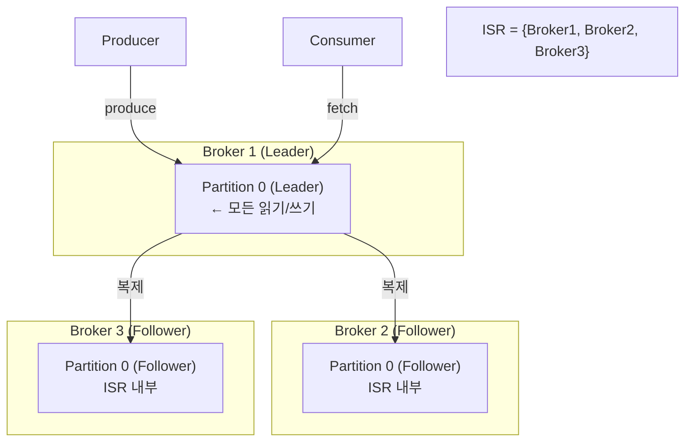
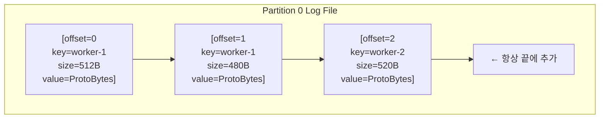
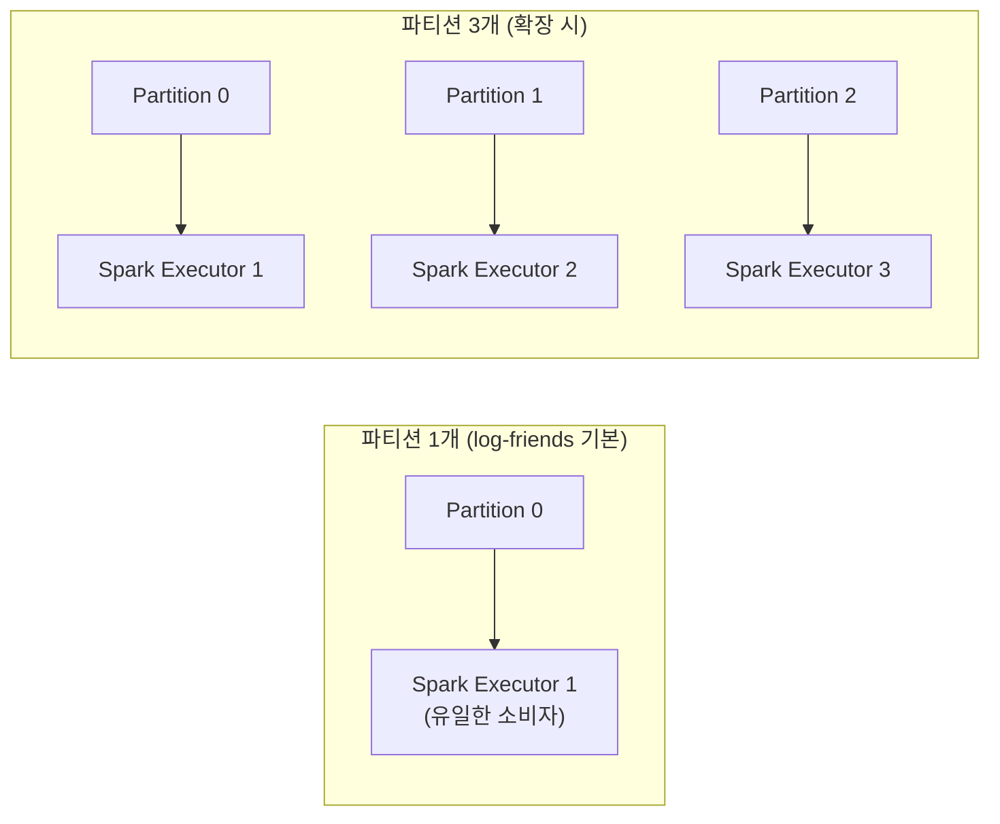

# Part 1: Kafka 아키텍처

> **예상 학습 시간:** 6~7시간
> **목표:** Kafka의 핵심 컴포넌트와 내부 저장 구조를 이해하고, log-friends가 Kafka를 선택한 이유를 체화한다

---

### 핵심 개념 --- Kafka가 필요한 이유

#### 직접 HTTP 전송 vs Kafka 비교

log-friends SDK는 ByteBuddy로 계측된 이벤트(HTTP/LOG/JDBC/METHOD_TRACE)를 수집해 분석 시스템으로 전송해야 한다. 가장 단순한 방법은 "계측 → 즉시 HTTP 전송"이지만, 이 방식은 치명적인 약점이 있다.



| 항목 | 직접 HTTP 전송 | Kafka 경유 |
|---|---|---|
| **내구성** | 수신 서버 다운 시 이벤트 유실 | 브로커가 디스크에 보존 (retention 기간까지) |
| **백프레셔** | 느린 수신 서버가 계측 스레드를 블로킹 | 큐(10,000건)로 격리, 드롭 방식 백프레셔 |
| **비동기** | 동기 전송, 응답 대기 | 비동기 배치 전송 (linger_ms=5) |
| **재처리** | 유실된 이벤트 복구 불가 | 오프셋 리셋으로 재소비 가능 |
| **확장성** | 수신 서버 1개에 의존 | 컨슈머 그룹으로 수평 확장 |

#### log-friends가 Kafka를 선택한 이유

`BatchTransporter.kt` 주석에도 명시되어 있듯, KafkaProducer는 **첫 전송 시점까지 초기화를 지연**한다. 이는 SLF4J 로드 순서 보장을 위한 것이기도 하지만, 근본적으로 **계측 코드가 애플리케이션 성능에 미치는 영향을 최소화**하기 위한 설계다.

```
계측 이벤트 → enqueue(O(1), non-blocking) → 10,000건 큐
                                               ↓ (별도 스레드, 500ms 또는 100건마다)
                                           flush() → KafkaProducer.send()
```

계측 스레드는 큐에 넣는 O(1) 연산만 수행한다. Kafka 브로커와의 네트워크 I/O는 `log-friends-batch-flush` 데몬 스레드가 담당한다.

---

### 핵심 개념 --- 핵심 컴포넌트

#### 전체 아키텍처



#### 브로커 (Broker)

브로커는 Kafka 서버 프로세스다. 브로커의 핵심 역할은 세 가지다.

1. **메시지 저장**: 프로듀서가 보낸 메시지를 디스크의 세그먼트 파일에 기록
2. **복제 조정**: 리더 파티션이 팔로워에게 메시지를 복제
3. **컨슈머 서빙**: 컨슈머의 fetch 요청에 응답하여 메시지 전달

log-friends는 KRaft 모드 단일 브로커를 사용한다. 브로커가 Controller 역할도 겸한다.

#### 토픽 (Topic)

토픽은 메시지의 논리적 카테고리다. 파일 시스템의 디렉터리에 비유할 수 있다.

- log-friends는 `log-friends.batch` 단일 토픽 사용
- 토픽은 1개 이상의 파티션으로 구성됨
- 프로듀서는 토픽 이름으로 메시지를 전송, 컨슈머는 토픽 이름으로 구독

```kotlin
// BatchTransporter.kt L177
val record = ProducerRecord("log-friends.batch", workerId, msg.toByteArray())
//                           ^ 토픽 이름        ^ 키(워커ID) ^ 값(Protobuf 직렬화)
```

키로 `workerId`를 사용하면 동일 워커의 이벤트가 동일 파티션에 순서대로 저장된다.

#### 파티션 (Partition)

파티션은 Kafka 병렬성의 핵심 단위다.



파티션의 핵심 특성:
- **파티션 내 순서 보장**: 파티션 내에서는 오프셋 순서대로 메시지가 저장되고 소비됨
- **토픽 간 순서 미보장**: 파티션이 여러 개면 파티션 간 순서는 보장되지 않음
- **병렬 소비의 단위**: 컨슈머 그룹의 각 컨슈머는 1개 이상의 파티션을 담당
- **수평 확장**: 파티션 수 = 최대 병렬 컨슈머 수

#### 오프셋 (Offset)

오프셋은 파티션 내 각 메시지의 고유 위치 식별자다.

- **절대값**: 0부터 시작하는 단조 증가 정수
- **불변**: 한번 할당된 오프셋은 변경되지 않음
- **파티션 내 고유**: 파티션 0의 오프셋 5와 파티션 1의 오프셋 5는 다른 메시지

```
Partition 0: [msg_A @ offset=0] [msg_B @ offset=1] [msg_C @ offset=2] ...
                                                     ↑
                                              컨슈머가 offset=2까지 읽었다면
                                              다음 fetch는 offset=3부터
```

#### 세그먼트 (Segment)

세그먼트는 파티션의 물리적 파일 저장 단위다. 파티션이 논리적 개념이라면, 세그먼트는 실제 디스크 파일이다.

```
/kafka-data/log-friends.batch-0/       ← Partition 0 디렉터리
  ├── 00000000000000000000.log          ← 메시지 데이터 (offset 0부터)
  ├── 00000000000000000000.index        ← offset → 파일 위치 인덱스
  ├── 00000000000000000000.timeindex    ← timestamp → offset 인덱스
  ├── 00000000000001000000.log          ← 다음 세그먼트 (offset 1,000,000부터)
  ├── 00000000000001000000.index
  └── 00000000000001000000.timeindex
```

세그먼트 파일명은 해당 세그먼트의 **첫 번째 오프셋**이다. 이를 통해 특정 오프셋의 메시지가 어느 파일에 있는지 빠르게 찾을 수 있다(이진 탐색).

---

### 핵심 개념 --- 복제 메커니즘

#### ISR (In-Sync Replicas)



**ISR(In-Sync Replicas)** 는 리더 파티션과 동기화 상태인 팔로워의 집합이다.

팔로워가 ISR에서 제외되는 조건:
- `replica.lag.time.max.ms`(기본 30초) 동안 리더를 따라잡지 못한 경우
- 팔로워 브로커가 다운된 경우

ISR의 중요성: `acks=all` 설정 시, **ISR 내의 모든 복제본이 메시지를 수신해야** 프로듀서에게 확인 응답을 보낸다.

#### acks 설정 비교

| acks 값 | 동작 | 내구성 | 성능 | log-friends |
|---|---|---|---|---|
| `acks=0` | 응답 대기 없음 (fire-and-forget) | 최저 (브로커 응답 없이 유실 가능) | 최고 | 미사용 |
| `acks=1` | 리더만 확인 | 중간 (리더 장애 시 유실 가능) | 중간 | **현재 설정** |
| `acks=all` | ISR 전체 확인 | 최고 (ISR 전체 확인 후 응답) | 낮음 | 미사용 |

```kotlin
// BatchTransporter.kt L41
put(ProducerConfig.ACKS_CONFIG, "1")
// 리더 브로커가 메시지를 수신하면 즉시 확인 응답
// 팔로워 복제 전에 리더 장애 발생 시 메시지 유실 가능
// 하지만 log-friends는 관측 데이터이므로 일부 유실 허용
```

**log-friends가 acks=1을 선택한 이유:**
관측 데이터(HTTP 로그, JDBC 추적 등)는 일부 유실이 허용된다. `acks=all`은 ISR 크기에 비례해 지연이 증가하므로, 단일 노드 운영에서 `acks=all`과 `acks=1`의 내구성 차이가 없다(ISR={리더 1개}). 따라서 `acks=1`이 합리적 선택이다.

---

### 핵심 개념 --- 메시지 저장 구조

#### Commit Log — append-only 설계

Kafka의 가장 핵심적인 설계 결정은 **Commit Log(커밋 로그)** 구조다.



**append-only의 장점:**
1. **랜덤 I/O 없음**: 디스크의 특정 위치를 수정하지 않으므로 HDD도 고성능
2. **OS 페이지 캐시 활용**: 순차 읽기는 OS가 미리 읽기(prefetch)로 최적화
3. **불변성 보장**: 기존 메시지 수정이 불가능하므로 오프셋 기반 재생(replay) 신뢰성 확보

#### 세그먼트 파일 구조

`.log` 파일의 각 메시지 레코드(RecordBatch) 구조:

```
RecordBatch
├── baseOffset        (8 bytes) — 배치 첫 메시지의 오프셋
├── batchLength       (4 bytes) — 배치 크기
├── magic             (1 byte)  — 포맷 버전
├── attributes        (2 bytes) — 압축 코덱, 타임스탬프 타입 등
├── lastOffsetDelta   (4 bytes) — 배치 내 마지막 오프셋 델타
├── firstTimestamp    (8 bytes)
├── maxTimestamp      (8 bytes)
├── producerId        (8 bytes) — 멱등성을 위한 프로듀서 ID
├── producerEpoch     (2 bytes)
├── baseSequence      (4 bytes) — 중복 감지용 시퀀스
└── records[]         — 실제 메시지 배열
    ├── offsetDelta
    ├── timestampDelta
    ├── key
    └── value         ← Protobuf AgentMessage 바이트
```

`.index` 파일(스파스 인덱스):
```
[relativeOffset=0    → filePosition=0    ]
[relativeOffset=100  → filePosition=51200]
[relativeOffset=200  → filePosition=102400]
...
```

모든 오프셋이 아닌 **일부 오프셋만 인덱싱**(스파스)하여 인덱스 파일 크기를 제한한다. 특정 오프셋을 찾을 때 인덱스에서 가장 가까운 앞 위치를 찾고 `.log` 파일에서 선형 탐색한다.

#### 보존 정책 (Retention)

| 설정 | 설명 | 기본값 |
|---|---|---|
| `retention.ms` | 메시지 보존 기간 | 7일 (604800000ms) |
| `retention.bytes` | 파티션당 최대 보존 크기 | 무제한 (-1) |
| `segment.bytes` | 세그먼트 파일 최대 크기 | 1GB |
| `segment.ms` | 세그먼트 롤링 주기 | 7일 |

보존 정책은 세그먼트 단위로 삭제된다. 개별 메시지 단위 삭제가 아니라 **오래된 세그먼트 파일 전체를 삭제**하는 방식이다.

```
log-friends.batch-0/
  ├── 00000000000000000000.log  ← 7일 이상 지나면 삭제 대상
  ├── 00000000000001000000.log  ← 아직 보존
  └── 00000000000002000000.log  ← 활성 세그먼트 (쓰기 중)
```

#### 파티션 개수와 병렬성 관계



**파티션 수 결정 원칙:**
- 파티션 수 ≥ 컨슈머 그룹 내 컨슈머 수여야 모든 컨슈머가 일을 할 수 있음
- 파티션 수 > 컨슈머 수이면 일부 컨슈머가 복수 파티션 담당
- 파티션 수 < 컨슈머 수이면 초과 컨슈머는 유휴 상태 (낭비)
- 파티션이 많을수록 브로커 메모리·파일 디스크립터 소비 증가

---

### 핵심 질문 Q&A

**Q1. 파티션이 많을수록 항상 좋은가?**

아니다. 파티션 수를 늘리면 다음 비용이 증가한다:
- **브로커 리소스**: 각 파티션은 브로커에서 메모리(페이지 캐시), 파일 디스크립터를 소비
- **장애 복구 시간**: 리더 선출은 파티션 단위로 발생하므로, 브로커 재시작 시 파티션이 많을수록 복구 시간 증가
- **End-to-End 지연**: 파티션이 많으면 프로듀서의 RecordAccumulator가 분산되어 배치 효율 저하

적정 파티션 수 공식: `max(목표 처리량 / 파티션당 처리량, 컨슈머 스레드 수)`

log-friends 단일 노드 환경에서는 파티션 1~3개가 적합하다.

---

**Q2. ISR에서 팔로워가 탈락하는 조건은?**

`replica.lag.time.max.ms`(기본 30초) 동안 팔로워가 리더의 마지막 오프셋을 따라잡지 못하면 ISR에서 제외된다. 구체적으로:
- 팔로워 브로커가 GC pause, 네트워크 지연 등으로 복제 요청을 보내지 못한 경우
- 팔로워 브로커가 완전히 다운된 경우

ISR 탈락 후 팔로워가 리더를 다시 따라잡으면 자동으로 ISR에 재합류한다.

---

**Q3. 토픽의 메시지 순서는 어디까지 보장되는가?**

**파티션 내에서만** 순서가 보장된다. 파티션 간에는 순서가 보장되지 않는다.

```
Partition 0: [A @ offset=0] → [B @ offset=1] → [C @ offset=2]  ← 순서 보장
Partition 1: [D @ offset=0] → [E @ offset=1]

토픽 전체: A, B, C, D, E 순서는 보장 안 됨. D가 A보다 먼저 소비될 수 있음.
```

log-friends의 `workerId` 키 전략: 동일 워커의 이벤트는 동일 파티션으로 라우팅되므로, 워커 단위 이벤트 순서가 보장된다.

---

**Q4. log-friends.batch 토픽에 파티션 3개를 두면 어떤 일이 일어나는가?**

1. **프로듀서 측**: `workerId` 키의 해시값으로 파티션이 결정됨. 워커 A는 항상 Partition 0, 워커 B는 항상 Partition 1 등으로 분산
2. **브로커 측**: 3개의 세그먼트 디렉터리 생성 (`log-friends.batch-0`, `-1`, `-2`)
3. **컨슈머 측**: Spark Structured Streaming은 3개 파티션을 병렬 소비할 수 있음. 단, 현재 단일 노드에서는 실제 병렬성 이점이 제한됨
4. **순서 변화**: 파티션 간 순서는 보장되지 않으므로, 다른 워커의 이벤트 간 글로벌 순서가 사라짐

---

**Q5. 세그먼트 파일이 왜 append-only인가?**

두 가지 이유가 있다:

**성능**: 디스크는 순차 쓰기 시 랜덤 쓰기 대비 수십~수백 배 빠르다. 기존 오프셋 4의 메시지를 수정하려면 파일 내 특정 위치를 찾아 덮어써야 하는데(랜덤 I/O), 이는 Kafka의 고처리량 목표와 충돌한다.

**신뢰성**: append-only이면 오프셋이 내용의 변경 없이 항상 동일한 메시지를 가리킨다. 컨슈머가 오프셋 100을 다시 읽어도 항상 같은 메시지가 나온다. 이 불변성이 재생(replay), 오프셋 리셋, 멀티 컨슈머 그룹의 독립적 소비를 가능하게 한다.

---

**Q6. BatchTransporter의 workerId 키가 없다면 어떻게 파티션이 결정되는가?**

키가 `null`이면 Kafka 프로듀서는 **라운드 로빈** 또는 **스티키 파티셔너**(Kafka 2.4+)로 파티션을 선택한다. 스티키 파티셔너는 현재 배치가 채워질 때까지 같은 파티션에 계속 보내고, 배치가 전송된 후 다음 파티션으로 전환한다. 이는 배치 효율을 높이기 위한 최적화다.

---

### 프로젝트 연결

#### BatchTransporter.TOPIC = "log-friends.batch" 의미

```kotlin
// BatchTransporter.kt L177
val record = ProducerRecord("log-friends.batch", workerId, msg.toByteArray())
```

- `"log-friends.batch"`: 토픽 이름. 브로커에 해당 토픽이 없으면 `auto.create.topics.enable=true`(기본값)일 때 자동 생성됨
- `workerId`: 파티션 키. 동일 워커(JVM 프로세스)의 이벤트가 같은 파티션으로 라우팅
- `msg.toByteArray()`: Protobuf 직렬화된 `AgentMessage` (BatchPayload 포함)

#### 단일 파티션 vs 다중 파티션 선택 기준

현재 log-friends는 단일 노드, 단일 컨슈머(Spark) 구성이므로 **파티션 1개**가 최적이다.

파티션 수를 늘려야 하는 시점:
1. Spark Executor가 여러 개로 늘어날 때 (파티션 = Executor 수)
2. 여러 Spring Boot 앱 인스턴스가 이벤트를 동시에 보낼 때 (처리량 증가)
3. 단일 파티션의 처리량이 브로커 I/O 병목이 될 때

---

### 학습 완료 체크리스트

- [ ] Kafka가 직접 HTTP 전송보다 나은 이유를 내구성, 백프레셔, 비동기 관점에서 설명할 수 있다
- [ ] 브로커, 토픽, 파티션, 오프셋의 관계를 그림으로 그릴 수 있다
- [ ] 오프셋이 절대값이고 불변인 이유를 설명할 수 있다
- [ ] 세그먼트 파일 3종 (.log, .index, .timeindex)의 역할을 설명할 수 있다
- [ ] ISR의 개념과 팔로워가 ISR에서 탈락하는 조건을 알고 있다
- [ ] acks=0, acks=1, acks=all의 내구성과 성능 트레이드오프를 비교할 수 있다
- [ ] log-friends가 acks=1을 선택한 이유를 설명할 수 있다
- [ ] 파티션 내 순서 보장과 토픽 전체 순서 미보장의 차이를 설명할 수 있다
- [ ] 보존 정책이 메시지 단위가 아닌 세그먼트 단위로 동작하는 이유를 설명할 수 있다
- [ ] 파티션 수를 늘리는 것의 이점과 비용을 함께 설명할 수 있다
- [ ] append-only 구조가 Kafka 고성능의 핵심인 이유를 I/O 관점에서 설명할 수 있다
- [ ] workerId 키가 파티션 라우팅에 미치는 영향을 설명할 수 있다

---

### 실습

#### 토픽 생성 및 확인

```bash
# 토픽 생성 (파티션 1개, 복제 인수 1)
kafka-topics.sh \
  --create \
  --topic log-friends.batch \
  --partitions 1 \
  --replication-factor 1 \
  --bootstrap-server localhost:9092

# 토픽 상세 정보 확인 (파티션, ISR, 리더 정보)
kafka-topics.sh \
  --describe \
  --topic log-friends.batch \
  --bootstrap-server localhost:9092

# 출력 예시:
# Topic: log-friends.batch  Partition: 0  Leader: 1  Replicas: 1  Isr: 1
#   ↑ 파티션 0의 리더는 브로커 1, 복제본 1개, ISR에 브로커 1 포함
```

#### 메시지 전송 및 소비 확인

```bash
# 콘솔 프로듀서로 테스트 메시지 전송
kafka-console-producer.sh \
  --topic log-friends.batch \
  --bootstrap-server localhost:9092
> test-message-1
> test-message-2
> ^C

# 처음부터 메시지 소비
kafka-console-consumer.sh \
  --topic log-friends.batch \
  --from-beginning \
  --bootstrap-server localhost:9092

# 오프셋 정보 확인
kafka-run-class.sh kafka.tools.GetOffsetShell \
  --topic log-friends.batch \
  --bootstrap-server localhost:9092
# 출력: log-friends.batch:0:2  ← 파티션 0에 2개의 메시지
```

#### 세그먼트 파일 직접 확인 (Docker)

```bash
# Kafka 컨테이너 내부에서 세그먼트 파일 확인
docker exec -it kafka bash

ls -la /var/lib/kafka/data/log-friends.batch-0/
# 00000000000000000000.log
# 00000000000000000000.index
# 00000000000000000000.timeindex

# 세그먼트 파일 덤프 (메시지 내용 확인)
kafka-run-class.sh kafka.tools.DumpLogSegments \
  --files /var/lib/kafka/data/log-friends.batch-0/00000000000000000000.log \
  --print-data-log
```

#### 파티션 3개로 토픽 재생성 실험

```bash
# 기존 토픽 삭제
kafka-topics.sh \
  --delete \
  --topic log-friends.batch \
  --bootstrap-server localhost:9092

# 파티션 3개로 재생성
kafka-topics.sh \
  --create \
  --topic log-friends.batch \
  --partitions 3 \
  --replication-factor 1 \
  --bootstrap-server localhost:9092

# 설명 확인 — 파티션 0, 1, 2가 모두 같은 브로커(단일 노드)에 있음을 확인
kafka-topics.sh \
  --describe \
  --topic log-friends.batch \
  --bootstrap-server localhost:9092
```
