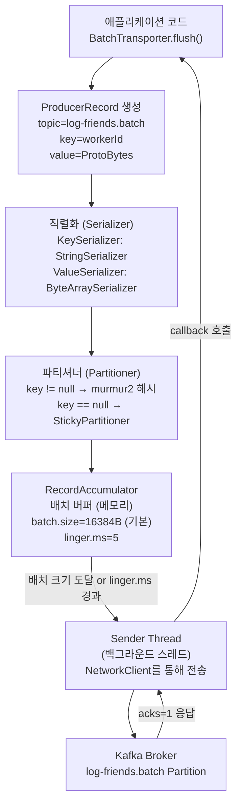
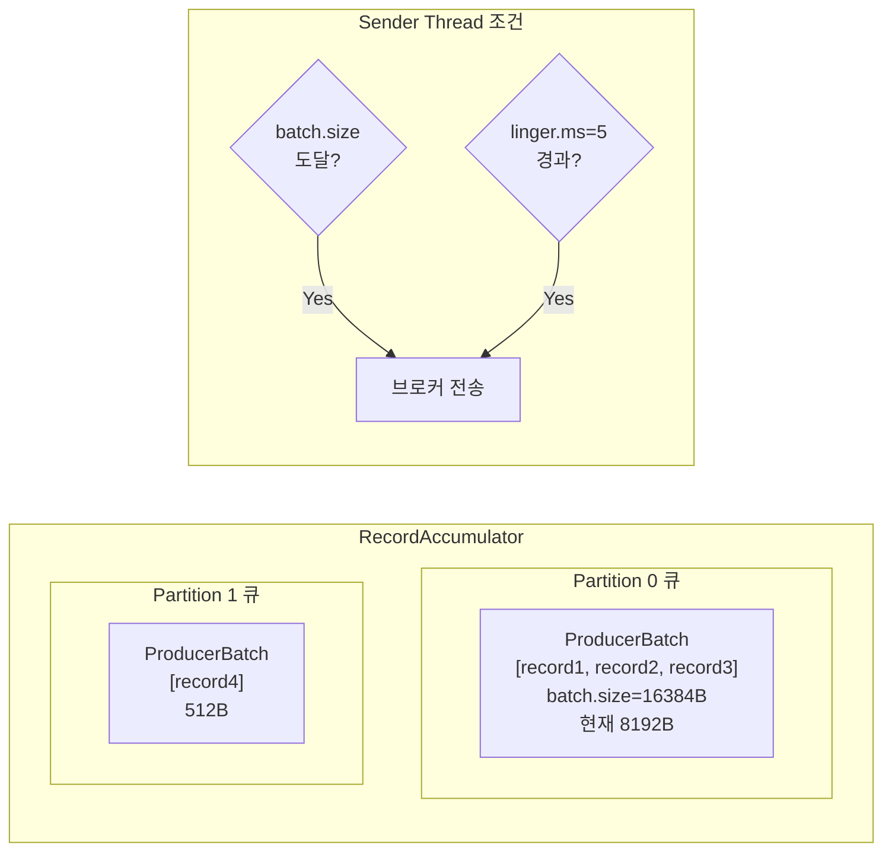
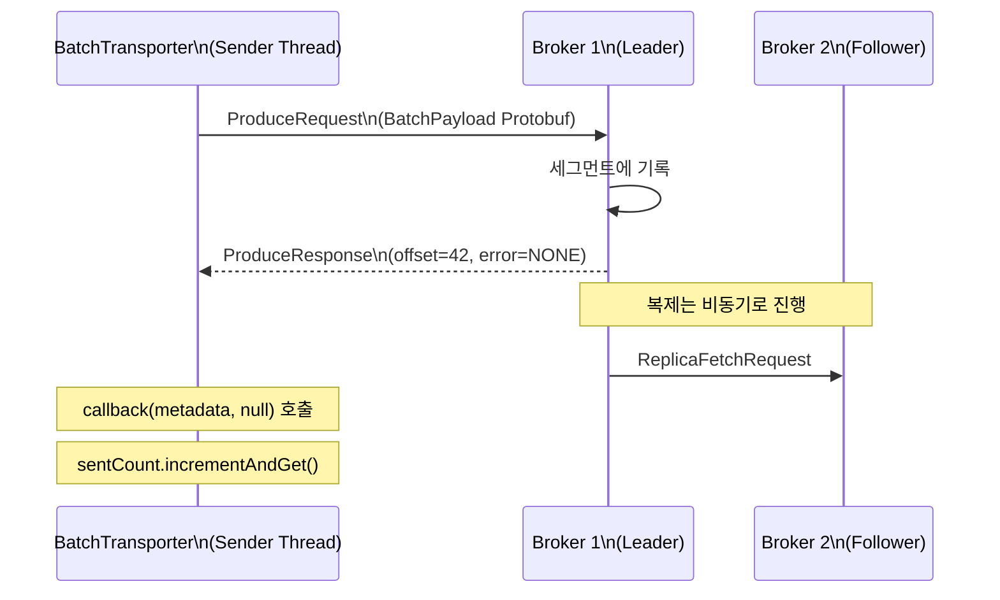
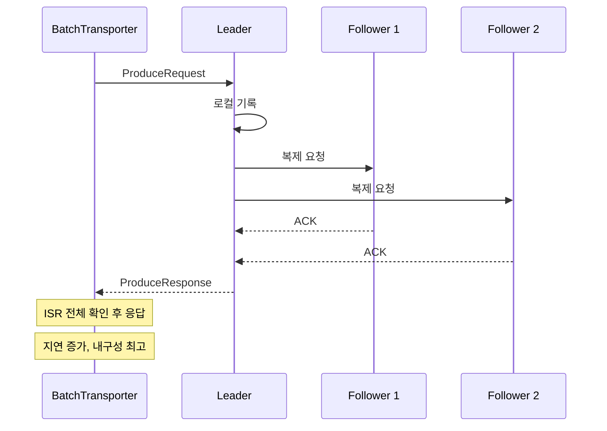
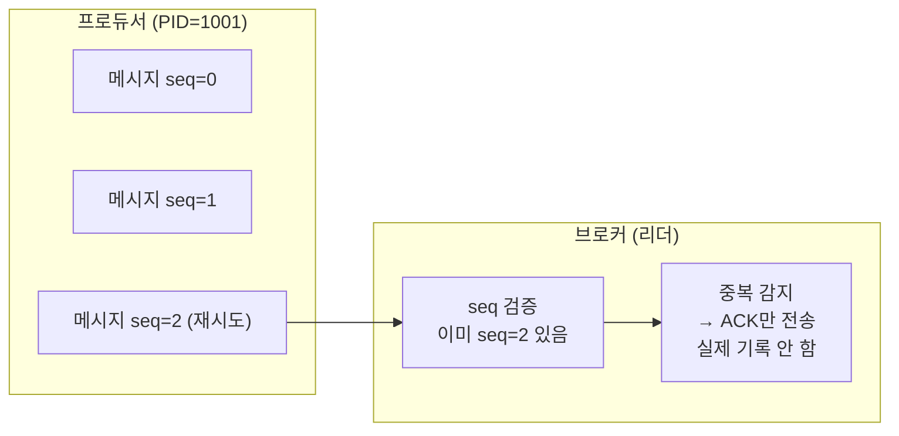
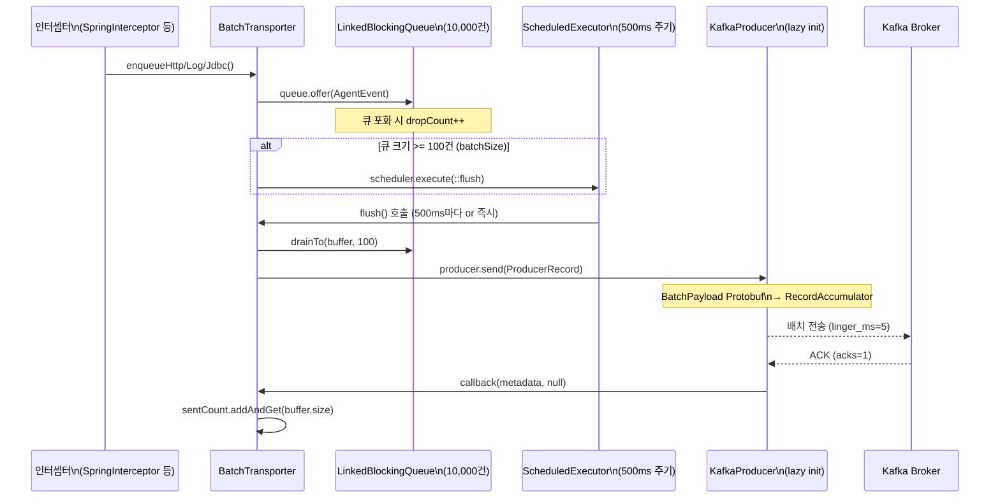

# Part 2: 프로듀서 심화

> **예상 학습 시간:** 6~7시간
> **목표:** Kafka 프로듀서의 내부 동작을 깊이 이해하고, BatchTransporter의 모든 설정값이 왜 그 값인지 근거를 체화한다

---

### 핵심 개념 --- 프로듀서 내부 구조

#### send() 호출부터 브로커 전달까지



각 단계의 역할:

**1. ProducerRecord 생성**
```kotlin
// BatchTransporter.kt L177
val record = ProducerRecord("log-friends.batch", workerId, msg.toByteArray())
// 토픽, 키, 값만 지정. 파티션 번호와 타임스탬프는 자동 결정.
```

**2. 직렬화 (Serializer)**
키(`workerId`)는 `StringSerializer`로 UTF-8 바이트 배열로 변환된다. 값(`AgentMessage`)은 이미 `msg.toByteArray()`로 Protobuf 직렬화된 바이트이므로 `ByteArraySerializer`가 그대로 통과시킨다.

**3. 파티셔너 (Partitioner)**
키가 있으면 `murmur2` 해시로 파티션을 결정한다:
```
partition = murmur2(keyBytes) % numPartitions
```
동일한 `workerId`는 항상 동일한 파티션으로 라우팅된다.

**4. RecordAccumulator (핵심)**
메모리 내 배치 버퍼. 파티션별로 `Deque<ProducerBatch>`를 유지한다. 두 조건 중 하나가 충족되면 Sender Thread가 해당 배치를 전송한다:
- 배치 크기가 `batch.size`(기본 16KB)에 도달
- `linger.ms` 시간이 경과

**5. Sender Thread**
`RecordAccumulator`에서 전송 준비된 배치를 꺼내 `NetworkClient`를 통해 브로커에 전송하는 백그라운드 스레드. 애플리케이션 스레드와 분리되어 있어 애플리케이션 성능에 직접 영향을 주지 않는다.

#### RecordAccumulator 상세



`linger.ms=5`의 의미: 배치가 가득 차지 않아도 **5밀리초 후에는 반드시 전송**한다. 이 값이 0이면 메시지가 RecordAccumulator에 들어오는 즉시 Sender Thread가 전송을 시도한다(배치 효율 저하). 값이 크면 배치 효율은 높아지지만 End-to-End 지연이 증가한다.

```kotlin
// BatchTransporter.kt L43
put(ProducerConfig.LINGER_MS_CONFIG, 5)
// 5ms마다 최대 batch.size(16KB)까지 배치로 묶어 전송
// log-friends의 flush 주기(500ms)보다 훨씬 짧아서
// 큰 배치 100건이 들어오면 여러 개의 Kafka 배치로 나눠 전송됨
```

---

### 핵심 개념 --- acks 심화

#### acks=1 내부 동작 (log-friends 현재 설정)



리더가 메시지를 로컬 디스크에 기록한 직후 프로듀서에게 응답을 보낸다. 팔로워 복제는 비동기로 진행되므로, 리더 장애 시 팔로워에 복제되지 않은 메시지는 유실될 수 있다.

#### acks=all 내부 동작 (비교)



`min.insync.replicas=2`와 `acks=all` 조합: ISR에서 최소 2개 복제본이 확인해야 응답. 복제본이 1개뿐이면(단일 노드) `NotEnoughReplicasException` 발생 가능.

#### log-friends 단일 노드에서의 acks=all 주의점

```
단일 노드 환경:
  ISR = {Broker 1 (리더 = 팔로워 없음)}
  min.insync.replicas = 1 (기본값)

→ acks=all이라도 ISR이 리더 1개뿐이므로
  acks=1과 동일한 내구성 (추가 복제 없음)
  하지만 acks=1보다 코드 경로가 길어 약간의 오버헤드 발생
```

따라서 log-friends 단일 노드에서는 `acks=1`이 실용적으로 최선이다.

---

### 핵심 개념 --- 재시도와 멱등성

#### retries=3의 의미

```kotlin
// BatchTransporter.kt L42
put(ProducerConfig.RETRIES_CONFIG, 3)
```

브로커로부터 재시도 가능한 에러(네트워크 타임아웃, 리더 선출 중 등)가 발생하면 자동으로 최대 3번 재전송한다. 재시도 간격은 `retry.backoff.ms`(기본 100ms)로 제어한다.

```mermaid
graph LR
    SEND["send() 시도"] --> ERR{"에러?"}
    ERR -->|재시도 가능 에러\n(네트워크, 리더 선출)| RETRY{"retry 횟수\n< 3?"}
    ERR -->|재시도 불가 에러\n(메시지 너무 큼)| FAIL["callback(null, exception)"]
    RETRY -->|Yes| BACKOFF["100ms 대기"] --> SEND
    RETRY -->|No| FAIL
    ERR -->|성공| SUCCESS["callback(metadata, null)"]
```

#### 메시지 중복 발생 조건

재시도는 **중복 메시지**를 발생시킬 수 있다:

```
1. 프로듀서가 메시지를 브로커에 전송
2. 브로커가 메시지를 기록하고 응답 전송
3. 네트워크 에러로 응답이 프로듀서에 도달 안 함
4. 프로듀서는 실패로 판단하고 재전송 (메시지가 브로커에 이미 있음)
→ 동일 메시지가 2번 기록됨 (중복)
```

BatchTransporter 콜백:
```kotlin
// BatchTransporter.kt L178-184
producer.send(record) { _, ex ->
    if (ex != null) {
        System.err.println("[Log Friends] Batch send failed: ${ex.message}")
        buffer.forEach { queue.offer(it) }  // 실패 시 큐에 다시 넣음
    } else {
        sentCount.addAndGet(buffer.size.toLong())
    }
}
```

`buffer.forEach { queue.offer(it) }` — 전송 실패 시 이벤트를 큐에 되돌린다. Kafka 프로듀서의 `retries=3`이 소진된 후 최종 실패 시에만 이 콜백이 호출된다. 즉, **ApplicationLevel 재시도가 Kafka 레벨 재시도 위에 추가**되어 있다.

#### enable.idempotence=true — 중복 방지

Kafka 프로듀서 멱등성은 PID(ProducerID)와 시퀀스 번호로 중복을 방지한다:



```kotlin
// 멱등성 활성화 (BatchTransporter에 현재 미설정)
put(ProducerConfig.ENABLE_IDEMPOTENCE_CONFIG, "true")
// 활성화 시 자동으로:
//   acks=all 강제
//   retries=Integer.MAX_VALUE 강제
//   max.in.flight.requests.per.connection=5 이하 강제
```

**log-friends에서 멱등성 미설정 시 리스크:**
관측 데이터(HTTP 로그, 메서드 추적 등)는 중복이 발생해도 분석 결과에 큰 영향이 없다. 카운트 집계에서 약간의 과대 계산이 생길 수 있지만, 관측 시스템의 특성상 허용 범위다. 내구성보다 성능을 우선하는 설계 결정이다.

---

### 핵심 개념 --- 압축

#### 압축 알고리즘 비교

| 압축 | CPU 부하 | 압축률 | 속도 | Protobuf와의 궁합 |
|---|---|---|---|---|
| `none` | 없음 | 1.0x (기준) | N/A | 현재 설정 |
| `gzip` | 높음 | 가장 좋음 (2~3x) | 느림 | 좋음 (텍스트 필드 압축 효과) |
| `snappy` | 낮음 | 중간 (1.5~2x) | 빠름 | **권장** (CPU 효율 최고) |
| `lz4` | 낮음 | 중간 (1.5~2x) | 매우 빠름 | 권장 (최저 지연) |
| `zstd` | 중간 | gzip급 (2~3x) | 빠름 | 좋음 (균형 최고) |

#### Protobuf 메시지에 snappy 압축이 효과적인 이유

Protobuf는 이진 직렬화이므로 JSON보다 이미 작다. 하지만 배치로 묶인 AgentMessage에는:
- 반복되는 필드 이름이 없음 (Protobuf 장점)
- 반복되는 타임스탬프 패턴 (`"2025-04-16T..."`)
- 반복되는 클래스명 (`"com.example.service.UserService"`)
- 반복되는 로거명, URI 패턴

이런 반복 패턴을 snappy/lz4가 효율적으로 압축한다.

```kotlin
// v1.1.0에 추가 예정: compression.type 설정
put(ProducerConfig.COMPRESSION_TYPE_CONFIG,
    System.getProperty("logfriends.kafka.compression.type", "snappy"))
```

압축은 **프로듀서에서 배치 전체에 적용**되고, **브로커가 그대로 저장**, **컨슈머가 해제**한다. 브로커는 압축 해제 없이 저장하므로 CPU 오버헤드가 없다.

#### CPU vs 네트워크 트레이드오프

```
압축 미사용:
  프로듀서 CPU: 낮음
  네트워크 대역폭: 높음 (원본 크기 전송)
  브로커 디스크: 높음

snappy 압축:
  프로듀서 CPU: 약간 증가 (snappy는 CPU 효율 높음)
  네트워크 대역폭: 약 40~60% 감소
  브로커 디스크: 약 40~60% 감소
  컨슈머 CPU: 약간 증가 (해제)
```

log-friends처럼 단일 서버에서 로컬 Kafka를 사용하면 네트워크가 병목이 아니므로 압축 이점이 제한적이다. 그러나 **브로커 디스크 사용량 절감** 효과는 단일 노드에서도 유효하다.

---

### 핵심 개념 --- 프로듀서 메트릭

Kafka 프로듀서는 JMX를 통해 메트릭을 노출한다. 주요 메트릭:

| 메트릭 | 의미 | 이상 징후 |
|---|---|---|
| `record-send-rate` | 초당 전송 레코드 수 | 갑작스러운 감소 → 브로커 문제 |
| `record-error-rate` | 초당 에러 레코드 수 | 0이 아니면 → retries 소진 또는 설정 오류 |
| `batch-size-avg` | 평균 배치 크기 (bytes) | 너무 작으면 → linger.ms 증가 고려 |
| `compression-rate` | 압축률 (compressed/uncompressed) | 1.0이면 → 압축 비활성화 상태 |
| `record-queue-time-avg` | RecordAccumulator 대기 시간 | 높으면 → Sender Thread 병목 |
| `request-latency-avg` | 브로커 응답 지연 | 높으면 → 브로커/네트워크 문제 |

BatchTransporter의 자체 메트릭:
```kotlin
// BatchTransporter.kt L152-153
val stats: String
    get() = "sent=${sentCount.get()}, dropped=${dropCount.get()}, queued=${queue.size}"
// sent: 누적 전송 이벤트 수
// dropped: 큐 포화로 버려진 이벤트 수
// queued: 현재 큐에 대기 중인 이벤트 수
```

`dropCount`가 증가하면 큐(10,000건)가 포화 상태임을 의미한다. 이는 Kafka 브로커에 메시지가 전달되지 않거나 flush 속도가 생성 속도를 따라가지 못함을 나타낸다.

---

### 핵심 질문 Q&A

**Q1. linger.ms=5를 설정한 이유는?**

linger.ms=0이면 메시지 1건이 들어올 때마다 Sender Thread가 즉시 전송을 시도한다. 이는 소규모 패킷을 브로커에 빈번하게 전송하여 네트워크 오버헤드와 브로커 부하를 높인다.

linger.ms=5는 5밀리초 동안 메시지를 누적하여 하나의 배치로 묶어 전송한다. log-friends의 BatchTransporter는 이미 애플리케이션 수준에서 500ms 배치 flush를 하고 있으므로, flush() 호출 시 100건이 한꺼번에 들어온다. 이 100건이 Kafka 배치(16KB)로 묶이는 데 linger.ms=5가 추가 대기 없이 즉각 전송을 가능하게 한다(100건 × ~500B = 50KB → 16KB 배치 3~4개로 분할 전송).

따라서 linger.ms=5는 "작은 메시지들을 5ms 내에 배치로 묶는" 최적화이며, 500ms 애플리케이션 flush 주기와 충돌하지 않는다.

---

**Q2. acks=1에서 리더가 죽으면 메시지가 유실되는가?**

조건부로 그렇다. 구체적인 시나리오:

```
1. 프로듀서가 메시지를 리더에게 전송
2. 리더가 로컬 디스크에 기록 (ISR에 아직 미복제)
3. 리더가 프로듀서에게 ACK 전송 (acks=1 완료)
4. ACK가 프로듀서에 도달하기 전에 리더 브로커 장애
5. 팔로워 중 하나가 새 리더로 선출됨
   → 미복제 메시지는 새 리더에 없음 → 유실
```

단, 이 시나리오는 세 가지 이벤트가 동시에 일어나야 한다:
1. 복제 완료 전
2. ACK 전송 후
3. 리더 장애

log-friends에서는 이 유실이 허용된다. 관측 데이터의 일부 유실은 모니터링 시스템 운영에서 허용 가능한 트레이드오프이다.

---

**Q3. Protobuf 메시지를 snappy로 압축하면 얼마나 줄어드는가?**

Protobuf의 `AgentMessage`는 이미 이진 포맷이므로 JSON보다 작다. 하지만 배치에 포함된 반복 데이터(타임스탬프 패턴, 클래스명, URI 패턴)는 snappy로 효과적으로 압축된다.

경험적 수치:
- 순수 이진 데이터 (랜덤): 압축률 ~1.0 (효과 없음)
- Protobuf 메시지 배치 (반복 패턴 많음): 압축률 ~1.5~2.0 (크기 33~50% 감소)
- HTTP 이벤트 (URI 반복): 압축률 ~2.0~2.5
- 로그 이벤트 (메시지 문자열): 압축률 ~2.5~3.0

---

**Q4. RecordAccumulator가 가득 차면 어떻게 되는가?**

`buffer.memory`(기본 32MB) 설정으로 RecordAccumulator의 최대 메모리가 결정된다. 이 메모리가 가득 차면:

1. `send()` 호출이 `max.block.ms`(기본 60초) 동안 블로킹됨
2. `max.block.ms` 초과 시 `BufferExhaustedException` 발생

BatchTransporter는 자체 큐(10,000건)를 별도로 관리하므로, RecordAccumulator 포화보다 **자체 큐 포화(dropCount 증가)**가 먼저 백프레셔 역할을 한다. 자체 큐가 10,000건을 초과하면 새 이벤트를 드롭하여 계측 코드가 블로킹되지 않도록 보호한다.

---

**Q5. BatchTransporter에서 flush()가 @Synchronized인 이유는?**

```kotlin
// BatchTransporter.kt L164
@Synchronized
private fun flush() {
    val buffer = ArrayList<AgentEvent>(batchSize)
    queue.drainTo(buffer, batchSize)
```

두 경로에서 flush()가 호출될 수 있다:
1. `ScheduledExecutorService`의 정기 실행 (intervalMs=500ms)
2. 큐가 batchSize(100건)에 도달하면 `scheduler.execute(this::flush)` 즉시 실행

두 경로가 동시에 실행되면 동일한 이벤트가 두 번 전송될 수 있다. `@Synchronized`로 flush() 동시 실행을 방지한다.

단, `LinkedBlockingQueue.drainTo()`는 스레드 안전하므로, 같은 이벤트가 두 번 빠질 위험은 없다. `@Synchronized`는 **배치 단위 처리의 원자성**을 보장한다.

---

**Q6. Kafka 프로듀서의 max.in.flight.requests.per.connection=5의 의미는?**

한 브로커 연결에서 동시에 응답을 기다리는 요청의 최대 수. 기본값 5는 5개의 ProduceRequest를 동시에 보내고 응답을 기다릴 수 있음을 의미한다.

`retries > 0`이고 `max.in.flight.requests.per.connection > 1`이면 순서가 뒤바뀔 수 있다:
```
요청 1 (seq=0) 전송 → 실패 → 재시도 중
요청 2 (seq=1) 전송 → 성공 → 기록됨 (seq=1 먼저)
요청 1 (seq=0) 재전송 → 성공 → 기록됨 (seq=0 나중에, 순서 역전!)
```

`enable.idempotence=true`는 이를 방지하기 위해 `max.in.flight.requests.per.connection=5` 이하를 강제하고 브로커가 시퀀스 순서를 검증한다.

---

### 프로젝트 연결

#### BatchTransporter 전체 send 흐름도



#### 설정 값 요약 및 근거

| 설정 | 값 | 위치 | 이유 |
|---|---|---|---|
| `ACKS_CONFIG` | `"1"` | L41 | 단일 노드에서 acks=all과 내구성 동일, 성능 우선 |
| `RETRIES_CONFIG` | `3` | L42 | 일시적 네트워크 장애 대응, 무한 재시도 방지 |
| `LINGER_MS_CONFIG` | `5` | L43 | 소규모 메시지 배치화, 500ms flush와 상호보완 |
| `RECONNECT_BACKOFF_MS_CONFIG` | `1000` | L44 | 브로커 재시작 시 연결 폭풍 방지 |
| `batchSize` | `100` | companion L196 | 500ms 주기와 조합, 이벤트 밀도에 적합 |
| `intervalMs` | `500` | companion L197 | 실시간성과 배치 효율의 균형 |
| queue capacity | `10000` | init L50 | OOM 방지, 배압 허용 |

---

### 학습 완료 체크리스트

- [ ] ProducerRecord가 send()에서 브로커까지 도달하는 5단계를 순서대로 설명할 수 있다
- [ ] RecordAccumulator의 역할과 batch.size, linger.ms가 배치 효율에 미치는 영향을 설명할 수 있다
- [ ] acks=0, 1, all의 차이를 내부 동작 수준에서 설명할 수 있다
- [ ] log-friends 단일 노드에서 acks=1과 acks=all의 내구성 차이가 없는 이유를 설명할 수 있다
- [ ] retries=3이 중복 메시지를 발생시킬 수 있는 조건을 설명할 수 있다
- [ ] enable.idempotence의 동작 원리 (PID + Sequence Number)를 설명할 수 있다
- [ ] 압축 알고리즘 5종의 CPU/압축률/속도 트레이드오프를 비교할 수 있다
- [ ] Protobuf 배치 메시지에 snappy가 효과적인 이유를 설명할 수 있다
- [ ] BatchTransporter의 @Synchronized flush()가 왜 필요한지 설명할 수 있다
- [ ] dropCount가 증가하는 상황과 대응 방법을 설명할 수 있다
- [ ] max.in.flight.requests.per.connection과 재시도 간의 순서 역전 문제를 설명할 수 있다
- [ ] BatchTransporter의 KafkaProducer lazy init이 왜 필요한지 설명할 수 있다

---

### 실습

#### 프로듀서 성능 테스트

```bash
# 기본 성능 테스트 (메시지 100,000건, 초당 1,000건)
kafka-producer-perf-test.sh \
  --topic log-friends.batch \
  --num-records 100000 \
  --record-size 512 \
  --throughput 1000 \
  --producer-props \
    bootstrap.servers=localhost:9092 \
    acks=1 \
    linger.ms=5

# 출력 예시:
# 100000 records sent, 998.2 records/sec (0.49 MB/sec),
# 2.31 ms avg latency, 156 ms max latency

# linger.ms=0 vs linger.ms=5 비교
kafka-producer-perf-test.sh \
  --topic log-friends.batch \
  --num-records 100000 \
  --record-size 512 \
  --throughput -1 \
  --producer-props \
    bootstrap.servers=localhost:9092 \
    acks=1 \
    linger.ms=0  # 변경 후 비교

# 압축 효과 확인
kafka-producer-perf-test.sh \
  --topic log-friends.batch \
  --num-records 50000 \
  --record-size 512 \
  --throughput -1 \
  --producer-props \
    bootstrap.servers=localhost:9092 \
    compression.type=snappy
```

#### 프로듀서 설정 실험

```bash
# acks 비교 실험
for ACKS in 0 1 all; do
  echo "=== acks=$ACKS ==="
  kafka-producer-perf-test.sh \
    --topic log-friends.batch \
    --num-records 10000 \
    --record-size 512 \
    --throughput -1 \
    --producer-props \
      bootstrap.servers=localhost:9092 \
      acks=$ACKS
done

# RecordAccumulator 배치 효율 확인 (메트릭)
# JMX 포트 활성화 후
kafka-run-class.sh kafka.tools.JmxTool \
  --object-name kafka.producer:type=producer-metrics,client-id=* \
  --attributes batch-size-avg,compression-rate,record-queue-time-avg \
  --bootstrap-server localhost:9092
```

#### BatchTransporter 동작 확인

```bash
# log-friends.batch 토픽에서 실제 Protobuf 메시지 수신 확인
# (Protobuf 바이트이므로 가독성 없음, 크기와 오프셋만 확인)
kafka-console-consumer.sh \
  --topic log-friends.batch \
  --from-beginning \
  --property print.key=true \
  --property print.offset=true \
  --bootstrap-server localhost:9092 \
  2>&1 | head -20

# 토픽 오프셋 현황
kafka-run-class.sh kafka.tools.GetOffsetShell \
  --topic log-friends.batch \
  --bootstrap-server localhost:9092
# 출력: log-friends.batch:0:1337  ← 1337개의 메시지 누적
```
