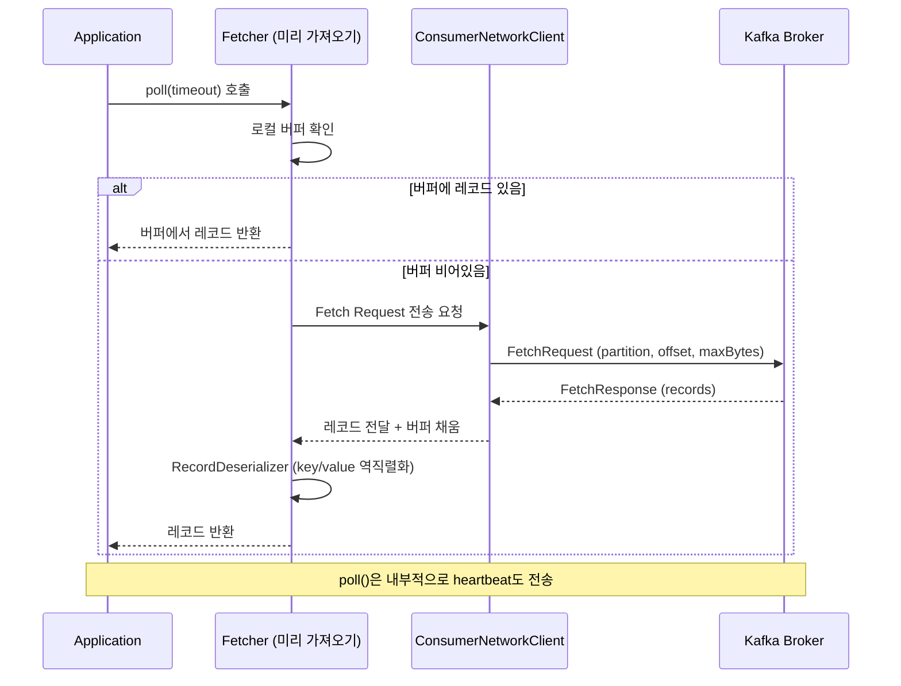
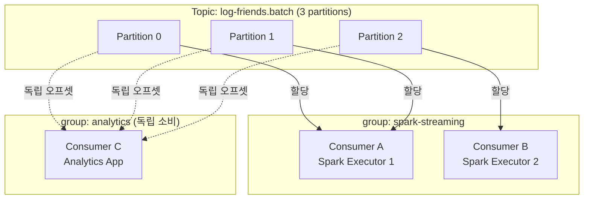
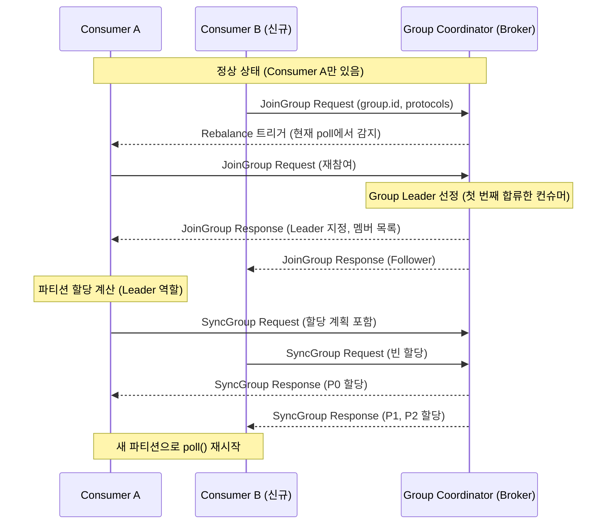
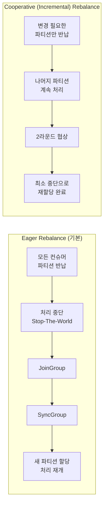
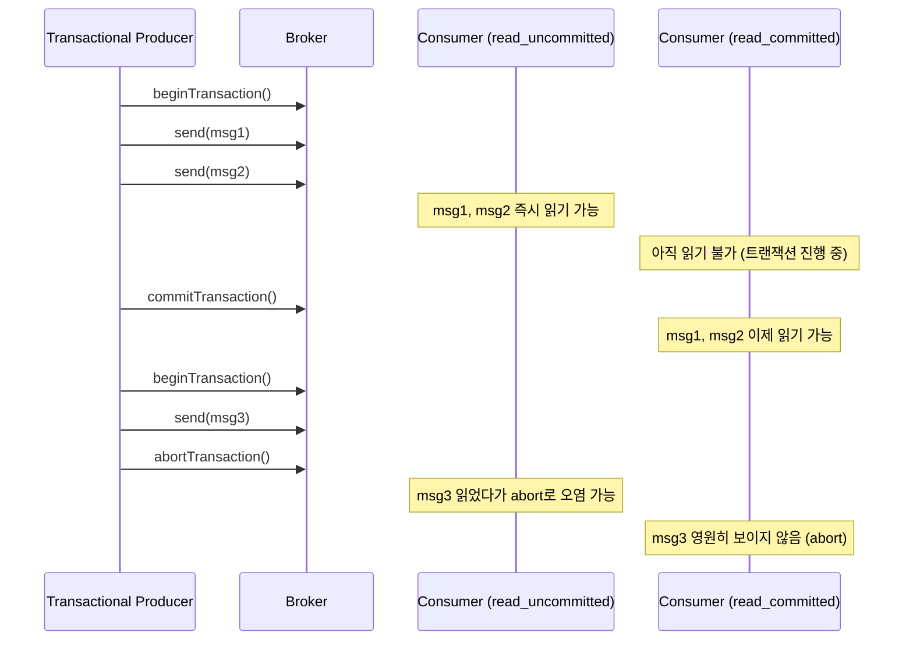

# Part 3 — 컨슈머 심화

> 예상 학습 시간: 6~7시간
> 선수 지식: Part 1 (브로커/토픽), Part 2 (프로듀서)

---

## 목차

1. [컨슈머 내부 구조](#1-컨슈머-내부-구조)
2. [컨슈머 그룹과 파티션 할당](#2-컨슈머-그룹과-파티션-할당)
3. [리밸런싱](#3-리밸런싱)
4. [오프셋 관리](#4-오프셋-관리)
5. [컨슈머 격리 수준](#5-컨슈머-격리-수준)
6. [핵심 질문 Q&A](#6-핵심-질문-qa)
7. [프로젝트 연결](#7-프로젝트-연결)
8. [실습](#8-실습)
9. [체크리스트](#9-체크리스트)

---

## 1. 컨슈머 내부 구조

### 1.1 poll() 루프 흐름

Kafka 컨슈머는 브로커에 능동적으로 데이터를 요청(pull)하는 구조다. `poll(timeout)` 한 번의 호출 안에서 다음 과정이 일어난다.



### 1.2 Fetcher의 미리 가져오기(Pre-fetch)

Fetcher는 애플리케이션이 현재 레코드를 처리하는 동안 **백그라운드에서 다음 배치를 미리 요청**한다. 이를 통해 네트워크 왕복 대기 시간이 숨겨진다.

- **fetch.min.bytes** (기본값: 1): 브로커가 응답하기 전 최소한으로 모아야 할 데이터 크기. 값을 높이면 브로커가 충분한 데이터를 모을 때까지 기다리므로 처리량은 높아지지만 지연이 늘어난다.
- **fetch.max.wait.ms** (기본값: 500ms): `fetch.min.bytes`를 충족하지 못해도 이 시간이 지나면 응답을 보낸다. 지연 시간의 상한선이다.
- **max.poll.records** (기본값: 500): `poll()` 한 번에 반환할 최대 레코드 수. 처리 시간이 긴 경우 줄이면 `max.poll.interval.ms` 초과를 방지할 수 있다.

```
fetch.min.bytes=1, fetch.max.wait.ms=500
  → 데이터가 1바이트라도 있으면 즉시 응답 (기본 동작, 저지연)

fetch.min.bytes=65536, fetch.max.wait.ms=500
  → 64KB 모이거나 500ms 경과 시 응답 (고처리량)
```

### 1.3 RecordDeserializer

브로커로부터 받은 바이트 배열을 Java/Kotlin 객체로 변환한다.

```
key.deserializer   = StringDeserializer      (workerId)
value.deserializer = ByteArrayDeserializer   (Protobuf 바이트)
```

log-friends에서는 `value`가 `AgentMessage` Protobuf 직렬화 바이트이므로 Spark 내부에서 `ProtoDeserializer.kt`가 `ByteArray → EventRow` 변환을 담당한다.

**log-friends 연결**: `StreamingJob.kt`의 Spark Kafka source는 Structured Streaming 내부에서 Kafka Consumer API를 감싸서 사용한다. `rawStream`에서 `.select("value")`로 꺼낸 ByteArray가 바로 이 역직렬화 대상이다.

---

## 2. 컨슈머 그룹과 파티션 할당

### 2.1 컨슈머 그룹 개념

같은 `group.id`를 가진 컨슈머들이 하나의 **컨슈머 그룹**을 이룬다. 토픽의 각 파티션은 그룹 내 **단 하나의 컨슈머**에만 할당된다.



- **그룹 내**: 파티션 3개, 컨슈머 2개 → Consumer A가 P0+P1, Consumer B가 P2 담당
- **그룹 간**: 각 그룹은 독립된 오프셋을 관리하므로 같은 메시지를 각자 소비 가능

### 2.2 파티션 할당 전략

컨슈머가 그룹에 합류할 때 **파티션 할당 전략(Assignor)**에 따라 파티션이 배분된다.

| 전략 | 동작 방식 | 특징 |
|---|---|---|
| **RangeAssignor** (기본) | 파티션을 연속 범위로 할당 | 토픽 수가 많을 때 불균등 발생 가능 |
| **RoundRobinAssignor** | 파티션을 순서대로 순환 배분 | 균등 분배에 유리 |
| **StickyAssignor** | 리밸런싱 시 기존 할당 최대 유지 | 리밸런싱 비용 최소화 |
| **CooperativeStickyAssignor** | StickyAssignor + Cooperative 리밸런싱 | 처리 중단 없는 리밸런싱 |

```
# 할당 전략 설정 예시
partition.assignment.strategy=org.apache.kafka.clients.consumer.CooperativeStickyAssignor
```

### 2.3 컨슈머 수와 파티션 수의 관계

```
파티션 3개, 컨슈머 2개 → 컨슈머 1개가 파티션 2개 담당 (정상)
파티션 3개, 컨슈머 3개 → 1:1 완벽 매핑 (최적)
파티션 3개, 컨슈머 4개 → 컨슈머 1개는 유휴 상태 (파티션 없음)
파티션 3개, 컨슈머 1개 → 컨슈머 1개가 파티션 3개 모두 처리
```

**log-friends 연결**: `log-friends.batch` 토픽이 파티션 1개(기본 `auto.create.topics.enable=true` + KRaft 단일 노드)라면 Spark executor가 여러 개여도 실제로는 1개의 task만 데이터를 받는다. 처리량 확장이 필요하면 파티션 수 먼저 늘려야 한다.

---

## 3. 리밸런싱

### 3.1 리밸런싱이란?

컨슈머 그룹 내의 파티션 할당이 재조정되는 과정이다. 다음 상황에서 트리거된다.

- 새로운 컨슈머가 그룹에 합류
- 기존 컨슈머가 그룹에서 이탈 (명시적 `close()` 또는 timeout)
- 토픽의 파티션 수 변경
- `max.poll.interval.ms` 초과 (처리 지연)

### 3.2 리밸런싱 프로토콜 흐름



### 3.3 Eager Rebalance vs Cooperative Rebalance



| 구분 | Eager | Cooperative |
|---|---|---|
| 처리 중단 | 전체 중단 (Stop-The-World) | 변경 파티션만 잠시 중단 |
| 사용 전략 | RangeAssignor, RoundRobinAssignor | CooperativeStickyAssignor |
| 설정 | 기본값 | `partition.assignment.strategy=CooperativeStickyAssignor` |
| 안정성 | 단순하지만 처리량 손실 | 복잡하지만 고가용성 |

### 3.4 타임아웃 파라미터

| 파라미터 | 기본값 | 설명 |
|---|---|---|
| `session.timeout.ms` | 45000ms | Heartbeat 없으면 이 시간 후 컨슈머 사망 판정 → 리밸런싱 |
| `heartbeat.interval.ms` | 3000ms | Heartbeat 전송 주기 (session.timeout.ms의 1/3 권장) |
| `max.poll.interval.ms` | 300000ms | poll() 호출 간격 최대값. 초과 시 그룹 이탈 처리 |

**관계**: `heartbeat.interval.ms < session.timeout.ms < max.poll.interval.ms`

**log-friends 연결**: `StreamingJob.kt`에서 `kafka.session.timeout.ms=30000`으로 설정되어 있다. Spark의 `foreachBatch`에서 ClickHouse/TimescaleDB 쓰기가 30초를 넘으면 session timeout이 발생한다. 이 경우 `max.poll.interval.ms`를 늘리거나 배치 처리 시간을 단축해야 한다.

```kotlin
// StreamingJob.kt — Kafka source 옵션
.option("kafka.session.timeout.ms", "30000")   // 현재 설정
// 처리 시간이 길 경우 추가 필요:
// .option("kafka.max.poll.interval.ms", "600000")
```

---

## 4. 오프셋 관리

### 4.1 __consumer_offsets 내부 토픽

Kafka는 컨슈머 그룹의 오프셋을 별도의 내부 토픽 `__consumer_offsets`에 저장한다.

```
__consumer_offsets 토픽
  - 기본 파티션 수: 50개
  - replication.factor: 3 (프로덕션) / 1 (log-friends 개발환경)
  - 저장 형식: <group.id, topic, partition> → <offset, metadata, timestamp>
```

오프셋 커밋은 단순한 Kafka 메시지 전송이다. 이 토픽을 읽으면 어떤 그룹이 어느 오프셋까지 소비했는지 알 수 있다.

### 4.2 자동 커밋 vs 수동 커밋

```mermaid
graph TD
    subgraph "자동 커밋 (enable.auto.commit=true)"
        A1[poll() 호출] --> A2[auto.commit.interval.ms 경과?]
        A2 -->|Yes| A3[마지막 poll() 반환 오프셋 커밋]
        A2 -->|No| A4[레코드 처리]
        A3 --> A4
    end

    subgraph "수동 커밋 (enable.auto.commit=false)"
        B1[poll() 호출] --> B2[레코드 처리]
        B2 --> B3{처리 완료?}
        B3 -->|Yes| B4[commitSync 또는 commitAsync]
        B3 -->|처리 실패| B5[재처리 or 에러 처리]
    end
```

### 4.3 commitSync vs commitAsync

```kotlin
// commitSync: 동기식, 커밋 성공 확인 후 다음 진행 (느리지만 안전)
consumer.commitSync()

// commitAsync: 비동기식, 커밋 완료를 기다리지 않음 (빠르지만 실패 시 재시도 어려움)
consumer.commitAsync { offsets, exception ->
    if (exception != null) logger.error("Commit failed", exception)
}

// 실용적 패턴: 처리 중 비동기, 종료 시 동기
try {
    while (running) {
        val records = consumer.poll(Duration.ofMillis(100))
        process(records)
        consumer.commitAsync()
    }
} finally {
    consumer.commitSync()  // 종료 시 반드시 동기 커밋
    consumer.close()
}
```

### 4.4 메시지 전달 보장 수준

| 수준 | 설명 | 오프셋 커밋 시점 | 중복/유실 |
|---|---|---|---|
| **At-Most-Once** | 최대 1번 전달 (유실 가능) | 처리 전 커밋 | 유실 O, 중복 X |
| **At-Least-Once** | 최소 1번 전달 (중복 가능) | 처리 후 커밋 | 유실 X, 중복 O |
| **Exactly-Once** | 정확히 1번 전달 | 트랜잭션 내 커밋 | 유실 X, 중복 X |

```
At-Most-Once 구현:
  poll() → commitSync() → process()
  (커밋 후 처리 중 크래시 → 메시지 유실)

At-Least-Once 구현:
  poll() → process() → commitSync()
  (처리 후 커밋 전 크래시 → 재시작 시 재처리 → 중복)

Exactly-Once 구현:
  Kafka Transactions API + isolation.level=read_committed
  또는 Spark Structured Streaming의 checkpoint 기반 exactly-once
```

**log-friends 연결**: Spark Structured Streaming은 기본적으로 **At-Least-Once** 보장을 제공한다. checkpoint와 결합하면 동일한 배치 ID(`batchId`)가 중복 처리되지 않도록 관리된다.

```kotlin
// StreamingJob.kt
.option("checkpointLocation", "$checkpointDir/main")
// 체크포인트가 오프셋과 처리 상태를 함께 저장
// 재시작 시 마지막 체크포인트부터 재개
```

### 4.5 auto.offset.reset

컨슈머 그룹이 처음 시작하거나 오프셋이 유효하지 않을 때의 동작을 결정한다.

```
auto.offset.reset=latest  (기본값)
  → 가장 최신 메시지부터 소비 (이전 메시지 무시)
  → 신규 서비스 배포, 실시간 처리에 적합

auto.offset.reset=earliest
  → 파티션의 가장 오래된 메시지부터 소비
  → 데이터 재처리, 마이그레이션에 적합

auto.offset.reset=none
  → 오프셋 없으면 예외 발생 (엄격한 오프셋 관리 시)
```

---

## 5. 컨슈머 격리 수준

### 5.1 isolation.level 설정

트랜잭션 프로듀서가 전송한 메시지의 가시성을 제어한다.

```
isolation.level=read_uncommitted (기본값)
  → 트랜잭션이 아직 커밋되지 않은 메시지도 읽음
  → 최저 지연, 중간 상태 데이터 노출 가능

isolation.level=read_committed
  → 커밋된 트랜잭션 메시지만 읽음
  → 중간 상태 노출 없음, 약간의 지연 증가
```

### 5.2 트랜잭션 프로듀서와의 관계



**log-friends 연결**: `BatchTransporter.kt`는 트랜잭션 프로듀서를 사용하지 않는다(`ACKS_CONFIG=1`, 트랜잭션 없음). 따라서 `isolation.level` 설정은 현재 영향 없다. 정확히 한 번 처리가 필요하면 프로듀서에 `transactional.id` 설정이 필요하다.

---

## 6. 핵심 질문 Q&A

**Q1. 컨슈머가 파티션 수보다 많으면 어떻게 되는가?**

초과한 컨슈머는 파티션을 할당받지 못하고 **유휴 상태(idle)**로 대기한다. Kafka는 하나의 파티션을 동일 그룹 내 여러 컨슈머가 동시에 소비하는 것을 허용하지 않는다. 유휴 컨슈머는 연결을 유지하며 heartbeat를 보내다가, 기존 컨슈머 중 하나가 이탈하면 리밸런싱을 통해 파티션을 넘겨받는다. 이는 일종의 **Hot Standby** 역할을 한다.

```
파티션 3개, 컨슈머 5개인 경우:
- Consumer 1 → P0 담당
- Consumer 2 → P1 담당
- Consumer 3 → P2 담당
- Consumer 4 → 유휴 (파티션 없음)
- Consumer 5 → 유휴 (파티션 없음)
```

**Q2. Spark Structured Streaming이 컨슈머 그룹을 어떻게 사용하는가?**

Spark는 Kafka source를 사용할 때 내부적으로 Kafka Consumer API를 활용한다. Spark 애플리케이션마다 고유한 `group.id`를 사용하며, 이 ID는 checkpoint 디렉토리와 연동된다. `StreamingJob.kt`에서 `group.id`를 명시하지 않으면 Spark가 자동으로 UUID 기반 ID를 생성한다.

중요한 점은 Spark의 각 Task(executor)가 특정 파티션을 담당하며, Spark의 micro-batch 처리 주기(`Trigger.ProcessingTime(10, TimeUnit.SECONDS)`)마다 오프셋 범위를 계산해서 처리한다. 오프셋은 Kafka에 커밋하는 것이 아니라 **checkpoint 디렉토리에 저장**한다.

**Q3. 리밸런싱 중 메시지가 중복 처리될 수 있는가?**

Eager Rebalance 시 **예, 중복 처리가 발생할 수 있다**. 시나리오:

```
1. Consumer A가 P0에서 msg1~msg10 poll()
2. msg1~msg5 처리 완료, 아직 커밋 안 함
3. 리밸런싱 발생 → Consumer A가 P0 반납
4. Consumer B가 P0 할당받음
5. Consumer B는 마지막 커밋된 오프셋(msg0 이후)부터 읽음
6. msg1~msg5가 Consumer B에서 재처리 (중복!)
```

해결 방법:
- 리밸런싱 전 `onPartitionsRevoked` 콜백에서 `commitSync()` 호출
- Cooperative Rebalance 사용으로 반납 파티션 최소화
- Exactly-Once 처리를 위한 트랜잭션 활용

**Q4. __consumer_offsets가 손상되면 어떻게 되는가?**

`__consumer_offsets` 토픽이 손상되거나 삭제되면 모든 컨슈머 그룹의 오프셋 정보가 사라진다.

결과:
- 모든 컨슈머 그룹이 `auto.offset.reset` 설정에 따라 동작
- `earliest`면 전체 토픽 재처리, `latest`면 이전 메시지 유실
- log-friends의 경우 `startingOffsets=latest`이므로 오프셋 손실 시 처리 안 된 메시지는 유실

대응:
- `__consumer_offsets` 토픽의 `replication.factor`를 3 이상으로 설정 (프로덕션)
- Spark checkpoint를 통해 오프셋을 별도 저장소에 이중 보관
- `kafka-consumer-groups.sh --reset-offsets`로 수동 복구

**Q5. auto.offset.reset=earliest vs latest 언제 사용하는가?**

| 상황 | 권장 설정 | 이유 |
|---|---|---|
| 신규 서비스 배포 | `latest` | 서비스 시작 이전 데이터 불필요 |
| 실시간 모니터링 | `latest` | 과거 이벤트보다 현재 상태 중요 |
| 데이터 파이프라인 재처리 | `earliest` | 모든 데이터 처리 필요 |
| 장애 복구 후 재시작 | `earliest` + 수동 오프셋 | 손실 없는 재처리 |
| 개발/테스트 환경 | `earliest` | 생성한 데이터 전부 확인 |

log-friends `StreamingJob.kt`에서 `startingOffsets=latest`를 사용하는 이유: 처음 Spark job이 시작될 때 이미 쌓인 과거 데이터(개발 중 생성된 이벤트)를 전부 처리하려 하면 초기 부하가 크고, 실시간 모니터링 목적에 맞지 않기 때문이다. 재처리가 필요하면 checkpoint를 삭제하고 `earliest`로 변경한다.

---

## 7. 프로젝트 연결

### 7.1 StreamingJob.kt의 Kafka source 설정 분석

```kotlin
// /log-friends-pipeline/src/main/kotlin/com/logfriends/spark/StreamingJob.kt

val rawStream = spark.readStream()
    .format("kafka")
    .option("kafka.bootstrap.servers", kafkaBrokers)     // kafka:9092
    .option("subscribe", kafkaTopic)                      // log-friends.batch
    .option("startingOffsets", "latest")                  // 신규 메시지만 소비
    .option("failOnDataLoss", "false")                    // 오프셋 gap 발생 시 에러 대신 경고
    .option("kafka.session.timeout.ms", "30000")          // 30초 heartbeat timeout
    .load()
```

`failOnDataLoss=false`의 의미: 오프셋이 유효하지 않거나(메시지 보존 기간 만료, 토픽 삭제) 파티션이 사라진 경우 예외 대신 경고 로그를 출력하고 계속 진행한다. 개발 환경에서는 편리하지만 프로덕션에서는 데이터 유실을 숨길 수 있어 주의가 필요하다.

### 7.2 Checkpoint와 오프셋 복구

```
checkpoint 디렉토리 구조 (/opt/spark-jobs/checkpoints/main/):
  ├── offsets/          ← 각 micro-batch의 Kafka 오프셋 범위
  │   ├── 0             (배치 0의 오프셋)
  │   ├── 1             (배치 1의 오프셋)
  │   └── ...
  ├── commits/          ← 성공적으로 처리 완료된 배치
  └── metadata          ← 스트림 메타데이터
```

재시작 시 Spark는 `commits/` 디렉토리에서 마지막 완료 배치를 찾고, `offsets/` 에서 해당 배치의 Kafka 오프셋을 읽어 그 다음부터 재개한다. 이로써 **At-Least-Once** 처리가 보장된다.

```bash
# 체크포인트 리셋 (처음부터 재처리 시)
docker volume rm log-friends-pipeline_spark-checkpoints

# 특정 오프셋부터 재시작 시
# StreamingJob.kt의 startingOffsets를 변경하고 체크포인트 삭제
```

### 7.3 group.id 격리 전략

log-friends에서 `StreamingJob.kt`는 Spark가 자동 생성한 `group.id`를 사용한다. 만약 별도의 분석 파이프라인을 추가하면 다른 `group.id`를 지정해서 동일한 `log-friends.batch` 토픽을 독립적으로 소비할 수 있다.

```kotlin
// 별도 분석 파이프라인 추가 예시
spark.readStream()
    .format("kafka")
    .option("kafka.bootstrap.servers", kafkaBrokers)
    .option("subscribe", "log-friends.batch")
    .option("kafka.group.id", "analytics-pipeline")   // 독립 그룹
    .load()
```

---

## 8. 실습

### 8.1 컨슈머 그룹 상태 확인

```bash
# Spark streaming 그룹 상태 확인
docker exec -it <kafka-container> /opt/kafka/bin/kafka-consumer-groups.sh \
    --bootstrap-server localhost:9092 \
    --describe \
    --group spark-streaming

# 출력 예시:
# GROUP           TOPIC              PARTITION  CURRENT-OFFSET  LOG-END-OFFSET  LAG  CONSUMER-ID
# spark-streaming log-friends.batch  0          1234            1234            0    consumer-1-...
```

### 8.2 Consumer Lag 모니터링

```bash
# 모든 컨슈머 그룹 목록
docker exec -it <kafka-container> /opt/kafka/bin/kafka-consumer-groups.sh \
    --bootstrap-server localhost:9092 \
    --list

# 특정 그룹의 lag 상세
docker exec -it <kafka-container> /opt/kafka/bin/kafka-consumer-groups.sh \
    --bootstrap-server localhost:9092 \
    --describe \
    --group <group-id>
```

### 8.3 오프셋 리셋

```bash
# 가장 최신 오프셋으로 리셋 (이전 메시지 건너뜀)
docker exec -it <kafka-container> /opt/kafka/bin/kafka-consumer-groups.sh \
    --bootstrap-server localhost:9092 \
    --reset-offsets \
    --group spark-streaming \
    --topic log-friends.batch \
    --to-latest \
    --execute

# 가장 오래된 오프셋으로 리셋 (전체 재처리)
docker exec -it <kafka-container> /opt/kafka/bin/kafka-consumer-groups.sh \
    --bootstrap-server localhost:9092 \
    --reset-offsets \
    --group spark-streaming \
    --topic log-friends.batch \
    --to-earliest \
    --execute

# 특정 오프셋으로 리셋
docker exec -it <kafka-container> /opt/kafka/bin/kafka-consumer-groups.sh \
    --bootstrap-server localhost:9092 \
    --reset-offsets \
    --group spark-streaming \
    --topic log-friends.batch:0 \
    --to-offset 500 \
    --execute
```

### 8.4 오프셋 수동 확인

```bash
# __consumer_offsets 토픽 내용 직접 확인 (디버깅용)
docker exec -it <kafka-container> /opt/kafka/bin/kafka-console-consumer.sh \
    --bootstrap-server localhost:9092 \
    --topic __consumer_offsets \
    --formatter "kafka.coordinator.group.GroupMetadataManager\$OffsetsMessageFormatter" \
    --from-beginning
```

---

## 9. 체크리스트

- [ ] `poll(timeout)` 내부에서 Fetcher, ConsumerNetworkClient, Broker 간 흐름을 설명할 수 있다
- [ ] `fetch.min.bytes`, `fetch.max.wait.ms`, `max.poll.records` 각각의 역할과 trade-off를 이해한다
- [ ] 컨슈머 그룹 내 파티션 할당 규칙(1 파티션 = 1 컨슈머)을 설명할 수 있다
- [ ] RangeAssignor, RoundRobinAssignor, StickyAssignor의 차이를 안다
- [ ] 파티션 수보다 컨슈머가 많을 때 어떤 일이 일어나는지 설명할 수 있다
- [ ] Eager Rebalance vs Cooperative Rebalance의 차이와 Stop-The-World 문제를 이해한다
- [ ] `session.timeout.ms`, `heartbeat.interval.ms`, `max.poll.interval.ms`의 관계를 설명할 수 있다
- [ ] `__consumer_offsets` 토픽의 역할과 저장 형식을 이해한다
- [ ] `commitSync()`와 `commitAsync()`의 차이를 설명하고 각각 언제 사용하는지 안다
- [ ] At-Most-Once, At-Least-Once, Exactly-Once 각각의 구현 방법을 설명할 수 있다
- [ ] `auto.offset.reset=earliest` vs `latest` 각각 언제 사용하는지 판단할 수 있다
- [ ] `isolation.level=read_committed`가 필요한 상황을 설명할 수 있다
- [ ] `StreamingJob.kt`에서 checkpoint가 오프셋 관리를 어떻게 대체하는지 이해한다
- [ ] `kafka-consumer-groups.sh --describe`로 consumer lag을 직접 확인해본다
- [ ] `kafka-consumer-groups.sh --reset-offsets`로 오프셋을 리셋해본다
