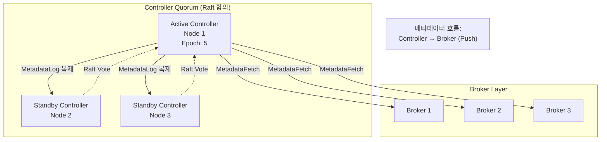
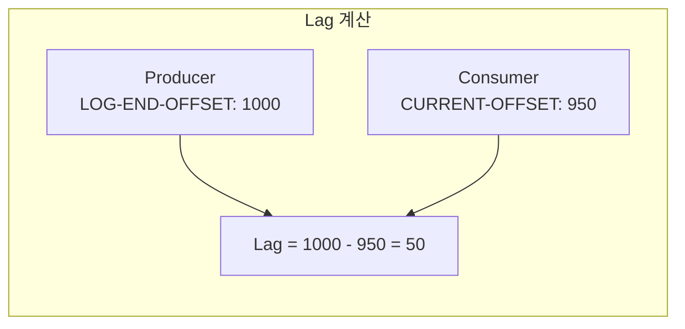
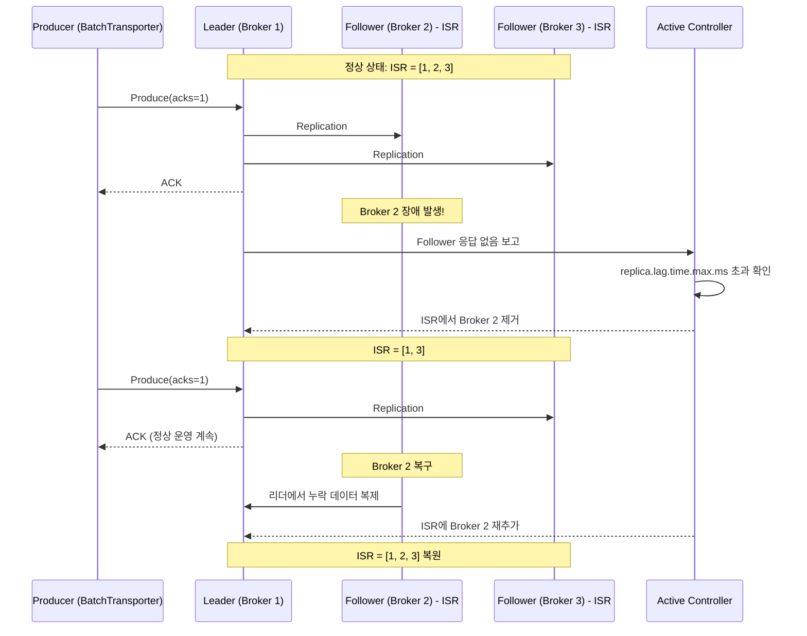
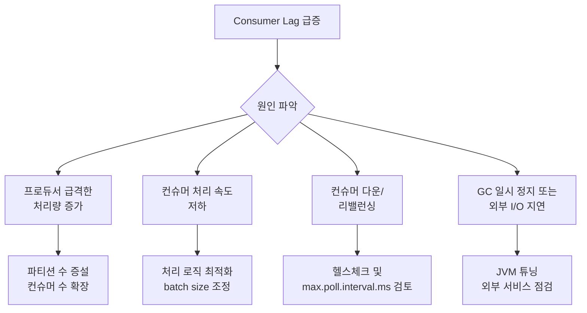

# Part 4 — KRaft & 운영

> 예상 학습 시간: 5~6시간
> 선수 지식: Part 1~3

---

## 목차

1. [KRaft란?](#1-kraft란)
2. [KRaft 클러스터 구성](#2-kraft-클러스터-구성)
3. [주요 운영 작업](#3-주요-운영-작업)
4. [모니터링 지표](#4-모니터링-지표)
5. [장애 시나리오](#5-장애-시나리오)
6. [핵심 질문 Q&A](#6-핵심-질문-qa)
7. [프로젝트 연결](#7-프로젝트-연결)
8. [실습](#8-실습)
9. [체크리스트](#9-체크리스트)

---

## 1. KRaft란?

### 1.1 배경: ZooKeeper 의존성 제거 (KIP-500)

Kafka 2.x까지는 브로커의 메타데이터(토픽, 파티션, ISR 목록 등)를 **Apache ZooKeeper**에 저장했다. 이 구조에는 여러 문제가 있었다.

| 문제 | 설명 |
|---|---|
| 운영 복잡도 | ZooKeeper 클러스터를 별도로 관리해야 함 |
| 메타데이터 병목 | 파티션 수 증가 시 ZooKeeper 쓰기 병목 발생 |
| 스케일 한계 | ZooKeeper의 실용적 한계: 약 200,000 파티션 |
| 컨트롤러 이중 상태 | ZooKeeper와 Kafka 컨트롤러 간 메타데이터 동기화 지연 |

KIP-500은 ZooKeeper를 제거하고 Kafka 자체에 합의 레이어를 내장하는 제안이다. 이 구현체가 **KRaft(Kafka Raft)**다.

### 1.2 Raft 합의 알고리즘 개요

KRaft는 Raft 합의 알고리즘을 사용해 컨트롤러 쿼럼(Controller Quorum)을 구성한다. Raft의 핵심 원칙:

1. **리더 선출**: 쿼럼 중 하나가 Active Controller(리더)가 됨
2. **로그 복제**: 모든 메타데이터 변경은 과반수 쿼럼에 복제된 후 커밋
3. **안전성**: 두 노드가 동시에 리더가 되는 상황(split-brain) 방지



### 1.3 __cluster_metadata 토픽

KRaft는 ZooKeeper 대신 내부 토픽 `__cluster_metadata`에 모든 클러스터 메타데이터를 저장한다.

```
__cluster_metadata 토픽
  - 파티션 수: 1 (단일 파티션, 순서 보장)
  - replication.factor: Controller 쿼럼 크기
  - 저장 내용:
    - 토픽/파티션 생성/삭제 기록
    - 브로커 등록/해제 기록
    - 파티션 리더십 변경 기록
    - ACL 및 설정 변경 기록
```

브로커는 Controller로부터 `MetadataFetch`를 통해 최신 메타데이터를 주기적으로 받아 로컬 캐시를 갱신한다. ZooKeeper 시절과 달리 **브로커→Controller 방향의 push** 구조다.

**log-friends 연결**: `docker-compose.infra.yml`에서 단일 노드가 broker와 controller 역할을 동시에 수행(`KAFKA_PROCESS_ROLES: broker,controller`). 이 경우 `__cluster_metadata`도 해당 노드에만 존재한다.

---

## 2. KRaft 클러스터 구성

### 2.1 단일 노드 구성 (log-friends 개발 환경)

log-friends의 `docker-compose.infra.yml`에 정의된 KRaft 단일 노드 설정을 분석한다.

```yaml
# /log-friends-pipeline/docker-compose.infra.yml

kafka:
  image: apache/kafka:3.9.0
  environment:
    KAFKA_NODE_ID: 1
    # broker와 controller 역할 동시 수행 (개발 환경 최소 구성)
    KAFKA_PROCESS_ROLES: broker,controller

    # 리스너 정의: 클라이언트용(PLAINTEXT)과 컨트롤러 내부용(CONTROLLER)
    KAFKA_LISTENERS: PLAINTEXT://0.0.0.0:9092,CONTROLLER://kafka:9093
    # 외부(다른 컨테이너)에서 접근할 주소
    KAFKA_ADVERTISED_LISTENERS: PLAINTEXT://kafka:9092

    # 리스너-프로토콜 매핑
    KAFKA_LISTENER_SECURITY_PROTOCOL_MAP: PLAINTEXT:PLAINTEXT,CONTROLLER:PLAINTEXT

    # 컨트롤러 쿼럼: nodeId@host:port 형식 (여기서는 단일 노드)
    KAFKA_CONTROLLER_QUORUM_VOTERS: 1@kafka:9093
    KAFKA_CONTROLLER_LISTENER_NAMES: CONTROLLER
    KAFKA_INTER_BROKER_LISTENER_NAME: PLAINTEXT

    # 개발 환경: 단일 노드이므로 replication factor=1
    KAFKA_OFFSETS_TOPIC_REPLICATION_FACTOR: 1
    KAFKA_AUTO_CREATE_TOPICS_ENABLE: "true"
```

### 2.2 멀티 노드 KRaft 구성 (프로덕션 참고)

```yaml
# 3노드 KRaft 클러스터 예시 (참고용)

kafka-1:
  environment:
    KAFKA_NODE_ID: 1
    KAFKA_PROCESS_ROLES: broker,controller
    KAFKA_CONTROLLER_QUORUM_VOTERS: 1@kafka-1:9093,2@kafka-2:9093,3@kafka-3:9093
    KAFKA_LISTENERS: PLAINTEXT://0.0.0.0:9092,CONTROLLER://0.0.0.0:9093
    KAFKA_ADVERTISED_LISTENERS: PLAINTEXT://kafka-1:9092

kafka-2:
  environment:
    KAFKA_NODE_ID: 2
    KAFKA_PROCESS_ROLES: broker,controller
    KAFKA_CONTROLLER_QUORUM_VOTERS: 1@kafka-1:9093,2@kafka-2:9093,3@kafka-3:9093
    KAFKA_LISTENERS: PLAINTEXT://0.0.0.0:9092,CONTROLLER://0.0.0.0:9093
    KAFKA_ADVERTISED_LISTENERS: PLAINTEXT://kafka-2:9092

# kafka-3도 동일한 패턴
```

### 2.3 역할 분리 구성 (전용 Controller)

대규모 클러스터에서는 Controller 전용 노드와 Broker 전용 노드를 분리할 수 있다.

```yaml
# Controller 전용 노드 (브로커 역할 없음)
kafka-controller:
  environment:
    KAFKA_PROCESS_ROLES: controller    # controller만
    KAFKA_NODE_ID: 100
    KAFKA_CONTROLLER_QUORUM_VOTERS: 100@kafka-controller:9093,...

# Broker 전용 노드 (컨트롤러 역할 없음)
kafka-broker:
  environment:
    KAFKA_PROCESS_ROLES: broker        # broker만
    KAFKA_NODE_ID: 1
    KAFKA_CONTROLLER_QUORUM_VOTERS: 100@kafka-controller:9093,...
```

### 2.4 KRaft 스토리지 초기화

KRaft 사용 전 반드시 클러스터 ID로 스토리지를 초기화해야 한다. Docker 이미지(`apache/kafka:3.9.0`)는 시작 시 자동으로 처리하지만, 직접 설정할 때는 다음 절차가 필요하다.

```bash
# 1. 새 클러스터 ID 생성 (UUID 형식)
CLUSTER_ID=$(kafka-storage.sh random-uuid)
echo "Cluster ID: $CLUSTER_ID"

# 2. 모든 노드의 스토리지 초기화 (같은 CLUSTER_ID 사용)
kafka-storage.sh format \
    --cluster-id $CLUSTER_ID \
    --config /etc/kafka/kraft/server.properties

# 3. 브로커 시작
kafka-server-start.sh /etc/kafka/kraft/server.properties
```

---

## 3. 주요 운영 작업

### 3.1 토픽 생성/수정/삭제

```bash
# 토픽 생성
kafka-topics.sh \
    --bootstrap-server localhost:9092 \
    --create \
    --topic log-friends.batch \
    --partitions 3 \
    --replication-factor 1

# 토픽 상세 정보
kafka-topics.sh \
    --bootstrap-server localhost:9092 \
    --describe \
    --topic log-friends.batch

# 토픽 설정 변경 (메시지 보존 기간 변경)
kafka-configs.sh \
    --bootstrap-server localhost:9092 \
    --entity-type topics \
    --entity-name log-friends.batch \
    --alter \
    --add-config retention.ms=86400000   # 24시간

# 토픽 삭제
kafka-topics.sh \
    --bootstrap-server localhost:9092 \
    --delete \
    --topic log-friends.batch
```

### 3.2 파티션 수 변경

**파티션 수는 늘리기만 가능하고, 줄일 수 없다.** 파티션이 줄어들면 해당 파티션의 데이터가 어떻게 처리될지 Kafka가 보장할 수 없기 때문이다.

```bash
# 파티션 수 증가 (1 → 3)
kafka-topics.sh \
    --bootstrap-server localhost:9092 \
    --alter \
    --topic log-friends.batch \
    --partitions 3

# 주의사항:
# 1. 파티션 수 변경 후 기존 메시지의 파티션 분포가 바뀌지 않음
# 2. 새로운 메시지만 새 파티션에 분배됨
# 3. 키 기반 파티셔닝을 사용하는 경우 같은 키가 다른 파티션으로 갈 수 있음
#    → log-friends의 경우 workerId가 키이므로 동일 worker의 이벤트가 분산될 수 있음
```

### 3.3 리더 재선출

브로커 재시작 후 리더 파티션이 최적이 아닌 브로커에 있을 때 수동으로 Preferred Leader Election을 수행한다.

```bash
# 전체 토픽 Preferred Leader Election
kafka-leader-election.sh \
    --bootstrap-server localhost:9092 \
    --election-type PREFERRED \
    --all-topic-partitions

# 특정 토픽만 Election
kafka-leader-election.sh \
    --bootstrap-server localhost:9092 \
    --election-type PREFERRED \
    --topic log-friends.batch \
    --partition 0
```

### 3.4 컨슈머 그룹 오프셋 리셋

```bash
# 그룹이 비활성 상태(컨슈머 없음)일 때만 가능

# Dry-run (실제 변경 없이 결과 미리 확인)
kafka-consumer-groups.sh \
    --bootstrap-server localhost:9092 \
    --reset-offsets \
    --group spark-streaming \
    --topic log-friends.batch \
    --to-earliest \
    --dry-run

# 실제 실행
kafka-consumer-groups.sh \
    --bootstrap-server localhost:9092 \
    --reset-offsets \
    --group spark-streaming \
    --topic log-friends.batch \
    --to-earliest \
    --execute
```

### 3.5 파티션 재분배 (프로덕션)

멀티 브로커 환경에서 파티션이 특정 브로커에 몰릴 경우 재분배한다.

```bash
# 1. 이동할 파티션 계획 파일 생성
cat > reassignment.json << EOF
{
  "version": 1,
  "partitions": [
    {"topic": "log-friends.batch", "partition": 0, "replicas": [1,2]},
    {"topic": "log-friends.batch", "partition": 1, "replicas": [2,3]},
    {"topic": "log-friends.batch", "partition": 2, "replicas": [3,1]}
  ]
}
EOF

# 2. 재분배 실행
kafka-reassign-partitions.sh \
    --bootstrap-server localhost:9092 \
    --reassignment-json-file reassignment.json \
    --execute

# 3. 진행 상태 확인
kafka-reassign-partitions.sh \
    --bootstrap-server localhost:9092\
    --reassignment-json-file reassignment.json \
    --verify
```

---

## 4. 모니터링 지표

### 4.1 핵심 브로커 지표

| 지표 (JMX MBean) | 의미 | 위험 임계값 | 대응 |
|---|---|---|---|
| `UnderReplicatedPartitions` | ISR 이탈 파티션 수 | **> 0** | 브로커 상태 즉시 확인 |
| `ActiveControllerCount` | Active Controller 수 | ≠ 1 | 0이면 Controller 없음, 2이면 split-brain |
| `OfflinePartitionsCount` | 리더 없는 파티션 수 | **> 0** | 메시지 쓰기/읽기 불가 상태 |
| `RequestHandlerAvgIdlePercent` | 요청 처리 스레드 유휴율 | **< 30%** | 브로커 CPU/스레드 포화 |
| `BytesInPerSec` | 초당 인입 바이트 | 네트워크 용량 80% | 프로듀서 throttle 또는 파티션 증설 |
| `BytesOutPerSec` | 초당 아웃 바이트 | 네트워크 용량 80% | 컨슈머 throttle 검토 |
| `RequestsPerSec` | 초당 요청 수 | 브로커 설계 용량 | 수평 확장 필요 |

### 4.2 컨슈머 Lag 지표

| 지표 | 의미 | 위험 임계값 | 대응 |
|---|---|---|---|
| `ConsumerLag` (= LOG-END-OFFSET - CURRENT-OFFSET) | 미처리 메시지 수 | 지속적 증가 추세 | 컨슈머 스케일 업/아웃 |
| `MaxLag` | 파티션 중 최대 Lag | > 예상 처리량 × 허용 지연 | 병목 파티션 조사 |
| `LeadConsumerLag` | 가장 빠른 컨슈머의 Lag | > 0 (이상적 상태) | 전반적인 처리 속도 저하 |



### 4.3 프로듀서 지표

| 지표 | 의미 | 위험 임계값 |
|---|---|---|
| `record-error-rate` | 메시지 전송 실패율 | > 0 (재시도 초과) |
| `record-retry-rate` | 재시도 비율 | 높으면 브로커 불안정 신호 |
| `request-latency-avg` | 평균 요청 지연 | SLA에 따라 다름 (보통 < 100ms) |
| `buffer-available-bytes` | 프로듀서 버퍼 여유 공간 | 0에 가까워지면 블로킹 위험 |

**log-friends 연결**: `BatchTransporter.kt`의 `KafkaProducer` 지표 확인. `ACKS_CONFIG=1`이므로 리더 브로커 응답만 받으면 성공으로 처리. `RETRIES_CONFIG=3`이 소진되면 `record-error-rate` 증가.

### 4.4 KRaft 전용 지표

| 지표 | 의미 | 위험 임계값 |
|---|---|---|
| `KafkaController/ActiveControllerCount` | Active Controller 수 | ≠ 1 |
| `MetadataSnapshotLoad` | 메타데이터 스냅샷 로드 횟수 | 빈번하면 재시작 반복 신호 |
| `RaftMetrics/CommitLatency` | Raft 로그 커밋 지연 | 높으면 쿼럼 통신 문제 |

**log-friends 연결**: Pipeline이 lag 없이 소비 중인지 확인 방법.

```bash
# docker-compose 환경에서 kafka 컨테이너 이름 확인
docker ps | grep kafka

# Consumer Lag 확인 (Spark Streaming 그룹)
docker exec log-friends-pipeline-kafka-1 \
    /opt/kafka/bin/kafka-consumer-groups.sh \
    --bootstrap-server localhost:9092 \
    --describe \
    --group <spark-auto-generated-group-id>

# LAG 컬럼 값이 0에 가까우면 정상
# 지속적으로 증가하면 Spark 처리 속도 < 프로듀서 속도
```

---

## 5. 장애 시나리오

### 5.1 브로커 다운 시 ISR 재구성



**ISR(In-Sync Replicas)**: 리더와 동기화된 팔로워 목록. `replica.lag.time.max.ms`(기본 30초) 이상 복제가 지연되면 ISR에서 제거된다.

### 5.2 메시지 유실 조건

다음 조건이 동시에 충족될 때 메시지 유실 가능성이 있다.

```
유실 시나리오:
  1. acks=1 설정 (log-friends 현재 설정)
  2. 리더에 메시지 기록 완료, ACK 반환
  3. 팔로워에 복제되기 전 리더 브로커 장애
  4. 팔로워 중 하나가 새 리더로 승격
  5. 새 리더는 이전 리더의 마지막 메시지를 갖고 있지 않음 → 유실

유실 방지:
  acks=all (또는 acks=-1) + min.insync.replicas=2
  → 최소 2개 ISR에 복제 확인 후 ACK
  → 단, 처리량 감소 + 지연 증가
```

log-friends의 경우 개발 환경 단일 노드이므로 유실 방지 설정이 의미 없다. 프로덕션에서는 `acks=all`과 `min.insync.replicas`를 설정해야 한다.

### 5.3 Consumer Lag 급증 원인과 대응



**log-friends 연결**: Spark `foreachBatch`에서 ClickHouse/TimescaleDB 쓰기가 지연될 경우 Lag 급증. 대응책:

```kotlin
// StreamingJob.kt에서 배치 처리 타임아웃 추가
.option("kafka.max.poll.interval.ms", "600000")  // 10분

// 또는 Trigger 주기 조정
.trigger(Trigger.ProcessingTime(30, TimeUnit.SECONDS))  // 10초 → 30초
```

### 5.4 Active Controller 장애

```
단일 노드(log-friends 개발 환경):
  → Controller가 다운되면 브로커도 같이 다운
  → 전체 서비스 중단
  → 재시작으로만 복구

3노드 Controller Quorum:
  → Active Controller 다운 시 Raft 리더 재선출 시작
  → 과반수(2/3) 투표로 새 Controller 선출
  → 수 초 내 자동 복구
  → 이 과정에서 새로운 토픽 생성/삭제 불가 (일시적)
  → 기존 메시지 produce/consume은 계속 가능
```

**BatchTransporter 연결**: Controller 장애 시 브로커는 계속 동작하므로 `BatchTransporter`의 메시지 전송은 영향 없다. `retries=3`, `reconnect.backoff.ms=1000` 설정으로 일시적 연결 장애는 자동 복구된다.

```kotlin
// BatchTransporter.kt — 내결함성 설정
put(ProducerConfig.RETRIES_CONFIG, 3)
put(ProducerConfig.RECONNECT_BACKOFF_MS_CONFIG, 1000)
// 재시도 3회, 재연결 시도 간격 1초
```

---

## 6. 핵심 질문 Q&A

**Q1. KRaft에서 Active Controller가 죽으면?**

Controller 쿼럼의 구성에 따라 다르다.

**단일 노드 (log-friends 개발 환경)**: Controller와 Broker가 같은 프로세스이므로 전체 Kafka가 중단된다. 재시작으로만 복구 가능하다.

**3노드 Controller Quorum**: Raft 프로토콜로 자동 복구된다.
1. 나머지 2개 Standby Controller가 응답 없음 감지 (Election Timeout)
2. 새 Controller 선출 투표 시작 (Epoch 번호 증가)
3. 과반수(2/3) 동의로 새 Active Controller 선출
4. 새 Controller가 `__cluster_metadata` 최신 상태 확인
5. 브로커에 메타데이터 업데이트 전파

이 과정에서 약 수 초~수십 초의 메타데이터 변경 불가 상태가 발생하지만, 기존 토픽의 produce/consume은 계속된다.

**Q2. log-friends.batch 토픽을 파티션 1개로 유지해도 되는가?**

개발 환경에서는 무방하다. 하지만 다음 제약을 이해해야 한다.

- **처리량 상한선**: 파티션 1개 = 1개의 Spark task만 데이터 수신 → 병렬 처리 불가
- **순서 보장**: 파티션 1개이면 전체 토픽 수준에서 메시지 순서 보장 (이점)
- **단일 장애점**: 파티션 리더가 있는 브로커 장애 시 해당 파티션 불가용

프로덕션에서 처리량이 중요하다면 파티션 3~6개를 권장한다. 단, 파티션 증가 후 동일 `workerId` 키를 가진 메시지가 다른 파티션으로 분산될 수 있어 순서가 보장되지 않는다.

**Q3. Consumer Lag이 급증하면 Spark job에 어떤 영향을 미치는가?**

직접적 영향:
1. **처리 지연 증가**: 이벤트가 발생하고 ClickHouse/TimescaleDB에 저장되기까지의 시간이 길어진다
2. **메모리 압박**: Spark의 micro-batch가 큰 경우 Executor 메모리 부족 가능
3. **session.timeout.ms 위협**: 배치 처리가 너무 오래 걸리면 Kafka가 컨슈머를 사망 판정 → 리밸런싱 → 처리 중단 → 더 큰 Lag 발생 (악순환)

대응 순서:
1. Lag 원인 파악 (프로듀서 급증 vs 컨슈머 지연)
2. `Trigger.ProcessingTime` 증가로 배치 크기 줄이기
3. ClickHouse/TimescaleDB 쓰기 성능 최적화
4. 파티션 수 증가 + Spark executor 수 증가

**Q4. KRaft 단일 노드에서 replication.factor=1의 위험성은?**

`replication.factor=1`은 데이터를 1개 브로커에만 저장한다는 의미다.

```
위험성:
  1. 브로커 디스크 장애 → 모든 데이터 영구 유실
  2. 브로커 OS 재부팅 → Kafka 중단 (재시작 전까지)
  3. Docker 볼륨 삭제 → 토픽과 메시지 전부 소멸

log-friends에서 허용되는 이유:
  - 개발/테스트 환경
  - SDK가 생성하는 이벤트는 원본 앱에서 재생성 가능
  - 영속성보다 단순성이 중요한 단계

프로덕션 전환 시 필수 변경:
  replication.factor=3
  min.insync.replicas=2
  acks=all
```

**Q5. kafka-storage.sh format을 두 번 실행하면?**

두 번째 실행 시 기존 데이터가 모두 삭제되고 새로운 클러스터 ID로 초기화된다.

```bash
# 첫 번째 실행 (정상 초기화)
kafka-storage.sh format --cluster-id ABC123 --config server.properties
# 결과: 스토리지 초기화 완료

# 두 번째 실행 (같은 클러스터 ID)
kafka-storage.sh format --cluster-id ABC123 --config server.properties
# 결과: 오류 - 이미 포맷된 스토리지

# 두 번째 실행 (다른 클러스터 ID, --ignore-formatted 없이)
kafka-storage.sh format --cluster-id XYZ456 --config server.properties
# 결과: 오류 - 기존 포맷 감지

# 강제 재포맷 (기존 데이터 전부 삭제!)
kafka-storage.sh format --cluster-id XYZ456 --config server.properties --ignore-formatted
# 결과: 기존 모든 토픽/메시지/오프셋 소멸
```

Docker 컨테이너를 `--volumes` 옵션으로 삭제(`docker compose down -v`)하면 볼륨도 함께 삭제되므로, 다음 `docker compose up` 시 자동으로 새 클러스터 ID로 초기화된다. 이것이 log-friends 개발 환경에서 `kafka-storage.sh format`을 명시적으로 관리하지 않아도 되는 이유다.

---

## 7. 프로젝트 연결

### 7.1 docker-compose.infra.yml KRaft 설정 전체 분석

```
KAFKA_NODE_ID: 1
  → 브로커 및 Controller의 고유 식별자
  → KAFKA_CONTROLLER_QUORUM_VOTERS의 voter ID와 일치해야 함

KAFKA_PROCESS_ROLES: broker,controller
  → 단일 노드에서 두 역할 동시 수행
  → 개발 환경에서 편리하지만 프로덕션에서는 분리 권장

KAFKA_LISTENERS: PLAINTEXT://0.0.0.0:9092,CONTROLLER://kafka:9093
  → PLAINTEXT: 클라이언트(프로듀서/컨슈머) 연결용
  → CONTROLLER: 컨트롤러 내부 통신용 (Raft)

KAFKA_ADVERTISED_LISTENERS: PLAINTEXT://kafka:9092
  → 클라이언트에게 알리는 연결 주소
  → Docker 네트워크 내 서비스명(kafka) 사용
  → 외부에서 접근하려면 localhost:9092로 포트 포워딩

KAFKA_CONTROLLER_QUORUM_VOTERS: 1@kafka:9093
  → nodeId@host:port 형식
  → 단일 노드이므로 1개만 등록
  → 3노드라면: "1@kafka-1:9093,2@kafka-2:9093,3@kafka-3:9093"

KAFKA_OFFSETS_TOPIC_REPLICATION_FACTOR: 1
  → __consumer_offsets 토픽의 복제 수
  → 단일 노드이므로 1로 설정 (기본값은 3)

KAFKA_AUTO_CREATE_TOPICS_ENABLE: "true"
  → 프로듀서가 존재하지 않는 토픽으로 전송 시 자동 생성
  → BatchTransporter가 "log-friends.batch"로 처음 전송 시 자동 생성됨
  → 프로덕션에서는 false로 설정하고 명시적 토픽 관리 권장
```

### 7.2 개발 → 운영 환경 전환 시 변경해야 할 설정

```yaml
# 개발 환경 (현재 log-friends)
KAFKA_PROCESS_ROLES: broker,controller     # 단일 노드
KAFKA_CONTROLLER_QUORUM_VOTERS: 1@kafka:9093  # 단일 voter
KAFKA_OFFSETS_TOPIC_REPLICATION_FACTOR: 1
KAFKA_AUTO_CREATE_TOPICS_ENABLE: "true"

# BatchTransporter.kt
ACKS_CONFIG = "1"
RETRIES_CONFIG = 3
```

```yaml
# 프로덕션 환경 (권장 변경사항)
# 1. 3노드 클러스터로 확장
KAFKA_CONTROLLER_QUORUM_VOTERS: 1@kafka-1:9093,2@kafka-2:9093,3@kafka-3:9093

# 2. 복제 설정 강화
KAFKA_OFFSETS_TOPIC_REPLICATION_FACTOR: 3
KAFKA_DEFAULT_REPLICATION_FACTOR: 3
KAFKA_MIN_INSYNC_REPLICAS: 2

# 3. 자동 생성 비활성화
KAFKA_AUTO_CREATE_TOPICS_ENABLE: "false"

# 4. log-friends.batch 토픽 명시적 생성
# kafka-topics.sh --create --topic log-friends.batch --partitions 6 --replication-factor 3
```

```kotlin
// BatchTransporter.kt 프로덕션 설정 변경
put(ProducerConfig.ACKS_CONFIG, "all")           // "1" → "all"
put(ProducerConfig.RETRIES_CONFIG, Int.MAX_VALUE) // 3 → 무제한 재시도
put(ProducerConfig.ENABLE_IDEMPOTENCE_CONFIG, true) // 중복 방지
put(ProducerConfig.MAX_IN_FLIGHT_REQUESTS_PER_CONNECTION, 5) // idempotence 활성화 시 최대 5
```

```kotlin
// StreamingJob.kt 프로덕션 설정 변경
.option("startingOffsets", "earliest")           // 운영 첫 배포 시 명시적 설정
.option("failOnDataLoss", "true")                // "false" → "true" (데이터 유실 감지)
.option("kafka.session.timeout.ms", "60000")     // "30000" → "60000" (안정성)
.option("kafka.max.poll.interval.ms", "300000")  // 명시적 설정
```

---

## 8. 실습

### 8.1 KRaft 상태 확인

```bash
# KRaft Controller Quorum 상태 확인
docker exec <kafka-container> /opt/kafka/bin/kafka-metadata-quorum.sh \
    --bootstrap-server localhost:9092 \
    --describe --status

# 출력 예시:
# ClusterId:              XYZ123...
# LeaderId:               1
# LeaderEpoch:            5
# HighWatermark:          1234
# MaxFollowerLag:         0
# MaxFollowerLagTimeMs:   0
# CurrentVoters:          [1]
# CurrentObservers:       []

# Quorum 상세 (각 노드 상태)
docker exec <kafka-container> /opt/kafka/bin/kafka-metadata-quorum.sh \
    --bootstrap-server localhost:9092 \
    --describe --replication
```

### 8.2 토픽 상태 확인

```bash
# log-friends.batch 토픽 상세 (파티션, 리더, ISR 확인)
docker exec <kafka-container> /opt/kafka/bin/kafka-topics.sh \
    --bootstrap-server localhost:9092 \
    --describe \
    --topic log-friends.batch

# 출력 예시:
# Topic: log-friends.batch  PartitionCount: 1  ReplicationFactor: 1
# Topic: log-friends.batch  Partition: 0  Leader: 1  Replicas: 1  Isr: 1

# 전체 토픽 목록
docker exec <kafka-container> /opt/kafka/bin/kafka-topics.sh \
    --bootstrap-server localhost:9092 \
    --list
```

### 8.3 컨슈머 그룹 Lag 모니터링

```bash
# 모든 컨슈머 그룹 목록
docker exec <kafka-container> /opt/kafka/bin/kafka-consumer-groups.sh \
    --bootstrap-server localhost:9092 \
    --list

# Spark streaming 그룹 상세 (group.id는 Spark가 자동 생성)
docker exec <kafka-container> /opt/kafka/bin/kafka-consumer-groups.sh \
    --bootstrap-server localhost:9092 \
    --describe \
    --group <spark-group-id>

# 실시간 Lag 모니터링 (1초 간격)
watch -n 1 'docker exec <kafka-container> /opt/kafka/bin/kafka-consumer-groups.sh \
    --bootstrap-server localhost:9092 --describe --group <spark-group-id>'
```

### 8.4 메시지 직접 확인

```bash
# log-friends.batch 토픽의 최근 메시지 확인
# (Protobuf 직렬화이므로 바이너리로 출력됨)
docker exec <kafka-container> /opt/kafka/bin/kafka-console-consumer.sh \
    --bootstrap-server localhost:9092 \
    --topic log-friends.batch \
    --from-beginning \
    --max-messages 5 \
    --property print.key=true \
    --property print.timestamp=true

# 메시지 수 확인
docker exec <kafka-container> /opt/kafka/bin/kafka-run-class.sh \
    kafka.tools.GetOffsetShell \
    --bootstrap-server localhost:9092 \
    --topic log-friends.batch
```

### 8.5 브로커 설정 동적 변경

```bash
# retention.ms 변경 (메시지 보존 기간)
docker exec <kafka-container> /opt/kafka/bin/kafka-configs.sh \
    --bootstrap-server localhost:9092 \
    --entity-type topics \
    --entity-name log-friends.batch \
    --alter \
    --add-config retention.ms=3600000  # 1시간

# 변경 확인
docker exec <kafka-container> /opt/kafka/bin/kafka-configs.sh \
    --bootstrap-server localhost:9092 \
    --entity-type topics \
    --entity-name log-friends.batch \
    --describe
```

---

## 9. 체크리스트

- [ ] ZooKeeper 방식의 문제점과 KRaft가 이를 어떻게 해결하는지 설명할 수 있다
- [ ] Raft 합의 알고리즘에서 리더 선출 과정을 설명할 수 있다
- [ ] `__cluster_metadata` 토픽의 역할을 `__consumer_offsets`와 비교해 설명할 수 있다
- [ ] `KAFKA_PROCESS_ROLES=broker,controller`의 의미와 프로덕션 분리 이유를 설명할 수 있다
- [ ] `KAFKA_CONTROLLER_QUORUM_VOTERS`의 형식과 과반수 원칙을 이해한다
- [ ] `KAFKA_ADVERTISED_LISTENERS`와 `KAFKA_LISTENERS`의 차이를 설명할 수 있다
- [ ] `kafka-storage.sh format`이 언제 필요한지 이해하며 두 번 실행 시 결과를 안다
- [ ] 파티션 수를 늘릴 수만 있고 줄일 수 없는 이유를 설명할 수 있다
- [ ] `UnderReplicatedPartitions > 0`이 알림을 울려야 하는 이유를 설명할 수 있다
- [ ] `ConsumerLag` 급증 시 원인을 파악하고 대응하는 방법을 안다
- [ ] `acks=1` vs `acks=all` 각각의 trade-off와 log-friends에서의 현재 설정을 이해한다
- [ ] KRaft Active Controller 장애 시 단일 노드와 3노드 구성의 차이를 설명할 수 있다
- [ ] `KAFKA_AUTO_CREATE_TOPICS_ENABLE=true`를 개발 환경에서 사용하는 이유와 프로덕션 권장 설정을 안다
- [ ] `kafka-metadata-quorum.sh`로 KRaft 상태를 직접 확인해본다
- [ ] `kafka-consumer-groups.sh --describe`로 Spark 그룹의 Lag을 직접 확인해본다
- [ ] 개발 환경에서 프로덕션으로 전환 시 변경해야 할 설정 목록을 작성할 수 있다
