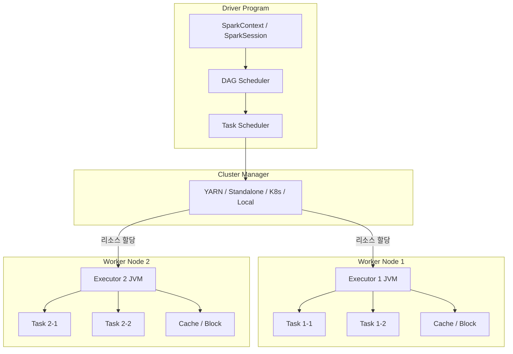
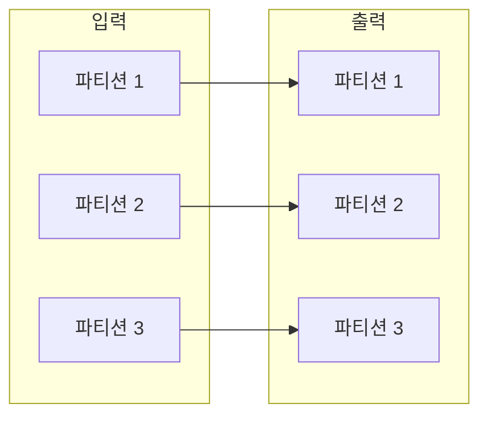
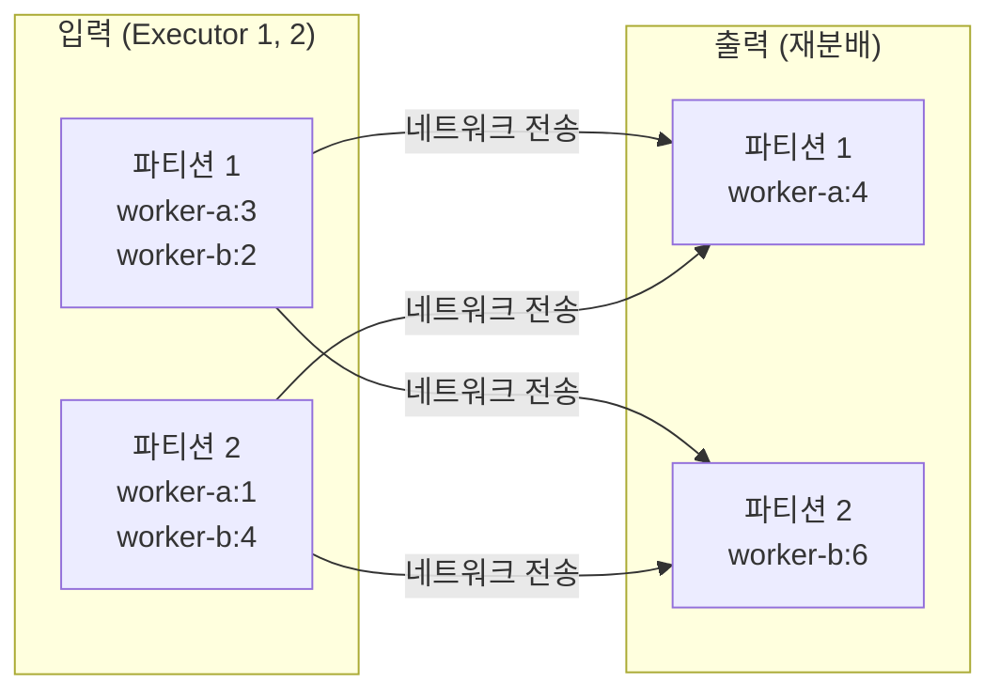
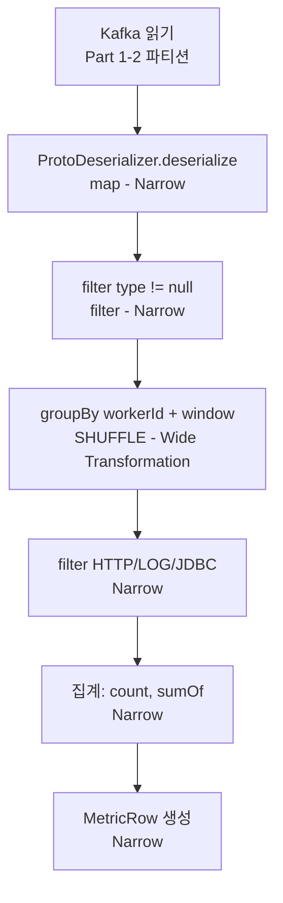

# Part 1: Spark 기초

> **예상 학습 시간:** 5~6시간
> **목표:** Spark 아키텍처, RDD/DataFrame/Dataset, Lazy Evaluation, Shuffle을 이해하여 Part 2(Structured Streaming) 학습의 토대를 마련한다.

---

## 섹션 1: Spark가 필요한 이유

### 단일 서버 처리의 한계

log-friends Pipeline이 처리해야 하는 데이터를 생각해보자. 하나의 Spring Boot 앱이 초당 수백 건의 HTTP/LOG/JDBC 이벤트를 발생시키고, 여러 워커가 동시에 데이터를 전송한다. 이 규모에서 단일 서버 처리는 세 가지 병목을 만난다.

**메모리 한계**: 단일 JVM이 보유할 수 있는 힙 메모리는 물리 메모리로 제한된다. 이벤트 집계를 위해 수 GB의 데이터를 메모리에 올리는 것은 불가능하다.

**CPU 한계**: 단일 서버의 코어 수는 고정되어 있다. 복잡한 집계 쿼리(예: 분 단위 HTTP 응답시간 평균 계산)는 코어를 100% 점유하면서도 처리를 완료하지 못할 수 있다.

**가용성 한계**: 단일 서버가 다운되면 처리 파이프라인 전체가 중단된다. StreamingJob이 재시작할 때까지 Kafka 메시지가 쌓인다.

### MapReduce의 단점: 디스크 기반 처리

Hadoop MapReduce는 대용량 처리 문제를 풀었지만, **모든 중간 결과를 HDFS(디스크)에 쓰는** 설계로 인해 속도가 느렸다.

```
MapReduce 처리 흐름:
Map Phase  → [디스크 쓰기] → Shuffle → [디스크 읽기] → Reduce Phase
                ↑                              ↑
           HDFS 기록 (느림)             HDFS 읽기 (느림)
```

머신러닝처럼 같은 데이터를 반복 처리하는 경우, 매 이터레이션마다 디스크 I/O가 발생한다. 10번 반복이면 10번의 전체 디스크 읽기/쓰기가 일어난다.

### Spark의 해법: 메모리 기반 처리

Spark는 중간 결과를 **메모리(RAM)에 유지**한다. 디스크는 메모리가 부족할 때만, 또는 체크포인트 저장 시에만 사용한다.

```
Spark 처리 흐름:
Stage 1 (메모리) → Shuffle (네트워크) → Stage 2 (메모리)
                       ↑
              디스크 대신 네트워크 전송
              메모리에서 바로 계산
```

벤치마크 기준으로 MapReduce 대비 **메모리 처리 시 100배, 디스크 처리 시 10배** 빠르다.

### log-friends에서 Spark를 쓰는 이유

`log-friends-pipeline/src/main/kotlin/com/logfriends/spark/StreamingJob.kt`의 역할을 단순 Java 코드로 대체한다면:

```kotlin
// 만약 Spark 없이 처리한다면
val events = kafkaConsumer.poll()  // Kafka에서 직접 읽기
val metrics = events.groupBy { it.workerId }  // 단일 JVM에서 집계
clickHouseWriter.write(metrics)               // 단일 스레드 쓰기
```

이 방식은 **수평 확장이 불가능**하다. 처리량이 늘면 단일 JVM을 키우는(Scale-Up) 방법밖에 없다.

Spark를 쓰면:
- Executor를 추가하는 것만으로 처리량 선형 증가 (Scale-Out)
- 파티션 병렬 처리: Kafka 파티션 수만큼 Task가 동시 실행
- 내결함성: Executor 실패 시 다른 Executor가 Task를 재실행

---

## 섹션 2: Spark 아키텍처

### 전체 구조



### Driver: 두뇌

Driver는 Spark 애플리케이션의 `main()` 함수가 실행되는 JVM 프로세스다.

**역할:**
- `SparkSession`(또는 `SparkContext`) 생성 및 관리
- 사용자 코드를 분석해 **DAG(방향 비순환 그래프)** 생성
- DAG를 Stage로 분리하고, Stage를 Task로 쪼개 Executor에 배분
- 실행 상태 모니터링 (Spark UI 제공, 기본 port 4040)

`StreamingJob.kt`에서 Driver는 `StreamingJob.main()` 함수 자체다:

```kotlin
// log-friends-pipeline/.../StreamingJob.kt
val spark = SparkSession.builder()
    .appName("LogFriends-Streaming")
    .config("spark.ui.port", "4040")      // Driver의 Web UI 포트
    .getOrCreate()                         // Driver에서 SparkSession 생성
```

### Executor: 일꾼

Executor는 Worker 노드에서 실행되는 JVM 프로세스다.

**역할:**
- Driver로부터 Task를 받아 실행
- 처리 결과를 Driver에 보고
- RDD/DataFrame 데이터를 메모리(또는 디스크)에 캐시

Executor는 Spark 애플리케이션 시작 시 생성되어 종료까지 살아있다. 각 Executor는 **고정된 수의 CPU 코어와 메모리**를 가진다.

### Task: 최소 실행 단위

Task는 **파티션 하나를 처리하는 최소 작업**이다. 파티션이 100개면 100개의 Task가 생성된다. 각 Task는 하나의 Executor 스레드에서 실행된다.

### Stage: Shuffle 경계

Stage는 **Shuffle 없이 연속으로 실행 가능한 Task들의 묶음**이다. `groupBy`나 `join` 같은 Wide Transformation이 나타날 때 Stage 경계가 생긴다.

```
Stage 1: map → filter → map  (Narrow Transformation, Shuffle 없음)
              ↓
         [Shuffle 경계] ← groupBy가 Stage 경계를 만든다
              ↓
Stage 2: aggregate → sort    (Wide Transformation 이후)
```

### log-friends 연결: local[*] 모드

`StreamingJob.kt`는 `.master()` 설정 없이 `getOrCreate()`를 호출한다. 이때 `spark-submit` 명령의 `--master` 파라미터나 환경변수로 마스터를 지정한다.

```bash
# docker-compose에서 실행 시 (local 모드)
spark-submit --master local[*] ...
```

`local[*]`에서:
- Driver와 Executor가 **같은 JVM 프로세스**에서 실행 (클러스터 매니저 불필요)
- `*`는 사용 가능한 **모든 CPU 코어**를 사용한다는 의미
- 파티션 수 = CPU 코어 수로 자동 설정

현재 log-friends는 단일 서버 Docker 환경이므로 `local[*]`이 적합하다. 실제 클러스터로 확장 시 `yarn` 또는 `k8s://...`으로 변경하면 된다.

---

## 섹션 3: RDD → DataFrame → Dataset

Spark API는 세 가지 추상화 계층을 가진다. 각 계층은 이전 계층을 기반으로 더 높은 수준의 추상화를 제공한다.

### RDD: 불변 분산 컬렉션

**RDD(Resilient Distributed Dataset)**는 Spark의 가장 낮은 수준 추상화다.

```
RDD[T] 특성:
- 불변(Immutable): 한번 생성되면 변경 불가, 새 RDD 생성
- 분산(Distributed): 여러 파티션에 나뉘어 Executor에 분산
- 탄력적(Resilient): 파티션 손실 시 Lineage로 재연산 가능
- 지연 평가(Lazy): 액션 호출 전까지 실제 계산 없음
```

RDD는 스키마(컬럼 정보)가 없어 Catalyst 옵티마이저의 최적화를 받지 못한다. `map`, `filter`, `reduce` 같은 함수형 API를 사용한다.

```scala
// RDD 사용 예
val rdd = sc.textFile("events.log")
val filtered = rdd.filter(_.contains("ERROR"))
val count = filtered.count()  // 액션: 여기서 실제 실행
```

### DataFrame: 스키마 있는 분산 테이블

**DataFrame**은 이름 붙은 컬럼을 가진 RDD다. SQL 테이블과 유사하다.

```
DataFrame = RDD[Row] + Schema (컬럼명 + 타입)

예시 스키마:
root
 |-- worker_id: string (nullable = true)
 |-- type: string (nullable = true)
 |-- timestamp: string (nullable = true)
 |-- duration_ms: long (nullable = true)
```

DataFrame의 핵심 장점은 **Catalyst 옵티마이저**가 실행 계획을 자동 최적화한다는 것이다. 사용자가 어떻게 쿼리를 작성하더라도, Catalyst가 가장 효율적인 물리 실행 계획을 찾아낸다.

```kotlin
// DataFrame 사용 예
val df = spark.read().json("events.json")
df.filter("type = 'HTTP'")
  .groupBy("worker_id")
  .agg(functions.avg("duration_ms"))
  .show()
```

### Dataset: 타입 안전한 DataFrame

**Dataset[T]**는 컴파일 타임 타입 안전성을 제공하는 DataFrame이다. Kotlin/Java/Scala의 데이터 클래스와 매핑된다.

```kotlin
// Dataset 사용 예 (Kotlin)
data class EventRow(val workerId: String, val type: String, ...)
val ds: Dataset<EventRow> = df.`as`(Encoders.bean(EventRow::class.java))
ds.filter { it.type == "HTTP" }  // 컴파일 타임 타입 체크
```

| 특성 | RDD | DataFrame | Dataset |
|---|---|---|---|
| 타입 안전성 | 있음 (런타임) | 없음 | 있음 (컴파일 타임) |
| Catalyst 최적화 | 없음 | 있음 | 있음 |
| 직렬화 | Java/Kryo | Tungsten (오프힙) | Encoder (효율적) |
| 언어 지원 | Scala/Java/Python/R | 모두 | Scala/Java/Kotlin |

### Spark SQL 옵티마이저: Catalyst

Catalyst는 DataFrame/SQL 쿼리를 4단계로 최적화한다:

```
사용자 쿼리 (SQL 또는 DataFrame API)
          ↓
1. 논리 계획 분석 (Unresolved Logical Plan → Analyzed Logical Plan)
          ↓ 카탈로그에서 테이블/컬럼 참조 해결
2. 논리 계획 최적화 (Optimized Logical Plan)
          ↓ Predicate Pushdown, Column Pruning, Constant Folding
3. 물리 계획 생성 (Physical Plans)
          ↓ 여러 물리 계획 중 비용 모델로 최선 선택
4. 코드 생성 (Code Generation)
          ↓ Tungsten이 JVM 바이트코드 직접 생성
최적화된 실행
```

**Predicate Pushdown**: `WHERE type = 'HTTP'` 조건을 데이터 소스(Kafka, Parquet)에 최대한 가까이 밀어 넣어 불필요한 데이터를 읽지 않는다.

**Column Pruning**: SELECT에 없는 컬럼은 읽지 않는다. `SELECT worker_id, type`만 필요하면 `duration_ms` 컬럼은 아예 역직렬화하지 않는다.

### Tungsten: 메모리 최적화

Tungsten은 Spark의 실행 엔진으로, Java 힙 대신 **오프힙(sun.misc.Unsafe) 메모리**를 사용한다.

- Java 힙: GC 오버헤드 있음, 객체 헤더 오버헤드 있음
- Tungsten 오프힙: GC 없음, 컴팩트한 바이너리 형식, CPU 캐시 친화적

DataFrame 연산이 RDD 연산보다 빠른 이유 중 하나가 Tungsten이다.

---

## 섹션 4: 변환(Transformation) vs 액션(Action)

### Lazy Evaluation: 지연 평가

Spark의 모든 Transformation은 **즉시 실행되지 않는다.** 실행 계획(DAG)을 기록해두고, **Action이 호출될 때** 비로소 실제 계산이 시작된다.

```kotlin
// 아래 코드는 아무것도 실행되지 않는다 (Transformation만 존재)
val df = spark.read().json("events.json")          // 파일도 아직 안 읽음
val filtered = df.filter("type = 'HTTP'")           // 필터 계획 기록
val grouped = filtered.groupBy("worker_id").count() // 집계 계획 기록

// 여기서 비로소 실제 실행이 시작된다 (Action)
grouped.show()  // <- Action!
grouped.collect()  // <- Action!
grouped.write().parquet("output/")  // <- Action!
```

왜 지연 평가인가?
- Catalyst가 전체 실행 계획을 보고 최적화할 수 있다
- 중간 결과를 메모리에 올리지 않아도 된다
- 파이프라인 퓨전: `map → filter → map`을 한 번의 데이터 순회로 처리

### Narrow Transformation: Shuffle 없음

각 입력 파티션이 **오직 하나의 출력 파티션에만 기여**하는 변환이다.



**Narrow Transformation 예시:**
- `map()`: 각 레코드를 독립적으로 변환
- `filter()`: 조건에 맞지 않는 레코드 제거
- `flatMap()`: 하나의 레코드를 여러 레코드로 확장
- `union()`: 동일 파티션 수의 두 RDD 합치기

`Aggregator.kt`의 `filter { it.type == "HTTP" }`는 Narrow Transformation이다. Shuffle 없이 각 Executor가 자신의 파티션 데이터만 필터링한다.

### Wide Transformation: Shuffle 발생

여러 입력 파티션의 데이터가 **여러 출력 파티션에 기여**하는 변환이다. 데이터가 네트워크를 통해 재분배(Shuffle)된다.



**Wide Transformation 예시:**
- `groupBy()`: 같은 키의 데이터를 같은 파티션으로 모음
- `join()`: 두 DataFrame을 키 기준으로 결합
- `distinct()`: 중복 제거를 위해 전체 데이터 비교 필요
- `orderBy()` / `sort()`: 전체 정렬

### DAG 예시: Aggregator.kt의 실행 계획



Stage 1: Kafka 읽기 → deserialize → filter (Shuffle 전까지)
Stage 2: groupBy 이후 집계 → 결과 수집

---

## 섹션 5: Shuffle과 성능

### Shuffle이란?

Shuffle은 **파티션 간 데이터 이동**이다. `groupBy("worker_id")`를 실행하면, 같은 `worker_id`를 가진 레코드들이 같은 파티션으로 모여야 한다. 이 과정에서:

1. **Map 단계**: 각 Executor가 출력 데이터를 파티션 키(Hash)로 정렬하여 로컬 디스크에 기록
2. **네트워크 전송**: 대상 Executor가 필요한 파티션 데이터를 네트워크로 가져옴
3. **Reduce 단계**: 모인 데이터로 집계 수행

```
비용 발생 지점:
- 디스크 쓰기 (Map 단계 output)
- 네트워크 전송 (파티션 간)
- 디스크 읽기 (Reduce 단계 input)
- 메모리 → 디스크 spill (메모리 부족 시)
```

### spark.sql.shuffle.partitions

Shuffle 후 생성되는 파티션 수를 결정하는 설정이다. **기본값은 200**이다.

```kotlin
// StreamingJob에서 설정 가능
val spark = SparkSession.builder()
    .config("spark.sql.shuffle.partitions", "10")  // Shuffle 후 파티션 10개
    .getOrCreate()
```

**기본값 200의 문제점:**
- 데이터가 적으면(수백 MB 미만) 200개의 빈 Task가 생성되어 오버헤드 발생
- 스케줄링 비용, Task 직렬화/역직렬화 비용이 실제 처리보다 커질 수 있음

**log-friends 연결**: 10초 마이크로배치에서 처리되는 이벤트 수가 수천~수만 건 수준이라면, 파티션 수를 `spark.sql.shuffle.partitions=4` 정도로 줄이는 것이 더 효율적이다.

### Aggregator.kt와 Shuffle

현재 `Aggregator.kt`는 **Spark DataFrame API를 사용하지 않는다**. 대신 Kotlin 컬렉션 API로 집계한다:

```kotlin
// log-friends-pipeline/.../Aggregator.kt
return events
    .groupBy { e -> Key(e.workerId, truncateToMinute(e.timestamp)) }  // Kotlin groupBy
    .map { (key, evts) -> ... }
```

이것은 **Driver JVM 단일 스레드**에서 실행되는 in-memory 집계다. `foreachBatch` 내부에서 `df.select("value").collect()`로 전체 데이터를 Driver로 가져온 뒤, Kotlin 코드로 처리한다.

**장점**: 구현이 단순, Protobuf 역직렬화와 집계를 한 번에 처리
**단점**: 배치 크기가 커지면 Driver 메모리 부족, Spark의 병렬 처리를 활용하지 못함

Part 4에서 이를 Spark DataFrame API로 리팩터링하여 분산 처리로 개선하는 방법을 학습한다.

---

## 핵심 질문 Q&A

**Q1: `local[*]`과 `local[2]`의 차이는?**

`local[N]`은 N개의 스레드(= N개의 Executor 슬롯)를 사용한다. `local[*]`은 JVM이 인식하는 CPU 코어 수만큼 스레드를 생성한다. 8코어 서버에서 `local[*]`은 `local[8]`과 동일하다.

실습: `Runtime.getRuntime().availableProcessors()`로 코어 수를 확인하면 `local[*]`의 스레드 수를 예측할 수 있다.

**Q2: DataFrame과 Dataset 중 Kotlin에서 무엇을 사용해야 하는가?**

Kotlin에서는 **DataFrame을 주로 사용**하고, 타입 안전성이 필요한 지점에서만 Dataset으로 변환하는 것이 실용적이다. Kotlin의 Spark Dataset 지원(`Encoders.bean()`)은 Java보다 불편하고, Kotlin-Spark 전용 라이브러리(`kotlin-spark-api`)를 사용하면 더 자연스러운 API를 쓸 수 있다.

`StreamingJob.kt`가 `Dataset<Row>`(= DataFrame)를 사용하는 것은 이 이유에서다.

**Q3: Shuffle 파티션을 줄여야 하는 상황은?**

다음 조건에서 기본값 200보다 적은 파티션이 유리하다:
- 처리 데이터가 작을 때 (수 MB ~ 수십 MB 수준의 마이크로배치)
- Executor 코어 수가 적을 때 (4코어면 4개 이상의 파티션은 순차 처리)
- Task 생성/스케줄링 오버헤드가 실제 처리 시간보다 클 때

Spark UI의 "Stages" 탭에서 Task당 처리 시간이 수 ms라면 파티션 수를 줄여야 한다.

**Q4: DAG에서 Stage 경계는 어떻게 결정되는가?**

**Shuffle이 발생하는 지점**에서 Stage 경계가 생긴다. `groupBy`, `join`, `distinct`, `repartition`이 대표적이다. Spark는 Shuffle 없이 파이프라인 처리 가능한 연산들을 하나의 Stage로 묶는다.

Spark UI → Jobs → DAG Visualization에서 실제 Stage 경계를 시각적으로 확인할 수 있다.

**Q5: Catalyst 옵티마이저가 Predicate Pushdown을 하면 어떤 이점이 있는가?**

```sql
SELECT * FROM events WHERE type = 'HTTP' AND duration_ms > 1000
```

Predicate Pushdown 없이: 모든 이벤트를 읽은 뒤 필터 적용
Predicate Pushdown 있이: 데이터 소스(Parquet 파일이면 Row Group 스킵, Kafka이면 메시지 필터) 수준에서 필터 적용

결과적으로 **네트워크/디스크 I/O와 역직렬화 비용**이 크게 줄어든다. Parquet 파일의 경우 컬럼 통계 정보를 이용해 전체 Row Group을 건너뛸 수 있다.

---

## 프로젝트 연결

### StreamingJob.kt의 SparkSession 설정 분석

```kotlin
// log-friends-pipeline/src/main/kotlin/com/logfriends/spark/StreamingJob.kt
val spark = SparkSession.builder()
    .appName("LogFriends-Streaming")
    // .master()가 없음 → spark-submit --master 파라미터 또는 MASTER 환경변수로 지정
    .config("spark.ui.port", "4040")
    .config("spark.sql.streaming.forceDeleteTempCheckpointLocation", "true")
    .getOrCreate()
```

**`spark.sql.streaming.forceDeleteTempCheckpointLocation=true`**: Streaming 쿼리 종료 시 임시 체크포인트를 자동 삭제한다. 개발/테스트 환경에서 이전 체크포인트로 인한 오프셋 충돌을 방지한다. **프로덕션에서는 `false`로 설정하여 체크포인트를 보존해야 한다.**

### local[*] 모드에서 Executor 수 확인

```kotlin
// 애플리케이션 실행 중 Spark UI에서 확인
// 또는 코드로:
val sc = spark.sparkContext()
println("Default Parallelism: ${sc.defaultParallelism()}")
// local[*]에서 CPU 코어 수 = Executor 슬롯 수 = 기본 파티션 수
```

Spark UI(`http://localhost:4040`) → Executors 탭에서 실행 중인 Executor와 코어 수를 실시간으로 확인할 수 있다.

---

## 실습

### 실습 1: 기본 DataFrame 조작

```kotlin
// build.gradle.kts에 의존성 추가 후 실행
import org.apache.spark.sql.SparkSession
import org.apache.spark.sql.functions.*

fun main() {
    val spark = SparkSession.builder()
        .appName("Spark-Basic-Practice")
        .master("local[*]")
        .getOrCreate()
    spark.sparkContext().setLogLevel("WARN")

    // 인메모리 데이터로 DataFrame 생성
    val data = listOf(
        mapOf("type" to "HTTP", "worker_id" to "worker-1", "duration_ms" to 150L),
        mapOf("type" to "HTTP", "worker_id" to "worker-1", "duration_ms" to 300L),
        mapOf("type" to "LOG",  "worker_id" to "worker-2", "duration_ms" to 0L),
        mapOf("type" to "HTTP", "worker_id" to "worker-2", "duration_ms" to 500L),
    )

    // 실제로는 Kafka에서 읽어오지만, 여기서는 인메모리 데이터 사용
    // Spark UI(localhost:4040)를 열어두고 실행하면 DAG 확인 가능

    println("=== Shuffle 파티션 기본값 ===")
    println(spark.conf().get("spark.sql.shuffle.partitions"))  // 200
}
```

### 실습 2: Shuffle vs No-Shuffle 비교

```kotlin
// 실행 전 Spark UI 열어두기 (localhost:4040)
val events = spark.range(1_000_000)
    .withColumn("worker_id", (col("id") % 10).cast("string"))
    .withColumn("duration_ms", (rand() * 1000).cast("long"))

// Narrow Transformation만 (Stage 1개)
val filtered = events.filter("duration_ms > 500")
println("Filtered count: ${filtered.count()}")  // Action → Stage 1개

// Wide Transformation 포함 (Stage 2개)
val grouped = events.groupBy("worker_id").agg(avg("duration_ms"))
grouped.show()  // Action → Stage 2개 (Shuffle 경계)
// Spark UI에서 2개의 Stage와 그 사이 Shuffle Read/Write 크기 확인
```

---

## 체크리스트

- [ ] Spark Driver와 Executor의 역할 차이를 설명할 수 있다
- [ ] `local[*]` 모드에서 Executor 수가 CPU 코어 수와 같은 이유를 안다
- [ ] RDD, DataFrame, Dataset의 차이점과 각각의 장단점을 설명할 수 있다
- [ ] Lazy Evaluation이 성능 최적화에 어떻게 기여하는지 설명할 수 있다
- [ ] Narrow Transformation과 Wide Transformation의 차이를 예시와 함께 설명할 수 있다
- [ ] Shuffle이 발생하면 어떤 비용이 생기는지 3가지 이상 열거할 수 있다
- [ ] Stage 경계가 어디서 생기는지 설명할 수 있다
- [ ] `spark.sql.shuffle.partitions`의 기본값이 200인 이유와, 이를 줄여야 하는 상황을 안다
- [ ] Catalyst 옵티마이저의 4단계를 순서대로 설명할 수 있다
- [ ] Tungsten이 Java 힙 대신 오프힙을 사용하는 이유를 설명할 수 있다
- [ ] `StreamingJob.kt`의 `SparkSession` 설정에서 `.master()`가 없는 이유를 설명할 수 있다
- [ ] `Aggregator.kt`가 Spark 분산 처리를 사용하지 않는 이유와 그 한계를 설명할 수 있다
- [ ] Spark UI에서 DAG Visualization을 열어 Stage 경계를 확인할 수 있다
