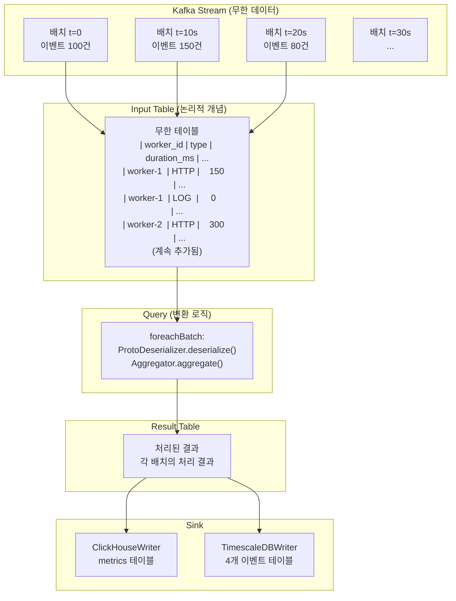
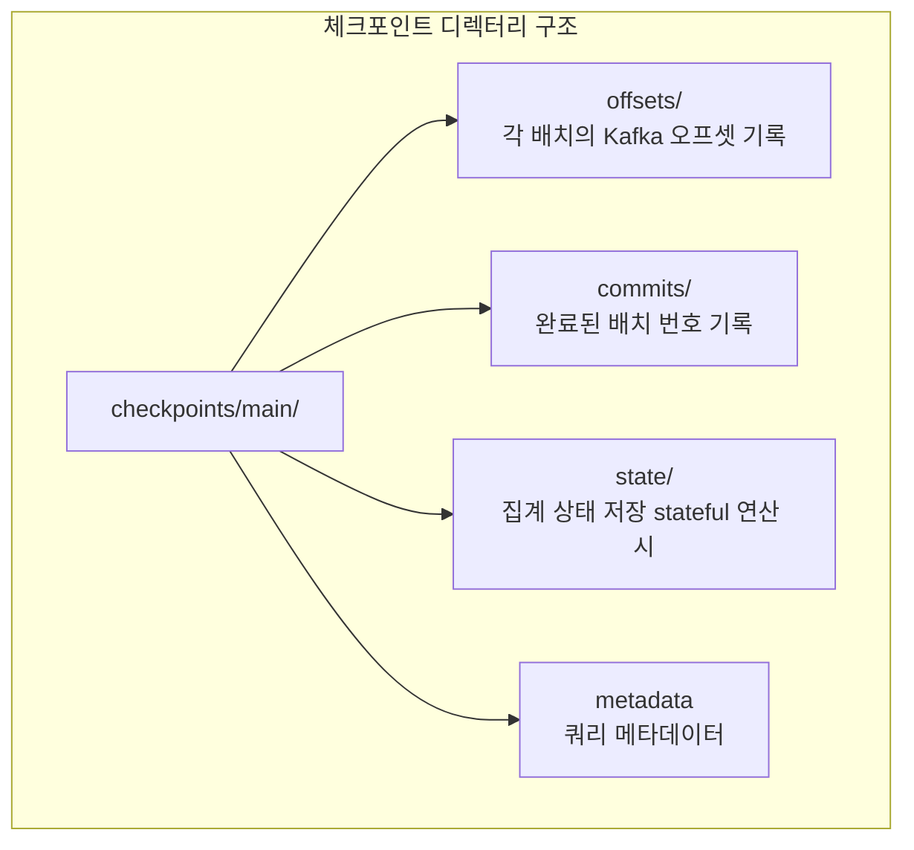

# Part 2: Structured Streaming

> **예상 학습 시간:** 6~7시간
> **목표:** Structured Streaming의 무한 테이블 추상화, 트리거, 출력 모드, 체크포인트를 이해하고 `StreamingJob.kt`의 전체 흐름을 완전히 분석할 수 있다.

---

## 섹션 1: Structured Streaming이란?

### DStream vs Structured Streaming

Spark는 스트리밍 처리를 두 번 구현했다. 첫 번째는 Spark 1.x의 **DStream(Discretized Stream)**, 두 번째는 Spark 2.0에서 도입된 **Structured Streaming**이다.

| 특성 | DStream (구식) | Structured Streaming (현재) |
|---|---|---|
| 추상화 | RDD의 시간 시퀀스 | 무한 DataFrame/Dataset |
| API | 저수준 RDD API | 고수준 DataFrame/SQL API |
| Catalyst 최적화 | 불가 | 가능 |
| 이벤트 시간 처리 | 어려움 | Watermark로 기본 지원 |
| 정확한 Once | 어려움 | 기본 지원 |
| 상태 관리 | 복잡 | mapGroupsWithState/flatMapGroupsWithState |

DStream은 Spark 3.4부터 유지보수 모드, Spark 4.0에서는 사실상 레거시 취급이다. **모든 새 코드는 Structured Streaming으로 작성**해야 한다.

### 무한 테이블(Unbounded Table) 추상화

Structured Streaming의 핵심 개념은 **스트림을 무한히 증가하는 테이블로 보는 것**이다.



이 추상화의 장점은 **배치 처리와 스트리밍 처리에 동일한 DataFrame API를 사용**할 수 있다는 것이다.

```kotlin
// 배치 처리
val df = spark.read().format("parquet").load("events/")
val result = df.groupBy("worker_id").count()

// 스트리밍 처리 (거의 동일한 코드)
val streamDf = spark.readStream().format("kafka").load()
val streamResult = streamDf.groupBy("worker_id").count()
streamResult.writeStream().format("console").start()
```

`readStream()`과 `writeStream()`만 다르고 나머지 변환 로직은 동일하다.

### log-friends에서의 적용

`StreamingJob.kt`는 Structured Streaming의 핵심 패턴인 **readStream → transform → writeStream**을 따른다:

```kotlin
// log-friends-pipeline/src/main/kotlin/com/logfriends/spark/StreamingJob.kt

// 1. readStream: Kafka에서 무한 스트림 읽기
val rawStream = spark.readStream()
    .format("kafka")
    .option("subscribe", kafkaTopic)
    .load()

// 2. transform + 3. writeStream: foreachBatch로 배치 처리
rawStream.writeStream()
    .foreachBatch { df, batchId ->
        processBatch(df, batchId)  // 변환 + Sink 쓰기
    }
    .start()
```

---

## 섹션 2: 마이크로배치 vs 연속 처리

### 마이크로배치 (Micro-Batch): log-friends의 선택

마이크로배치는 Structured Streaming의 **기본 처리 모드**다. 정해진 주기(트리거 간격)마다 새로운 데이터를 하나의 배치로 모아 처리한다.

```
타임라인:
t=0s    배치 #0 시작 (Kafka에서 데이터 읽기)
t=3s    배치 #0 완료 (ClickHouse + TimescaleDB 쓰기)
t=10s   배치 #1 시작 (다음 10초분 데이터)
t=12s   배치 #1 완료
t=20s   배치 #2 시작
...
```

`StreamingJob.kt`의 트리거:

```kotlin
.trigger(Trigger.ProcessingTime(10, TimeUnit.SECONDS))
// 10초마다 새 배치 처리
```

**마이크로배치의 장점:**
- 구현이 단순하고 안정적
- Exactly-Once 시맨틱 보장 (체크포인트 기반)
- 재처리가 쉬움 (배치 단위로 재실행 가능)

**마이크로배치의 단점:**
- 최소 지연 시간(Latency)이 트리거 간격 (log-friends는 10초 이상)
- 고정 오버헤드: 트리거마다 배치 계획 수립, Kafka 오프셋 커밋

### 연속 처리 (Continuous Processing): 실험적 기능

Spark 2.3에 추가된 실험적 기능으로, 레코드 단위로 즉시 처리한다.

```kotlin
// 연속 처리 (밀리초 단위 체크포인트)
.trigger(Trigger.Continuous("1 second"))
```

**현재 제한사항:**
- 지원하는 Source가 적음 (Kafka만 안정적)
- 일부 연산(집계, 정렬) 미지원
- Spark 4.0에서도 여전히 실험적 상태

**log-friends의 선택이 합리적인 이유**: 10초 지연은 Observability 데이터 수집에서 충분히 낮은 지연이며, 안정성과 Exactly-Once 보장이 더 중요하다.

---

## 섹션 3: 트리거(Trigger) 종류

트리거는 **언제 새 배치를 시작할 것인가**를 결정한다.

| 트리거 | API | 설명 | 사용 사례 |
|---|---|---|---|
| **Default** | `.trigger(Trigger.Unspecified())` | 이전 배치 완료 즉시 다음 배치 시작 | 최대 처리량, 지연 최소화 |
| **ProcessingTime** | `.trigger(Trigger.ProcessingTime("10 seconds"))` | 지정 주기로 배치 실행 | log-friends (균등 부하) |
| **Once** | `.trigger(Trigger.Once())` | 현재까지 데이터를 한 번만 처리 후 종료 | 스케줄 배치 재처리 |
| **AvailableNow** | `.trigger(Trigger.AvailableNow())` | 현재 사용 가능한 모든 데이터 처리 후 종료 | Once의 개선판 |
| **Continuous** | `.trigger(Trigger.Continuous("1 second"))` | 레코드 단위 연속 처리 (실험적) | 초저지연 요구 시 |

### ProcessingTime 동작 원리

```
트리거 시각  배치 처리 시간  다음 트리거 시각
t=0s        3초 소요        t=10s  (10초 경과 후)
t=10s       12초 소요       t=20s  (처리 완료 후 다음 주기 계산)
t=20s       5초 소요        t=30s
```

**중요**: `ProcessingTime("10 seconds")`는 "10초마다 정확히 실행"이 아니라, "이전 배치 완료 후, 10초 주기의 다음 경계 시각에 실행"이다.

만약 배치 처리가 10초를 초과하면:
- Spark는 완료 즉시 다음 배치를 시작한다 (건너뛰지 않음)
- 데이터가 쌓이므로 다음 배치 크기가 커진다
- 처리가 지속적으로 느리면 backpressure가 쌓인다

### log-friends 트리거 선택의 근거

```kotlin
// StreamingJob.kt
.trigger(Trigger.ProcessingTime(10, TimeUnit.SECONDS))
```

**10초를 선택한 이유:**
- Kafka에서 100ms~500ms 단위로 이벤트가 배치 전송됨 (`logfriends.batch.interval.ms=500`)
- 10초 = 약 20개의 SDK 배치를 하나의 Spark 배치로 처리
- ClickHouseWriter와 TimescaleDBWriter의 DB 연결 오버헤드를 배치로 상각
- 10초 단위 집계는 실시간 모니터링에 충분히 짧은 지연

---

## 섹션 4: 출력 모드(Output Mode)

출력 모드는 **Result Table에서 Sink로 어떤 행을 쓸 것인가**를 결정한다.

### Append 모드

새로 추가된 행만 Sink에 쓴다. 이전에 쓴 결과는 변경되지 않는다.

```
배치 #0: 결과 [A, B, C]       → Sink에 [A, B, C] 쓰기
배치 #1: 결과 [D, E]           → Sink에 [D, E] 쓰기 (A, B, C는 다시 안 씀)
배치 #2: 결과 [F]              → Sink에 [F] 쓰기
```

**사용 가능한 경우**: 집계 없는 단순 변환, Watermark가 설정된 집계

**log-friends 적용**: TimescaleDBWriter는 새 이벤트를 매번 추가하므로 Append 모드가 적합하다.

### Update 모드

현재 배치에서 변경된 행만 쓴다. 집계 결과가 업데이트된 행만 전송한다.

```
배치 #0: worker-1의 HTTP count = 5   → Sink에 (worker-1, 5) 쓰기
배치 #1: worker-1의 HTTP count = 8   → Sink에 (worker-1, 8) 쓰기 (변경분만)
```

**사용 가능한 경우**: 집계 쿼리, 외부 시스템이 upsert를 지원할 때

### Complete 모드

매 배치마다 전체 Result Table을 Sink에 쓴다. 집계 결과 전체를 항상 새로 쓴다.

```
배치 #0: 전체 결과 [worker-1:5, worker-2:3]
         → Sink에 전체 쓰기
배치 #1: 전체 결과 [worker-1:8, worker-2:7, worker-3:2]
         → Sink에 전체 쓰기 (이전 배치 결과 포함)
```

**사용 가능한 경우**: 집계 쿼리, Sink가 전체 상태를 관리할 때
**단점**: 데이터가 많아질수록 매 배치에 쓰는 양이 증가

### foreachBatch: 출력 모드를 직접 제어

`StreamingJob.kt`는 `.foreachBatch()`를 사용하므로 출력 모드를 명시하지 않는다. `foreachBatch`는 **각 배치의 DataFrame을 직접 받아 커스텀 쓰기 로직을 실행**하므로, 모드 선택이 사용자 코드의 몫이다.

```kotlin
// StreamingJob.kt
.foreachBatch(VoidFunction2 { df: Dataset<Row>, batchId: Long ->
    processBatch(df, batchId)
    // 여기서 쓰는 방식이 곧 출력 모드를 결정함
})
```

`processBatch()`에서:
- `TimescaleDBWriter.write(events)` → **Append 방식** (새 이벤트만 INSERT)
- `ClickHouseWriter.write(metrics)` → **Append 방식** (SummingMergeTree가 자동 합산)

**ClickHouseWriter와 SummingMergeTree의 멱등성**:
```sql
-- ClickHouse SummingMergeTree: 동일 (worker_id, window_start)에 여러 INSERT 시
-- 자동으로 숫자 컬럼을 합산함
-- 따라서 배치 재처리 시 중복 카운트 위험이 있음
-- 실제 쿼리 시 GROUP BY + SUM으로 정확한 값을 얻어야 함
```

---

## 섹션 5: 체크포인트(Checkpoint)

### 체크포인트의 역할

체크포인트는 Structured Streaming의 **내결함성 메커니즘**이다. Streaming 쿼리가 재시작되더라도 중복 없이, 누락 없이 처리를 재개할 수 있게 해준다.



### 오프셋 관리 상세

```
배치 #5 시작:
  1. offsets/5 파일 생성 (처리할 Kafka 오프셋 범위 기록)
     예: {"topic-partition-0": {"start": 1000, "end": 1150}}

  2. Kafka에서 오프셋 1000~1150 읽기

  3. processBatch() 실행 (ClickHouse + TimescaleDB 쓰기)

  4. commits/5 파일 생성 (배치 완료 기록)

배치 #5 처리 중 장애 발생:
  - commits/5가 없으므로 재시작 시 offsets/5를 보고 동일 범위 재처리
  - commits/5 있고 offsets/6 없으면 → 배치 #6 시작
```

### StreamingJob.kt의 체크포인트 설정

```kotlin
// log-friends-pipeline/src/main/kotlin/com/logfriends/spark/StreamingJob.kt
val checkpointDir = System.getenv("CHECKPOINT_DIR") ?: "/opt/spark-jobs/checkpoints"

rawStream.writeStream()
    .foreachBatch(...)
    .option("checkpointLocation", "$checkpointDir/main")
    .trigger(Trigger.ProcessingTime(10, TimeUnit.SECONDS))
    .start()
```

**`/opt/spark-jobs/checkpoints/main/`** 경로는 docker-compose에서 볼륨 마운트로 영속화되어야 한다. 컨테이너가 재시작되어도 체크포인트가 유지된다.

### 체크포인트 없이 실행 시

```kotlin
// 체크포인트 없이 실행 가능하나:
rawStream.writeStream()
    .foreachBatch(...)
    .start()  // 경고 메시지 출력
// WARNING: No checkpoint provided → 재시작 시 startingOffsets 설정에 따라 동작
// "startingOffsets": "latest" → 재시작 전 메시지는 유실될 수 있음
```

현재 `StreamingJob.kt`는 `"startingOffsets": "latest"`를 사용하므로, 체크포인트 없이 재시작하면 Spark 다운 시간 동안의 이벤트가 유실된다. 체크포인트 + `"earliest"` 조합이 더 안전하다.

### 체크포인트 디렉터리 손상 시 복구

체크포인트가 손상되면 쿼리를 재시작할 수 없다. 이 경우:

1. 손상된 체크포인트 디렉터리 삭제 또는 이름 변경
2. `startingOffsets`를 재처리 시작 시점으로 수동 설정
3. 새 체크포인트 디렉터리로 쿼리 재시작

```kotlin
// 긴급 복구 설정
spark.readStream()
    .format("kafka")
    .option("startingOffsets", """{"log-friends.batch":{"0":1234567}}""")  // 수동 오프셋
    .load()
```

---

## 섹션 6: Watermark — 늦게 도착하는 데이터 처리

### 이벤트 시간 vs 처리 시간

스트리밍 데이터에는 두 가지 시간이 있다:

**이벤트 시간(Event Time)**: 이벤트가 실제로 발생한 시각 (SDK가 기록하는 `timestamp`)
**처리 시간(Processing Time)**: Spark가 데이터를 처리하는 시각 (현재 시계)

네트워크 지연, 재전송, Kafka 파티션 불균형 등으로 인해 이벤트는 **발생 순서대로 Spark에 도착하지 않을 수 있다**.

```
이벤트 발생 순서:  t=10:00:01, t=10:00:02, t=10:00:03, t=10:00:05
Spark 도착 순서:   t=10:00:01, t=10:00:05, t=10:00:02, t=10:00:03
                                ↑                   ↑
                           5초 일찍 도착          3초 늦게 도착
```

### Watermark 개념

Watermark는 "**이 시각 이전의 늦은 데이터는 더 이상 처리하지 않겠다**"는 경계선이다.

```kotlin
// 최대 10분 늦은 이벤트까지 허용
stream
    .withWatermark("timestamp", "10 minutes")
    .groupBy(
        window(col("timestamp"), "5 minutes"),
        col("worker_id")
    )
    .count()
```

```
현재 Watermark = 최대 이벤트 시간 - 10분

이벤트 시간 = 10:15:00 도착
→ Watermark = 10:05:00 (10:15:00 - 10분)
→ 10:05:00 이전 이벤트는 무시

이벤트 시간 = 10:04:59 도착 (늦은 이벤트)
→ Watermark 10:05:00 이후이므로 무시됨 (드롭)
```

### log-friends에서 Watermark가 현재 없는 이유

`StreamingJob.kt`는 **Watermark를 설정하지 않는다**. 이유는:

1. `foreachBatch`로 직접 처리하므로 Spark의 스트리밍 집계를 사용하지 않음
2. 이벤트 시간 기반 윈도우 집계가 아닌, Kotlin의 `truncateToMinute()`로 집계
3. 늦은 이벤트는 단순히 현재 배치에 포함되어 처리됨

만약 향후 Part 4에서 Spark DataFrame API 기반 집계로 리팩터링한다면, `withWatermark`가 필수가 된다.

---

## 핵심 질문 Q&A

**Q1: 10초 트리거에서 배치 처리가 15초 걸리면 어떻게 되는가?**

Spark는 현재 배치를 완료한 직후, **다음 10초 주기의 경계 시각**에 맞춰 다음 배치를 시작한다. 만약 t=0s에 배치 시작, t=15s에 완료라면, t=20s(다음 10초 경계)에 다음 배치가 시작된다.

처리가 지속적으로 10초를 초과하면:
- 각 배치에 더 많은 데이터가 쌓임 (Kafka 오프셋이 누적됨)
- 처리 시간이 더 길어지는 악순환 가능
- 해결: 처리 로직 최적화, Executor 수 증가, 또는 트리거 간격 조정

**Q2: 체크포인트 디렉터리가 손상되면 어떻게 복구하는가?**

1. 손상 범위 확인: `offsets/`와 `commits/`의 파일 비교
2. 마지막으로 `commits/`에 기록된 배치 번호 확인
3. 해당 배치의 Kafka 오프셋을 `offsets/` 파일에서 읽기
4. 새 체크포인트 디렉터리 생성 후 유효한 마지막 오프셋부터 재시작

Spark 3.4+에서는 `spark.sql.streaming.checkpointFileManagerClass`로 체크포인트 스토리지를 교체할 수 있다 (S3, GCS 등).

**Q3: Append 모드에서 집계를 하려면 Watermark가 왜 필요한가?**

집계 결과는 이론적으로 **언제라도 늦은 이벤트가 도착하면 변경될 수 있다**. Spark는 결과가 확정되기 전까지 메모리에 상태를 유지해야 한다.

Watermark는 "이 시각 이후로는 더 이상 늦은 이벤트가 없다"는 경계를 알려줘서, Spark가 상태를 **안전하게 내보내고 메모리에서 제거**할 수 있게 해준다.

Watermark 없이 집계에 Append 모드를 쓰면: `AnalysisException: Append output mode not supported when there are streaming aggregations on streaming DataFrames/Datasets without watermark`

**Q4: 마이크로배치가 실패하면 재시도 메커니즘은?**

Structured Streaming에서 배치 실패 시:
1. 체크포인트의 `offsets/` 파일에 기록된 오프셋 범위를 재처리
2. `commits/` 파일이 없으면 동일 배치를 재시도
3. `StreamingQueryException`이 발생하면 쿼리 자체가 종료됨

`StreamingJob.kt`는 `foreachBatch` 내부에서 예외를 `catch`하고 오류를 로그로만 남긴다. 이는 **Spark 쿼리 재시도를 방해**하는 설계다:

```kotlin
// StreamingJob.kt 현재 코드
.foreachBatch(VoidFunction2 { df, batchId ->
    try {
        processBatch(df, batchId)
    } catch (e: Exception) {
        System.err.println("[Spark] Batch $batchId error: ${e.message}")
        e.printStackTrace()
        // 예외를 삼키므로 Spark는 배치 성공으로 판단
    }
})
```

이 설계의 의도는 **부분 실패 허용**: TimescaleDB가 다운되어도 Spark 쿼리 자체는 계속 실행된다. 완전한 Exactly-Once가 필요하면 예외를 다시 throw해야 한다.

**Q5: log-friends에서 TimescaleDB 쓰기가 느리면 파이프라인 전체에 미치는 영향은?**

`processBatch()`는 순차적으로 실행된다:
```kotlin
val metrics = Aggregator.aggregate(events)   // 1. 집계 (빠름)
ClickHouseWriter.write(metrics)              // 2. ClickHouse 쓰기
TimescaleDBWriter.write(events)              // 3. TimescaleDB 쓰기 (느리면?)
```

TimescaleDB 쓰기가 7초 걸리면:
- 전체 배치 처리 시간 = 집계 + ClickHouse + TimescaleDB ≒ 7초+
- 10초 트리거이므로 아직 여유 있음
- TimescaleDB가 15초 걸리면 → 위 Q1처럼 적체 발생

**개선 방향**: ClickHouseWriter와 TimescaleDBWriter를 병렬 실행:

```kotlin
private fun processBatch(df: Dataset<Row>, batchId: Long) {
    val events = /* 역직렬화 */
    val metrics = Aggregator.aggregate(events)

    // 병렬 쓰기 (Coroutine 또는 CompletableFuture)
    val chFuture = CompletableFuture.runAsync { ClickHouseWriter.write(metrics) }
    val tsFuture = CompletableFuture.runAsync { TimescaleDBWriter.write(events) }
    CompletableFuture.allOf(chFuture, tsFuture).get()
}
```

---

## 프로젝트 연결

### StreamingJob.kt 전체 흐름 분석

```kotlin
// log-friends-pipeline/src/main/kotlin/com/logfriends/spark/StreamingJob.kt

// === 설정 로드 (환경변수 우선) ===
val kafkaBrokers  = System.getenv("KAFKA_BROKERS") ?: "kafka:9092"
val kafkaTopic    = System.getenv("LOGFRIENDS_KAFKA_TOPIC") ?: "log-friends.batch"
val checkpointDir = System.getenv("CHECKPOINT_DIR") ?: "/opt/spark-jobs/checkpoints"

// === SparkSession 생성 (Driver 초기화) ===
val spark = SparkSession.builder()
    .appName("LogFriends-Streaming")
    .config("spark.ui.port", "4040")
    .config("spark.sql.streaming.forceDeleteTempCheckpointLocation", "true")
    .getOrCreate()
// getOrCreate(): 이미 실행 중인 세션이 있으면 재사용 (테스트 친화적)

// === Kafka Source 설정 (readStream) ===
val rawStream = spark.readStream()
    .format("kafka")
    .option("kafka.bootstrap.servers", kafkaBrokers)  // 주의: "kafka." prefix
    .option("subscribe", kafkaTopic)
    .option("startingOffsets", "latest")   // 재시작 시 최신부터 (체크포인트 없을 때)
    .option("failOnDataLoss", "false")     // 토픽 삭제 등 데이터 손실 시 경고만
    .option("kafka.session.timeout.ms", "30000")
    .load()
// rawStream: 스키마는 [key, value, topic, partition, offset, timestamp, timestampType]

// === writeStream: foreachBatch 패턴 ===
val query = rawStream
    .writeStream()
    .foreachBatch(VoidFunction2 { df: Dataset<Row>, batchId: Long ->
        try {
            processBatch(df, batchId)
        } catch (e: Exception) {
            System.err.println("[Spark] Batch $batchId error: ${e.message}")
            e.printStackTrace()
        }
    })
    .option("checkpointLocation", "$checkpointDir/main")
    .trigger(Trigger.ProcessingTime(10, TimeUnit.SECONDS))
    .start()
// start(): 비동기로 쿼리 시작, StreamingQuery 객체 반환

query.awaitTermination()  // Driver 스레드를 블로킹하며 쿼리 실행 유지
```

**VoidFunction2 명시적 SAM 변환 이유**:
Kotlin에서 Java의 함수형 인터페이스를 람다로 넘길 때 타입 추론 실패가 발생할 수 있다. `VoidFunction2`를 명시하면 Kotlin 컴파일러가 올바른 타입으로 변환한다.

### 체크포인트 경로와 장애 복구 시나리오

**시나리오 1: 정상 재시작**
```
1. Spark 컨테이너 재시작
2. checkpoints/main/offsets/ 에서 마지막 오프셋 확인
3. 마지막으로 commits/에 기록된 배치 이후부터 재처리
4. 데이터 유실 없음
```

**시나리오 2: ClickHouse 다운 중 재시작**
```
1. 배치 #10 처리 중 ClickHouseWriter 실패
2. 예외가 catch되어 배치 #10은 "성공"으로 기록됨 (commits/10 생성)
3. ClickHouse 복구 후 재시작
4. 배치 #11부터 처리 → 배치 #10의 metrics는 ClickHouse에 미기록 상태
→ 데이터 유실 발생 (현재 설계의 한계)
```

**개선 방안**: `foreachBatch` 내부에서 예외를 throw하면 commits/ 파일이 생성되지 않아 재시작 시 재처리된다. 단, TimescaleDB에는 이미 쓰여진 데이터가 있을 수 있으므로 중복 처리 주의 필요.

---

## 실습

### 실습 1: Rate Source로 Streaming 기초 체험

```kotlin
import org.apache.spark.sql.SparkSession
import org.apache.spark.sql.streaming.Trigger

fun main() {
    val spark = SparkSession.builder()
        .appName("StreamingBasic")
        .master("local[*]")
        .getOrCreate()
    spark.sparkContext().setLogLevel("WARN")

    // Rate Source: 인공적으로 데이터 생성 (초당 N행)
    val stream = spark.readStream()
        .format("rate")
        .option("rowsPerSecond", "100")
        .load()
    // 스키마: [timestamp: timestamp, value: long]

    val query = stream.writeStream()
        .format("console")
        .option("truncate", "false")
        .trigger(Trigger.ProcessingTime("5 seconds"))
        .start()

    // Spark UI(localhost:4040) → Streaming 탭에서 배치별 처리 통계 확인
    Thread.sleep(30_000)
    query.stop()
}
```

### 실습 2: foreachBatch 패턴 실습

```kotlin
fun main() {
    val spark = SparkSession.builder()
        .master("local[*]")
        .getOrCreate()

    val stream = spark.readStream()
        .format("rate")
        .option("rowsPerSecond", "50")
        .load()

    val query = stream.writeStream()
        .foreachBatch { df, batchId ->
            val count = df.count()
            println("[Batch $batchId] 이벤트 수: $count")

            // StreamingJob.kt와 동일한 패턴:
            // 1. collect()로 Driver로 데이터 가져오기
            val rows = df.collect()
            // 2. 커스텀 로직 (집계, DB 쓰기 등)
            println("[Batch $batchId] 첫 번째 이벤트: ${rows.firstOrNull()}")
        }
        .option("checkpointLocation", "/tmp/streaming-test-checkpoint")
        .trigger(Trigger.ProcessingTime("5 seconds"))
        .start()

    Thread.sleep(30_000)
    query.stop()
}
```

### 실습 3: 체크포인트 동작 확인

```bash
# 1. 실습 2 실행 중 /tmp/streaming-test-checkpoint/ 확인
ls -la /tmp/streaming-test-checkpoint/
# offsets/  commits/  metadata

# 2. offsets/0 파일 내용 확인 (Rate Source 오프셋)
cat /tmp/streaming-test-checkpoint/offsets/0

# 3. 프로그램 종료 후 재시작
# → 동일 배치 번호부터 이어서 처리됨

# 4. /tmp/streaming-test-checkpoint/ 삭제 후 재시작
# → 오프셋 초기화, 처음부터 처리
```

---

## 체크리스트

- [ ] DStream과 Structured Streaming의 핵심 차이점 3가지를 설명할 수 있다
- [ ] "무한 테이블" 추상화가 배치 처리와 스트리밍 처리를 통합하는 원리를 설명할 수 있다
- [ ] 마이크로배치와 연속 처리의 차이와 각각의 적합한 사용 사례를 안다
- [ ] 트리거 4종의 차이를 표로 설명할 수 있다
- [ ] `ProcessingTime("10 seconds")`에서 배치 처리가 15초 걸릴 때의 동작을 정확히 설명할 수 있다
- [ ] Append, Update, Complete 출력 모드의 차이를 설명할 수 있다
- [ ] `foreachBatch`가 출력 모드를 대체하는 이유를 설명할 수 있다
- [ ] 체크포인트 디렉터리의 `offsets/`와 `commits/`의 역할 차이를 설명할 수 있다
- [ ] `StreamingJob.kt`에서 체크포인트가 없으면 재시작 시 무슨 일이 벌어지는지 설명할 수 있다
- [ ] 이벤트 시간과 처리 시간의 차이를 실제 사례로 설명할 수 있다
- [ ] Watermark가 없으면 Append 모드에서 집계가 왜 동작하지 않는지 설명할 수 있다
- [ ] `StreamingJob.kt`에서 `VoidFunction2`를 사용하는 이유를 설명할 수 있다
- [ ] 배치 내 ClickHouseWriter 실패 시 데이터 유실이 발생하는 시나리오를 추적할 수 있다
- [ ] `awaitTermination()`을 호출하지 않으면 어떻게 되는지 설명할 수 있다
