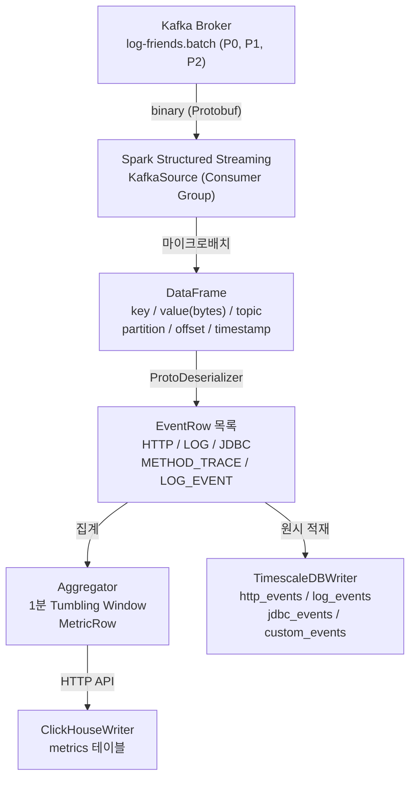
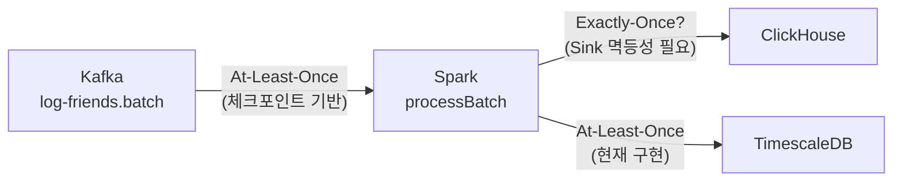
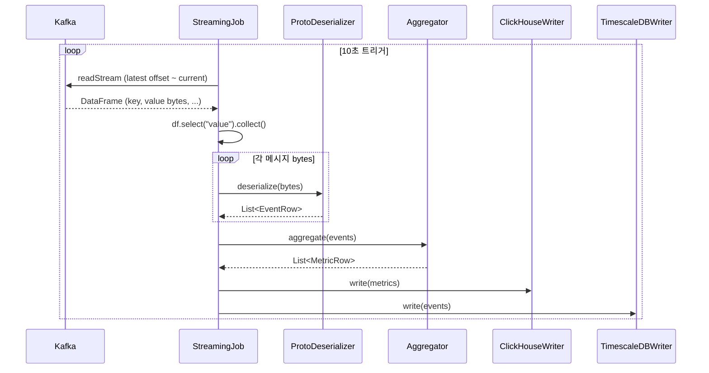

# Part 3: Kafka Source/Sink — Spark Structured Streaming 연동

> 예상 학습 시간: 5~6시간
> log-friends-pipeline — StreamingJob.kt / ProtoDeserializer.kt 기반

---

## 섹션 1: Spark-Kafka 통합 구조

Spark Structured Streaming은 Kafka를 **무한한 테이블**처럼 다룬다. 새로 도착한 메시지가 곧 새로운 행(Row)이고, Spark는 트리거 주기마다 그 증분을 읽어 처리한다. 이 추상화 덕분에 배치 처리 코드와 거의 동일한 DataFrame API로 스트리밍을 작성할 수 있다.

### 전체 데이터 흐름



Kafka에서 읽은 데이터는 항상 `value` 컬럼의 `bytes` 타입으로 시작한다. log-friends에서 이 bytes는 Protobuf로 직렬화된 `AgentMessage`이며, 하나의 메시지 안에 최대 100개의 이벤트가 배치(batch)로 묶여 있다.

### 필요 의존성

```kotlin
// build.gradle.kts
dependencies {
    implementation("org.apache.spark:spark-sql-kafka-0-10_2.13:4.0.2")
    implementation("org.apache.kafka:kafka-clients:3.9.0")
}
```

`spark-sql-kafka-0-10`이 핵심 의존성이다. `0-10`은 Kafka 0.10+ API를 사용한다는 의미이며, Spark 버전 및 Scala 버전(2.13)과 반드시 일치해야 한다.

### Kafka DataFrame 스키마

`readStream().format("kafka").load()` 호출 시 Spark가 자동으로 다음 스키마를 생성한다.

| 컬럼명 | 타입 | 설명 |
|---|---|---|
| `key` | `BinaryType` | Kafka 메시지 키 (nullable) |
| `value` | `BinaryType` | 실제 메시지 페이로드 (Protobuf bytes) |
| `topic` | `StringType` | 메시지가 온 토픽 이름 |
| `partition` | `IntegerType` | 파티션 번호 (0, 1, 2, ...) |
| `offset` | `LongType` | 파티션 내 메시지 오프셋 |
| `timestamp` | `TimestampType` | Kafka 브로커 저장 시각 |
| `timestampType` | `IntegerType` | 0=CreateTime, 1=LogAppendTime |

log-friends 파이프라인에서는 `value` 컬럼만 사용하고 나머지는 무시한다. 오프셋 관리는 Spark의 체크포인트가 전담하므로 `offset` 컬럼을 직접 다룰 필요가 없다.

---

## 섹션 2: readStream 설정

### StreamingJob.kt 실제 설정 분석

`/Users/choeseonghyeon/Desktop/log-friends/log-friends-pipeline/src/main/kotlin/com/logfriends/spark/StreamingJob.kt`

```kotlin
val rawStream = spark.readStream()
    .format("kafka")
    .option("kafka.bootstrap.servers", kafkaBrokers)   // 환경변수 KAFKA_BROKERS, 기본값 "kafka:9092"
    .option("subscribe", kafkaTopic)                   // "log-friends.batch"
    .option("startingOffsets", "latest")               // 신규 메시지만 처리
    .option("failOnDataLoss", "false")                 // 오프셋 손실 시 중단 안 함
    .option("kafka.session.timeout.ms", "30000")       // Consumer 세션 타임아웃 30초
    .load()
```

각 옵션의 의미와 결정 배경을 상세히 살펴본다.

### startingOffsets: "latest" vs "earliest" vs JSON 지정

```kotlin
// 신규 데이터만 읽기 (모니터링 용도에 적합)
.option("startingOffsets", "latest")

// 토픽의 처음부터 모두 읽기 (초기 데이터 적재 시)
.option("startingOffsets", "earliest")

// 파티션별 특정 오프셋 지정 (데이터 복구 시)
.option("startingOffsets", """{"log-friends.batch":{"0":100,"1":200,"2":150}}""")
```

중요한 점은 `startingOffsets`는 **체크포인트가 없을 때만** 적용된다. 일단 체크포인트가 생성되면, 재시작 시 Spark는 항상 체크포인트에 저장된 오프셋부터 이어서 읽는다. 즉 `"latest"`를 지정해도 재시작 시 데이터를 건너뛰지 않는다.

### maxOffsetsPerTrigger: 처리량 제어

```kotlin
// 10초 트리거 기준, 배치당 최대 10,000건 처리
.option("maxOffsetsPerTrigger", 10000)
```

이 설정이 없으면 Spark는 마이크로배치마다 Kafka에 쌓인 모든 메시지를 한 번에 읽으려 한다. 트래픽이 갑자기 폭증하면 배치 처리 시간이 예측 불가능해지고, GC 압박이나 OOM이 발생할 수 있다. `maxOffsetsPerTrigger`로 배치 크기를 제한하면 처리 시간이 일정하게 유지된다.

log-friends의 기본 설정에서는 이 옵션이 없다. Agent 큐 용량(10,000건)과 배치 전송(100건/500ms)을 감안하면, 10초 트리거 기준 최대 약 2,000건이 들어올 수 있다. 운영 환경에서는 `10000`을 권장한다.

### failOnDataLoss: 오프셋 손실 처리

```kotlin
.option("failOnDataLoss", "false")   // log-friends 설정
```

Kafka에서 보존 기간(retention)이 지나 오프셋이 삭제되거나, 파티션이 재배치되어 저장된 오프셋이 유효하지 않을 때 발생하는 상황이다. `"true"`(기본값)이면 파이프라인이 에러로 중단된다. 모니터링 데이터는 일부 손실보다 파이프라인 중단이 더 치명적이므로 `"false"`가 적절하다.

### kafka.* 접두사 옵션

`kafka.`로 시작하는 옵션은 Kafka Consumer 설정으로 그대로 전달된다.

```kotlin
.option("kafka.session.timeout.ms", "30000")  // Consumer가 30초간 heartbeat 없으면 그룹에서 제외
.option("kafka.max.poll.records", "500")       // 한 번 poll에 가져올 최대 레코드 수
.option("kafka.security.protocol", "SASL_SSL") // 보안 설정 (운영 환경)
```

---

## 섹션 3: value 컬럼 파싱 — ProtoDeserializer 분석

### Kafka value는 항상 bytes

Kafka는 메시지를 bytes로 저장한다. Spark DataFrame에서 `value` 컬럼은 `BinaryType`이다. 이 bytes가 무엇인지(JSON, Avro, Protobuf 등)는 Spark가 모른다. 파싱은 전적으로 애플리케이션의 책임이다.

### ProtoDeserializer 전체 분석

`/Users/choeseonghyeon/Desktop/log-friends/log-friends-pipeline/src/main/kotlin/com/logfriends/spark/ProtoDeserializer.kt`

```kotlin
object ProtoDeserializer {

    fun deserialize(bytes: ByteArray): List<EventRow> {
        // 1. Protobuf 파싱 — 실패 시 emptyList 반환 (예외 억제)
        val msg = try {
            AgentMessage.parseFrom(bytes)
        } catch (e: Exception) {
            System.err.println("[Proto] parse error: ${e.message}")
            return emptyList()
        }

        val workerId = msg.workerId
        // 2. batch 필드 존재 여부 확인 (oneof 패턴)
        if (!msg.hasBatch()) return emptyList()

        // 3. batch 안의 이벤트 목록을 EventRow로 변환
        return msg.batch.eventsList.mapNotNull { evt -> toRow(workerId, evt) }
    }
}
```

### AgentMessage 구조 (Protobuf)

하나의 Kafka 메시지(`AgentMessage`)는 다음 구조를 가진다.

```
AgentMessage
  workerId: "worker-abc123"   ← 어떤 Spring 앱 인스턴스에서 왔는지
  batch:
    events[0]: AgentEvent (HTTP)
    events[1]: AgentEvent (LOG)
    events[2]: AgentEvent (JDBC)
    ...
    events[99]: AgentEvent (HTTP)   ← 최대 100건 배치
```

### oneof 분기 처리

`AgentEvent`는 Protobuf의 `oneof`로 정의되어 있어, 각 이벤트는 정확히 하나의 타입만 가진다.

```kotlin
private fun toRow(workerId: String, evt: AgentEvent): EventRow? = when {
    evt.hasLog()         -> /* LOG 이벤트 처리 */
    evt.hasHttp()        -> /* HTTP 이벤트 처리 */
    evt.hasJdbc()        -> /* JDBC 이벤트 처리 */
    evt.hasMethodTrace() -> /* METHOD_TRACE 이벤트 처리 */
    evt.hasLogEvent()    -> /* LOG_EVENT 이벤트 처리 */
    else -> null  // 미래 타입 확장 시 null 반환 → 조용히 무시
}
```

`else -> null`이 중요하다. 새 이벤트 타입이 proto에 추가되어도 파이프라인이 에러로 중단되지 않는다. `mapNotNull`이 `null`을 걸러내기 때문이다.

### StreamingJob에서의 실제 파싱

`processBatch` 함수에서 DataFrame → EventRow 변환이 이루어진다.

```kotlin
private fun processBatch(df: Dataset<Row>, batchId: Long) {
    @Suppress("UNCHECKED_CAST")
    val rows = df.select("value").collect() as Array<Row>
    if (rows.isEmpty()) return

    val events = mutableListOf<EventRow>()
    for (row in rows) {
        val bytes = row.get(0) as? ByteArray ?: continue   // null-safe 캐스팅
        events.addAll(ProtoDeserializer.deserialize(bytes)) // 1 message → N events
    }
    // ...
}
```

`df.select("value").collect()`는 DataFrame을 Driver로 수집한다. 이 방식은 데이터가 Driver 메모리에 모두 올라오기 때문에 소규모 트래픽에 적합하다. 대규모 트래픽에서는 `mapPartitions`를 사용해 Executor에서 직접 파싱하는 것이 낫다.

---

## 섹션 4: 오프셋 관리와 체크포인트

### Kafka 오프셋 관리 방식 비교

| 방식 | 저장 위치 | 특징 |
|---|---|---|
| Kafka consumer_offsets | Kafka 브로커 | 전통적 Consumer 방식 |
| **Spark 체크포인트** | HDFS/로컬/S3 | Structured Streaming 기본 방식 |

Spark Structured Streaming은 Kafka의 `consumer_offsets` 토픽을 사용하지 않는다. 대신 체크포인트 디렉토리에 오프셋을 JSON 형태로 저장한다.

### 체크포인트 디렉토리 구조

log-friends에서 체크포인트 위치는 환경변수 `CHECKPOINT_DIR`로 설정된다. 기본값은 `/opt/spark-jobs/checkpoints/main`이다.

```
/opt/spark-jobs/checkpoints/main/
  offsets/           ← 처리 예정 오프셋 (배치 시작 전 기록)
    0                  → batchId=0일 때 처리한 오프셋 범위
    1
    2
  commits/           ← 처리 완료 오프셋 (배치 종료 후 기록)
    0
    1
  metadata           ← 스트리밍 쿼리 메타데이터
  state/             ← 상태 저장 (집계, 조인 등)
```

### 오프셋 우선순위

```
체크포인트 존재? ─── Yes ──→ 체크포인트 오프셋 사용 (startingOffsets 무시)
      │
      No
      │
      └──────────────────→ startingOffsets 옵션 적용
```

이 메커니즘 덕분에 파이프라인을 재시작해도 처리하지 못한 메시지가 손실되지 않는다. `offsets/`에 기록했지만 `commits/`에 없는 배치는 재처리된다.

### At-Least-Once 보장

체크포인트 기반 오프셋 관리는 At-Least-Once를 보장한다. Exactly-Once를 위해서는 Sink의 멱등성이 추가로 필요하다 (섹션 6 참고).

---

## 섹션 5: writeStream (Sink) — foreachBatch 패턴

### ForeachBatch Sink

Structured Streaming의 가장 유연한 Sink다. 각 마이크로배치를 일반 DataFrame으로 받아 임의의 처리를 수행할 수 있다.

```kotlin
rawStream
    .writeStream()
    .foreachBatch(VoidFunction2 { df: Dataset<Row>, batchId: Long ->
        processBatch(df, batchId)
    })
    .option("checkpointLocation", "$checkpointDir/main")
    .trigger(Trigger.ProcessingTime(10, TimeUnit.SECONDS))
    .start()
```

Kotlin에서는 `VoidFunction2`로 명시적 SAM 변환을 해야 한다. Kotlin의 타입 추론이 `foreachBatch`의 Java 함수형 인터페이스를 자동으로 처리하지 못하는 한계 때문이다.

### ForeachBatch vs Foreach

| 항목 | ForeachBatch | Foreach |
|---|---|---|
| 단위 | 배치 전체를 DataFrame으로 | 행(Row) 하나씩 |
| 재사용 | 동일 배치를 여러 Sink에 쓸 수 있음 | 매 행마다 처리 함수 호출 |
| 성능 | 배치 최적화 가능 (JDBC batch INSERT) | 행별 처리, 오버헤드 큼 |
| 유연성 | 임의 처리 가능 | 단순 변환에 적합 |
| **log-friends 선택** | **ForeachBatch** | — |

log-friends가 ForeachBatch를 선택한 이유는 두 가지다. 첫째, 동일 배치를 ClickHouseWriter와 TimescaleDBWriter 두 곳에 써야 한다. 둘째, JDBC 배치 INSERT(`addBatch()` + `executeBatch()`)로 성능을 최적화해야 한다.

### processBatch 내부의 순차 처리

```kotlin
private fun processBatch(df: Dataset<Row>, batchId: Long) {
    // 1. Kafka bytes → EventRow 목록 변환
    val events = /* ProtoDeserializer 처리 */

    // 2. 집계 → ClickHouse (메트릭)
    val metrics = Aggregator.aggregate(events)
    ClickHouseWriter.write(metrics)     // HTTP API

    // 3. 원시 이벤트 → TimescaleDB
    TimescaleDBWriter.write(events)     // JDBC
}
```

ClickHouseWriter와 TimescaleDBWriter는 **순차 실행**된다. ClickHouseWriter가 실패하면 TimescaleDBWriter는 실행되지 않는다. 두 Sink의 독립성이 필요하다면 try-catch로 각각 감싸야 한다.

실제로 StreamingJob.kt의 `processBatch` 호출부를 보면 전체를 try-catch로 감싸고 있다. ClickHouseWriter 실패 시 해당 배치 전체가 TimescaleDB에도 쓰이지 않는다.

### ClickHouseWriter: HTTP API 방식

`/Users/choeseonghyeon/Desktop/log-friends/log-friends-pipeline/src/main/kotlin/com/logfriends/spark/ClickHouseWriter.kt`

ClickHouse의 HTTP API를 직접 사용해 SQL INSERT를 전송한다.

```kotlin
val sql = """
    INSERT INTO metrics
      (worker_id, window_start, http_count, ...)
    VALUES ('worker-1', toDateTime('2026-04-16 10:00:00'), 42, ...)
""".trimIndent()

// POST http://clickhouse:8123/
```

JDBC 드라이버 없이 순수 HTTP만으로 ClickHouse에 쓸 수 있다는 장점이 있다.

### TimescaleDBWriter: JDBC 배치 방식

PostgreSQL JDBC 드라이버로 TimescaleDB(PostgreSQL 확장)에 배치 INSERT한다.

```kotlin
c.prepareStatement(sql).use { stmt ->
    events.forEach { e ->
        stmt.setString(1, e.workerId)
        // ... 파라미터 바인딩
        stmt.addBatch()
    }
    stmt.executeBatch()  // 전체를 한 번에 전송
}
```

`executeBatch()`는 네트워크 왕복을 최소화해 성능을 크게 개선한다.

---

## 섹션 6: Exactly-Once 보장

### Spark Structured Streaming의 보장 수준



Kafka → Spark 구간은 체크포인트로 At-Least-Once가 보장된다. Spark → Sink 구간은 Sink의 멱등성(idempotency)에 달려 있다.

### ClickHouse: SummingMergeTree로 중복 합산

ClickHouseWriter의 주석에 명시되어 있다.

```kotlin
/**
 * SummingMergeTree 사용 → 동일 (worker_id, window_start)에 대한 여러 INSERT가
 * 자동으로 합산됩니다. 쿼리 시 GROUP BY로 정확한 합계를 얻습니다.
 */
```

SummingMergeTree는 동일 키의 행이 들어오면 숫자 컬럼을 자동으로 합산한다. 단, 합산은 백그라운드 병합(merge) 과정에서 이루어지므로, 쿼리 시에는 항상 `GROUP BY ... SUM(http_count)`와 같이 조회해야 정확한 값을 얻는다.

중복 배치가 INSERT되면 합산이 두 배가 되어버린다. 이를 막으려면 ReplacingMergeTree를 사용하거나, batchId를 키에 포함시켜 중복을 방지해야 한다.

### TimescaleDB: 중복 INSERT 발생 가능성

TimescaleDBWriter는 현재 단순 INSERT만 수행한다. 배치가 재처리되면 동일 이벤트가 두 번 삽입된다.

```kotlin
// 현재 구현: 멱등성 없음
stmt.addBatch()
stmt.executeBatch()
```

이를 해결하는 방법은 두 가지다.

**방법 1: INSERT ON CONFLICT DO NOTHING (이벤트 ID 기반)**
```sql
INSERT INTO http_events (event_id, worker_id, ts, ...)
VALUES (?, ?, ?, ...)
ON CONFLICT (event_id) DO NOTHING
```

**방법 2: batchId 기반 중복 제거**
```kotlin
// batchId를 테이블에 함께 저장하고, 이미 처리된 batchId는 skip
INSERT INTO http_events (batch_id, worker_id, ts, ...)
SELECT ?, ?, ?, ...
WHERE NOT EXISTS (SELECT 1 FROM processed_batches WHERE batch_id = ?)
```

현재 log-friends는 모니터링 목적이므로 약간의 중복은 허용 가능한 트레이드오프로 판단한 것으로 보인다.

---

## 핵심 질문 Q&A

**Q1: maxOffsetsPerTrigger=10000이면 10초 배치에 몇 건까지 처리 가능한가?**

정확히 10,000개의 Kafka 메시지(오프셋)가 처리된다. log-friends에서 하나의 Kafka 메시지는 최대 100개 이벤트를 포함하므로, 최대 10,000 × 100 = 1,000,000개의 이벤트가 처리될 수 있다. 단, 이는 이론적 상한이며 실제로는 Agent 배치 크기(100건)와 전송 주기(500ms)에 따라 10초에 최대 약 2,000개 메시지가 생성된다.

**Q2: startingOffsets="latest"인데 파이프라인이 재시작되면 어떻게 되는가?**

체크포인트가 존재하면 `startingOffsets`는 무시된다. 재시작 시 Spark는 체크포인트의 `offsets/` 디렉토리에서 마지막으로 처리한 오프셋을 읽어 그 다음부터 이어 처리한다. 체크포인트가 없는 최초 실행 시에만 `"latest"`가 적용된다.

**Q3: foreachBatch에서 ClickHouseWriter 실패 시 TimescaleDBWriter는 실행되는가?**

현재 StreamingJob.kt의 구현에서는 실행되지 않는다. `processBatch`가 순차적으로 실행되고, 전체를 try-catch로 감싸기 때문에 ClickHouseWriter 예외 발생 시 TimescaleDBWriter까지 도달하지 못한다. 단, ClickHouseWriter 내부에서 예외를 잡아(`try-catch`) 로그만 출력하고 있어, 실제로는 TimescaleDBWriter가 실행된다. ClickHouseWriter.write() 내부를 보면 `catch (e: Exception) { System.err.println(...) }`으로 예외를 삼킨다.

**Q4: Protobuf 파싱 실패 메시지는 어떻게 처리하는가?**

ProtoDeserializer에서 파싱 실패 시 `emptyList()`를 반환하고 에러 로그만 출력한다. 해당 메시지는 무시(skip)된다. Kafka 오프셋은 정상 커밋되어 다음 배치에서 재처리되지 않는다. 파싱 실패 메시지를 Dead Letter Queue(DLQ)로 보내는 처리는 현재 구현에 없다.

**Q5: Kafka 파티션이 3개이고 Spark executor가 2개면?**

Spark는 Kafka 파티션 하나를 하나의 Task로 처리한다. 파티션 3개 → 3개 Task. Executor가 2개이므로, 첫 번째 배치에서 2개 Task가 동시에 실행되고 나머지 1개는 대기한다. 그러나 log-friends의 `processBatch`는 `df.collect()`로 Driver에서 처리하므로 Executor 병렬성이 Kafka 읽기 단계에서만 의미 있다. 실제 이벤트 파싱과 DB 쓰기는 단일 Driver에서 순차 실행된다.

**Q6: kafka.session.timeout.ms=30000 설정의 의미는?**

Kafka Consumer(Spark 내부)가 브로커에 30초간 heartbeat를 보내지 않으면 Consumer Group에서 제외된다. 제외되면 리밸런싱이 발생해 파티션이 재할당된다. Spark 배치 처리 시간이 길어질 경우 heartbeat가 지연될 수 있으므로, 배치 처리 시간보다 크게 설정해야 한다.

---

## 프로젝트 연결 포인트

### StreamingJob.kt + ProtoDeserializer.kt 전체 흐름



### 새 이벤트 타입 추가 시 수정 포인트

1. `proto/agent.proto` — 새 메시지 타입 정의 및 `AgentEvent` oneof에 추가
2. `EventRow.kt` (Models.kt) — 새 타입의 필드 추가
3. `ProtoDeserializer.kt` — `toRow()` when 절에 새 분기 추가
4. `TimescaleDBWriter.kt` — 새 타입에 해당하는 `write*Events()` 함수 추가
5. `Aggregator.kt` — 집계에 새 타입이 필요하면 MetricRow 및 집계 로직 수정
6. ClickHouse/TimescaleDB 테이블 DDL 추가

---

## 체크리스트

- [ ] `spark-sql-kafka-0-10` 의존성과 Spark/Scala 버전이 일치하는가?
- [ ] `startingOffsets`와 체크포인트의 우선순위를 이해했는가?
- [ ] Kafka DataFrame에서 `value` 컬럼이 `BinaryType`임을 확인했는가?
- [ ] `failOnDataLoss=false` 설정의 트레이드오프를 이해했는가?
- [ ] `maxOffsetsPerTrigger` 없이 운영 시 발생할 수 있는 문제를 설명할 수 있는가?
- [ ] 체크포인트 디렉토리의 `offsets/`와 `commits/`의 차이를 이해했는가?
- [ ] ForeachBatch가 Foreach보다 log-friends에 적합한 이유를 설명할 수 있는가?
- [ ] Kotlin에서 `VoidFunction2`를 사용하는 이유를 이해했는가?
- [ ] ClickHouseWriter가 HTTP API를 사용하는 이유와 장단점을 설명할 수 있는가?
- [ ] TimescaleDBWriter에서 중복 INSERT가 발생할 수 있는 시나리오를 설명할 수 있는가?
- [ ] SummingMergeTree에서 중복 배치 INSERT 시 데이터가 어떻게 되는가?
- [ ] ProtoDeserializer의 파싱 실패 처리 전략이 적절한지 평가할 수 있는가?
- [ ] processBatch에서 collect()를 사용하는 방식의 한계를 이해했는가?
- [ ] Kafka 파티션 수와 Spark Executor 수의 관계를 설명할 수 있는가?

---

## 실습

### 실습 1: Kafka 스트림 읽기 + value 출력

```kotlin
val spark = SparkSession.builder()
    .appName("KafkaBasic")
    .master("local[2]")
    .getOrCreate()

spark.readStream()
    .format("kafka")
    .option("kafka.bootstrap.servers", "localhost:9092")
    .option("subscribe", "log-friends.batch")
    .option("startingOffsets", "latest")
    .load()
    .select(col("topic"), col("partition"), col("offset"), col("timestamp"))
    .writeStream()
    .format("console")
    .option("truncate", "false")
    .start()
    .awaitTermination()
```

Kafka에 메시지가 들어올 때마다 콘솔에 메타데이터가 출력되는지 확인한다.

### 실습 2: value를 hex로 출력해 Protobuf 바이트 확인

```kotlin
import org.apache.spark.sql.functions.*

spark.readStream()
    .format("kafka")
    .option("kafka.bootstrap.servers", "localhost:9092")
    .option("subscribe", "log-friends.batch")
    .load()
    .select(
        col("offset"),
        hex(col("value")).alias("value_hex"),
        length(col("value")).alias("value_bytes")
    )
    .writeStream()
    .format("console")
    .start()
    .awaitTermination()
```

### 실습 3: 간이 ProtoDeserializer 연결

```kotlin
// Driver 측에서 직접 파싱 (소규모 테스트용)
val query = spark.readStream()
    .format("kafka")
    .option("kafka.bootstrap.servers", "localhost:9092")
    .option("subscribe", "log-friends.batch")
    .load()
    .writeStream()
    .foreachBatch(VoidFunction2 { df: Dataset<Row>, batchId: Long ->
        val rows = df.select("value").collect()
        rows.forEach { row ->
            val bytes = row.get(0) as? ByteArray ?: return@forEach
            val events = ProtoDeserializer.deserialize(bytes)
            println("Batch $batchId: ${events.size} events")
            events.take(3).forEach { println("  - ${it.type} @ ${it.workerId}") }
        }
    })
    .option("checkpointLocation", "/tmp/test-checkpoint")
    .trigger(Trigger.ProcessingTime(5, TimeUnit.SECONDS))
    .start()

query.awaitTermination()
```
