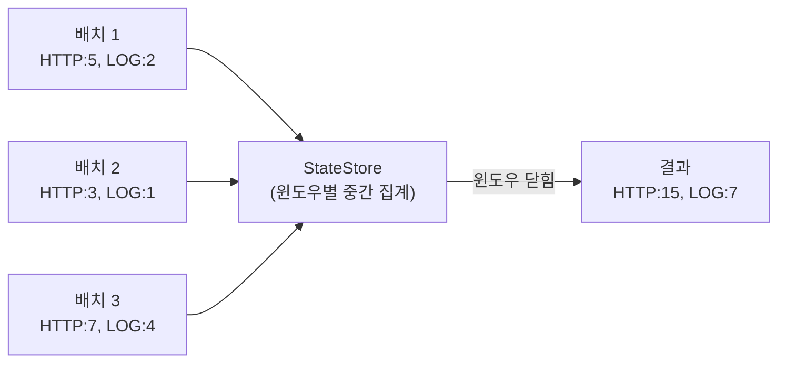
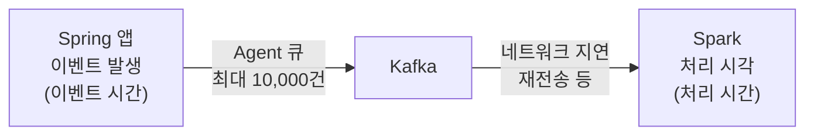
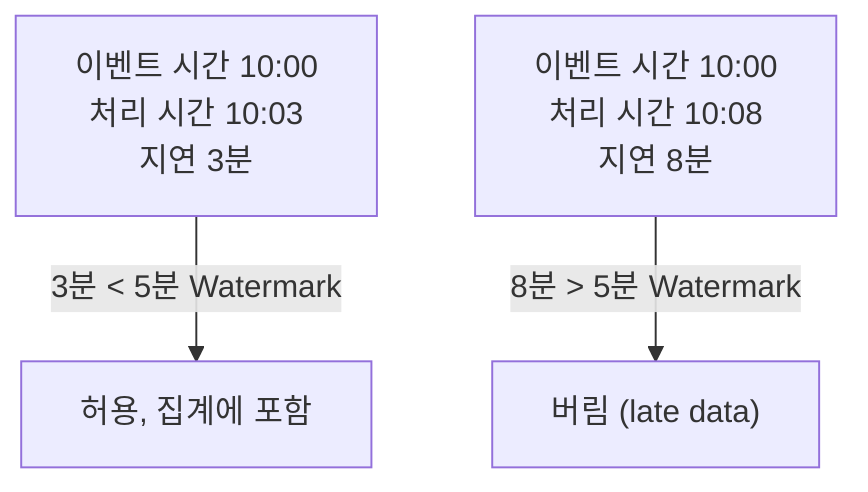
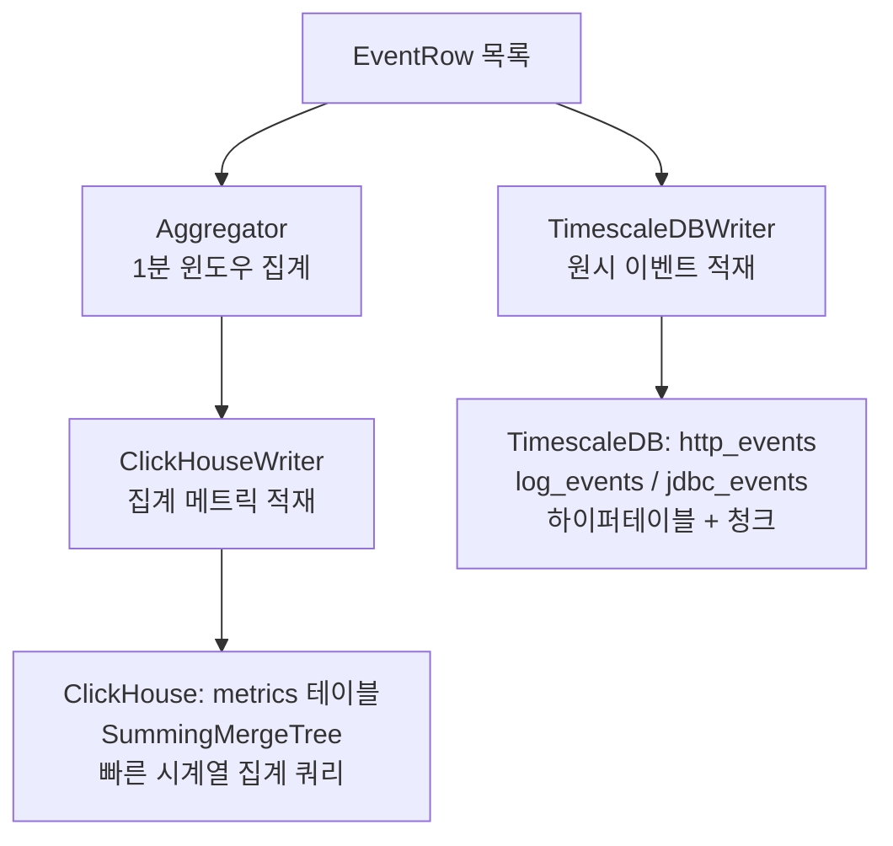
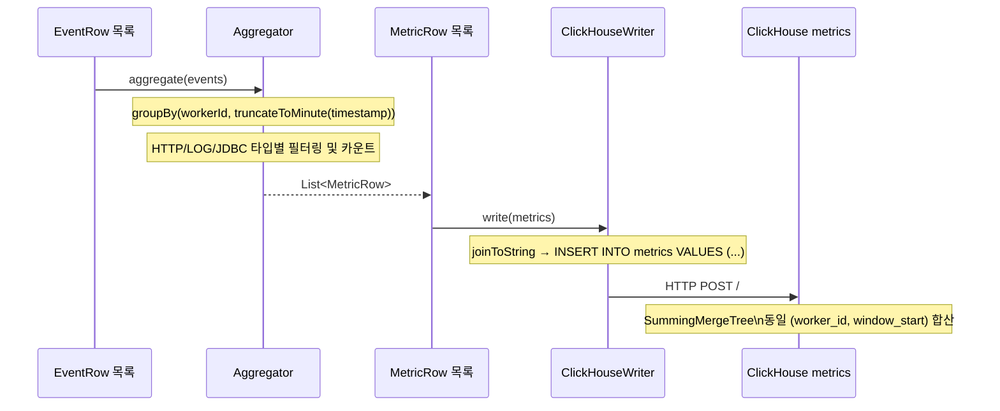

# Part 4: Window & 집계 — Structured Streaming 스트리밍 집계

> 예상 학습 시간: 5~6시간
> log-friends-pipeline — Aggregator.kt / ClickHouseWriter.kt 기반

---

## 섹션 1: 스트리밍 집계 개념

### 배치 집계 vs 스트리밍 집계

배치 처리에서 집계는 단순하다. 전체 데이터가 이미 있고, `GROUP BY`로 한 번에 결과를 낸다. 과거 결과를 기억할 필요가 없다.

```
배치 집계:
  [전체 데이터 파일] → GROUP BY → [결과]
  
  데이터가 고정되어 있음. 재실행하면 동일 결과.
```

스트리밍 집계는 데이터가 계속 흘러들어온다. 1분 단위로 HTTP 요청 수를 세려면, 현재 배치에 들어온 데이터만이 아니라 **같은 1분 구간에 속하는 이전 배치의 데이터도 함께 집계**해야 한다.

```
스트리밍 집계:
  배치 1 (00:00~00:10): HTTP 요청 5건 → 10분 윈도우에 누적
  배치 2 (00:10~00:20): HTTP 요청 3건 → 같은 윈도우에 누적
  ...
  배치 6 (00:50~01:00): HTTP 요청 7건 → 윈도우 닫힘, 결과: 37건
```

이전 배치의 부분 합계를 어딘가에 기억하고 있어야 한다. 이것이 **상태(State)**다.

### 상태(State)가 필요한 이유

상태 없는 스트리밍 집계는 각 배치를 독립적으로 처리한다. 배치 안의 데이터만 집계하므로 결과가 불완전하다.

상태 있는 스트리밍 집계는 여러 배치에 걸쳐 중간 결과를 유지한다.



### StateStore: 인메모리 + 체크포인트 지속성

Spark의 StateStore는 집계 상태를 메모리에 유지하면서, 체크포인트 주기마다 디스크(체크포인트 경로)에 저장한다.

```
메모리 (빠른 접근):
  (workerId="app1", window="2026-04-16 10:00") → http_count=42, log_error=3, ...
  (workerId="app2", window="2026-04-16 10:00") → http_count=17, log_error=0, ...

체크포인트 (내구성):
  /opt/spark-jobs/checkpoints/main/state/
    0/          ← 파티션 0의 상태
    1/          ← 파티션 1의 상태
```

파이프라인이 재시작되면 StateStore를 체크포인트에서 복구해 집계를 이어간다.

그러나 log-friends의 Aggregator.kt는 Spark의 StateStore를 사용하지 않는다. 다음 섹션에서 자세히 살펴본다.

---

## 섹션 2: Window 종류

스트리밍 집계에서 "어떤 시간 범위를 하나의 그룹으로 볼 것인가"를 정의하는 것이 Window다.

### Tumbling Window (log-friends 사용)

겹치지 않는 고정 크기의 구간. 각 이벤트는 정확히 하나의 윈도우에 속한다.

```
시간축: ──────────────────────────────────────────────
         0:00      1:00      2:00      3:00      4:00
         │         │         │         │         │
         [────────][────────][────────][────────]
           batch1    batch2    batch3    batch4
```

**사용 사례**: 분당 요청 수, 시간당 에러 수처럼 정확한 시간 구간별 통계가 필요할 때.

**Spark API**:
```kotlin
window(col("timestamp"), "1 minute")        // 1분 Tumbling Window
window(col("timestamp"), "1 hour")          // 1시간 Tumbling Window
```

### Sliding Window

크기보다 작은 슬라이딩 간격으로 이동하는 윈도우. 이벤트가 여러 윈도우에 중복으로 속한다.

```
시간축: ──────────────────────────────────────────────
         0:00    0:30    1:00    1:30    2:00
         │       │       │       │       │
         [─────────────]                    (윈도우 1: 0:00~1:00)
                 [─────────────]            (윈도우 2: 0:30~1:30)
                         [─────────────]   (윈도우 3: 1:00~2:00)
```

**사용 사례**: 이동 평균, 최근 N분간 에러율처럼 부드러운 추세 분석이 필요할 때.

**Spark API**:
```kotlin
window(col("timestamp"), "1 minute", "30 seconds") // 1분 윈도우, 30초 간격 슬라이딩
```

### Session Window

이벤트 간 gap이 일정 시간 이상 벌어지면 세션이 종료된다.

```
시간축: ──────────────────────────────────────────────
         이벤트   이벤트   이벤트        이벤트   이벤트
         ●────●────●                    ●────●
         [─────────────────]   gap      [────────]
               세션 1           > 5분     세션 2
```

**사용 사례**: 사용자 행동 분석, API 호출 세션, 장애 클러스터링.

**Spark API** (Spark 3.2+):
```kotlin
session_window(col("timestamp"), "5 minutes") // gap 5분이면 세션 종료
```

### 각 Window 타입별 비교

| 항목 | Tumbling | Sliding | Session |
|---|---|---|---|
| 이벤트 소속 | 1개 윈도우 | 여러 윈도우 | 1개 세션 |
| 크기 | 고정 | 고정 | 동적 |
| 상태 복잡도 | 낮음 | 중간 | 높음 |
| log-friends | **사용** | — | — |
| 메모리 사용 | 낮음 | 윈도우 수 × 크기 | 이벤트 흐름에 따라 변동 |

---

## 섹션 3: Watermark와 늦은 데이터

### 이벤트 시간 vs 처리 시간



- **이벤트 시간(Event Time)**: 이벤트가 실제 발생한 시각. `EventRow.timestamp`에 기록된 시각.
- **처리 시간(Processing Time)**: Spark가 해당 이벤트를 처리한 시각. 현재 시각.

이 두 시각 사이에는 항상 지연이 존재한다. Agent 큐에 10,000건이 쌓여 있다면 마지막 이벤트는 최대 수십 초 늦게 처리될 수 있다.

### Watermark가 필요한 이유

이벤트 시간 기반으로 1분 윈도우 집계를 한다고 가정하자. 윈도우 [10:00, 10:01)이 닫혀야 하는 시점은 언제인가? Spark는 10:01이 지난 이벤트가 들어오면 이 윈도우를 닫고 싶다. 그런데 5분 늦게 도착하는 이벤트가 있다면 10:06까지 기다려야 하는가?

Watermark는 "이 시간보다 늦은 이벤트는 허용하지 않겠다"는 선언이다.

```kotlin
df.withWatermark("timestamp", "5 minutes")  // 5분 이상 늦은 이벤트는 버림
  .groupBy(window(col("timestamp"), "1 minute"))
  .count()
```



현재 Watermark는 `max(이벤트 시간) - 허용 지연`으로 계산된다. Watermark 이전 시간의 윈도우는 닫히고, 늦은 이벤트는 버려진다.

### Aggregator.kt는 이벤트 시간? 처리 시간?

`/Users/choeseonghyeon/Desktop/log-friends/log-friends-pipeline/src/main/kotlin/com/logfriends/spark/Aggregator.kt`

```kotlin
fun aggregate(events: List<EventRow>): List<MetricRow> {
    data class Key(val workerId: String, val window: String)

    return events
        .groupBy { e -> Key(e.workerId, truncateToMinute(e.timestamp)) }
```

`e.timestamp`는 `EventRow`의 타임스탬프다. ProtoDeserializer를 보면 이 값은 Protobuf 메시지에서 직접 온다.

```kotlin
// ProtoDeserializer.kt — HTTP 이벤트의 경우
EventRow(
    timestamp = e.timestamp,  // ← Spring 앱에서 기록한 이벤트 발생 시각
    ...
)
```

즉, **이벤트 시간 기반**이다. Spring 앱에서 HTTP 요청이 처리된 실제 시각을 기준으로 1분 윈도우를 계산한다.

그러나 Aggregator는 Spark의 `window()` 함수나 StateStore를 사용하지 않는다. 대신 Kotlin의 `groupBy`로 직접 집계한다. Watermark 개념도 없다. 이는 스트리밍 상태 관리를 Spark에 위임하지 않고 애플리케이션 레벨에서 처리하는 설계 선택이다.

장점은 단순함과 제어 가능성이다. 단점은 배치 경계에 걸친 이벤트(10초 배치에서 1분 경계를 넘나드는 이벤트)가 여러 MetricRow로 분리된다는 점이다. 이는 SummingMergeTree에서 자동으로 합산되므로 실제로는 문제가 되지 않는다.

---

## 섹션 4: log-friends Aggregator 상세 분석

### Aggregator.kt 전체 코드 분석

`/Users/choeseonghyeon/Desktop/log-friends/log-friends-pipeline/src/main/kotlin/com/logfriends/spark/Aggregator.kt`

```kotlin
object Aggregator {

    private val FMT = DateTimeFormatter.ofPattern("yyyy-MM-dd HH:mm:ss").withZone(ZoneOffset.UTC)

    fun aggregate(events: List<EventRow>): List<MetricRow> {
        // Key = (workerId, 1분 window 시작 시각)
        data class Key(val workerId: String, val window: String)

        return events
            .groupBy { e -> Key(e.workerId, truncateToMinute(e.timestamp)) }
            .map { (key, evts) ->
                val httpEvts = evts.filter { it.type == "HTTP" }
                val logEvts  = evts.filter { it.type == "LOG"  }
                val jdbcEvts = evts.filter { it.type == "JDBC" }

                MetricRow(
                    workerId          = key.workerId,
                    windowStart       = key.window,
                    httpCount         = httpEvts.size.toLong(),
                    httpErrCount      = httpEvts.count { (it.statusCode ?: 0) >= 400 }.toLong(),
                    httpDurationTotal = httpEvts.sumOf { it.durationMs ?: 0L },
                    logError          = logEvts.count { it.level == "ERROR" }.toLong(),
                    logWarn           = logEvts.count { it.level == "WARN"  }.toLong(),
                    logInfo           = logEvts.count { it.level == "INFO"  }.toLong(),
                    jdbcCount         = jdbcEvts.size.toLong(),
                    jdbcDurationTotal = jdbcEvts.sumOf { it.durationMs ?: 0L },
                )
            }
    }

    fun truncateToMinute(ts: String): String = try {
        FMT.format(Instant.parse(ts).truncatedTo(ChronoUnit.MINUTES))
    } catch (_: Exception) {
        FMT.format(Instant.now().truncatedTo(ChronoUnit.MINUTES))  // 파싱 실패 시 현재 시각
    }
}
```

### 집계 로직 단계별 분석

**1단계: Key 정의**

```kotlin
data class Key(val workerId: String, val window: String)
```

집계의 기준은 `workerId`(어떤 Spring 앱 인스턴스)와 `window`(1분 단위 시각)의 조합이다. 동일 앱의 동일 1분 구간 이벤트가 하나의 MetricRow가 된다.

**2단계: truncateToMinute로 윈도우 계산**

```kotlin
fun truncateToMinute(ts: String): String = try {
    FMT.format(Instant.parse(ts).truncatedTo(ChronoUnit.MINUTES))
} catch (_: Exception) {
    FMT.format(Instant.now().truncatedTo(ChronoUnit.MINUTES))
}
```

`Instant.parse("2026-04-16T10:03:45.123Z").truncatedTo(ChronoUnit.MINUTES)`는 `2026-04-16T10:03:00Z`를 반환한다. 초/밀리초를 버리고 분 단위로 내림한다.

타임스탬프 파싱에 실패하면 `Instant.now()`를 사용한다. 이 경우 이벤트가 잘못된 윈도우에 집계될 수 있다.

**3단계: 타입별 필터링과 집계**

```kotlin
val httpEvts = evts.filter { it.type == "HTTP" }

httpCount         = httpEvts.size.toLong()              // 전체 HTTP 요청 수
httpErrCount      = httpEvts.count { (it.statusCode ?: 0) >= 400 }.toLong()  // 4xx/5xx 에러
httpDurationTotal = httpEvts.sumOf { it.durationMs ?: 0L }  // 총 처리 시간 (ms)
```

평균 응답 시간은 저장하지 않는다. 대신 총합(`httpDurationTotal`)을 저장해, 쿼리 시 `httpDurationTotal / httpCount`로 계산한다. 이는 SummingMergeTree에서 부분 합계를 누적할 때 평균을 올바르게 계산하기 위한 설계다.

### MetricRow 스키마와 ClickHouse metrics 테이블 매핑

```kotlin
data class MetricRow(
    val workerId: String,
    val windowStart: String,          // "2026-04-16 10:03:00"  ← ClickHouse toDateTime()
    val httpCount: Long          = 0,
    val httpErrCount: Long       = 0,
    val httpDurationTotal: Long  = 0, // ms 합산
    val logError: Long           = 0,
    val logWarn: Long            = 0,
    val logInfo: Long            = 0,
    val jdbcCount: Long          = 0,
    val jdbcDurationTotal: Long  = 0,
)
```

ClickHouse INSERT 쿼리:

```sql
INSERT INTO metrics
  (worker_id, window_start,
   http_count, http_err_count, http_duration_total,
   log_error, log_warn, log_info,
   jdbc_count, jdbc_duration_total)
VALUES
  ('app-1', toDateTime('2026-04-16 10:03:00'), 42, 3, 15234, 1, 5, 36, 8, 421)
```

### Spark window() 함수와의 비교

만약 Aggregator를 Spark SQL의 `window()` 함수로 구현한다면 다음과 같다.

```kotlin
// Spark SQL 방식 (현재 log-friends는 이 방식을 사용하지 않음)
eventsDF
    .withWatermark("timestamp", "10 minutes")
    .groupBy(
        col("workerId"),
        window(col("timestamp"), "1 minute")
    )
    .agg(
        count(when(col("type").equalTo("HTTP"), 1)).alias("http_count"),
        count(when(col("type").equalTo("HTTP").and(col("statusCode").geq(400)), 1)).alias("http_err_count"),
        sum(when(col("type").equalTo("HTTP"), col("durationMs")).otherwise(0)).alias("http_duration_total"),
        count(when(col("type").equalTo("LOG").and(col("level").equalTo("ERROR")), 1)).alias("log_error"),
        count(when(col("type").equalTo("LOG").and(col("level").equalTo("WARN")), 1)).alias("log_warn"),
        count(when(col("type").equalTo("LOG").and(col("level").equalTo("INFO")), 1)).alias("log_info"),
        count(when(col("type").equalTo("JDBC"), 1)).alias("jdbc_count"),
        sum(when(col("type").equalTo("JDBC"), col("durationMs")).otherwise(0)).alias("jdbc_duration_total")
    )
```

log-friends의 Kotlin 직접 집계 방식은 Spark StateStore를 우회한다. 이는 코드 단순성을 높이지만, Watermark 기반 늦은 데이터 처리와 분산 상태 관리의 이점을 포기하는 것이다. 소규모 트래픽에서는 합리적인 선택이다.

---

## 섹션 5: 집계 결과 저장 전략

### ClickHouse vs TimescaleDB 역할 분리



| 항목 | ClickHouse (metrics) | TimescaleDB (raw events) |
|---|---|---|
| 데이터 | 1분 집계 메트릭 | 원시 이벤트 전체 |
| 적재 방식 | HTTP API | JDBC |
| 테이블 엔진 | SummingMergeTree | 하이퍼테이블 (TimescaleDB) |
| 용도 | 대시보드, 알림 | 상세 분석, 디버깅 |
| 보존 기간 | 수개월~수년 | 수일~수주 (청크 압축/삭제) |
| 쿼리 패턴 | 시간별 집계, 트렌드 | 특정 이벤트 조회, 로그 검색 |

### ClickHouse: SummingMergeTree 엔진

SummingMergeTree는 동일 기본 키(Primary Key)의 행을 백그라운드에서 병합(merge)할 때 숫자 컬럼을 자동으로 합산한다.

```sql
CREATE TABLE metrics (
    worker_id        String,
    window_start     DateTime,
    http_count       UInt64,
    http_err_count   UInt64,
    http_duration_total UInt64,
    log_error        UInt64,
    log_warn         UInt64,
    log_info         UInt64,
    jdbc_count       UInt64,
    jdbc_duration_total UInt64
) ENGINE = SummingMergeTree()
ORDER BY (worker_id, window_start);
```

배치 재처리로 동일 `(worker_id, window_start)`에 대해 두 번 INSERT되면, 병합 전까지는 두 행이 공존한다. 이를 방지하려면 다음과 같이 쿼리한다.

```sql
-- 항상 GROUP BY SUM을 사용해야 정확한 집계를 얻는다
SELECT
    worker_id,
    window_start,
    SUM(http_count) AS http_count,
    SUM(http_err_count) AS http_err_count,
    SUM(http_duration_total) / NULLIF(SUM(http_count), 0) AS avg_duration_ms
FROM metrics
WHERE window_start >= now() - INTERVAL 1 HOUR
GROUP BY worker_id, window_start
ORDER BY window_start;
```

### TimescaleDB: 하이퍼테이블과 청크

TimescaleDB는 PostgreSQL 확장으로, 시계열 데이터를 시간 기준 청크(chunk)로 자동 분할한다.

```sql
-- http_events는 하이퍼테이블로 생성됨
SELECT create_hypertable('http_events', 'ts');

-- 자동으로 시간 구간별 청크 생성
-- chunk_0: ts 2026-04-01 ~ 2026-04-08
-- chunk_1: ts 2026-04-08 ~ 2026-04-15
-- ...
```

청크 단위로 압축, 삭제가 가능해 오래된 데이터를 효율적으로 관리할 수 있다.

```sql
-- 7일 이전 데이터 자동 삭제 정책
SELECT add_retention_policy('http_events', INTERVAL '7 days');
```

### TimescaleDBWriter의 ts 컬럼 주의사항

```kotlin
// TimescaleDBWriter.kt — 현재 구현의 문제점
stmt.setTimestamp(2, Timestamp.from(Instant.now()))  // ← 이벤트 시간이 아닌 처리 시간!
```

TimescaleDBWriter는 `Instant.now()`를 ts로 사용한다. 이벤트 발생 시각(`e.timestamp`)이 아니라 Spark가 처리한 시각이 저장된다. 분석 목적으로 정확한 이벤트 발생 시각이 필요하다면 `e.timestamp`를 파싱해 사용해야 한다.

```kotlin
// 개선된 방식
stmt.setTimestamp(2, Timestamp.from(
    try { Instant.parse(e.timestamp) }
    catch (_: Exception) { Instant.now() }
))
```

---

## 섹션 6: 성능 최적화

### 파티션 수 조정

Spark의 셔플(shuffle) 파티션 수는 `spark.sql.shuffle.partitions`로 제어한다. 기본값은 200인데, 소규모 스트리밍에서는 불필요하게 많다.

```kotlin
SparkSession.builder()
    .config("spark.sql.shuffle.partitions", "8")  // Kafka 파티션 수의 2~3배
    .getOrCreate()
```

log-friends는 Spark SQL `window()` 함수를 사용하지 않으므로 셔플이 발생하지 않는다. `processBatch` 내부에서 `df.collect()`로 Driver에 데이터를 모아 Kotlin으로 처리하기 때문이다.

### 상태 저장 크기 제한

Spark의 상태 기반 집계(`window()` 사용 시)에서는 상태가 계속 커질 수 있다. Watermark가 없으면 모든 윈도우의 상태가 영원히 유지된다.

```kotlin
// Watermark 없는 집계 — 상태가 무한 증가 (위험)
df.groupBy(window(col("timestamp"), "1 minute")).count()

// Watermark 있는 집계 — 닫힌 윈도우의 상태가 정리됨 (안전)
df.withWatermark("timestamp", "10 minutes")
  .groupBy(window(col("timestamp"), "1 minute"))
  .count()
```

log-friends는 Kotlin 직접 집계 방식이므로 이 문제가 없다. 각 배치의 데이터가 독립적으로 처리되고 상태가 유지되지 않는다.

### RocksDB StateStore

Spark 3.2+에서는 기본 인메모리 StateStore 대신 RocksDB를 StateStore로 사용할 수 있다.

```kotlin
SparkSession.builder()
    .config("spark.sql.streaming.stateStore.providerClass",
            "org.apache.spark.sql.execution.streaming.state.RocksDBStateStoreProvider")
    .getOrCreate()
```

RocksDB StateStore는 상태 데이터를 디스크에 오프로드해 GC 압박을 줄이고 대용량 상태를 처리할 수 있다. 집계 키의 카디널리티(workerId × 시간 구간)가 크다면 도입을 고려한다.

### 10초 배치 처리 시간 측정

처리 시간을 직접 측정해 병목을 찾을 수 있다.

```kotlin
private fun processBatch(df: Dataset<Row>, batchId: Long) {
    val t0 = System.currentTimeMillis()
    val rows = df.select("value").collect()

    val t1 = System.currentTimeMillis()
    // ... ProtoDeserializer, Aggregator, Writer 처리

    val t2 = System.currentTimeMillis()
    ClickHouseWriter.write(metrics)

    val t3 = System.currentTimeMillis()
    TimescaleDBWriter.write(events)

    val t4 = System.currentTimeMillis()
    println("""
        [Spark] Batch $batchId timing:
          collect: ${t1-t0}ms
          parse+aggregate: ${t2-t1}ms
          clickhouse: ${t3-t2}ms
          timescale: ${t4-t3}ms
          total: ${t4-t0}ms (trigger: 10000ms)
    """.trimIndent())
}
```

처리 시간이 트리거 주기(10초)를 초과하면 배치가 지연 누적된다. Spark UI (`http://localhost:4040`)에서 배치 처리 시간 추이를 확인할 수 있다.

### collect() vs mapPartitions 성능 비교

현재 log-friends는 `df.collect()`로 Driver에서 처리한다.

```kotlin
// 현재 방식: Driver 처리
val rows = df.select("value").collect() as Array<Row>
// 모든 데이터가 Driver 메모리로 집중 → 소규모 트래픽에 적합
```

트래픽이 증가하면 Executor에서 파싱하는 방식으로 전환이 필요하다.

```kotlin
// 확장 방식: Executor 분산 처리
import org.apache.spark.sql.Encoders

val eventsDS = df.select("value")
    .as(Encoders.BINARY())
    .mapPartitions({ iter ->
        iter.flatMap { bytes ->
            ProtoDeserializer.deserialize(bytes).iterator()
        }
    }, Encoders.bean(EventRow::class.java))
```

단, Executor에서 ProtoDeserializer를 사용하려면 관련 의존성이 Executor 클래스패스에 있어야 한다.

---

## 핵심 질문 Q&A

**Q1: Tumbling Window 1분에서 Watermark 없으면 어떤 문제가 생기는가?**

Spark의 `window()` 함수를 사용할 경우, Watermark 없이는 모든 과거 윈도우의 상태가 메모리에 영원히 유지된다. 시간이 지날수록 StateStore 크기가 증가해 결국 OOM(Out of Memory)이 발생한다. 또한 닫혀야 할 윈도우가 닫히지 않아 결과가 언제 출력되는지 보장되지 않는다. `withWatermark`를 통해 윈도우 닫힘 시점을 명확히 정의해야 한다. log-friends는 `window()` 함수 대신 Kotlin `groupBy`를 사용하므로 이 문제가 없다.

**Q2: Aggregator.kt에서 window() 함수의 기준 시간은 이벤트 시간인가 처리 시간인가?**

Aggregator.kt는 Spark의 `window()` 함수를 사용하지 않는다. Kotlin의 `groupBy`로 직접 집계한다. 기준 시간은 `e.timestamp`로, ProtoDeserializer가 Protobuf 메시지에서 추출한 값이다. 이 값은 Spring 앱에서 이벤트 발생 시 기록된 **이벤트 시간**이다. 단, TimescaleDBWriter에서 `Instant.now()`를 사용하는 것과 달리 Aggregator는 올바르게 이벤트 시간을 사용하고 있다.

**Q3: MetricRow의 windowStart가 1분 단위로 정확히 끊기지 않는 이유는?**

`truncateToMinute`는 초 이하를 버림한다. "2026-04-16T10:03:45.123Z" → "2026-04-16 10:03:00". 이 함수 자체는 정확히 1분 단위로 끊는다. 정확히 끊기지 않는 상황은 타임스탬프 파싱이 실패할 때다. 파싱 실패 시 `Instant.now()`를 사용하는데, 이 경우 처리 시간(현재 시각)이 기준이 되어 이벤트가 의도한 윈도우가 아닌 처리 시각의 윈도우에 집계된다.

**Q4: ClickHouse SummingMergeTree는 중복을 언제 제거하는가?**

SummingMergeTree는 중복을 제거하지 않는다. 대신 동일 기본 키의 행을 **합산**한다. 병합 작업은 ClickHouse 백그라운드에서 비동기로 이루어진다. 따라서 INSERT 직후에는 여러 행이 공존할 수 있고, 쿼리 시 항상 `GROUP BY ... SUM()`으로 집계해야 정확한 값을 얻는다. 중복 제거(덮어쓰기)가 필요하면 ReplacingMergeTree 엔진을 사용한다.

**Q5: 상태(State) 크기가 너무 커지면 어떻게 처리하는가?**

세 가지 접근법이 있다. 첫째, Watermark를 적절히 설정해 닫힌 윈도우의 상태를 정리한다. 둘째, `spark.sql.streaming.stateStore.maintenanceInterval`로 상태 정리 주기를 조정한다. 셋째, RocksDB StateStore로 전환해 상태를 디스크에 오프로드한다. log-friends는 Kotlin 직접 집계 방식이라 Spark 상태 관리가 적용되지 않으며, 배치 처리 후 상태가 GC된다. 메모리 문제가 발생하면 `maxOffsetsPerTrigger`로 배치 크기를 줄이는 것이 더 효과적이다.

**Q6: 하나의 10초 배치에서 1분 윈도우가 여러 개 생성될 수 있는가?**

그렇다. 10초 배치 안에 다른 1분 구간의 이벤트가 섞일 수 있다. 예를 들어 Agent 큐에 10분치 데이터가 쌓여 있다가 한 번에 전송되면, 하나의 배치에서 10개의 1분 윈도우에 해당하는 이벤트가 들어올 수 있다. Aggregator는 이를 각각의 Key로 분리해 10개의 MetricRow를 생성한다. SummingMergeTree에서 각 windowStart별로 합산된다.

---

## 프로젝트 연결 포인트

### Aggregator.kt와 MetricRow → ClickHouse metrics 테이블 전체 흐름



### 새 집계 지표 추가 시 수정 포인트

1. `Models.kt` — `MetricRow`에 새 필드 추가 (예: `methodTraceCount`)
2. `Aggregator.kt` — `aggregate()` 내 METHOD_TRACE 이벤트 집계 로직 추가
3. `ClickHouseWriter.kt` — INSERT SQL에 새 컬럼 추가
4. ClickHouse DDL — `ALTER TABLE metrics ADD COLUMN method_trace_count UInt64 DEFAULT 0`

### ClickHouseWriter HTTP INSERT 쿼리 구조

```kotlin
// ClickHouseWriter.kt의 실제 SQL 생성
val values = metrics.joinToString(",\n") { m ->
    "('${esc(m.workerId)}', " +
    "toDateTime('${m.windowStart}'), " +
    "${m.httpCount}, ${m.httpErrCount}, ${m.httpDurationTotal}, " +
    "${m.logError}, ${m.logWarn}, ${m.logInfo}, " +
    "${m.jdbcCount}, ${m.jdbcDurationTotal})"
}

val sql = """
    INSERT INTO metrics
      (worker_id, window_start,
       http_count, http_err_count, http_duration_total,
       log_error, log_warn, log_info,
       jdbc_count, jdbc_duration_total)
    VALUES $values
""".trimIndent()
```

단일 HTTP POST로 여러 행을 한 번에 INSERT한다. ClickHouse는 이 방식으로 초당 수백만 행 삽입이 가능하다.

---

## 체크리스트

- [ ] 배치 집계와 스트리밍 집계의 차이 — 상태가 필요한 이유를 설명할 수 있는가?
- [ ] Tumbling / Sliding / Session Window의 차이와 각 사용 사례를 설명할 수 있는가?
- [ ] 이벤트 시간과 처리 시간의 차이를 이해했는가?
- [ ] Watermark의 역할과 없을 때 발생하는 문제를 설명할 수 있는가?
- [ ] Aggregator.kt가 Spark window() 함수 대신 Kotlin groupBy를 사용하는 이유는?
- [ ] truncateToMinute 실패 시 데이터가 어떻게 처리되는지 파악했는가?
- [ ] MetricRow에서 평균 응답 시간 대신 총합을 저장하는 이유를 설명할 수 있는가?
- [ ] SummingMergeTree에서 집계 결과를 정확히 조회하는 쿼리를 작성할 수 있는가?
- [ ] TimescaleDBWriter의 ts 컬럼이 이벤트 시간이 아닌 처리 시간인 문제를 인식했는가?
- [ ] ClickHouseWriter의 HTTP API 방식이 JDBC보다 ClickHouse에 적합한 이유는?
- [ ] collect() 방식의 한계와 mapPartitions로의 전환 조건을 설명할 수 있는가?
- [ ] RocksDB StateStore가 필요한 상황을 설명할 수 있는가?
- [ ] 새 집계 지표(예: METHOD_TRACE 카운트)를 추가하려면 어떤 파일을 수정해야 하는가?
- [ ] 하나의 배치에서 여러 1분 윈도우가 생성될 수 있는 시나리오를 설명할 수 있는가?

---

## 실습

### 실습 1: 1분 Tumbling Window 집계 (Spark SQL 방식)

```kotlin
import org.apache.spark.sql.functions.*

val spark = SparkSession.builder()
    .appName("WindowAgg")
    .master("local[2]")
    .config("spark.sql.shuffle.partitions", "4")
    .getOrCreate()

// 테스트 데이터 생성
val data = listOf(
    Tuple3("HTTP", "2026-04-16T10:00:15Z", 200),
    Tuple3("HTTP", "2026-04-16T10:00:45Z", 404),
    Tuple3("HTTP", "2026-04-16T10:01:10Z", 200),
    Tuple3("LOG",  "2026-04-16T10:00:30Z", 0),
)

val schema = StructType(listOf(
    StructField("type", StringType(), false),
    StructField("ts", StringType(), false),
    StructField("status", IntegerType(), false),
))

val df = spark.createDataFrame(data, schema)
    .withColumn("ts", col("ts").cast("timestamp"))

// 1분 Tumbling Window 집계
df.groupBy(
        window(col("ts"), "1 minute"),
        col("type")
    )
    .count()
    .orderBy("window")
    .show(truncate = false)
```

### 실습 2: Aggregator.kt 동작 검증

```kotlin
// Aggregator 단위 테스트 재현
val events = listOf(
    EventRow("worker-1", "HTTP", "2026-04-16T10:03:15Z", statusCode = 200, durationMs = 45L),
    EventRow("worker-1", "HTTP", "2026-04-16T10:03:45Z", statusCode = 500, durationMs = 3200L),
    EventRow("worker-1", "HTTP", "2026-04-16T10:04:10Z", statusCode = 200, durationMs = 67L),
    EventRow("worker-1", "LOG",  "2026-04-16T10:03:30Z", level = "ERROR"),
    EventRow("worker-1", "LOG",  "2026-04-16T10:03:55Z", level = "INFO"),
)

val metrics = Aggregator.aggregate(events)

// 예상 결과:
// MetricRow(workerId="worker-1", windowStart="2026-04-16 10:03:00",
//           httpCount=2, httpErrCount=1, httpDurationTotal=3245, logError=1, logInfo=1)
// MetricRow(workerId="worker-1", windowStart="2026-04-16 10:04:00",
//           httpCount=1, httpErrCount=0, httpDurationTotal=67)

metrics.forEach { println(it) }
assert(metrics.size == 2) { "윈도우가 2개여야 함" }
assert(metrics[0].httpCount == 2L) { "첫 번째 윈도우 HTTP 2건" }
assert(metrics[0].httpErrCount == 1L) { "첫 번째 윈도우 에러 1건" }
```

### 실습 3: Watermark가 있는 집계 vs 없는 집계 비교

```kotlin
// Watermark 없는 집계 — 운영 중 StateStore 크기 변화 관찰
val withoutWatermark = df.groupBy(window(col("ts"), "1 minute")).count()
    .writeStream
    .outputMode("complete")  // complete 모드: 전체 결과 출력
    .format("console")
    .start()

// Watermark 있는 집계 — 닫힌 윈도우만 출력 (append 모드)
val withWatermark = df
    .withWatermark("ts", "5 minutes")
    .groupBy(window(col("ts"), "1 minute"))
    .count()
    .writeStream
    .outputMode("append")   // append 모드: 확정된 윈도우만 출력
    .format("console")
    .start()
```

`complete` 모드에서는 Watermark 없이도 동작하지만 상태가 계속 커진다. `append` 모드는 Watermark가 있어야 사용 가능하며, 확정된 윈도우만 결과에 추가된다.
