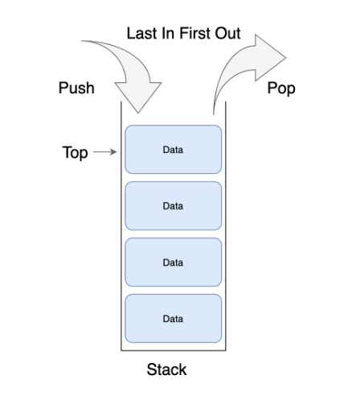
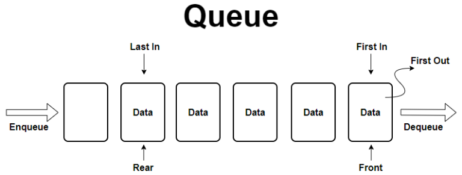

# 스택과 큐 (Stack & Queue)

## 1. 스택 (Stack)

### 1.1 특징
- **후입선출 (LIFO: Last In First Out)** 방식의 자료구조입니다.
- 나중에 들어온 데이터가 가장 먼저 나갑니다.
- **깊이 우선 탐색(DFS)**, **백트래킹**, 재귀 알고리즘 구현 등에 사용됩니다.

### 1.2 주요 연산
- `push`: 데이터를 삽입 (Top에 추가)
- `pop`: 데이터를 삭제하고 확인 (Top에서 제거)
- `peek`: 데이터를 제거하지 않고 확인 (Top 확인)

### 1.3 파이썬 구현
파이썬에서는 기본 `list`를 스택으로 사용합니다.

```python
stack = []

# 삽입 (push)
stack.append(1)
stack.append(2)
stack.append(3)

# 삭제 (pop)
print(stack.pop()) # 3

# 확인 (peek)
if stack:
    print(stack[-1]) # 2
```

## 2. 큐 (Queue)

### 2.1 특징
- **선입선출 (FIFO: First In First Out)** 방식의 자료구조입니다.
- 먼저 들어온 데이터가 가장 먼저 나갑니다.
- **너비 우선 탐색(BFS)**, 대기열 관리 등에 사용됩니다.

### 2.2 주요 연산
- `enqueue` (add): 데이터를 삽입 (Rear에 추가)
- `dequeue` (poll): 데이터를 삭제하고 확인 (Front에서 제거)

### 2.3 파이썬 구현
파이썬에서는 `collections.deque`를 사용하는 것이 효율적입니다. (list의 pop(0)은 O(n)임)

```python
from collections import deque

queue = deque()

# 삽입 (enqueue)
queue.append(1)
queue.append(2)
queue.append(3)

# 삭제 (dequeue)
print(queue.popleft()) # 1
print(queue.popleft()) # 2
```

## 3. 우선순위 큐 (Priority Queue)와 힙 (Heap)

### 3.1 힙 (Heap)
- **우선순위 큐**를 구현하기 위한 자료구조로, **완전 이진 트리** 형태입니다.
- **최대 힙 (Max Heap)**: 부모 노드가 자식보다 크거나 같음
- **최소 힙 (Min Heap)**: 부모 노드가 자식보다 작거나 같음
- 최댓값이나 최솟값을 **O(1)** 에 찾고, 삽입/삭제는 **O(log n)** 에 수행합니다.

### 3.2 파이썬 구현 (`heapq`)
파이썬의 `heapq` 모듈은 **최소 힙**을 기본으로 제공합니다.

```python
import heapq

min_heap = []

# 삽입
heapq.heappush(min_heap, 10)
heapq.heappush(min_heap, 5)
heapq.heappush(min_heap, 20)

# 삭제 (최솟값 추출)
print(heapq.heappop(min_heap)) # 5 (가장 작은 값)

# 최대 힙 사용 시 (부호를 반대로 저장)
max_heap = []
heapq.heappush(max_heap, -10)
heapq.heappush(max_heap, -5)
heapq.heappush(max_heap, -20)

print(-heapq.heappop(max_heap)) # 20 (가장 큰 값)
```


