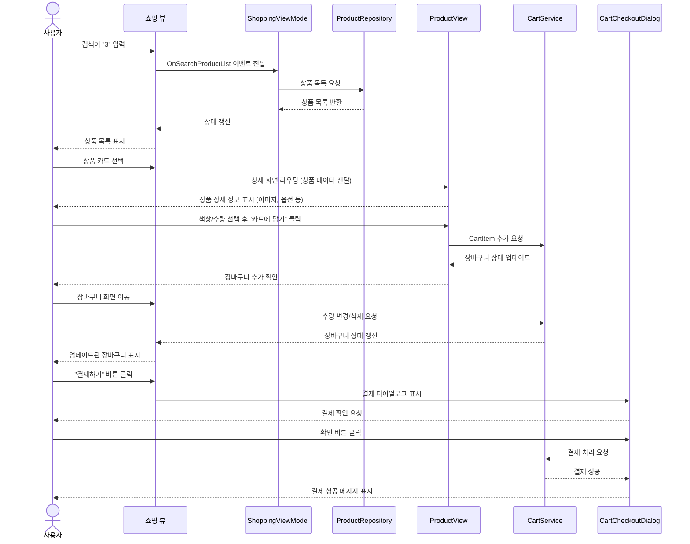

**🏗️ 기본 인프라 구축**

  

**📌 1. main.dart 구성 및 기본 라우팅 설정**

  

Flutter 애플리케이션의 기본 구조를 설정하고, 화면 간 이동을 관리하기 위해 초기 라우팅을 구성합니다.

  

**✨ main.dart 기본 구조**

```
import 'package:flutter/material.dart';

void main() {
  runApp(const MyApp());
}

class MyApp extends StatelessWidget {
  const MyApp({super.key});

  @override
  Widget build(BuildContext context) {
    return MaterialApp(
      debugShowCheckedModeBanner: false,
      initialRoute: '/',
      routes: {
        '/': (context) => const HomeScreen(),
        '/shopping': (context) => const ShoppingView(),
        '/product': (context) => const ProductView(),
        '/cart': (context) => const CartView(),
      },
    );
  }
}

class HomeScreen extends StatelessWidget {
  const HomeScreen({super.key});

  @override
  Widget build(BuildContext context) {
    return Scaffold(
      appBar: AppBar(title: const Text("Home")),
      body: Center(
        child: Column(
          mainAxisAlignment: MainAxisAlignment.center,
          children: [
            ElevatedButton(
              onPressed: () => Navigator.pushNamed(context, '/shopping'),
              child: const Text("Go to Shopping"),
            ),
            ElevatedButton(
              onPressed: () => Navigator.pushNamed(context, '/product'),
              child: const Text("Go to Product"),
            ),
            ElevatedButton(
              onPressed: () => Navigator.pushNamed(context, '/cart'),
              child: const Text("Go to Cart"),
            ),
          ],
        ),
      ),
    );
  }
}
```

**📍 주요 구성 요소**

• **MaterialApp**: Flutter 애플리케이션의 루트 위젯

• **initialRoute**: 앱 실행 시 기본적으로 표시할 화면 설정 ('/')

• **routes**: 화면 간 이동을 위해 등록된 라우트 매핑

• **Navigator**: 화면 간 이동을 관리하는 API

**📌 2. 글로벌 서비스 등록**

  

애플리케이션 전역에서 사용할 서비스 및 상태 관리를 설정합니다.

  

**✨ MultiRepositoryProvider 및 MultiBlocProvider 설정**

```
import 'package:flutter_bloc/flutter_bloc.dart';
import 'package:provider/provider.dart';

void main() {
  runApp(
    MultiRepositoryProvider(
      providers: [
        RepositoryProvider(create: (context) => AuthService()),
        RepositoryProvider(create: (context) => CartRepository()),
      ],
      child: MultiBlocProvider(
        providers: [
          BlocProvider(create: (context) => AuthBloc(context.read<AuthService>())),
          BlocProvider(create: (context) => CartBloc(context.read<CartRepository>())),
        ],
        child: const MyApp(),
      ),
    ),
  );
}
```

**📍 주요 구성 요소**

• **MultiRepositoryProvider**: 전역에서 사용할 리포지토리를 등록

• **RepositoryProvider**: DI(의존성 주입)를 위한 개별 리포지토리 제공

• **MultiBlocProvider**: 전역 상태 관리를 위한 Bloc 등록

• **BlocProvider**: Bloc(상태 관리) 객체를 생성하여 주입


```